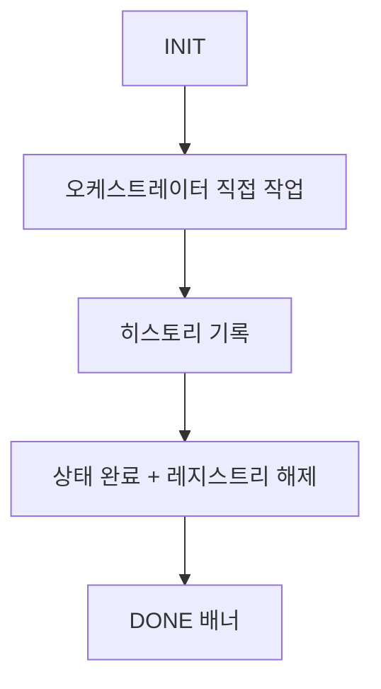

# Prompt (Tier 3)

## 개요

cc:prompt는 경량 작업을 위한 Tier 3 모드입니다. PLAN/WORK/REPORT 단계 없이 INIT 후 오케스트레이터가 직접 작업을 수행합니다.

## 입력 처리

사용자 요청 전처리는 INIT 단계(init 에이전트)에서 자동 수행됩니다. 오케스트레이터가 `command=prompt` 기반으로 Mode Auto-Determination Rule에 따라 `mode=prompt`를 자동 결정합니다.

init이 반환한 `request`, `workDir`, `workId` 등을 보관합니다.

## 실행 흐름



1. **INIT**: init 에이전트가 workDir 생성, user_prompt.txt 저장
2. **직접 작업**: 오케스트레이터가 user_prompt.txt 기반으로 직접 작업 수행
3. **완료 처리**: history.md 갱신, status.json 전이, 레지스트리 해제, DONE 배너

## 특징

- **워크플로우 없음**: PLAN, WORK, REPORT 단계를 거치지 않음
- **파일 변경 가능**: Write/Edit 도구로 코드 수정 가능
- **질의응답 지원**: 간단한 질문에 즉시 답변 (기존 cc:query 역할 통합)
- **히스토리 기록**: history.md에 1행 기록
- **경량화**: 서브에이전트 호출 최소화 (init만 사용)

## vs cc:implement -np

| 항목 | cc:prompt | cc:implement -np |
|------|-----------|------------------|
| 실행 흐름 | INIT -> 직접 작업 | INIT -> WORK -> REPORT |
| 에이전트 | init + 오케스트레이터 | init + worker + reporter |
| 보고서 | 없음 | 있음 (report.md) |
| 적합한 용도 | 즉석 수정 (1-2개 파일) | 가벼운 단일 태스크 |

## 수행 방식

1. INIT 완료 후 `<workDir>/user_prompt.txt` 읽기
2. 요청 내용에 따라 직접 작업 수행
3. 필요시 도구 사용 (Read, Write, Edit, Grep, Glob, Bash, WebSearch 등)

## 사용 예시

```
cc:prompt "로그인 함수에 null 체크 추가"
cc:prompt "README.md에 설치 방법 섹션 추가"
cc:prompt "config.ts에서 타임아웃 값 30초로 변경"
cc:prompt "TypeScript에서 interface와 type의 차이점"
cc:prompt "이 프로젝트에서 사용하는 인증 방식"
```

## 주의사항

1. **복잡한 작업은 cc:implement 사용**: 다중 파일 변경, 아키텍처 변경 등은 전체 워크플로우 권장
2. **보고서 필요시 cc:implement -np 사용**: 작업 보고서가 필요하면 no-plan 모드 사용
3. **코드 리뷰는 cc:review 사용**: 리뷰가 필요하면 전용 커맨드 사용
4. **심층 조사는 cc:research 사용**: 비교 분석, 심층 연구가 필요하면 cc:research 권장
