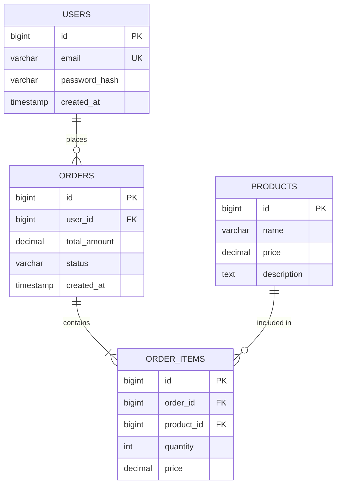

# Analyze Database

데이터베이스 구조를 분석하여 스키마 리포트를 작성하는 스킬입니다.

## 목적

- 데이터베이스 스키마 구조 파악
- 테이블 간 관계 시각화 (ERD)
- 인덱스 및 성능 최적화 포인트 식별
- 정규화 수준 및 데이터 무결성 검토
- 분석 결과를 문서로 저장하여 참고 자료 제공

## 핵심 원칙

1. **명확성 우선**: 불명확한 DB 정보는 AskUserQuestion 도구를 사용하여 반드시 재질의
2. **구조화**: 스키마 정보를 체계적으로 정리
3. **시각화**: ERD 다이어그램으로 관계 표현
4. **문서화**: 분석 결과를 구조화된 문서로 저장
5. **분석 전용**: 데이터베이스를 수정하지 않고 분석만 수행

## 키워드

데이터베이스, DB, 스키마, 테이블, ERD, 인덱스, table, schema, database

## 워크플로우

```
요청 수신 → DB 연결 정보 확인 → 스키마/테이블 분석 → 관계 분석 → 인덱스 분석 → ERD 생성 → 보고서 작성
              ↓ (불명확)
          AskUserQuestion으로 재질의하여 명확화 (PLAN 단계에서만)
```

### 1단계: 요청 수신

사용자 요청을 받아 분석을 시작합니다.

**확인 항목:**
- 어떤 데이터베이스를 분석할 것인가?
- 전체 스키마인가, 특정 테이블인가?
- 분석 목적은 무엇인가? (구조 파악, 성능 개선, 마이그레이션 등)

### 2단계: DB 연결 정보 확인

데이터베이스 연결 정보를 파악합니다.

**확인 항목:**
- DB 유형 (MySQL, PostgreSQL, SQLite, MongoDB 등)
- 연결 정보 (호스트, 포트, 데이터베이스명)
- 스키마 파일 위치 (SQL 파일, migration 파일 등)
- ORM 정의 파일 (models.py, schema.prisma 등)

**정보 소스 우선순위:**
1. 프로젝트 내 스키마 정의 파일
2. ORM 모델 정의
3. Migration 파일
4. 직접 DB 접속 (필요시)

### 3단계: 스키마/테이블 구조 분석

데이터베이스 구조를 분석합니다.

**분석 항목:**
- 테이블 목록 및 설명
- 컬럼 정보 (이름, 타입, NULL 허용, 기본값)
- Primary Key
- Unique 제약조건
- Check 제약조건
- 기본값 및 자동 생성 값

**출력 형식:**
```markdown
### users 테이블

| 컬럼명 | 타입 | NULL | 기본값 | 설명 |
|--------|------|------|--------|------|
| id | BIGINT | NO | AUTO_INCREMENT | PK |
| email | VARCHAR(255) | NO | - | 사용자 이메일 |
| password_hash | VARCHAR(255) | NO | - | 암호화된 비밀번호 |
| created_at | TIMESTAMP | NO | CURRENT_TIMESTAMP | 생성일시 |
```

### 4단계: 관계 (FK, 참조) 분석

테이블 간 관계를 분석합니다.

**분석 항목:**
- Foreign Key 관계
- 참조 무결성 설정 (CASCADE, SET NULL 등)
- 논리적 관계 (FK 없이 코드상 연결)
- 관계 유형 (1:1, 1:N, N:M)

**출력 형식:**
```markdown
### 테이블 관계

| 테이블 | 관계 | 참조 테이블 | FK 컬럼 | 참조 컬럼 | ON DELETE |
|--------|------|------------|---------|----------|-----------|
| orders | N:1 | users | user_id | id | CASCADE |
| order_items | N:1 | orders | order_id | id | CASCADE |
| order_items | N:1 | products | product_id | id | RESTRICT |
```

### 5단계: 인덱스 분석

인덱스 구조를 분석합니다.

**분석 항목:**
- 인덱스 목록 및 타입 (B-Tree, Hash, Full-text 등)
- 인덱스 컬럼 및 순서
- Unique 인덱스 여부
- 복합 인덱스 구성
- 잠재적 인덱스 개선점

**출력 형식:**
```markdown
### 인덱스 분석

| 테이블 | 인덱스명 | 타입 | 컬럼 | Unique |
|--------|----------|------|------|--------|
| users | PRIMARY | BTREE | id | YES |
| users | idx_email | BTREE | email | YES |
| orders | idx_user_date | BTREE | user_id, created_at | NO |
```

### 6단계: 쿼리 패턴 분석 (필요시)

코드베이스에서 쿼리 패턴을 분석합니다.

**분석 항목:**
- 자주 사용되는 쿼리 패턴
- N+1 쿼리 문제 가능성
- 느린 쿼리 가능성 (인덱스 미사용 등)
- JOIN 패턴

### 7단계: ERD 다이어그램 생성

command-mermaid-diagrams 스킬을 사용하여 ERD를 생성합니다.

**Mermaid ER 다이어그램 형식:**


### 8단계: 보고서 작성

분석 결과를 문서로 저장합니다.

**저장 위치:**
```
.workflow/analyze/<YYYYMMDD>-<HHMMSS>-<제목>/report.md
```

**파일명 규칙:**
- 날짜: 실행 시점의 날짜 (YYYYMMDD 형식)
- 시간: 실행 시점의 시간 (HHMMSS 형식)
- 제목: 요청 내용을 요약한 한글 제목
- 예: `20260203-164500-사용자DB스키마분석.md`

## 문서 템플릿

```markdown
# [데이터베이스 분석 제목]

- 분석 일시: YYYY-MM-DD HH:MM:SS (KST)
- 원본 요청: [사용자의 원본 요청]
- DB 유형: [MySQL/PostgreSQL/SQLite 등]
- 대상: [전체 스키마 / 특정 테이블]

## 요약

[1-2문장으로 분석 결과 요약]

## 데이터베이스 개요

- **테이블 수**: N개
- **주요 도메인**: [사용자, 주문, 상품 등]
- **정규화 수준**: [1NF/2NF/3NF/BCNF]

## ERD (Entity Relationship Diagram)

```mermaid
erDiagram
    [ERD 다이어그램]
```

## 테이블 상세

### [테이블명]

**설명**: [테이블 목적/역할]

| 컬럼명 | 타입 | NULL | 기본값 | 설명 |
|--------|------|------|--------|------|
| ... | ... | ... | ... | ... |

**인덱스:**
- [인덱스 정보]

**관계:**
- [FK 관계 정보]

## 관계 분석

| 테이블 | 관계 | 참조 테이블 | 설명 |
|--------|------|------------|------|
| ... | ... | ... | ... |

## 인덱스 분석

### 현재 인덱스

| 테이블 | 인덱스명 | 컬럼 | 타입 | 용도 |
|--------|----------|------|------|------|
| ... | ... | ... | ... | ... |

### 인덱스 개선 제안 (해당시)

- [개선 제안 1]
- [개선 제안 2]

## 정규화 분석

### 현재 상태
- [정규화 수준 및 설명]

### 비정규화 항목 (해당시)
- [비정규화된 부분과 이유]

## 데이터 무결성

### 참조 무결성
- [FK 제약조건 분석]

### 기타 제약조건
- [CHECK, UNIQUE 등]

## 성능 고려사항

- [쿼리 패턴 분석 결과]
- [잠재적 병목 지점]
- [개선 제안]

## 위험 요소 및 고려사항

| 항목 | 위험 | 권장 조치 |
|------|------|----------|
| ... | ... | ... |

## 다음 단계

이 분석 결과를 바탕으로:
- `cc:implement` - 스키마 변경 구현
- `cc:refactor` - 쿼리 최적화
```

## 재질의 가이드라인

> **도구 사용**: 재질의는 반드시 **AskUserQuestion** 도구를 사용하여 수행합니다.
> **실행 시점**: 재질의는 **PLAN 단계**에서 planner가 수행합니다. WORK 단계의 worker는 재질의를 수행하지 않고 계획서에 명시된 요구사항만으로 분석을 수행합니다.

다음 항목이 명확하지 않으면 AskUserQuestion 도구를 사용하여 질문합니다:

| 항목 | 질문 예시 |
|------|----------|
| 대상 DB | "어떤 데이터베이스를 분석할까요? (전체/특정 테이블)" |
| DB 유형 | "사용 중인 DBMS가 무엇인가요? (MySQL, PostgreSQL 등)" |
| 스키마 위치 | "스키마 정의 파일이나 ORM 모델 파일 위치가 어디인가요?" |
| 분석 목적 | "분석 목적이 무엇인가요? (구조 파악, 성능 개선, 마이그레이션 등)" |
| 범위 | "전체 스키마 분석인가요, 특정 테이블만 분석할까요?" |

## 결과 보고 형식

분석 완료 후 다음 형식으로 결과를 보고합니다:

```markdown
## 데이터베이스 분석 완료

### 분석 문서
- **경로**: `.workflow/analyze/<YYYYMMDD>-<HHMMSS>-<제목>/report.md`
- **작성 일시**: YYYY-MM-DD HH:MM:SS (KST)

### 요약
[1-2문장 요약]

### 주요 발견사항
- **테이블 수**: N개
- **주요 관계**: [관계 요약]
- **인덱스 상태**: [양호/개선 필요]

### ERD
[다이어그램 또는 다이어그램 링크]

### 다음 단계
이 분석 결과를 바탕으로 `cc:implement` 또는 `cc:refactor` 명령어로 작업을 진행할 수 있습니다.
```

## 주의사항

1. **읽기 전용**: 데이터베이스를 수정하지 않고 분석만 수행
2. **보안 주의**: 연결 정보, 민감한 데이터 노출 주의
3. **문서 저장 필수**: 모든 분석 결과는 문서로 저장
4. **ERD 포함**: 가능하면 Mermaid ERD 다이어그램 포함
5. **성능 영향 최소화**: 운영 DB 분석 시 부하 주의
6. **command-mermaid-diagrams 연동**: ERD 생성 시 command-mermaid-diagrams 스킬 활용
