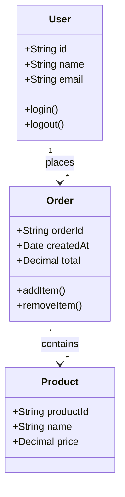
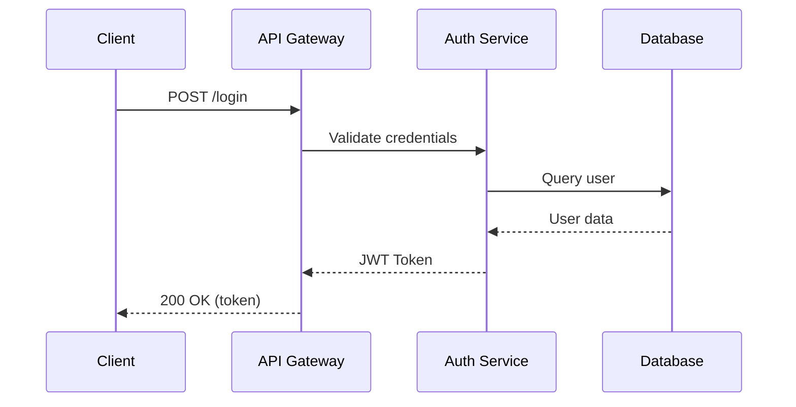
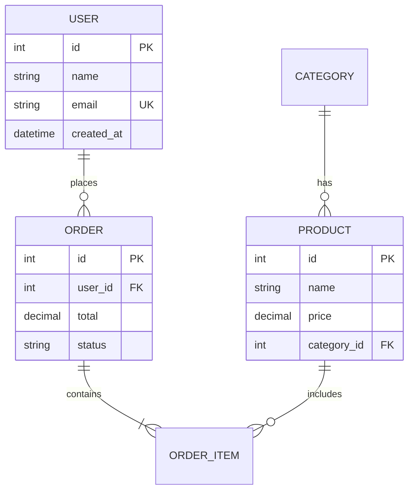
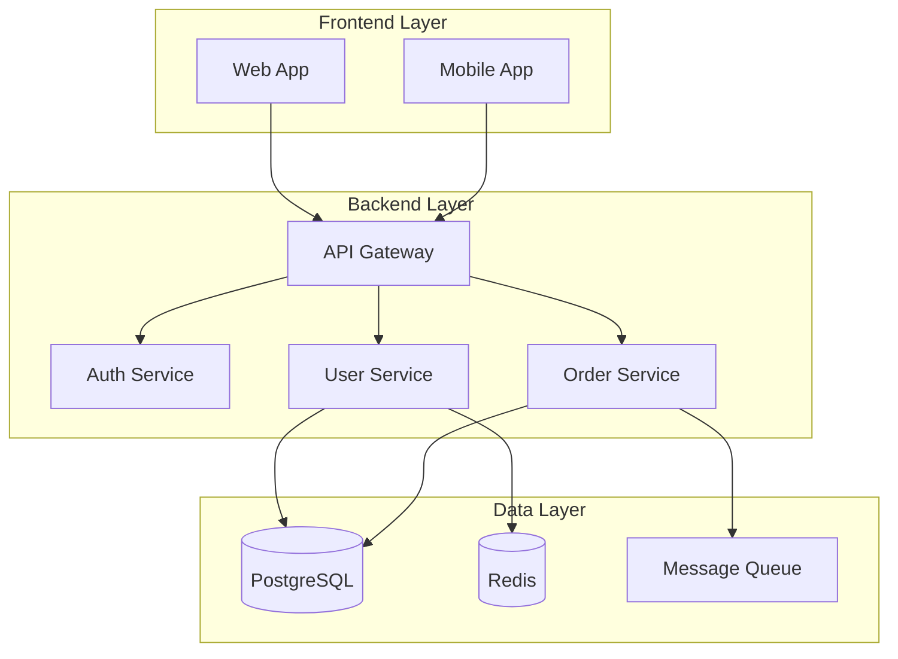
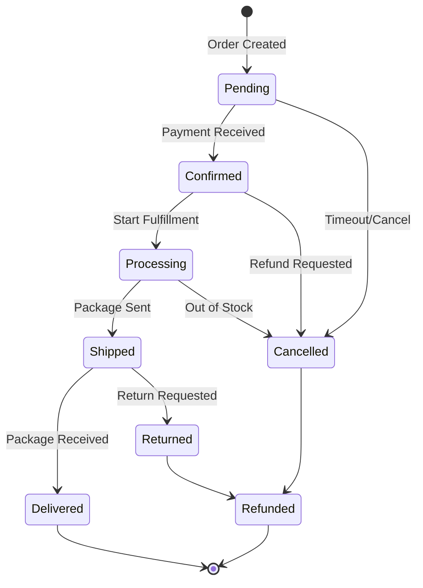
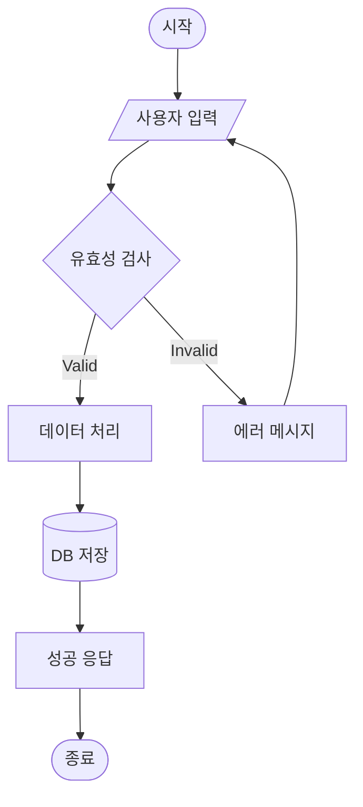

# Architect

시스템 아키텍처를 설계하고 UML 다이어그램을 생성합니다.

## 사용 시기

- 시스템 아키텍처 설계 요청
- UML 다이어그램 생성 요청
- 데이터 모델 설계 요청
- 시스템 흐름 시각화 요청
- "설계해줘", "아키텍처", "다이어그램", "UML" 키워드 포함 요청

---

## 아키텍처 설계 워크플로우

```
1. 요구사항 수집
   - 시스템 목표 파악
   - 주요 기능 식별
   - 제약사항 확인
       ↓
2. 다이어그램 유형 선택
   - 표현할 내용에 맞는 다이어그램 결정
   - 필요한 다이어그램 목록 작성
       ↓
3. 다이어그램 생성
   - Mermaid 코드 작성
   - .md 파일로 저장
       ↓
4. PNG 변환
   - mmdc CLI로 이미지 생성
   - .png 파일로 저장
       ↓
5. 검토 및 반복
   - 다이어그램 검증
   - 필요시 수정
```

---

## 다이어그램 유형 가이드

### 1. 클래스 다이어그램 (Class Diagram)

**용도**: 객체 지향 구조, 클래스 관계, 상속/구성/의존 관계 표현

**사용 시점**:
- 도메인 모델 설계
- 객체 간 관계 정의
- API 설계 문서화



**관계 표현**:
- `<|--` : 상속 (Inheritance)
- `*--` : 구성 (Composition)
- `o--` : 집합 (Aggregation)
- `-->` : 연관 (Association)
- `..>` : 의존 (Dependency)
- `..|>` : 구현 (Realization)

---

### 2. 시퀀스 다이어그램 (Sequence Diagram)

**용도**: 객체 간 상호작용, 메시지 흐름, 시간 순서 표현

**사용 시점**:
- API 호출 흐름 설계
- 사용자 시나리오 문서화
- 시스템 간 통신 설계



**메시지 유형**:
- `->>` : 동기 요청
- `-->>` : 응답
- `--)` : 비동기 메시지
- `--x` : 실패 응답

---

### 3. ER 다이어그램 (Entity Relationship Diagram)

**용도**: 데이터베이스 스키마, 엔티티 관계, 데이터 모델 표현

**사용 시점**:
- 데이터베이스 설계
- 테이블 관계 정의
- 데이터 모델 문서화



**카디널리티**:
- `||--||` : 일대일
- `||--o{` : 일대다
- `o{--o{` : 다대다

---

### 4. 컴포넌트 다이어그램 (Component Diagram)

**용도**: 시스템 구조, 모듈 구성, 서비스 관계 표현

**사용 시점**:
- 마이크로서비스 아키텍처 설계
- 모듈 구조 문서화
- 시스템 통합 설계



---

### 5. 상태 다이어그램 (State Diagram)

**용도**: 객체 상태 전이, 워크플로우, 생명주기 표현

**사용 시점**:
- 주문 상태 흐름 설계
- 작업 워크플로우 정의
- 상태 머신 설계



---

### 6. 플로우차트 (Flowchart)

**용도**: 프로세스 흐름, 의사결정 로직, 알고리즘 표현

**사용 시점**:
- 비즈니스 프로세스 설계
- 알고리즘 시각화
- 의사결정 흐름 문서화



**방향 옵션**:
- `TD` / `TB` : 위에서 아래
- `BT` : 아래에서 위
- `LR` : 왼쪽에서 오른쪽
- `RL` : 오른쪽에서 왼쪽

---

## 다이어그램 선택 가이드

| 목적 | 권장 다이어그램 |
|------|----------------|
| 객체 구조 설계 | 클래스 다이어그램 |
| API 흐름 설계 | 시퀀스 다이어그램 |
| 데이터베이스 설계 | ER 다이어그램 |
| 시스템 구조 설계 | 컴포넌트 다이어그램 (플로우차트) |
| 상태 전이 설계 | 상태 다이어그램 |
| 프로세스 흐름 설계 | 플로우차트 |
| 일정 계획 | 간트 차트 |

---

## mermaid-diagrams 스킬 참조

상세한 Mermaid 문법 및 스타일링은 `command-mermaid-diagrams` 스킬을 참조합니다.

**참조 방법**:
```
Read: .claude/skills/command-mermaid-diagrams/SKILL.md
```

**포함 내용**:
- 모든 다이어그램 타입 상세 문법
- 스타일링 옵션 (색상, 폰트 등)
- HTML 임베드 방법
- 참고 링크

---

## mmdc CLI 사용법

### 설치

```bash
npm install -g @mermaid-js/mermaid-cli
```

### Markdown 파일에서 PNG 변환

```bash
# 기본 변환
mmdc -i diagram.md -o diagram.png

# 배경색 지정
mmdc -i diagram.md -o diagram.png -b white

# 테마 적용 (default, dark, forest, neutral)
mmdc -i diagram.md -o diagram.png -t dark

# 너비 지정
mmdc -i diagram.md -o diagram.png -w 1200
```

### SVG 변환

```bash
mmdc -i diagram.md -o diagram.svg
```

### 일괄 변환

```bash
# 디렉토리 내 모든 .md 파일 변환
for f in *.md; do mmdc -i "$f" -o "${f%.md}.png"; done
```

---

## 출력 파일 규칙

### 파일명 규칙

```
<diagram-type>-<description>.md   # Mermaid 소스
<diagram-type>-<description>.png  # 이미지 파일
```

**예시**:
```
class-user-domain.md
class-user-domain.png
sequence-login-flow.md
sequence-login-flow.png
er-database-schema.md
er-database-schema.png
```

### 저장 경로

기본적으로 현재 작업 디렉토리에 저장합니다.
사용자가 지정한 경로가 있으면 해당 경로에 저장합니다.

```
# 기본 경로 (cc:architect 사용 시)
.workflow/architect/<YYYYMMDD>-<HHMMSS>-<제목>/diagrams/

# 사용자 지정 경로
<사용자 지정 경로>/
```

### Markdown 파일 구조

```markdown
# [다이어그램 제목]

## 설명
[다이어그램에 대한 설명]

## 다이어그램

```mermaid
[Mermaid 코드]
```

## 참고사항
[추가 참고사항]
```

---

## Mermaid 표현 한계

Mermaid로 표현하기 어려운 경우:

| 다이어그램 | 한계 | 대안 |
|-----------|------|------|
| 배포 다이어그램 | 직접 지원 없음 | 플로우차트로 대체 |
| 유스케이스 다이어그램 | 직접 지원 없음 | 플로우차트로 대체 |
| 복잡한 UML | 상세 표현 제한 | PlantUML 권장 |
| 대규모 다이어그램 | 렌더링 성능 저하 | 분할하여 작성 |

---

## 사용 예시

### 전체 시스템 설계

```
사용자 요청: "이커머스 시스템 아키텍처 설계해줘"

생성할 다이어그램:
1. 컴포넌트 다이어그램 - 전체 시스템 구조
2. ER 다이어그램 - 데이터 모델
3. 클래스 다이어그램 - 도메인 모델
4. 시퀀스 다이어그램 - 주문 프로세스
5. 상태 다이어그램 - 주문 상태 흐름
```

### 특정 다이어그램 요청

```
사용자 요청: "로그인 흐름 시퀀스 다이어그램 그려줘"

생성할 다이어그램:
1. 시퀀스 다이어그램 - 로그인 인증 흐름
```

---

## 주의사항

1. **mmdc CLI 필수**: PNG 생성을 위해 mmdc가 설치되어 있어야 합니다.
2. **Mermaid 문법 준수**: 올바른 문법으로 작성해야 렌더링됩니다.
3. **파일명 일관성**: 다이어그램 타입과 설명을 포함한 명확한 파일명을 사용합니다.
4. **설명 포함**: 각 다이어그램에 목적과 설명을 포함합니다.
5. **크기 고려**: 너무 큰 다이어그램은 분할하여 작성합니다.
