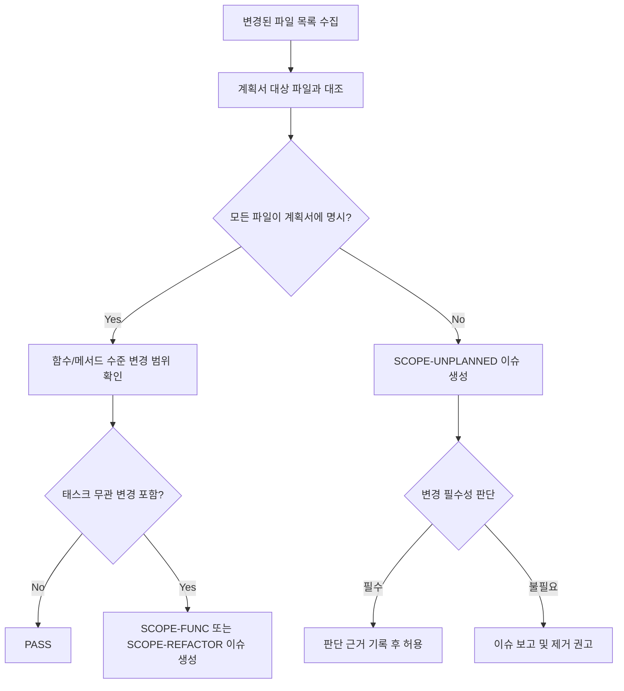

# Code Quality Checker

코드 품질을 정량적으로 측정하고 개선점을 식별하는 스킬.

## Overview

구현 완료된 코드를 대상으로:
- 린트/포맷/타입체크 자동 실행
- DRY/KISS/YAGNI 위반 탐지
- 코드 메트릭 측정 (순환 복잡도, 함수/파일 크기 등)
- 정량적 Code Quality Score (0-100) 산출
- 이슈 분류 및 개선 방안 제시

## Code Metrics

| 메트릭 | 임계값 | 페널티 |
|--------|--------|--------|
| **순환 복잡도** | <=10 OK, 11-20 경고, >20 실패 | -5 (경고), -10 (실패) / 함수 |
| **함수 크기** | <=50줄 OK, >50 경고 | -3 / 함수 |
| **파일 크기** | <=500줄 OK, >500 경고 | -5 / 파일 |
| **중첩 깊이** | <=3 OK, >3 경고 | -3 / 인스턴스 |
| **매개변수 수** | <=4 OK, >4 경고 | -2 / 함수 |

## Code Quality Score

```
Code Quality Score = 100 - metric_penalties - issue_penalties
```

**이슈 페널티:**

| 심각도 | 페널티 | 예시 |
|--------|--------|------|
| **high** | -20 | 보안 취약점, O(n^2)+ 알고리즘, N+1 쿼리 |
| **medium** | -10 | DRY 위반, 차선 접근, 설정 누락 |
| **low** | -3 | 명명 규칙, 경미한 코드 스멜 |

**점수 해석:**

| 점수 | 상태 | 판정 |
|------|------|------|
| 90-100 | Excellent | PASS |
| 70-89 | Acceptable | CONCERNS |
| <70 | Below threshold | ISSUES_FOUND |

## Issue Prefixes

| 접두사 | 카테고리 | 기본 심각도 |
|--------|---------|------------|
| SEC- | 보안 (인증, 유효성, 비밀키) | high |
| PERF- | 성능 (알고리즘, 설정, 병목) | medium/high |
| MNT- | 유지보수 (DRY, SOLID, 복잡도) | medium |
| ARCH- | 아키텍처 (계층, 경계, 패턴) | medium |
| BP- | 베스트 프랙티스 (권장과 다른 구현) | medium |
| OPT- | 최적성 (더 나은 접근이 존재) | medium |
| SCOPE- | 변경 범위 (계획서 대비 범위 초과) | medium/high |

**PERF- 하위 카테고리:**

| 접두사 | 카테고리 | 심각도 |
|--------|---------|--------|
| PERF-ALG- | 알고리즘 복잡도 (Big O) | O(n^2)+ 시 high |
| PERF-CFG- | 패키지/라이브러리 설정 | medium |
| PERF-PTN- | 아키텍처 패턴 성능 | high |
| PERF-DB- | 데이터베이스 쿼리, 인덱스 | high |

## Workflow

### 1. 도구 자동 감지 및 실행

프로젝트 루트에서 설정 파일을 확인하여 사용 가능한 도구를 자동 감지:

```bash
# JavaScript/TypeScript
[ -f package.json ] && npm run lint 2>&1      # ESLint
[ -f package.json ] && npx prettier --check . 2>&1  # Prettier
[ -f tsconfig.json ] && npx tsc --noEmit 2>&1  # TypeScript

# Python
[ -f pyproject.toml ] && ruff check . 2>&1     # Ruff
[ -f pyproject.toml ] && mypy . 2>&1           # MyPy
[ -f setup.cfg ] && flake8 . 2>&1              # Flake8

# Rust
[ -f Cargo.toml ] && cargo clippy 2>&1         # Clippy
```

**도구가 없는 경우:** 수동 코드 분석으로 대체 (정적 분석).

### 2. 코드 메트릭 측정

대상 파일들의 메트릭을 수동으로 측정:
- 함수별 순환 복잡도 계산 (if/else/for/while/switch case 카운트)
- 함수/파일 크기 (줄 수) 측정
- 중첩 깊이 확인
- 매개변수 수 확인

### 3. 원칙 위반 탐지

**DRY (Don't Repeat Yourself):**
- 중복 코드 블록 (3줄 이상 동일)
- 유사 로직의 복사-붙여넣기
- 공통 패턴 미추출

**KISS (Keep It Simple, Stupid):**
- 불필요하게 복잡한 조건문
- 과도한 추상화
- 이해하기 어려운 코드 흐름

**YAGNI (You Aren't Gonna Need It):**
- 사용되지 않는 함수/클래스
- 미래를 위한 과도한 설계
- 불필요한 설정 가능성

### 4. 보안 검사

- SEC-: 하드코딩된 자격증명, 미검증 입력, SQL 인젝션, 레이스 컨디션
- 환경변수 미사용 비밀키
- XSS 취약점

### 5. 아키텍처 검사

- ARCH-: 계층 위반, 순환 의존성, 가이드 미준수
- 관심사 분리 위반
- 의존성 방향 역전

### 6. Score 산출 및 보고

```yaml
verdict: PASS | CONCERNS | ISSUES_FOUND
code_quality_score: {0-100}
metrics:
  avg_cyclomatic_complexity: {value}
  functions_over_50_lines: {count}
  files_over_500_lines: {count}
  max_nesting_depth: {value}
lint_results:
  tool: {tool_name}
  errors: {count}
  warnings: {count}
issues:
  - id: "SEC-001"
    severity: high
    file: "src/auth/index.ts:42"
    finding: "하드코딩된 API 키"
    suggested_action: "환경변수로 이동"
  - id: "MNT-001"
    severity: medium
    file: "src/service.ts:42"
    finding: "DRY 위반: 중복 유효성 검사 로직"
    suggested_action: "공통 유효성 검사기로 추출"
```

## Critical Rules

1. **도구 실행 우선**: 사용 가능한 린트/타입체크 도구가 있으면 반드시 실행
2. **증거 기반**: 모든 이슈는 파일:라인 참조 포함
3. **심각도 정확**: 실제 심각도에 맞게 분류 (모든 것을 Critical로 하지 말 것)
4. **수정 제안**: 이슈마다 구체적 수정 방안 제시
5. **기존 컨벤션 존중**: 프로젝트 기존 코딩 스타일을 기준으로 판단
6. **정량적 보고**: 주관적 평가 대신 메트릭 기반 점수 사용
7. **변경 범위 준수**: 계획서에 명시된 범위를 초과하는 변경이 있으면 SCOPE- 이슈로 보고

## 변경 범위 검증 (Change Scope Verification)

계획서에 명시된 작업 범위와 실제 변경 내역을 대조하여 Scope Creep을 감지한다.

### 최소 변경 원칙 (Minimal Change Principle) 체크리스트

변경된 모든 파일/함수에 대해 아래 항목을 검증한다:

| # | 체크 항목 | 판정 기준 |
|---|----------|----------|
| 1 | **계획서 명시 여부** | 변경된 파일이 계획서의 "대상 파일" 또는 "작업 상세"에 명시되어 있는가? |
| 2 | **변경 필수성** | 계획서에 없는 파일을 변경한 경우, 해당 변경 없이는 태스크 완수가 불가능한가? |
| 3 | **부수 효과 최소화** | 변경이 기존 동작(API 시그니처, 설정값, 출력 형식 등)을 의도치 않게 바꾸지 않는가? |
| 4 | **리팩터링 혼입 금지** | 태스크와 무관한 코드 정리, 이름 변경, 포맷팅 수정이 포함되지 않았는가? |
| 5 | **임포트/의존성 최소화** | 새로 추가된 임포트나 의존성이 태스크 목표 달성에 직접 필요한 것인가? |

### Scope Creep 경고 패턴

다음 패턴이 감지되면 `SCOPE-` 접두사 이슈로 보고한다:

| 접두사 | 패턴 | 심각도 | 설명 |
|--------|------|--------|------|
| SCOPE-UNPLANNED | 계획서에 없는 파일 변경 | high | diff에 계획서 대상 파일 목록에 없는 파일이 포함됨 |
| SCOPE-FUNC | 요청하지 않은 함수 변경 | medium | 태스크 목표와 무관한 함수/메서드가 수정됨 |
| SCOPE-REFACTOR | 무관한 리팩터링 혼입 | medium | 태스크와 관계없는 코드 정리, 변수 이름 변경, 포맷팅 수정 |
| SCOPE-DEP | 불필요한 의존성 추가 | medium | 태스크 목표에 직접 필요하지 않은 패키지/모듈 추가 |
| SCOPE-SIDE | 의도하지 않은 부수 효과 | high | 기존 API 시그니처, 설정 기본값, 출력 형식 등이 변경됨 |

### 검증 프로세스



### 적용 시점

- **implement/refactor 완료 후**: 최종 diff를 계획서와 대조
- **코드 리뷰 시**: 리뷰 대상 변경의 범위 적정성 판단
- **PR 생성 전**: 커밋에 포함된 모든 변경이 계획 범위 내인지 확인

## When to Apply

- **WORK 단계**: implement/refactor 완료 후 검증
- **REPORT 단계**: 최종 품질 보고서 포함
- **코드 리뷰 전**: 리뷰 전 사전 품질 검증
- **PR 생성 전**: 머지 전 품질 게이트
