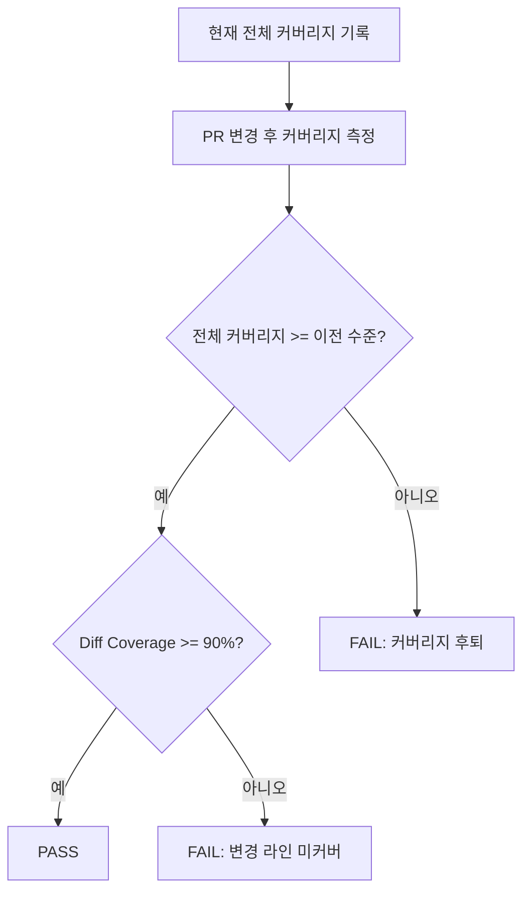
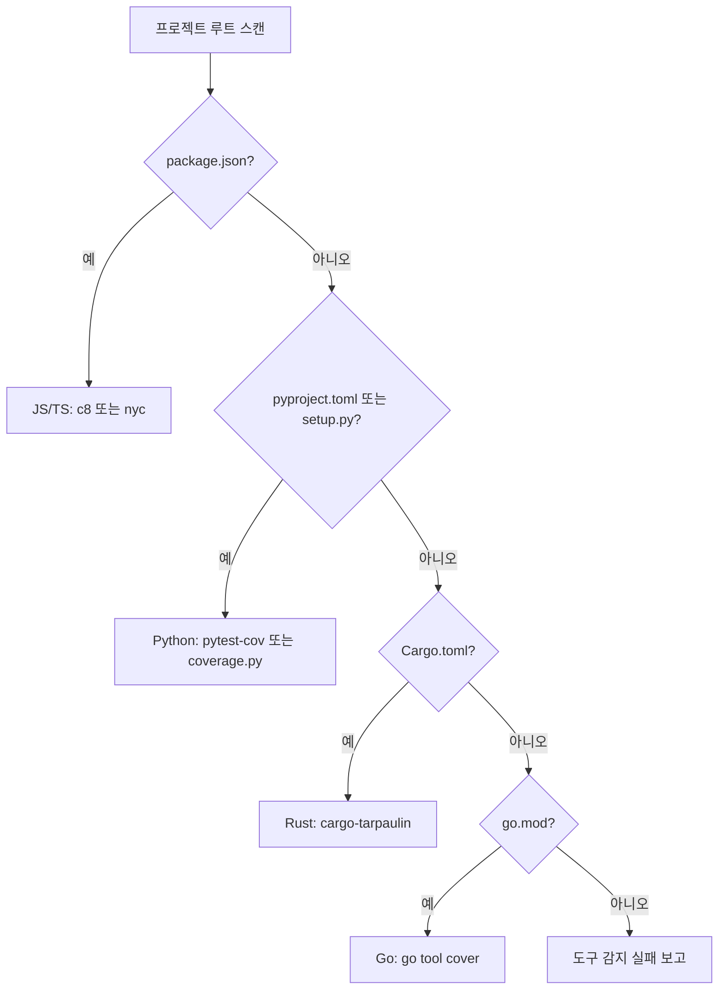

# Coverage Analysis - Code Coverage Measurement & Diff Coverage Gate

코드 커버리지를 측정하고, 변경된 라인에 대한 diff coverage 게이트를 적용하며, 미커버 영역에 대한 테스트를 제안하는 스킬.

## Overview

코드베이스를 대상으로 다음을 수행한다:
- 언어별 적합한 커버리지 도구를 자동 감지하여 실행
- 전체 커버리지와 diff coverage를 분리 측정
- 래칫(ratchet) 전략으로 점진적 품질 향상 유도
- 미커버 영역을 분석하여 테스트 제안 생성

핵심 원칙: "코드를 터치했으면 그 라인은 테스트해야 한다" - 새로운 코드나 변경된 코드에 대해 높은 커버리지를 요구하되, 기존 레거시 코드의 전체 커버리지를 강제하지 않는다.

## 지원 도구

### 언어별 커버리지 도구

| 언어 | 도구 | 출력 형식 | 설치 확인 |
|------|------|----------|----------|
| JavaScript/TypeScript | c8 | Cobertura XML, lcov | `npx c8 --version` |
| JavaScript/TypeScript | istanbul/nyc | Cobertura XML, lcov | `npx nyc --version` |
| Python | coverage.py | Cobertura XML | `python -m coverage --version` |
| Python | pytest-cov | Cobertura XML | `pytest --co -q 2>&1 \| head -1` |
| Rust | cargo-tarpaulin | Cobertura XML | `cargo tarpaulin --version` |
| Go | go tool cover | Go cover profile | `go tool cover -h 2>&1` |

### Diff Coverage 도구

| 도구 | 입력 | 출력 | 용도 |
|------|------|------|------|
| diff-cover | Cobertura XML + git diff | HTML, JSON, console | 변경 라인 대상 커버리지 측정 |

## 커버리지 실행 명령어

```bash
# JavaScript/TypeScript (c8)
npx c8 --reporter=cobertura --report-dir=coverage npm test 2>&1

# JavaScript/TypeScript (nyc)
npx nyc --reporter=cobertura npm test 2>&1

# Python (pytest-cov)
pytest --cov=. --cov-report=xml:coverage.xml 2>&1

# Python (coverage.py)
python -m coverage run -m pytest && python -m coverage xml -o coverage.xml 2>&1

# Rust (cargo-tarpaulin)
cargo tarpaulin --out xml --output-dir coverage 2>&1

# Go
go test -coverprofile=coverage.out ./... 2>&1
go tool cover -func=coverage.out 2>&1
```

## Diff Coverage 전략

### diff-cover 실행

```bash
# 기본 diff coverage (현재 브랜치 vs main)
diff-cover coverage.xml --compare-branch=origin/main 2>&1

# 임계값 적용
diff-cover coverage.xml --compare-branch=origin/main --fail-under=90 2>&1

# HTML 보고서 생성
diff-cover coverage.xml --compare-branch=origin/main --html-report=diff-cover.html 2>&1

# JSON 출력
diff-cover coverage.xml --compare-branch=origin/main --json-report=diff-cover.json 2>&1
```

### 래칫(Ratchet) 전략

래칫 전략은 전체 커버리지를 점진적으로 향상시키는 기법이다. 커버리지가 현재 수준 이하로 떨어지는 것을 방지하면서, 새 코드에는 높은 기준을 적용한다.

**원칙:**
1. 전체 커버리지는 현재 수준 이상 유지 (후퇴 금지)
2. 변경된 라인에는 90%+ diff coverage 요구
3. 매 PR마다 전체 커버리지가 미세하게 상승하는 효과 달성
4. 레거시 코드의 일괄 커버리지 강제는 하지 않음

**래칫 검증 흐름:**



**래칫 기준값 관리:**

```bash
# 현재 커버리지를 기준값으로 저장
python -m coverage report --format=total > .coverage-baseline 2>&1

# PR에서 래칫 검증
BASELINE=$(cat .coverage-baseline 2>/dev/null || echo "0")
CURRENT=$(python -m coverage report --format=total 2>&1)
# CURRENT >= BASELINE 확인
```

## Workflow

### 1. 도구 자동 감지

프로젝트 루트의 설정 파일을 기반으로 적합한 커버리지 도구를 자동 감지한다.

| 감지 파일 | 언어 | 선택 도구 |
|-----------|------|----------|
| `package.json` | JavaScript/TypeScript | c8 우선, nyc 폴백 |
| `pyproject.toml` 또는 `setup.py` | Python | pytest-cov 우선, coverage.py 폴백 |
| `Cargo.toml` | Rust | cargo-tarpaulin |
| `go.mod` | Go | go tool cover |



### 2. 커버리지 실행

감지된 도구로 전체 테스트를 실행하고 Cobertura XML 형식의 커버리지 리포트를 생성한다.

### 3. Diff Coverage 비교

`diff-cover`를 사용하여 변경된 라인의 커버리지를 산출한다. `--compare-branch` 옵션으로 베이스 브랜치와 비교한다.

### 4. 미커버 영역 테스트 제안

diff-cover 결과에서 미커버 라인을 분석하여 다음을 제안한다:
- 미커버 라인이 속한 함수/메서드 식별
- 해당 함수의 입력 타입과 분기 조건 분석
- 미커버 분기를 실행하는 테스트 케이스 골격 제안

## 임계값 설정

| 메트릭 | 기본 임계값 | 엄격 모드 | 용도 |
|--------|-----------|----------|------|
| 전체 커버리지 | 80% | 90% | 코드베이스 전체 건강도 |
| Diff Coverage | 90% | 100% | 변경 코드 품질 게이트 |
| 래칫 기준 | 현재 수준 유지 | 현재 수준 + 0.5% | 점진적 향상 |

## 보고 형식

```yaml
coverage_analysis:
  verdict: PASS | WARN | FAIL
  overall:
    line_coverage: 85.3
    branch_coverage: 72.1
    threshold: 80.0
    status: PASS
  diff_coverage:
    changed_lines: 142
    covered_lines: 134
    diff_coverage_pct: 94.4
    threshold: 90.0
    status: PASS
  ratchet:
    baseline: 84.1
    current: 85.3
    delta: +1.2
    status: PASS
  uncovered_areas:
    - file: "src/utils/parser.ts:45-52"
      function: "parseConfig"
      reason: "에러 핸들링 분기 미커버"
      suggestion: "잘못된 JSON 입력에 대한 테스트 케이스 추가"
    - file: "src/api/handler.py:88-95"
      function: "handle_request"
      reason: "타임아웃 분기 미커버"
      suggestion: "요청 타임아웃 시나리오 테스트 추가"
  tool_used: "c8 + diff-cover"
```

## code-quality-checker와의 역할 분리

| 영역 | code-quality-checker | command-coverage-analysis |
|------|---------------------|--------------------------|
| 범위 | 커버리지 수치 간접 참조 | 커버리지 도구 직접 실행, 상세 분석 |
| 깊이 | 전체 커버리지 임계값 확인 | diff coverage, 래칫 전략, 미커버 영역 분석 |
| 도구 | 기존 커버리지 리포트 참조 | c8/istanbul/coverage.py/tarpaulin 직접 실행 |
| 목적 | 코드 품질의 커버리지 측면 | 커버리지 전문 심층 분석 + 테스트 제안 |

**상호 보완**: code-quality-checker가 기본 커버리지 임계값을 확인하고, command-coverage-analysis가 diff coverage 게이트와 미커버 영역 분석을 수행. 두 스킬이 동시 로드되면 command-coverage-analysis의 상세 결과를 code-quality-checker가 참조한다.

## Critical Rules

1. **Cobertura XML 필수**: diff-cover 호환을 위해 커버리지 리포트는 반드시 Cobertura XML 형식으로 생성
2. **래칫 후퇴 금지**: 전체 커버리지가 이전 수준 이하로 떨어지면 FAIL 판정
3. **Diff Coverage 90%+**: 변경된 라인의 90% 이상이 테스트로 커버되어야 PASS
4. **미커버 영역 제안 필수**: FAIL 또는 WARN 판정 시 미커버 영역에 대한 구체적 테스트 제안 포함
5. **증거 기반**: 모든 커버리지 수치에 파일:라인 참조 포함
6. **도구 미설치 시 안내**: 감지된 도구가 미설치된 경우 설치 명령어를 안내하고 WARN 판정
