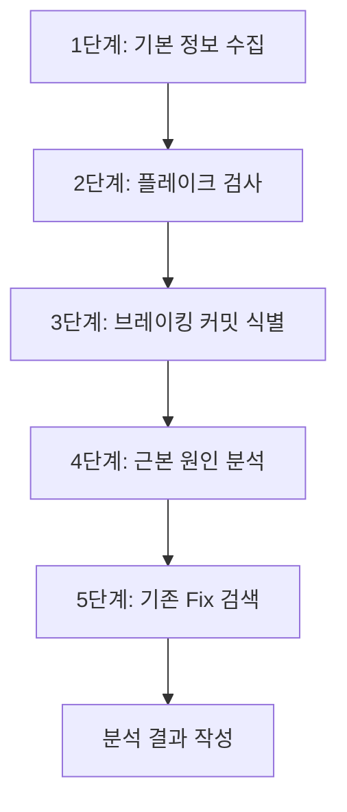

# GHA Analysis

GitHub Actions 실패를 체계적으로 조사하여 근본 원인을 식별하고 해결 방안을 제시하는 스킬.

## 사전 조건

gh CLI가 설치되어 있고 인증이 완료되어 있어야 한다.

```bash
# gh CLI 설치 및 인증 확인
gh --version
gh auth status
```

gh CLI가 없으면 작업 내역에 "gh CLI 미설치로 GHA 분석 불가" 에러를 기록하고 수동 분석으로 전환한다.

## 5단계 조사 프로세스



### 1단계: 기본 정보 수집

실패한 워크플로우 런의 기본 정보를 수집하고 실제 실패 원인을 식별한다.

```bash
# 워크플로우 런 상세 조회
gh run view <run-id>

# JSON 형식으로 Job 상세 정보 조회
gh run view <run-id> --json jobs,conclusion,headSha,headBranch,event,createdAt

# 실패한 Job의 로그 조회
gh run view <run-id> --log-failed
```

**핵심 판단 기준:**
- exit code 1을 발생시킨 실제 원인 식별 (경고/비치명적 에러와 구분)
- `failing:`, `fatal:`, `error:` 패턴에 집중
- 비치명적 에러와 치명적 에러가 동시에 나타나면 치명적 에러에 집중

### 2단계: 플레이크(Flaky) 검사

동일한 Job의 최근 10-20회 실행 이력을 분석하여 플레이키 여부를 판단한다.

```bash
# 워크플로우 실행 이력 조회
gh run list --workflow=<workflow-name> --limit 20

# 특정 런의 특정 Job 상태 확인
gh run view <run-id> --json jobs | jq '.jobs[] | select(.name == "<job-name>") | {name, conclusion, startedAt}'
```

**플레이크 판단 기준:**

| 패턴 | 판단 | 조치 |
|------|------|------|
| 최근 20회 중 1-2회만 실패 | 플레이키 가능성 높음 | 재실행 권장, 테스트 안정화 검토 |
| 특정 시점 이후 지속 실패 | 브레이킹 변경 | 3단계로 진행 |
| 간헐적 실패 (30% 이상) | 환경 의존적 문제 | 인프라/의존성 점검 |
| 모든 최근 런 실패 | 지속적 문제 | 3단계로 진행 |

### 3단계: 브레이킹 커밋 식별

지속적 실패 패턴이 확인되면, 실패를 최초로 발생시킨 커밋을 식별한다.

```bash
# 마지막 성공 런과 첫 실패 런 사이의 커밋 비교
gh run view <last-success-run-id> --json headSha
gh run view <first-failure-run-id> --json headSha

# 두 커밋 사이의 변경 사항 확인
git log --oneline <success-sha>..<failure-sha>
git diff <success-sha>..<failure-sha> -- <관련 파일>
```

**검증 방법:**
- 브레이킹 커밋 이전의 모든 런에서 해당 Job이 성공했는지 확인
- 브레이킹 커밋 이후의 모든 런에서 해당 Job이 실패했는지 확인
- 양쪽 모두 일관되면 높은 신뢰도로 브레이킹 커밋 확정

### 4단계: 근본 원인 분석

로그, 이력, 브레이킹 커밋 정보를 종합하여 근본 원인을 도출한다.

**분석 체크리스트:**

| 카테고리 | 확인 항목 |
|----------|----------|
| 코드 변경 | 브레이킹 커밋의 변경 내용이 실패와 직접 연관되는가? |
| 의존성 | 패키지 버전 변경, lock 파일 변경이 있는가? |
| 환경 | 러너 이미지, Node/Python 버전 변경이 있는가? |
| 타이밍 | 타임아웃, 레이스 컨디션 가능성이 있는가? |
| 외부 서비스 | API 호출 실패, 네트워크 문제가 있는가? |
| 설정 | 워크플로우 YAML, 환경 변수 변경이 있는가? |

### 5단계: 기존 Fix PR 검색

이미 수정 PR이 존재하는지 확인하여 중복 작업을 방지한다.

```bash
# 에러 메시지 키워드로 PR 검색
gh pr list --state open --search "<에러 키워드>"

# 실패한 파일/워크플로우 관련 PR 검색
gh pr list --state open --search "<실패 파일명>"

# 최근 머지된 PR에서 관련 수정 확인
gh pr list --state merged --search "<키워드>" --limit 10
```

**Fix PR이 발견된 경우:** 분석 결과에 PR 번호와 링크를 포함하고, 별도 수정 권고는 생략한다.

## 분석 결과 작성 형식

작업 내역 파일에 다음 구조로 분석 결과를 기록한다:

```markdown
## GHA 분석 결과

### 실패 요약
- 워크플로우: <이름>
- Job: <이름>
- 실패 시점: <날짜>
- 트리거: <이벤트>

### 플레이크 평가
- 유형: 지속적 실패 | 플레이키 | 간헐적
- 최근 성공률: X/20

### 브레이킹 커밋 (해당 시)
- 커밋: <SHA>
- 작성자: <이름>
- 신뢰도: 높음 | 중간 | 낮음

### 근본 원인
<분석 내용>

### 기존 Fix PR
- PR #<번호>: <제목> (해당 시)

### 수정 권고 (Fix PR 없는 경우)
<권고 내용>
```

## 활용 가이드

### build 명령어에서의 활용

build 워크플로우에서 CI 실패 조사 태스크가 있을 때 이 스킬을 로드한다.

```
예시 계획서 태스크:
| W03 | CI 파이프라인 실패 원인 분석 및 수정 | - | 1 | T2(6) |
```

### analyze 명령어에서의 활용

analyze 워크플로우에서 CI/CD 파이프라인 상태를 분석할 때 활용한다.

```
예시: "최근 CI 실패 패턴을 분석해주세요"
-> command-gha-analysis 스킬 자동 로드
-> 5단계 프로세스로 체계적 조사
```

## 주의사항

- `gh run watch`는 출력이 많아 토큰을 낭비하므로 사용하지 않는다
- `gh run view <id> --json jobs` 형태로 필요한 정보만 조회한다
- 대규모 로그는 `--log-failed` 옵션으로 실패 부분만 조회한다
- 분석 중 gh CLI 명령이 실패하면 에러를 기록하고 가능한 범위 내에서 분석을 계속한다

## 연관 스킬

| 스킬 | 관계 |
|------|------|
| github-integration | gh CLI 기본 사용법 참조 |
| command-verification-before-completion | 수정 후 검증 체크리스트 |
| command-code-quality-checker | 코드 변경 품질 검사 |
