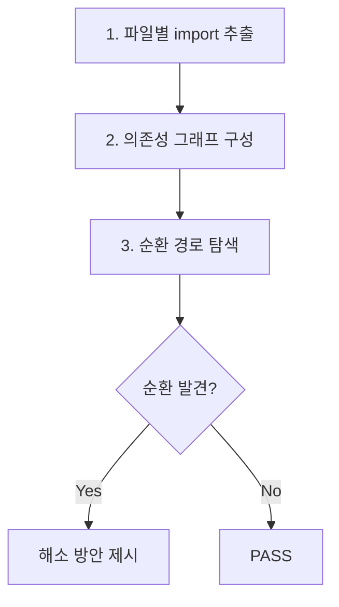

# Architecture Review

아키텍처 관점에서 코드 변경을 리뷰하여 구조적 결함을 조기에 발견하는 스킬.

## Overview

아키텍처 리뷰는 코드의 기능적 정확성이 아닌 **구조적 건전성**을 검증한다. 계층 간 의존성 방향, 모듈 경계, 설계 원칙 준수 여부를 체계적으로 점검하여 기술 부채 누적을 방지한다.

**적용 시점:**
- 새 모듈/패키지 도입 리뷰
- API 인터페이스 변경 리뷰
- 의존성 구조 변경 리뷰
- 계층 간 경계를 넘는 코드 변경 리뷰
- 대규모 리팩토링 리뷰

## command-architect 및 command-code-quality-checker와의 역할 분리

| 항목 | command-architect | command-code-quality-checker | command-review-architecture |
|------|-------------------|-----------------------------|-----------------------------|
| **역할** | 설계 생성 (다이어그램, 구조 정의) | ARCH- 접두사 기본 검사 (계층, 경계, 패턴) | 아키텍처 관점 리뷰 전문 체크리스트 |
| **사용 시점** | 새 시스템/모듈 설계 시 | implement/refactor 완료 후 품질 검사 | review 명령어에서 아키텍처 리뷰 요청 시 |
| **산출물** | UML 다이어그램, 아키텍처 문서 | Code Quality Score 내 ARCH- 이슈 | 아키텍처 리뷰 판정 (verdict + 상세 findings) |
| **검사 깊이** | 설계 수준 (What to build) | 코드 수준 기본 검사 (ARCH- 카테고리) | 코드 수준 심층 검사 (계층/순환/SOLID/에스컬레이션) |
| **관계** | 설계 기준 제공자 | 기본 아키텍처 검사 실행자 | 아키텍처 리뷰 전문 판정자 |

**ARCH- 접두사 체계 확장:** command-code-quality-checker의 `ARCH-` 접두사(계층, 경계, 패턴)는 구현 완료 후 기본 수준의 아키텍처 검사를 수행한다. command-review-architecture는 이 기본 검사를 **리뷰 관점에서 확장**하여, 계층 위반의 근본 원인 분석, 순환 의존성의 해소 방안, SOLID 원칙 위반의 구체적 리팩토링 방향, 에스컬레이션 판단까지 포함하는 심층 체크리스트를 제공한다.

## 계층 위반 탐지

### 계층 참조 규칙

표준 계층 구조에서 의존성은 **상위에서 하위 방향**으로만 허용된다:

```
Presentation (UI/Controller) -> Domain (Service/UseCase) -> Infrastructure (Repository/External)
```

| 계층 | 허용 참조 대상 | 금지 참조 대상 |
|------|---------------|---------------|
| Presentation | Domain | Infrastructure (직접 참조 금지) |
| Domain | 없음 (자체 완결) | Presentation, Infrastructure |
| Infrastructure | Domain (인터페이스만) | Presentation |

### 위반 패턴 목록

| 위반 유형 | 설명 | 심각도 | 예시 |
|-----------|------|--------|------|
| **하위->상위 직접 참조** | Infrastructure가 Presentation 계층을 import | high | `repository.py`에서 `views.py` import |
| **계층 건너뛰기** | Presentation이 Infrastructure를 직접 호출 | medium | Controller에서 직접 SQL 쿼리 실행 |
| **순환 참조** | 두 계층이 상호 의존 | high | Domain <-> Infrastructure 양방향 참조 |
| **도메인 오염** | Domain 계층에 프레임워크/인프라 의존성 침투 | high | 도메인 모델에 ORM 데코레이터 직접 사용 |
| **경계 누수** | 내부 구현 상세가 상위 계층에 노출 | medium | Repository 반환값이 ORM 모델 그대로 노출 |

### 탐지 절차

1. 변경된 파일의 import/require 문을 수집
2. 각 파일의 소속 계층을 프로젝트 디렉토리 구조에서 판별
3. import 대상 파일의 소속 계층과 비교하여 방향 검증
4. 위반 발견 시 위반 유형, 파일:라인, 심각도를 기록

## 순환 의존성 검사

import 분석 기반 순환 의존성 탐지를 4단계로 수행한다:



**1단계 - 파일별 import 추출:**
- 변경된 파일 및 직접 의존 파일의 import/require/from 문 수집
- 상대 경로와 절대 경로를 정규화하여 통일

**2단계 - 의존성 그래프 구성:**
- 파일 간 방향 그래프 구성 (A imports B = A -> B)
- 모듈/패키지 수준으로 그룹핑하여 모듈 간 의존성도 확인

**3단계 - 순환 경로 탐색:**
- 깊이 우선 탐색(DFS)으로 백엣지(back edge) 탐지
- 발견된 순환 경로를 구성하는 모든 노드 기록

**4단계 - 해소 방안 제시:**
- 인터페이스 추출 (의존성 역전)
- 이벤트 기반 분리 (Observer/Pub-Sub 패턴)
- 중재자 패턴 (Mediator) 도입
- 공통 모듈 추출

## SOLID 원칙 검증 체크리스트

### S - 단일 책임 원칙 (Single Responsibility)

- [ ] 클래스/모듈이 하나의 변경 이유만 갖는가?
- [ ] 파일 크기가 비정상적으로 크지 않은가? (500줄 초과 시 의심)
- [ ] 메서드 이름이 "And", "Or" 등 복합 동작을 암시하지 않는가?

### O - 개방-폐쇄 원칙 (Open-Closed)

- [ ] 새 기능 추가 시 기존 코드를 수정하지 않고 확장할 수 있는 구조인가?
- [ ] switch/case 또는 if/else 체인이 타입별 분기에 사용되고 있지 않은가?
- [ ] 플러그인/전략 패턴 등 확장 포인트가 적절히 제공되는가?

### L - 리스코프 치환 원칙 (Liskov Substitution)

- [ ] 하위 타입이 상위 타입의 계약(사전/사후 조건)을 위반하지 않는가?
- [ ] 오버라이드된 메서드가 예외를 추가로 던지거나 반환 타입을 축소하지 않는가?

### I - 인터페이스 분리 원칙 (Interface Segregation)

- [ ] 인터페이스가 구현체에 불필요한 메서드를 강제하지 않는가?
- [ ] 거대 인터페이스가 역할별로 분리되어 있는가?
- [ ] 클라이언트가 사용하지 않는 메서드에 의존하지 않는가?

### D - 의존성 역전 원칙 (Dependency Inversion)

- [ ] 고수준 모듈이 저수준 모듈의 구체 구현에 직접 의존하지 않는가?
- [ ] 추상(인터페이스/프로토콜)에 의존하고 있는가?
- [ ] 의존성 주입(DI)이 적절히 사용되고 있는가?

## 에스컬레이션 기준

다음 변경이 포함된 경우 리뷰 판정과 별개로 **즉시 에스컬레이션**을 권고한다:

| 에스컬레이션 대상 | 심각도 | 사유 |
|-------------------|--------|------|
| **DB 스키마 변경** | high | 마이그레이션 전략, 롤백 계획, 하위 호환성 검토 필요 |
| **신규 프레임워크/라이브러리 도입** | high | 라이선스, 유지보수 상태, 보안 이력, 학습 비용 검토 필요 |
| **공개 API 계약 변경** | high | 클라이언트 영향 분석, 버전 전략, 마이그레이션 가이드 필요 |
| **모듈 간 의존성 방향 역전** | medium | 기존 아키텍처 원칙 위배 여부, 의도된 설계 변경인지 확인 필요 |
| **새 계층/레이어 추가** | medium | 전체 아키텍처와의 정합성, 기존 계층과의 경계 정의 필요 |
| **인증/인가 흐름 변경** | high | 보안 영향 분석 필요 (review-security와 협력) |

**에스컬레이션 판단 기준 (getsentry/code-review 참조):**
- 변경의 blast radius가 단일 모듈을 초과하는가?
- 변경을 되돌리기(rollback) 어려운가?
- 해당 변경에 대한 팀 합의가 있는가?

## Output Format

```yaml
verdict: PASS | CONCERNS | ISSUES_FOUND
summary: "아키텍처 리뷰 요약 (1-2문장)"
layer_violations:
  - type: "하위->상위 직접 참조"
    severity: high
    file: "src/infrastructure/repository.py:15"
    detail: "infrastructure 계층에서 presentation 계층의 serializer 직접 import"
    suggested_action: "도메인 인터페이스를 통한 간접 참조로 변경"
circular_dependencies:
  - cycle: ["module_a", "module_b", "module_c"]
    severity: high
    detail: "A->B->C->A 순환 경로 발견"
    suggested_action: "module_c에서 module_a 의존을 인터페이스로 분리"
solid_violations:
  - principle: "S - 단일 책임"
    severity: medium
    file: "src/services/order_service.py"
    detail: "주문 생성, 결제 처리, 알림 전송을 모두 담당 (3가지 변경 이유)"
    suggested_action: "PaymentService, NotificationService 분리"
escalation_items:
  - type: "DB 스키마 변경"
    severity: high
    detail: "users 테이블에 새 컬럼 추가, 마이그레이션 전략 미확인"
    action_required: "DBA 또는 시니어 개발자 리뷰 필요"
```

## Critical Rules

1. **계층 방향 엄수**: 의존성은 반드시 상위->하위 방향만 허용. 역방향 참조는 무조건 ISSUES_FOUND 판정
2. **에스컬레이션 누락 금지**: DB 스키마 변경, 공개 API 계약 변경 등 에스컬레이션 대상이 발견되면 verdict와 무관하게 반드시 escalation_items에 포함
3. **증거 기반 판정**: 모든 위반 사항에 파일:라인 참조와 구체적 수정 방안 포함. 추상적 지적 금지
4. **프로젝트 컨벤션 우선**: 표준 계층 구조가 아닌 프로젝트 고유 아키텍처가 있으면 해당 규칙을 우선 적용
5. **ARCH- 체계 연동**: command-code-quality-checker의 ARCH- 이슈와 중복 보고하지 않음. 기본 검사는 ARCH-에 위임하고, 이 스킬은 심층 분석과 에스컬레이션에 집중

## 연관 스킬

| 스킬 | 용도 | 경로 |
|------|------|------|
| command-architect | 아키텍처 설계 생성 및 다이어그램 산출 | `.claude/skills/command-architect/SKILL.md` |
| command-code-quality-checker | ARCH- 접두사 기본 아키텍처 검사, Code Quality Score 산출 | `.claude/skills/command-code-quality-checker/SKILL.md` |
| command-requesting-code-review | 리뷰 요청 체크리스트 및 이슈 분류 기준 | `.claude/skills/command-requesting-code-review/SKILL.md` |
