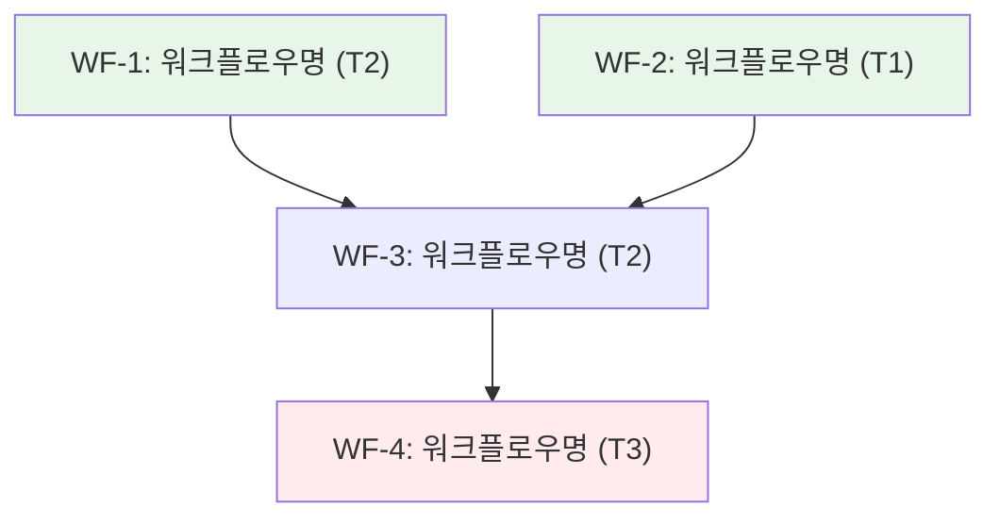
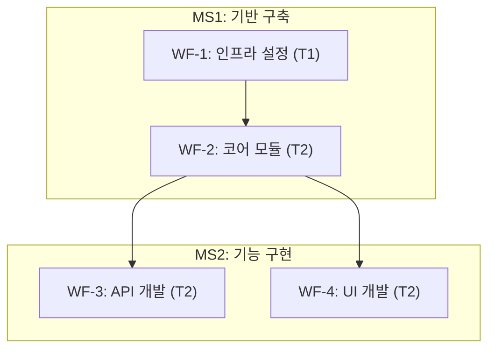

# Command Strategy

대규모 작업을 다중 워크플로우로 분해하여 실행 가능한 로드맵을 생성하는 전략 수립 전용 스킬.

## 목적

cc:strategy 명령어의 핵심 실행 엔진으로, 다음 활동을 체계적으로 수행한다:

- **현황 분석**: 코드베이스 구조, 기존 워크플로우 이력(`.workflow/`), 기술 스택, CLAUDE.md Next Steps를 종합적으로 파악
- **목표 정의**: 최종 목표(End Goal)를 명확화하고, 측정 가능한 마일스톤과 완료 기준(Definition of Done)을 설정
- **워크플로우 분해**: 마일스톤별 워크플로우를 식별하고, 워크플로우 간 종속성을 분석하여 실행 순서를 결정
- **로드맵 생성**: 우선순위, 종속성, 리스크를 종합하여 `roadmap.md`를 최종 산출

## 복잡도 산정 가이드

워크플로우 단위의 복잡도를 산정하여 일정 예측과 리소스 배분의 근거를 제공한다. 태스크 단위 복잡도 산정(workflow-plan/SKILL.md 참조)을 워크플로우 수준으로 확장한 것이다.

### 태스크 복잡도 점수 공식 (참조)

```
태스크 복잡도 = action_verbs * 2 + connectors * 2 + domain + scope + risk
```

| 요소 | 설명 | 점수 범위 |
|------|------|----------|
| `action_verbs` | 행위 동사 수 (생성, 수정, 삭제, 연동, 분석 등) | 0-5 (x2) |
| `connectors` | 접속사/조건 ("~하고", "~한 후", "~이면", 종속성) | 0-3 (x2) |
| `domain` | 도메인 전문성 필요도 (0: 일반, 1: 중간, 2: 전문) | 0-2 |
| `scope` | 영향 범위 (0: 단일 파일, 1: 모듈, 2: 시스템, 3: 크로스커팅) | 0-3 |
| `risk` | 부작용 위험도 (0: 안전, 1: 주의, 2: 높음) | 0-2 |

### 워크플로우 복잡도 산정

워크플로우 복잡도는 포함된 태스크들의 복잡도 합산에 구조적 요인을 가중하여 산정한다.

```
워크플로우 복잡도 = sum(태스크 복잡도) + phase_penalty + dependency_penalty
```

| 요소 | 설명 | 점수 |
|------|------|------|
| `sum(태스크 복잡도)` | 워크플로우 내 모든 태스크의 복잡도 점수 합계 | - |
| `phase_penalty` | Phase 수에 따른 조정 (2 Phase: +2, 3 Phase: +5, 4+ Phase: +8) | 0-8 |
| `dependency_penalty` | 크로스 Phase 종속성 수 x 2 | 0-N |

### 워크플로우 티어 분류

| 티어 | 점수 범위 | 분류 | 특성 |
|------|----------|------|------|
| T1 | < 10 | 단순 | 단일 Phase, 1-2개 태스크. 1회 세션에 완료 가능 |
| T2 | 10 - 30 | 중간 | 2-3 Phase, 3-6개 태스크. 종속성 있으나 관리 가능 |
| T3 | > 30 | 복잡 | 3+ Phase, 7개 이상 태스크. 아키텍처 변경 포함, 단계적 실행 필수 |

### 산정 예시

| 워크플로우 | 태스크 합산 | Phase | 종속성 | 최종 복잡도 |
|-----------|-----------|-------|--------|-----------|
| 설정 파일 3개 수정 | T1(2)+T1(2)+T1(3)=7 | 1 Phase (+0) | 0 | T1(7) |
| API 모듈 리팩토링 | T2(8)+T2(10)+T1(4)=22 | 2 Phase (+2) | 1 (+2) | T2(26) |
| 마이크로서비스 분리 | T3(18)+T2(12)+T3(16)+T2(9)=55 | 3 Phase (+5) | 3 (+6) | T3(66) |

## 종속성 그래프 생성

워크플로우 간 종속성을 분석하고 Mermaid flowchart로 시각화하는 절차.

### 분석 절차

1. **워크플로우 식별**: 마일스톤별로 필요한 워크플로우를 나열
2. **종속성 유형 분류**:
   - **데이터 종속성**: 선행 워크플로우의 산출물이 후행의 입력이 되는 경우
   - **구조 종속성**: 선행 워크플로우가 생성한 코드/인프라 위에 구축하는 경우
   - **지식 종속성**: 선행 워크플로우의 조사/분석 결과가 후행의 의사결정에 필요한 경우
3. **병렬 그룹 판별**: 종속성이 없는 워크플로우를 병렬 실행 그룹으로 묶기
4. **크리티컬 패스 식별**: 가장 긴 종속 체인을 파악하여 일정의 병목 구간 확인

### Mermaid flowchart 출력 형식



**스타일 규칙:**

| 상태 | 색상 | 의미 |
|------|------|------|
| `fill:#e8f5e9` | 연한 녹색 | 독립 실행 가능 (선행 종속성 없음) |
| `fill:#fff3e0` | 연한 주황색 | 종속성 있음 (선행 완료 대기) |
| `fill:#ffebee` | 연한 빨간색 | 크리티컬 패스 (일정 병목) |
| `fill:#e3f2fd` | 연한 파란색 | 마일스톤 완료 지점 |

**다이어그램 규칙:**

- `flowchart TD` 키워드 사용 (top-down 방향)
- 노드 ID는 영문+숫자만 (예: `WF1`, `WF2`)
- 라벨에는 한글 사용 가능
- 방향 없는 연결(`---`, `-.-`) 금지, 반드시 방향 화살표(`-->`, `-.->`) 사용
- 마일스톤 경계는 subgraph로 표현

### 마일스톤 경계 포함 예시



## 로드맵 템플릿

cc:strategy 명령어의 최종 산출물인 `roadmap.md`의 표준 구조. strategy.md의 "핵심 산출물" 섹션과 정합성을 유지한다.

```markdown
# [프로젝트/목표명] 로드맵

## 목표

- **최종 목표**: [End Goal 기술]
- **배경**: [왜 이 작업이 필요한지]
- **성공 지표**: [정량적 측정 가능한 기준]

## 마일스톤

### MS1: [마일스톤명]
- **완료 기준**: [Definition of Done]
- **예상 워크플로우**: N개
- **예상 복잡도**: T2(합산 점수)

### MS2: [마일스톤명]
- **완료 기준**: [Definition of Done]
- **예상 워크플로우**: N개
- **예상 복잡도**: T2(합산 점수)

## 워크플로우 체인

| ID | 워크플로우 | 명령어 | 마일스톤 | 종속성 | 복잡도 | 우선순위 |
|----|-----------|--------|---------|--------|--------|---------|
| WF-1 | [워크플로우명] | implement | MS1 | - | T2(N) | P0 |
| WF-2 | [워크플로우명] | research | MS1 | WF-1 | T1(N) | P1 |
| WF-3 | [워크플로우명] | implement | MS2 | WF-2 | T2(N) | P1 |

## 종속성 그래프

(Mermaid flowchart - 위 "종속성 그래프 생성" 섹션의 형식 준수)

## 리스크 및 완화 전략

| ID | 리스크 | 심각도 | 영향 워크플로우 | 완화 전략 |
|----|--------|--------|---------------|----------|
| R1 | [리스크 설명] | 높음/중간/낮음 | WF-N | [구체적 완화 방안] |

## 일정

| Phase | 워크플로우 | 실행 방식 | 비고 |
|-------|-----------|----------|------|
| Phase 1 | WF-1, WF-2 | 병렬 | 선행 종속성 없음 |
| Phase 2 | WF-3 | 순차 | WF-1, WF-2 완료 후 |
```

### 템플릿 사용 가이드

- **목표 섹션**: 반드시 정량적 성공 지표를 포함 (예: "명령어 수 8개에서 5개로 축소", "테스트 커버리지 80% 이상")
- **마일스톤**: 2-5개 범위. 각 마일스톤은 독립적으로 가치를 제공해야 함
- **워크플로우 체인**: 명령어 컬럼은 implement, research, review, strategy 중 하나
- **종속성 그래프**: 워크플로우가 4개 이상일 때 필수 포함
- **리스크**: 최소 1개 이상 식별. 기술적 리스크와 일정 리스크를 구분
- **일정**: 병렬 실행 가능 워크플로우를 명시하여 총 소요 시간 최적화

## 관련 스킬

| 스킬 | 용도 | 참조 시점 |
|------|------|----------|
| scope-decomposer | 요청을 에픽/스토리로 분해, RICE 우선순위 판단 | 목표 정의 및 워크플로우 분해 단계에서 활용 |
| workflow-plan | 개별 워크플로우 내부의 태스크 분해 및 Phase 설계 | 워크플로우별 상세 계획 수립 시 참조 |
| command-mermaid-diagrams | Mermaid 다이어그램 생성 | 종속성 그래프 시각화 시 참조 |
