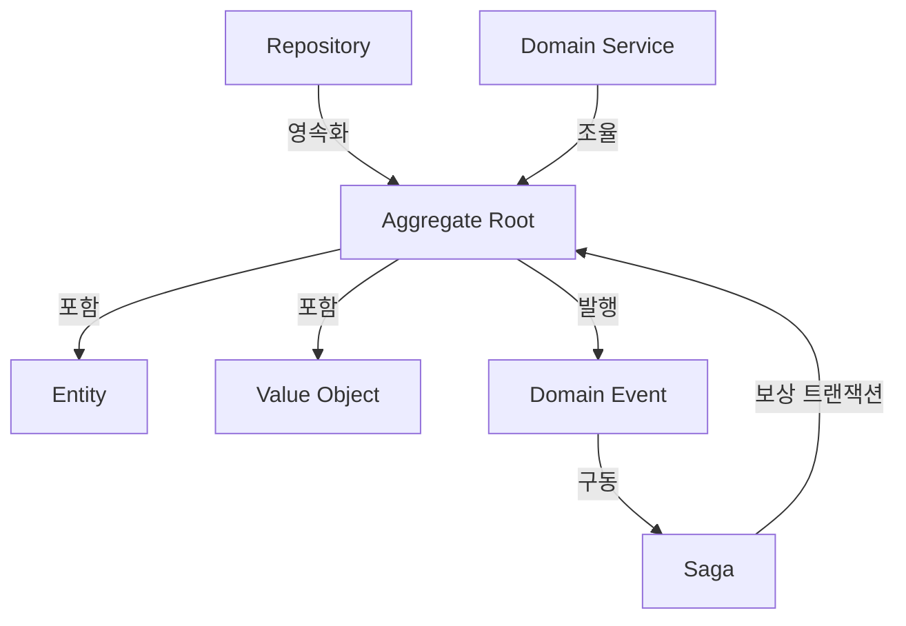

# DDD Tactical Patterns (DDD 전술 패턴)

DDD 전술 패턴 7개의 상세 참조 문서. 각 패턴에 대해 개념 설명, Python 코드 예시, JS/TS 코드 예시를 포함한다.

## Table of Contents

1. [Entity](#1-entity)
2. [Value Object](#2-value-object)
3. [Aggregate](#3-aggregate)
4. [Repository](#4-repository)
5. [Domain Service](#5-domain-service)
6. [Domain Event](#6-domain-event)
7. [Saga](#7-saga)
8. [Entity vs Value Object 동등성 비교](#entity-vs-value-object-동등성-비교)

---

## 1. Entity

**개념**: 고유 식별자(identity)로 구별되는 도메인 객체. 속성이 변해도 동일한 식별자를 가지면 같은 Entity이다. 생명주기를 가지며, 생성-변경-삭제의 과정을 거친다.

**핵심 특성**:
- 고유 식별자(ID)로 동등성 판단 (속성 비교가 아님)
- 가변적(mutable) — 상태가 변경될 수 있음
- 생명주기(lifecycle) 존재

### Python

```python
from dataclasses import dataclass, field
from uuid import UUID, uuid4


@dataclass
class User:
    """사용자 엔티티 — ID로 동등성 판단"""
    id: UUID = field(default_factory=uuid4)
    name: str = ""
    email: str = ""

    def change_email(self, new_email: str) -> None:
        if not new_email or "@" not in new_email:
            raise ValueError("유효하지 않은 이메일")
        self.email = new_email

    def __eq__(self, other: object) -> bool:
        if not isinstance(other, User):
            return NotImplemented
        return self.id == other.id

    def __hash__(self) -> int:
        return hash(self.id)
```

### JS/TS

```typescript
class User {
  readonly id: string;
  private _name: string;
  private _email: string;

  constructor(id: string, name: string, email: string) {
    this.id = id;
    this._name = name;
    this._email = email;
  }

  changeEmail(newEmail: string): void {
    if (!newEmail || !newEmail.includes("@")) {
      throw new Error("유효하지 않은 이메일");
    }
    this._email = newEmail;
  }

  equals(other: User): boolean {
    return this.id === other.id;
  }

  get name(): string { return this._name; }
  get email(): string { return this._email; }
}
```

---

## 2. Value Object

**개념**: 속성 값의 조합으로만 정의되는 불변 객체. 고유 식별자가 없으며, 모든 속성이 같으면 동일한 Value Object이다. 불변성(immutability)을 보장하여 부작용을 방지한다.

**핵심 특성**:
- 속성 값으로 동등성 판단 (structural equality)
- 불변(immutable) — 변경 시 새 객체 생성
- 식별자 없음

### Python

```python
from dataclasses import dataclass


@dataclass(frozen=True)
class Money:
    """금액 VO — frozen=True로 불변 보장"""
    amount: float
    currency: str

    def add(self, other: "Money") -> "Money":
        if self.currency != other.currency:
            raise ValueError("통화 단위 불일치")
        return Money(amount=self.amount + other.amount, currency=self.currency)

    def multiply(self, factor: float) -> "Money":
        return Money(amount=self.amount * factor, currency=self.currency)


@dataclass(frozen=True)
class Address:
    """주소 VO"""
    street: str
    city: str
    zipcode: str
    country: str
```

### JS/TS

```typescript
class Money {
  constructor(
    readonly amount: number,
    readonly currency: string
  ) {
    Object.freeze(this);
  }

  add(other: Money): Money {
    if (this.currency !== other.currency) {
      throw new Error("통화 단위 불일치");
    }
    return new Money(this.amount + other.amount, this.currency);
  }

  multiply(factor: number): Money {
    return new Money(this.amount * factor, this.currency);
  }

  equals(other: Money): boolean {
    return this.amount === other.amount && this.currency === other.currency;
  }
}

class Address {
  constructor(
    readonly street: string,
    readonly city: string,
    readonly zipcode: string,
    readonly country: string
  ) {
    Object.freeze(this);
  }

  equals(other: Address): boolean {
    return (
      this.street === other.street &&
      this.city === other.city &&
      this.zipcode === other.zipcode &&
      this.country === other.country
    );
  }
}
```

---

## 3. Aggregate

**개념**: 데이터 변경의 단위가 되는 관련 객체 클러스터. Aggregate Root(루트 엔티티)를 통해서만 내부 객체에 접근하며, 불변 조건(invariant)을 Aggregate 경계 내에서 보호한다. 트랜잭션 일관성의 경계이다.

**핵심 특성**:
- Aggregate Root를 통한 접근만 허용
- 경계 내 불변 조건(invariant) 강제
- 트랜잭션 일관성 단위

### Python — 불변 조건 보호

```python
from dataclasses import dataclass, field
from uuid import UUID, uuid4


@dataclass
class OrderItem:
    """주문 항목 — Aggregate 내부 엔티티"""
    product_id: str
    quantity: int
    unit_price: float

    @property
    def subtotal(self) -> float:
        return self.quantity * self.unit_price


class Order:
    """주문 Aggregate Root — 불변 조건을 보호"""
    MAX_ITEMS = 20

    def __init__(self, order_id: UUID | None = None, customer_id: str = ""):
        self.id: UUID = order_id or uuid4()
        self.customer_id = customer_id
        self._items: list[OrderItem] = []
        self._status: str = "draft"

    def add_item(self, product_id: str, quantity: int, unit_price: float) -> None:
        """항목 추가 — 불변 조건: 최대 항목 수 제한"""
        if len(self._items) >= self.MAX_ITEMS:
            raise ValueError(f"주문 항목은 최대 {self.MAX_ITEMS}개까지 허용")
        if quantity <= 0:
            raise ValueError("수량은 양수여야 합니다")
        self._items.append(OrderItem(product_id, quantity, unit_price))

    def remove_item(self, product_id: str) -> None:
        self._items = [i for i in self._items if i.product_id != product_id]

    def place(self) -> None:
        """주문 확정 — 불변 조건: 빈 주문 불가"""
        if not self._items:
            raise ValueError("빈 주문은 확정할 수 없습니다")
        self._status = "placed"

    @property
    def total(self) -> float:
        return sum(item.subtotal for item in self._items)

    @property
    def items(self) -> tuple[OrderItem, ...]:
        """내부 컬렉션을 불변 튜플로 반환하여 외부 변경 방지"""
        return tuple(self._items)
```

### JS/TS — 불변 조건 보호

```typescript
class OrderItem {
  constructor(
    readonly productId: string,
    readonly quantity: number,
    readonly unitPrice: number
  ) {}

  get subtotal(): number {
    return this.quantity * this.unitPrice;
  }
}

class Order {
  private static readonly MAX_ITEMS = 20;
  private readonly _items: OrderItem[] = [];
  private _status: string = "draft";

  constructor(
    readonly id: string,
    readonly customerId: string
  ) {}

  addItem(productId: string, quantity: number, unitPrice: number): void {
    if (this._items.length >= Order.MAX_ITEMS) {
      throw new Error(`주문 항목은 최대 ${Order.MAX_ITEMS}개까지 허용`);
    }
    if (quantity <= 0) {
      throw new Error("수량은 양수여야 합니다");
    }
    this._items.push(new OrderItem(productId, quantity, unitPrice));
  }

  removeItem(productId: string): void {
    const index = this._items.findIndex((i) => i.productId === productId);
    if (index >= 0) this._items.splice(index, 1);
  }

  place(): void {
    if (this._items.length === 0) {
      throw new Error("빈 주문은 확정할 수 없습니다");
    }
    this._status = "placed";
  }

  get total(): number {
    return this._items.reduce((sum, item) => sum + item.subtotal, 0);
  }

  get items(): readonly OrderItem[] {
    return [...this._items];
  }

  get status(): string {
    return this._status;
  }
}
```

---

## 4. Repository

**개념**: Aggregate의 영속성을 캡슐화하는 인터페이스. 컬렉션처럼 Aggregate를 저장/조회/삭제하며, 도메인 계층이 인프라(DB, 파일 등)에 직접 의존하지 않도록 한다.

**핵심 특성**:
- Aggregate Root 단위로 CRUD 제공
- 도메인 계층에는 인터페이스만 노출 (구현은 인프라 계층)
- DIP(Dependency Inversion Principle) 적용

### Python — convention-python의 `DataRepository(ABC)` 확장

```python
from abc import ABC, abstractmethod
from uuid import UUID


class OrderRepository(ABC):
    """주문 Aggregate의 Repository 인터페이스 (도메인 계층)"""

    @abstractmethod
    def find_by_id(self, order_id: UUID) -> Order | None:
        """ID로 주문 조회"""
        pass

    @abstractmethod
    def save(self, order: Order) -> None:
        """주문 저장 (생성 또는 갱신)"""
        pass

    @abstractmethod
    def delete(self, order_id: UUID) -> None:
        """주문 삭제"""
        pass

    @abstractmethod
    def find_by_customer(self, customer_id: str) -> list[Order]:
        """고객별 주문 목록 조회"""
        pass


class InMemoryOrderRepository(OrderRepository):
    """인메모리 구현 (테스트/개발용, 인프라 계층)"""

    def __init__(self) -> None:
        self._store: dict[UUID, Order] = {}

    def find_by_id(self, order_id: UUID) -> Order | None:
        return self._store.get(order_id)

    def save(self, order: Order) -> None:
        self._store[order.id] = order

    def delete(self, order_id: UUID) -> None:
        self._store.pop(order_id, None)

    def find_by_customer(self, customer_id: str) -> list[Order]:
        return [o for o in self._store.values() if o.customer_id == customer_id]
```

### JS/TS — convention-javascript의 `DataRepository<T>` 확장

```typescript
interface OrderRepository {
  findById(orderId: string): Promise<Order | undefined>;
  save(order: Order): Promise<void>;
  delete(orderId: string): Promise<void>;
  findByCustomer(customerId: string): Promise<Order[]>;
}

class InMemoryOrderRepository implements OrderRepository {
  private readonly store = new Map<string, Order>();

  async findById(orderId: string): Promise<Order | undefined> {
    return this.store.get(orderId);
  }

  async save(order: Order): Promise<void> {
    this.store.set(order.id, order);
  }

  async delete(orderId: string): Promise<void> {
    this.store.delete(orderId);
  }

  async findByCustomer(customerId: string): Promise<Order[]> {
    return [...this.store.values()].filter(
      (order) => order.customerId === customerId
    );
  }
}
```

---

## 5. Domain Service

**개념**: 특정 Entity나 Value Object에 자연스럽게 속하지 않는 도메인 로직을 담는 상태 없는(stateless) 서비스. 여러 Aggregate 간의 조율이나 도메인 규칙 적용에 사용한다.

**핵심 특성**:
- 상태 없음(stateless)
- Entity/VO에 속하지 않는 도메인 로직 담당
- 도메인 언어(Ubiquitous Language)로 명명

### Python

```python
from dataclasses import dataclass


@dataclass(frozen=True)
class Money:
    amount: float
    currency: str


class PricingService:
    """가격 계산 도메인 서비스 — 여러 Aggregate 참여"""

    def __init__(self, tax_rate: float = 0.1):
        self._tax_rate = tax_rate

    def calculate_total(
        self, items: list[OrderItem], discount_percent: float = 0.0
    ) -> Money:
        """주문 총액 계산 (할인 + 세금 적용)"""
        subtotal = sum(item.subtotal for item in items)
        discount = subtotal * (discount_percent / 100)
        tax = (subtotal - discount) * self._tax_rate
        return Money(amount=subtotal - discount + tax, currency="KRW")


class TransferService:
    """계좌 이체 도메인 서비스 — 두 Account Aggregate 간 조율"""

    def transfer(self, source: "Account", target: "Account", amount: Money) -> None:
        if source.balance.amount < amount.amount:
            raise ValueError("잔액 부족")
        source.withdraw(amount)
        target.deposit(amount)
```

### JS/TS

```typescript
class PricingService {
  constructor(private readonly taxRate: number = 0.1) {}

  calculateTotal(items: OrderItem[], discountPercent: number = 0): Money {
    const subtotal = items.reduce((sum, item) => sum + item.subtotal, 0);
    const discount = subtotal * (discountPercent / 100);
    const tax = (subtotal - discount) * this.taxRate;
    return new Money(subtotal - discount + tax, "KRW");
  }
}

class TransferService {
  transfer(source: Account, target: Account, amount: Money): void {
    if (source.balance.amount < amount.amount) {
      throw new Error("잔액 부족");
    }
    source.withdraw(amount);
    target.deposit(amount);
  }
}
```

---

## 6. Domain Event

**개념**: 도메인에서 발생한 의미 있는 사건(fact)을 나타내는 불변 객체. 과거형으로 명명하며(OrderPlaced, PaymentCompleted 등), Aggregate 간 느슨한 결합을 달성하고 이벤트 소싱의 기반이 된다.

**핵심 특성**:
- 불변(immutable)
- 과거형 명명 (무엇이 발생했는가)
- 발생 시각(timestamp) 포함
- Aggregate 간 통신에 활용

### Python

```python
from dataclasses import dataclass, field
from datetime import datetime, timezone
from uuid import UUID, uuid4
from typing import Callable


@dataclass(frozen=True)
class DomainEvent:
    """도메인 이벤트 기반 클래스"""
    event_id: UUID = field(default_factory=uuid4)
    occurred_at: datetime = field(default_factory=lambda: datetime.now(timezone.utc))


@dataclass(frozen=True)
class OrderPlaced(DomainEvent):
    """주문 확정 이벤트"""
    order_id: UUID = field(default_factory=uuid4)
    customer_id: str = ""
    total_amount: float = 0.0


@dataclass(frozen=True)
class PaymentCompleted(DomainEvent):
    """결제 완료 이벤트"""
    order_id: UUID = field(default_factory=uuid4)
    amount: float = 0.0


class EventBus:
    """간단한 도메인 이벤트 버스"""

    def __init__(self) -> None:
        self._handlers: dict[type, list[Callable]] = {}

    def subscribe(self, event_type: type, handler: Callable) -> None:
        self._handlers.setdefault(event_type, []).append(handler)

    def publish(self, event: DomainEvent) -> None:
        for handler in self._handlers.get(type(event), []):
            handler(event)
```

### JS/TS

```typescript
interface DomainEvent {
  readonly eventId: string;
  readonly occurredAt: Date;
}

class OrderPlaced implements DomainEvent {
  readonly occurredAt = new Date();
  constructor(
    readonly eventId: string,
    readonly orderId: string,
    readonly customerId: string,
    readonly totalAmount: number
  ) {}
}

class PaymentCompleted implements DomainEvent {
  readonly occurredAt = new Date();
  constructor(
    readonly eventId: string,
    readonly orderId: string,
    readonly amount: number
  ) {}
}

type EventHandler<T extends DomainEvent> = (event: T) => void;

class EventBus {
  private handlers = new Map<string, EventHandler<DomainEvent>[]>();

  subscribe<T extends DomainEvent>(
    eventName: string,
    handler: EventHandler<T>
  ): void {
    const list = this.handlers.get(eventName) ?? [];
    list.push(handler as EventHandler<DomainEvent>);
    this.handlers.set(eventName, list);
  }

  publish(eventName: string, event: DomainEvent): void {
    const list = this.handlers.get(eventName) ?? [];
    list.forEach((handler) => handler(event));
  }
}
```

---

## 7. Saga

**개념**: 여러 Aggregate(또는 Bounded Context)에 걸친 비즈니스 프로세스를 로컬 트랜잭션 시퀀스로 관리하는 패턴. 각 단계가 성공하면 다음 단계로 진행하고, 실패하면 이전 단계의 보상 트랜잭션(compensating transaction)을 실행하여 최종 일관성을 보장한다.

**방식**:
- **Choreography**: 이벤트 발행/구독으로 느슨하게 연결
- **Orchestration**: 중앙 조정자(Saga Orchestrator)가 단계별 흐름 관리

### Python — Orchestration 방식

```python
from dataclasses import dataclass
from enum import Enum
from typing import Callable


class SagaStatus(Enum):
    PENDING = "pending"
    COMPLETED = "completed"
    COMPENSATING = "compensating"
    FAILED = "failed"


@dataclass
class SagaStep:
    """Saga 개별 단계"""
    name: str
    action: Callable[[], bool]
    compensate: Callable[[], None]


class OrderSaga:
    """주문 처리 Saga — Orchestration 방식"""

    def __init__(self) -> None:
        self._steps: list[SagaStep] = []
        self._completed: list[SagaStep] = []
        self.status = SagaStatus.PENDING

    def add_step(self, step: SagaStep) -> None:
        self._steps.append(step)

    def execute(self) -> bool:
        """전체 Saga 실행 — 실패 시 보상 트랜잭션 역순 실행"""
        for step in self._steps:
            if step.action():
                self._completed.append(step)
            else:
                self._compensate()
                self.status = SagaStatus.FAILED
                return False
        self.status = SagaStatus.COMPLETED
        return True

    def _compensate(self) -> None:
        """완료된 단계를 역순으로 보상"""
        self.status = SagaStatus.COMPENSATING
        for step in reversed(self._completed):
            step.compensate()
        self._completed.clear()


# 사용 예시
def create_order_saga() -> OrderSaga:
    saga = OrderSaga()
    saga.add_step(SagaStep(
        name="재고 차감",
        action=lambda: reserve_inventory(),
        compensate=lambda: release_inventory(),
    ))
    saga.add_step(SagaStep(
        name="결제 처리",
        action=lambda: process_payment(),
        compensate=lambda: refund_payment(),
    ))
    saga.add_step(SagaStep(
        name="배송 요청",
        action=lambda: request_shipment(),
        compensate=lambda: cancel_shipment(),
    ))
    return saga
```

### JS/TS — Orchestration 방식

```typescript
interface SagaStep {
  name: string;
  action: () => Promise<boolean>;
  compensate: () => Promise<void>;
}

class OrderSaga {
  private steps: SagaStep[] = [];
  private completed: SagaStep[] = [];
  status: "pending" | "completed" | "compensating" | "failed" = "pending";

  addStep(step: SagaStep): void {
    this.steps.push(step);
  }

  async execute(): Promise<boolean> {
    for (const step of this.steps) {
      if (await step.action()) {
        this.completed.push(step);
      } else {
        await this.compensate();
        this.status = "failed";
        return false;
      }
    }
    this.status = "completed";
    return true;
  }

  private async compensate(): Promise<void> {
    this.status = "compensating";
    for (const step of [...this.completed].reverse()) {
      await step.compensate();
    }
    this.completed = [];
  }
}

// 사용 예시
function createOrderSaga(): OrderSaga {
  const saga = new OrderSaga();
  saga.addStep({
    name: "재고 차감",
    action: () => reserveInventory(),
    compensate: () => releaseInventory(),
  });
  saga.addStep({
    name: "결제 처리",
    action: () => processPayment(),
    compensate: () => refundPayment(),
  });
  saga.addStep({
    name: "배송 요청",
    action: () => requestShipment(),
    compensate: () => cancelShipment(),
  });
  return saga;
}
```

---

## Entity vs Value Object 동등성 비교

Entity와 Value Object의 가장 핵심적인 차이는 **동등성(equality) 판단 기준**이다.

| 구분 | Entity | Value Object |
|------|--------|-------------|
| 동등성 기준 | Identity (고유 식별자) | Structural (속성 값 전체) |
| 가변성 | 가변(mutable) | 불변(immutable) |
| 수명 | 생명주기 추적 | 교체 가능 (새 객체 생성) |
| 예시 | User, Order, Account | Money, Address, DateRange |

### Python — 동등성 비교 코드

```python
from dataclasses import dataclass, field
from uuid import UUID, uuid4


# Entity: ID 기반 동등성
@dataclass
class Customer:
    id: UUID = field(default_factory=uuid4)
    name: str = ""

    def __eq__(self, other: object) -> bool:
        if not isinstance(other, Customer):
            return NotImplemented
        return self.id == other.id  # ID만 비교

    def __hash__(self) -> int:
        return hash(self.id)


# Value Object: 속성 기반 동등성
@dataclass(frozen=True)
class Money:
    amount: float
    currency: str
    # frozen=True로 __eq__, __hash__ 자동 생성 (모든 속성 비교)


# 동등성 차이 확인
customer1 = Customer(id=UUID("12345678-1234-1234-1234-123456789abc"), name="Alice")
customer2 = Customer(id=UUID("12345678-1234-1234-1234-123456789abc"), name="Bob")
print(customer1 == customer2)  # True — 같은 ID이므로 같은 Entity

money1 = Money(amount=100, currency="KRW")
money2 = Money(amount=100, currency="KRW")
money3 = Money(amount=200, currency="KRW")
print(money1 == money2)  # True — 모든 속성이 같으므로 같은 VO
print(money1 == money3)  # False — amount가 다르므로 다른 VO
```

### JS/TS — 동등성 비교 코드

```typescript
// Entity: ID 기반 동등성
class Customer {
  constructor(readonly id: string, private _name: string) {}

  equals(other: Customer): boolean {
    return this.id === other.id; // ID만 비교
  }

  get name(): string { return this._name; }
  set name(value: string) { this._name = value; } // 가변
}

// Value Object: 속성 기반 동등성
class Money {
  constructor(readonly amount: number, readonly currency: string) {
    Object.freeze(this); // 불변
  }

  equals(other: Money): boolean {
    return this.amount === other.amount && this.currency === other.currency; // 모든 속성 비교
  }
}

// 동등성 차이 확인
const customer1 = new Customer("c-001", "Alice");
const customer2 = new Customer("c-001", "Bob");
console.log(customer1.equals(customer2)); // true — 같은 ID

const money1 = new Money(100, "KRW");
const money2 = new Money(100, "KRW");
const money3 = new Money(200, "KRW");
console.log(money1.equals(money2)); // true — 모든 속성 동일
console.log(money1.equals(money3)); // false — amount 다름
```

---

## 패턴 간 관계



| 관계 | 설명 |
|------|------|
| Aggregate ↔ Entity/VO | Aggregate는 Root Entity + 내부 Entity + Value Object의 클러스터 |
| Repository ↔ Aggregate | Repository는 Aggregate Root 단위로 영속화 |
| Domain Service ↔ Aggregate | 여러 Aggregate에 걸친 로직을 Domain Service에 배치 |
| Domain Event ↔ Aggregate | Aggregate 상태 변경 시 Domain Event 발행 |
| Saga ↔ Domain Event | Domain Event가 Saga의 다음 단계를 트리거 |
| Entity ↔ Value Object | Entity는 Value Object를 속성으로 포함 (예: Order의 Money 속성) |
