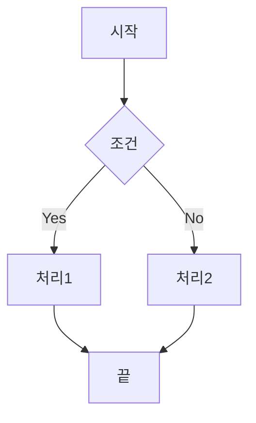
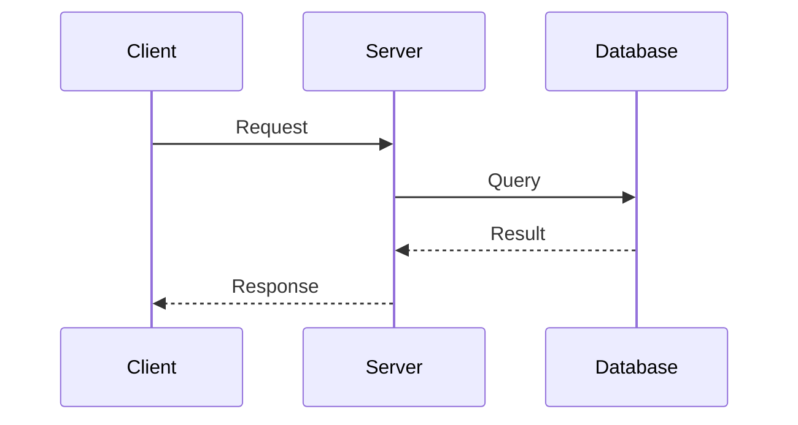
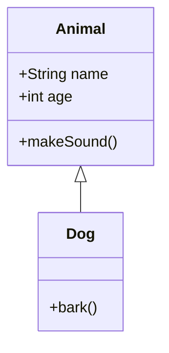
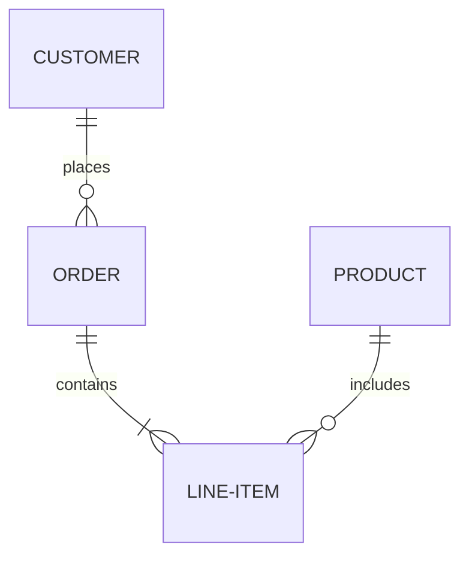
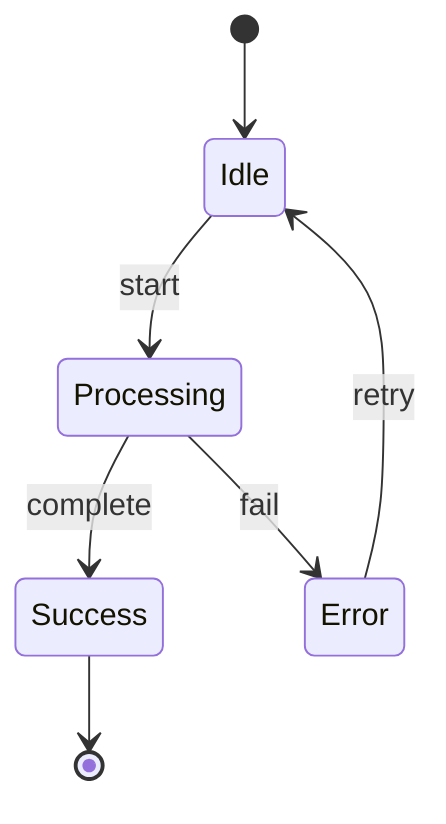
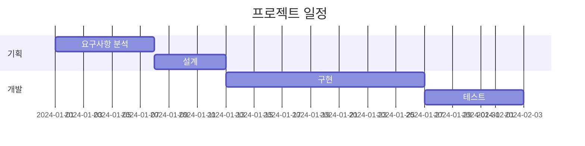
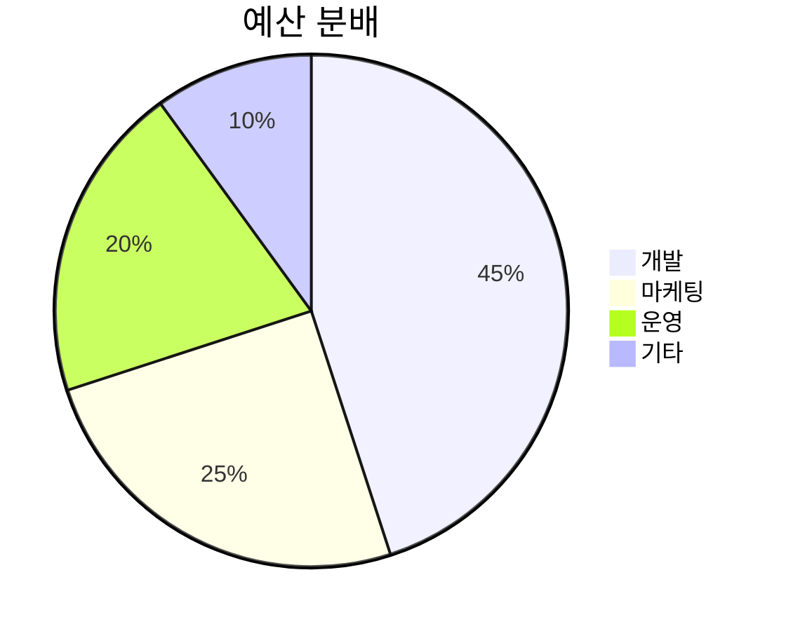
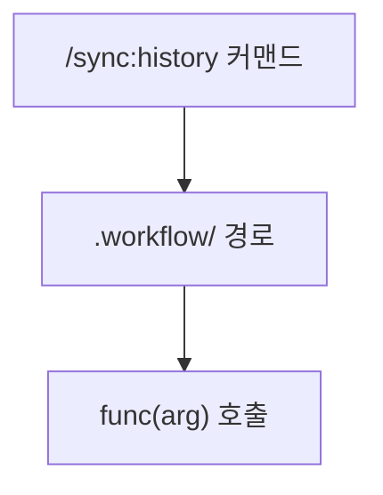
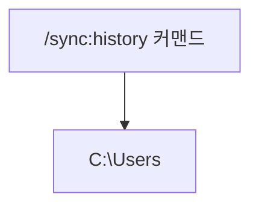
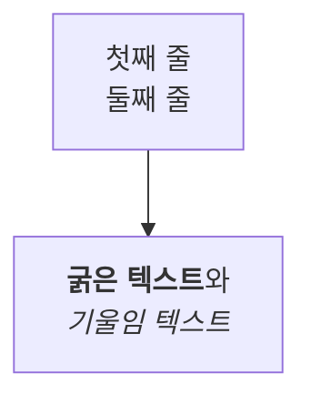

# Mermaid Diagrams

Mermaid를 사용하여 다양한 다이어그램을 생성합니다.

## 사용 시기

- 플로우차트, 시퀀스 다이어그램이 필요할 때
- 클래스 다이어그램, ER 다이어그램을 그릴 때
- 상태 다이어그램, 간트 차트가 필요할 때
- 시스템 아키텍처를 시각화할 때
- 데이터 모델을 표현할 때

---

## 지원 다이어그램 타입

### 1. Flowchart (플로우차트)



**방향 옵션:**
- `TD` / `TB` - 위에서 아래
- `BT` - 아래에서 위
- `LR` - 왼쪽에서 오른쪽
- `RL` - 오른쪽에서 왼쪽

#### 화살표 방향 필수 규칙

Flowchart에서 모든 연결선은 **반드시 방향(화살표)을 포함**해야 합니다. 방향이 없는 연결선은 금지합니다.

| 구분 | 문법 | 설명 | 허용 여부 |
|------|------|------|----------|
| 방향 실선 | `-->` | 실선 화살표 | 허용 |
| 방향 점선 | `-.->` | 점선 화살표 | 허용 |
| 방향 굵은선 | `==>` | 굵은 실선 화살표 | 허용 |
| 라벨 실선 | `-->\|텍스트\|` | 라벨 포함 실선 화살표 | 허용 |
| 라벨 점선 | `-.->\|텍스트\|` | 라벨 포함 점선 화살표 | 허용 |
| 라벨 굵은선 | `==>\|텍스트\|` | 라벨 포함 굵은 화살표 | 허용 |
| **무방향 실선** | `---` | 방향 없는 실선 | **금지** |
| **무방향 점선** | `-.-` | 방향 없는 점선 | **금지** |
| **무방향 굵은선** | `===` | 방향 없는 굵은선 | **금지** |

> **원칙**: 흐름도에서 연결선은 데이터/제어 흐름의 방향을 나타내야 합니다. 방향 없는 연결은 흐름의 의미를 모호하게 만들므로 항상 화살표(`-->`, `-.->`, `==>`)를 사용합니다.

### 2. Sequence Diagram (시퀀스 다이어그램)



### 3. Class Diagram (클래스 다이어그램)



### 4. ER Diagram (엔티티 관계 다이어그램)



### 5. State Diagram (상태 다이어그램)



### 6. Gantt Chart (간트 차트)



### 7. Pie Chart (파이 차트)



## 출력 형식

- **Markdown (.md)**: Mermaid 코드 블록
- **HTML**: 인터랙티브 프리뷰
- **PNG**: 이미지 파일
- **SVG**: 벡터 이미지

## 변환 방법

### CLI 도구 (mmdc)

```bash
# 설치
npm install -g @mermaid-js/mermaid-cli

# PNG 변환
mmdc -i diagram.mmd -o diagram.png

# SVG 변환
mmdc -i diagram.mmd -o diagram.svg

# 테마 적용
mmdc -i diagram.mmd -o diagram.png -t dark
```

### HTML 임베드

```html
<!DOCTYPE html>
<html>
<head>
    <script src="https://cdn.jsdelivr.net/npm/mermaid/dist/mermaid.min.js"></script>
</head>
<body>
    <div class="mermaid">
        flowchart LR
            A --> B
    </div>
    <script>mermaid.initialize({startOnLoad:true});</script>
</body>
</html>
```

## 스타일링

```mermaid
flowchart TD
    A[시작]:::start --> B[처리]:::process
    B --> C[끝]:::end

    classDef start fill:#90EE90
    classDef process fill:#87CEEB
    classDef end fill:#FFB6C1
```

## 특수문자 처리

노드 라벨에 특수문자(`/`, `\`, `(`, `)`, `{`, `}` 등)가 포함되면 Mermaid 형상 구문과 충돌하여 파싱 에러가 발생할 수 있습니다.

> **기본 원칙**: 특수문자가 1개라도 포함되면 라벨을 큰따옴표(`"`)로 감싼다. 큰따옴표 래핑만으로 해결되지 않는 문자(`/`, `\` 등 라벨 시작 위치, `|`, `"`, `#`)는 HTML 엔티티로 추가 치환한다.

### 충돌 원인

Mermaid는 대괄호 안의 특정 문자를 형상(shape) 구문으로 해석합니다:

| 구문 | 형상 | 충돌 문자 |
|------|------|----------|
| `[/ /]` | 사다리꼴 (lean-right) | `/` |
| `[\ \]` | 역사다리꼴 (lean-left) | `\` |
| `(( ))` | 이중 원 | `(`, `)` |
| `[( )]` | 실린더 | `(`, `)` |
| `{ }` | 다이아몬드 | `{`, `}` |
| `\|...\|` | 엣지 라벨 구분자 | `\|` (PIPE 토큰으로 파싱) |
| `"..."` | 문자열 토큰 | `"` (STR 토큰과 충돌) |
| `\n` | 리터럴 문자열 | `\n` (개행이 아닌 리터럴로 인식) |

### 잘못된 예시 vs 올바른 예시

| 잘못된 예시 | 문제 | 올바른 예시 (큰따옴표) | 올바른 예시 (HTML 엔티티) |
|------------|------|----------------------|------------------------|
| `E[/path/to/file]` | `[/`가 사다리꼴 형상으로 파싱됨 | `E["/path/to/file"]` | `E["#sol;path#sol;to#sol;file"]` |
| `F[C:\Users\docs]` | `[\`가 역사다리꼴 형상으로 파싱됨 | `F["C:\Users\docs"]` | `F["C:#bsol;Users#bsol;docs"]` |
| `G[func(arg)]` | `()`가 형상 구문과 혼동됨 | `G["func(arg)"]` | `G["func#lpar;arg#rpar;"]` |
| `H[.workflow/ 경로]` | 라벨 내 슬래시가 파서 혼동 유발 | `H[".workflow/ 경로"]` | `H[".workflow#sol; 경로"]` |
| `B1[curl\|bash 파이프]` | `\|`가 엣지 라벨 PIPE 토큰으로 파싱됨 | `B1["curl #124; bash 파이프"]` | - |
| `Q[사용자 질의\n"d80 에러"]` | `"`가 STR 토큰과 충돌, `\n`은 개행 아님 | `Q["사용자 질의<br>#quot;d80 에러#quot;"]` | - |
| `A[첫째 줄\n둘째 줄]` | `\n`이 리터럴로 표시됨 (줄바꿈 안 됨) | `A["첫째 줄<br>둘째 줄"]` | Markdown 문자열 방식도 가능 (해결 방법 3 참조) |

### 해결 방법 1: 큰따옴표 래핑 (권장)

라벨 전체를 큰따옴표(`"`)로 감싸면 내부 문자가 리터럴로 처리됩니다.



### 해결 방법 2: HTML 엔티티

큰따옴표 래핑이 불가능한 경우 HTML 엔티티로 대체합니다.

| 문자 | HTML 엔티티 | 예시 |
|------|------------|------|
| `/` | `#sol;` | `#sol;path` |
| `\` | `#bsol;` | `C:#bsol;Users` |
| `(` | `#lpar;` | `func#lpar;` |
| `)` | `#rpar;` | `#rpar;` |
| `\|` | `#124;` | `curl #124; bash` |
| `"` | `#quot;` | `#quot;에러 메시지#quot;` |
| `#` | `#35;` | `#35;sol;` (엔티티 리터럴 표시) |



### 해결 방법 3: Markdown 문자열

Mermaid v10.7+에서 지원하는 Markdown 문자열 구문(`` "`...`" ``)을 사용하면 **굵게**, *기울임*, 자동 줄바꿈을 라벨 안에서 직접 사용할 수 있습니다.

- `\n` 리터럴 대신 **실제 개행 문자**를 넣으면 줄바꿈으로 렌더링됩니다.
- 내부에서 Markdown 인라인 서식(**bold**, *italic*)을 그대로 사용할 수 있습니다.
- `<br>` HTML 태그 없이도 여러 줄 라벨을 작성할 수 있습니다.



> **참고**: Markdown 문자열 안에서는 `"`, `|` 등 특수문자도 이스케이프 없이 사용할 수 있습니다. 단, 백틱(`` ` ``)은 구문 종료 문자이므로 사용할 수 없습니다.

> **원칙**: 라벨에 특수문자가 포함될 때는 항상 큰따옴표로 감싸는 것을 기본으로 합니다. 라벨 시작이 `/`나 `\`인 경우에는 큰따옴표와 HTML 엔티티를 함께 사용합니다.

## 참고 링크

- [Mermaid 공식 문서](https://mermaid.js.org/)
- [Mermaid Live Editor](https://mermaid.live/)
