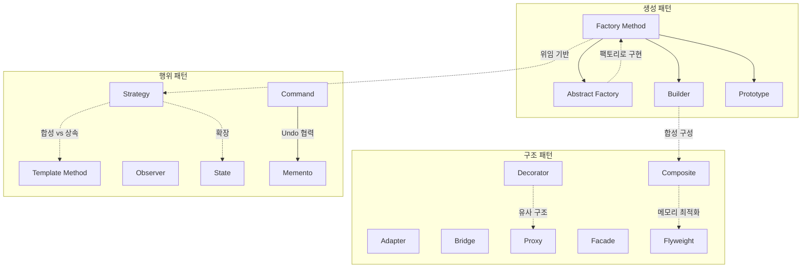
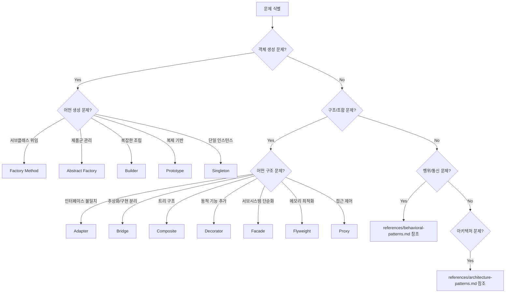

# Software Design Patterns

GoF 23개 디자인 패턴과 현대 아키텍처 패턴을 포함한 39개 패턴의 종합 참조 가이드.

## Quick Selection Guide

| 문제 상황 | 추천 패턴 | 카테고리 |
|-----------|----------|----------|
| 객체 생성 로직을 서브클래스에 위임 | Factory Method | 생성 |
| 관련 객체 제품군을 일괄 생성 | Abstract Factory | 생성 |
| 복잡한 객체를 단계별로 조립 | Builder | 생성 |
| 기존 객체를 복제하여 새 객체 생성 | Prototype | 생성 |
| 전역 단일 인스턴스 보장 | Singleton | 생성 |
| 호환되지 않는 인터페이스 연결 | Adapter | 구조 |
| 추상화와 구현을 독립적으로 변경 | Bridge | 구조 |
| 트리 구조로 개별/복합 객체 동일 처리 | Composite | 구조 |
| 런타임에 기능을 동적으로 추가 | Decorator | 구조 |
| 복잡한 서브시스템에 단순 인터페이스 제공 | Facade | 구조 |
| 대량 유사 객체의 메모리 최적화 | Flyweight | 구조 |
| 객체 접근 제어 (지연/권한/캐시) | Proxy | 구조 |
| 요청을 핸들러 체인으로 순차 전달 | Chain of Responsibility | 행위 |
| 작업을 객체로 캡슐화 (큐잉/Undo) | Command | 행위 |
| 컬렉션을 내부 구조 은닉하며 순회 | Iterator | 행위 |
| 객체 간 복잡한 통신을 중앙 집중화 | Mediator | 행위 |
| 캡슐화 유지하며 상태 스냅샷 저장/복원 | Memento | 행위 |
| 이벤트 기반 알림 및 구독 메커니즘 | Observer | 행위 |
| 상태에 따라 객체 동작 변경 | State | 행위 |
| 런타임에 알고리즘 교체 | Strategy | 행위 |
| 알고리즘 골격 유지하며 단계 재정의 | Template Method | 행위 |
| 클래스 수정 없이 새 작업 추가 | Visitor | 행위 |
| UI와 비즈니스 로직 분리 | MVC / MVP / MVVM | 아키텍처 |
| 데이터 접근 로직 추상화 | Repository | 아키텍처 |
| 느슨한 결합과 테스트 용이성 | Dependency Injection | 아키텍처 |
| 읽기/쓰기 모델 분리 및 독립 확장 | CQRS | 아키텍처 |
| 모든 상태 변경의 완전한 이력 보존 | Event Sourcing | 아키텍처 |
| 서비스 독립 개발/배포/확장 | Microservices | 분산 |
| 분산 트랜잭션 관리 | Saga | 분산 |
| 장애 연쇄 전파 차단 | Circuit Breaker | 분산 |

## GoF Patterns Summary

### Creational Patterns (생성 패턴)

| 패턴 | 핵심 | 메커니즘 |
|------|------|---------|
| Factory Method | 서브클래스에 생성 위임 | 상속 + 오버라이드 |
| Abstract Factory | 제품군 호환성 보장 | 인터페이스 조합 |
| Builder | 복잡한 객체의 단계별 생성 | Fluent API / Director |
| Prototype | 기존 객체 기반 생성 | clone() 복제 |
| Singleton | 단일 인스턴스 보장 | static getInstance() |

상세 구조, 코드 예시, 장단점: [references/creational-patterns.md](references/creational-patterns.md) 참조

### Structural Patterns (구조 패턴)

| 패턴 | 핵심 | 메커니즘 |
|------|------|---------|
| Adapter | 인터페이스 호환 | 위임/상속 |
| Bridge | 추상화-구현 분리 | 합성 |
| Composite | 부분-전체 계층 표현 | 재귀 합성 |
| Decorator | 동적 기능 추가 | 재귀 래핑 |
| Facade | 복잡성 은닉 | 위임 |
| Flyweight | 메모리 최적화 | 객체 공유 |
| Proxy | 접근 제어 | 대리 위임 |

상세 구조, 코드 예시, 장단점: [references/structural-patterns.md](references/structural-patterns.md) 참조

### Behavioral Patterns (행위 패턴)

| 패턴 | 핵심 | 메커니즘 |
|------|------|---------|
| Chain of Responsibility | 요청 순차 전달 | 핸들러 체인 |
| Command | 작업 객체화 | Invoker-Receiver |
| Interpreter | 문법 해석 | 재귀 구문 트리 |
| Iterator | 컬렉션 순회 | 커서 기반 |
| Mediator | 통신 중앙 집중화 | 중재 객체 |
| Memento | 상태 스냅샷 | Originator-Caretaker |
| Observer | 이벤트 알림 | Pub-Sub |
| State | 상태별 동작 변경 | 상태 객체 위임 |
| Strategy | 알고리즘 교체 | 합성 기반 |
| Template Method | 알고리즘 골격 고정 | 상속 기반 |
| Visitor | 새 작업 추가 | 이중 디스패치 |

상세 구조, 코드 예시, 장단점: [references/behavioral-patterns.md](references/behavioral-patterns.md) 참조

## Architecture & Modern Patterns Summary

| 카테고리 | 패턴 | 핵심 |
|----------|------|------|
| UI 아키텍처 | MVC | Controller 경유 요청-응답 |
| UI 아키텍처 | MVP | Presenter 중재, 수동적 View |
| UI 아키텍처 | MVVM | 데이터 바인딩, 선언적 UI |
| 데이터 접근 | Repository | 컬렉션형 데이터 접근 추상화 |
| 데이터 접근 | CQRS | 읽기/쓰기 모델 분리 |
| 데이터 접근 | Event Sourcing | 이벤트 시퀀스로 상태 기록 |
| 의존성 | Dependency Injection | 외부 주입, IoC |
| 분산 시스템 | Microservices | 서비스 독립 배포/확장 |
| 분산 시스템 | Saga | 보상 트랜잭션 기반 분산 관리 |
| 분산 시스템 | Circuit Breaker | 장애 연쇄 전파 차단 |
| 분산 시스템 | API Gateway | 단일 진입점 |
| 분산 시스템 | BFF | 플랫폼별 전용 백엔드 |
| 아키텍처 설계 | Clean Architecture | 의존성 규칙 기반 계층 분리 |
| 아키텍처 설계 | Hexagonal Architecture | Ports & Adapters |
| 아키텍처 설계 | DDD | 도메인 모델 중심 설계 |
| 이벤트 기반 | EDA | Pub-Sub, Event Streaming |

상세 구조, 적용 시나리오, 장단점: [references/architecture-patterns.md](references/architecture-patterns.md) 참조

## Pattern Relationships

## Pattern Decision Flowchart

## When to Load References

- **패턴 선택만 필요한 경우**: 이 SKILL.md의 Quick Selection Guide와 Decision Flowchart로 충분
- **특정 패턴의 구조/코드 예시가 필요한 경우**: 해당 카테고리 references 파일을 로드
  - 생성 패턴 상세 --> `references/creational-patterns.md`
  - 구조 패턴 상세 --> `references/structural-patterns.md`
  - 행위 패턴 상세 --> `references/behavioral-patterns.md`
  - 아키텍처/현대 패턴 상세 --> `references/architecture-patterns.md`
- **여러 카테고리 비교가 필요한 경우**: 관련 references만 선택적 로드
