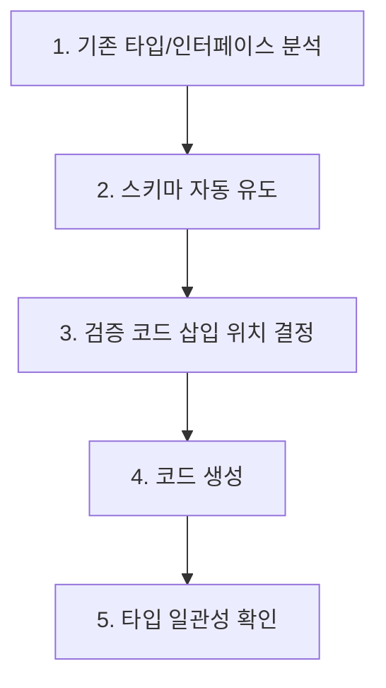

# Runtime Contract - Schema Validation Code Generator

기존 타입/인터페이스를 분석하여 런타임 스키마 검증 코드를 자동 생성하는 스킬.

## Overview

TypeScript는 컴파일 타임에 타입 안전성을 보장하지만, 런타임에 외부에서 유입되는 데이터(API 요청, 설정 파일, 환경변수, 서드파티 응답)는 타입 시스템의 보호 범위 밖이다. Python의 타입 힌트도 동일한 한계를 가진다.

**컴파일 타임 + 런타임 검증 결합의 가치:**

- 컴파일 타임: 개발자 실수를 조기 차단 (타입 불일치, 누락 필드)
- 런타임: 신뢰할 수 없는 외부 데이터를 실제 실행 시점에 검증
- 결합 효과: 개발 중에는 타입 시스템이, 프로덕션에서는 스키마 검증이 방어 계층을 형성

> "TypeScript ensures type safety during development, while Zod validates untrusted data at runtime" - [zod.dev/v4](https://zod.dev/v4)

이 스킬은 기존 코드의 타입 정의를 분석하고, 신뢰 경계(Trust Boundary)에 검증 코드를 자동 삽입하여 두 계층의 방어를 통합한다.

## 지원 도구

| 도구 | 언어 | 권장도 | 핵심 특성 | 적합 상황 |
|------|------|--------|----------|----------|
| **Zod v4** | TypeScript | 최우선 | 문자열 파싱 14x, 배열 7x, 객체 6.5x 향상. 타입 인스턴스화 ~175회(v3: 25,000+). Zod Mini ~1.9KB gzip | TS 프로젝트 전반. API 입력, 설정, 환경변수 파싱 |
| **beartype** | Python | 우선 | O(1) 상수 시간 타입 체킹. 무작위 트리 워크 알고리즘. 데코레이터 기반 | Python 프로젝트 전반. 함수 인자/반환값 검증 |
| **io-ts** | TypeScript | 대안 | 함수형 프로그래밍 기반 Codec 패턴. fp-ts 생태계 통합 | fp-ts 사용 프로젝트, Either 기반 에러 핸들링 선호 시 |

### Zod v4 우선 권장 근거

Zod v4는 2025년 안정 릴리스 기준으로 주간 다운로드 39.6M+를 달성하며 TypeScript 런타임 검증의 사실상 표준이다.

**성능 개선 데이터 (v3 대비):**

| 항목 | v3 | v4 | 개선 배율 |
|------|----|----|----------|
| 문자열 파싱 | 기준 | 14배 향상 | 14x |
| 배열 파싱 | 기준 | 7배 향상 | 7x |
| 객체 파싱 | 기준 | 6.5배 향상 | 6.5x |
| 타입 인스턴스화 | 25,000+회 | ~175회 | ~143x |
| 번들 크기 (Mini) | N/A | ~1.9KB gzip | 트리 셰이킹 가능 |

**JSON Schema 지원:** draft-2020-12, draft-7, draft-4, OpenAPI 3.0 표준과 호환되어 API 문서화와 검증 코드를 단일 소스에서 관리할 수 있다.

출처: [InfoQ: Zod v4 Available](https://www.infoq.com/news/2025/08/zod-v4-available/), [zod.dev/v4](https://zod.dev/v4)

## 적용 경계 가이드

런타임 검증은 모든 코드에 삽입하는 것이 아니라, **신뢰 경계(Trust Boundary)** 에만 적용한다.

### 적용 대상 (반드시 검증)

| 경계 | 설명 | 위험도 |
|------|------|--------|
| **API 경계** | HTTP 요청 body/query/params, GraphQL 입력, WebSocket 메시지 | HIGH |
| **설정 파일 로드** | JSON/YAML/TOML 설정, 런타임 동적 설정 | MEDIUM |
| **외부 데이터 수신** | 서드파티 API 응답, 데이터베이스 쿼리 결과(동적 스키마), 메시지 큐 소비 | HIGH |
| **환경변수 파싱** | process.env / os.environ 값 읽기 및 변환 | MEDIUM |

### 적용 제외 (검증 불필요)

| 영역 | 이유 |
|------|------|
| 내부 함수 간 호출 | 컴파일 타임 타입 시스템이 이미 보장 |
| 동일 모듈 내 데이터 전달 | 타입 추론으로 충분 |
| 성능 임계 경로 (초당 10만+ 호출) | 검증 오버헤드가 허용 범위 초과 시 샘플링 적용 |

### 판단 기준

```
데이터가 신뢰 경계를 넘는가?
  ├─ YES: 런타임 검증 삽입
  │   ├─ 외부 -> 내부: 입력 파싱 (parse, don't validate)
  │   └─ 내부 -> 외부: 출력 검증 (응답 스키마 준수 확인)
  └─ NO: 컴파일 타임 타입으로 충분
```

## 코드 생성 워크플로우



### 1. 기존 타입/인터페이스 분석

대상 프로젝트에서 타입 정의를 수집한다:

- **TypeScript**: `interface`, `type`, `enum` 선언 탐색
- **Python**: `dataclass`, `TypedDict`, `NamedTuple`, Pydantic `BaseModel` 탐색

```
검색 패턴:
  TypeScript: interface\s+\w+, type\s+\w+\s*=, enum\s+\w+
  Python: @dataclass, class\s+\w+\(TypedDict\), class\s+\w+\(BaseModel\)
```

### 2. 스키마 자동 유도

기존 타입에서 검증 스키마를 유도한다. 타입과 스키마가 단일 소스(Single Source of Truth)를 공유하도록 한다.

**TypeScript (Zod v4) 접근:**

| 전략 | 방법 | 장점 |
|------|------|------|
| Schema-First | Zod 스키마 정의 후 `z.infer<>` 로 타입 추출 | 타입과 검증이 자동 동기화 |
| Type-First 변환 | 기존 interface를 분석하여 대응하는 Zod 스키마 생성 | 기존 코드 변경 최소화 |

**Python (beartype) 접근:**

| 전략 | 방법 | 장점 |
|------|------|------|
| 데코레이터 적용 | `@beartype` 데코레이터를 함수에 추가 | 기존 타입 힌트를 그대로 활용 |
| dataclass 통합 | `@beartype` + `@dataclass` 결합 | 생성자 인자까지 자동 검증 |

### 3. 검증 코드 삽입 위치 결정

신뢰 경계에 해당하는 코드 위치를 식별한다:

| 프레임워크 | 삽입 위치 | 패턴 |
|-----------|----------|------|
| Express/Koa | 라우트 핸들러 진입부 | `req.body` 파싱 |
| Next.js API Routes | 핸들러 함수 시작부 | `request.json()` 파싱 |
| FastAPI | 라우트 함수 파라미터 | Pydantic 모델 또는 beartype 데코레이터 |
| NestJS | DTO 클래스 | `class-validator` 대체 또는 Zod pipe |
| CLI 도구 | 인자 파싱 직후 | `process.argv` / `sys.argv` 파싱 |
| 설정 로더 | 파일 읽기 직후 | `JSON.parse()` / `yaml.safe_load()` 직후 |

### 4. 코드 생성

위치가 결정되면 해당 도구의 검증 코드를 생성한다.

### 5. 타입 일관성 확인

생성된 스키마와 기존 타입이 일치하는지 확인한다:

- **Zod v4**: `z.infer<typeof schema>`와 기존 타입의 구조 비교
- **beartype**: 타입 힌트와 데코레이터의 검증 대상 일치 확인
- 불일치 발견 시 경고 출력 및 수동 확인 요청

## Zod v4 주요 패턴

### 문자열 파싱

```typescript
import { z } from "zod/v4";

// 기본 문자열 검증
const EmailSchema = z.email();
const UrlSchema = z.url();
const UuidSchema = z.uuid();

// 제약 조건 결합
const UsernameSchema = z.string().min(3).max(30).regex(/^[a-zA-Z0-9_]+$/);

// 템플릿 리터럴 (v4 신규)
const SemverSchema = z.templateLiteral([z.int(), ".", z.int(), ".", z.int()]);
```

### 객체 스키마

```typescript
// API 요청 body 스키마
const CreateUserSchema = z.object({
  name: z.string().min(1),
  email: z.email(),
  age: z.number().int().min(0).max(150).optional(),
  role: z.enum(["admin", "user", "viewer"]),
  metadata: z.record(z.string(), z.unknown()).optional(),
});

// 타입 추출 (Single Source of Truth)
type CreateUserInput = z.infer<typeof CreateUserSchema>;

// 파싱 (parse, don't validate)
function handleCreateUser(rawBody: unknown): CreateUserInput {
  return CreateUserSchema.parse(rawBody);
  // 실패 시 ZodError throw - 어떤 필드가 왜 실패했는지 상세 메시지 포함
}
```

### 배열 검증

```typescript
// 배열 요소 검증
const TagsSchema = z.array(z.string().min(1)).min(1).max(10);

// 튜플 (고정 길이)
const CoordinateSchema = z.tuple([z.number(), z.number()]);

// 중첩 객체 배열
const OrderItemsSchema = z.array(
  z.object({
    productId: z.string().uuid(),
    quantity: z.number().int().positive(),
    price: z.number().nonnegative(),
  })
);
```

### 유니언 타입

```typescript
// 판별 유니언 (Discriminated Union)
const EventSchema = z.discriminatedUnion("type", [
  z.object({ type: z.literal("click"), x: z.number(), y: z.number() }),
  z.object({ type: z.literal("scroll"), offset: z.number() }),
  z.object({ type: z.literal("keypress"), key: z.string() }),
]);

// 일반 유니언
const IdSchema = z.union([z.string().uuid(), z.number().int().positive()]);
```

### 환경변수 파싱

```typescript
// 환경변수 스키마 (애플리케이션 시작 시 1회 검증)
const EnvSchema = z.object({
  NODE_ENV: z.enum(["development", "staging", "production"]),
  PORT: z.coerce.number().int().min(1).max(65535).default(3000),
  DATABASE_URL: z.url(),
  API_KEY: z.string().min(10),
  LOG_LEVEL: z.enum(["debug", "info", "warn", "error"]).default("info"),
});

// 애플리케이션 시작 시 검증
const env = EnvSchema.parse(process.env);
```

### 에러 핸들링

```typescript
import { z } from "zod/v4";

// safeParse로 에러를 throw하지 않고 처리
const result = CreateUserSchema.safeParse(rawBody);

if (!result.success) {
  // 구조화된 에러 정보
  const formatted = z.prettifyError(result.error);
  console.error(formatted);
  return { status: 400, errors: result.error.issues };
}

// result.data는 타입 안전
const user: CreateUserInput = result.data;
```

## beartype 주요 패턴

### 함수 데코레이터

```python
from beartype import beartype
from beartype.typing import Optional

@beartype
def create_user(
    name: str,
    email: str,
    age: Optional[int] = None,
    role: str = "user",
) -> dict:
    """인자 타입이 런타임에 자동 검증된다."""
    return {"name": name, "email": email, "age": age, "role": role}

# 잘못된 타입 전달 시 BeartypeCallHintParamViolation 발생
# create_user(name=123)  -> 즉시 에러
```

### dataclass 통합

```python
from beartype import beartype
from dataclasses import dataclass

@beartype
@dataclass
class Config:
    host: str
    port: int
    debug: bool = False
    workers: int = 4

# 생성자 인자도 자동 검증
# Config(host="localhost", port="8080")  -> 에러 (port는 int여야 함)
```

### 컬렉션 타입 검증

```python
from beartype import beartype
from beartype.typing import List, Dict, Union

@beartype
def process_items(
    items: List[Dict[str, Union[str, int]]],
    tags: List[str],
) -> int:
    return len(items)
```

## io-ts 패턴 (TypeScript 대안)

```typescript
import * as t from "io-ts";
import { pipe } from "fp-ts/function";
import * as E from "fp-ts/Either";

// Codec 정의
const UserCodec = t.type({
  name: t.string,
  email: t.string,
  age: t.union([t.number, t.undefined]),
});

// 디코딩 (Either 기반 에러 핸들링)
pipe(
  UserCodec.decode(rawData),
  E.fold(
    (errors) => console.error("Validation failed:", errors),
    (user) => console.log("Valid user:", user)
  )
);
```

> io-ts는 fp-ts 생태계를 이미 사용하는 프로젝트에 적합하다. 새 프로젝트에서는 Zod v4를 권장한다.

## Workflow

### 1. 프로젝트 언어 및 프레임워크 식별

```bash
# TypeScript 프로젝트 확인
ls tsconfig.json package.json 2>/dev/null

# Python 프로젝트 확인
ls pyproject.toml setup.py requirements.txt 2>/dev/null
```

### 2. 기존 타입 정의 수집

```
TypeScript: Glob("src/**/*.ts") -> interface/type 선언 탐색
Python: Glob("**/*.py") -> dataclass/TypedDict/BaseModel 탐색
```

### 3. 신뢰 경계 코드 식별

```
API 핸들러: Grep("app\.(get|post|put|delete|patch)")
설정 로더: Grep("(JSON\.parse|yaml\.safe_load|toml\.load)")
환경변수: Grep("(process\.env|os\.environ|env::var)")
외부 API 호출: Grep("(fetch|axios|requests)\.(get|post)")
```

### 4. 검증 코드 생성 및 삽입

각 신뢰 경계에 대해:
1. 대응하는 타입 정의 확인
2. 도구별 스키마 코드 생성
3. 파싱 코드 삽입 (parse, don't validate 원칙)
4. 에러 핸들링 코드 추가

### 5. 검증

```bash
# TypeScript 타입 체크
npx tsc --noEmit 2>&1

# Python 타입 체크
mypy --strict <target_file> 2>&1

# 기존 테스트 통과 확인
npm test 2>&1    # 또는 pytest 2>&1
```

## Critical Rules

1. **신뢰 경계만 검증**: 내부 함수 간 호출에 런타임 검증을 삽입하지 않는다
2. **Parse, Don't Validate**: 검증 후 원본 데이터가 아닌 파싱된 타입 안전 데이터를 사용한다
3. **Single Source of Truth**: 타입과 스키마를 별도로 관리하지 않는다. Schema-First(Zod infer) 또는 동기화 검증을 적용한다
4. **에러 메시지 품질**: 검증 실패 시 어떤 필드가 왜 실패했는지 구조화된 에러를 반환한다
5. **기존 코드 최소 변경**: 새 검증 코드를 추가하되, 기존 비즈니스 로직은 변경하지 않는다
6. **Zod v4 우선**: TypeScript 프로젝트에서는 특별한 이유가 없는 한 Zod v4를 사용한다
7. **성능 고려**: 초당 10만+ 호출 경로에서는 검증 오버헤드를 측정하고, 필요 시 샘플링을 적용한다
