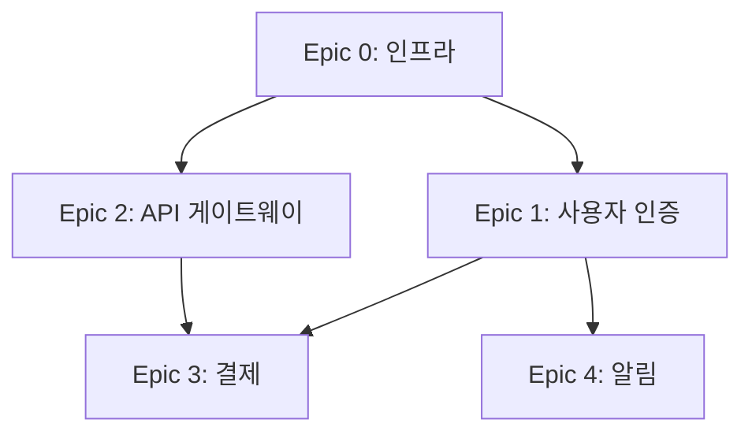

# Scope Decomposer

대규모 요청을 에픽(Epic)과 스토리(Story)로 체계적으로 분해하고, RICE 프레임워크로 우선순위를 산정하는 스킬.

## Overview

### 기능
- 대규모 요청/이니셔티브를 에픽(3-7개)으로 분해
- 각 에픽을 스토리(5-10개)로 세분화
- RICE 스코어 기반 우선순위 판단 (P0-P3)
- 종속성 그래프 생성
- 인프라 에픽(Epic 0) 자동 판별

### 적용 단계
- **PLAN 단계**: 계획 수립 시 요청 분해에 활용
- **독립 사용**: 스코프 정의가 필요한 모든 상황

## Decomposition Process

### Phase 1: 스코프 분석

요청에서 핵심 도메인을 추출:

1. **도메인 식별**
   - 비즈니스 도메인 (사용자 인증, 결제, 알림 등)
   - 기술 도메인 (API, DB, 프론트엔드 등)
   - 인프라 도메인 (CI/CD, 모니터링, 보안 등)

2. **인프라 에픽 판단**
   - 새 프로젝트인가?
   - 멀티스택인가?
   - 보안/모니터링 요구사항이 있는가?
   - 있으면 Epic 0 (인프라)를 생성

3. **출력**: 도메인 목록 + 인프라 에픽 여부

### Phase 2: 에픽 분해

각 도메인을 에픽으로 구조화:

```markdown
## Epic [N]: [에픽 제목]

### 목표
[에픽의 비즈니스 목표]

### 범위
- 포함: [포함 사항]
- 제외: [제외 사항]

### 종속성
- 선행: [필요한 에픽]
- 후행: [이 에픽에 의존하는 에픽]
```

**규칙:**
- 에픽 수: 3-7개 (인프라 포함)
- Epic 0: 인프라 (해당 시)
- Epic 1-N: 비즈니스 도메인

### Phase 3: 스토리 분해

각 에픽을 사용자 스토리로 세분화:

```markdown
### Story [N]: [스토리 제목]

As a [사용자 유형],
I want to [기능],
So that [가치].

#### Acceptance Criteria
- [ ] AC1: [검증 가능한 기준]
- [ ] AC2: [검증 가능한 기준]

#### Technical Notes
- [구현 접근 방식]
- [필요한 기술]
```

**규칙:**
- 에픽당 스토리 수: 5-10개
- 각 스토리는 독립적으로 완료 가능해야 함
- AC는 검증 가능해야 함

### Phase 4: RICE 우선순위 판단

각 스토리에 RICE 스코어를 산정:

```
RICE = (Reach x Impact x Confidence) / Effort
```

#### Reach (1-10): 영향받는 사용자

| 점수 | 사용자 수 | 지표 |
|------|----------|------|
| 1-2 | <500 | 니치, 단일 페르소나 |
| 3-4 | 500-2K | 부서 수준 |
| 5-6 | 2K-5K | 조직 전체 |
| 7-8 | 5K-10K | 다중 조직 |
| 9-10 | >10K | 플랫폼 전체 |

#### Impact (0.25-3.0): 비즈니스 가치

| 점수 | 수준 | 지표 |
|------|------|------|
| 0.25 | 최소 | Nice-to-have |
| 0.5 | 낮음 | QoL 개선 |
| 1.0 | 중간 | 효율성 향상 |
| 2.0 | 높음 | 매출 기여 |
| 3.0 | 대규모 | 전략적 차별화 |

#### Confidence (0.5-1.0): 데이터 품질

| 점수 | 수준 | 근거 |
|------|------|------|
| 0.9-1.0 | 높음 | 산업 보고서, 정량 데이터 |
| 0.7-0.8 | 중간 | 뉴스 기사, 사례 연구 |
| 0.5-0.6 | 낮음 | 블로그, 추정 |

#### Effort (1-10): 소요 시간

| 점수 | 시간 | 지표 |
|------|------|------|
| 1-2 | <2주 | 3 AC, 단순 CRUD |
| 3-4 | 2-4주 | 4 AC, 통합 작업 |
| 5-6 | 1-2개월 | 5 AC, 복잡 로직 |
| 7-8 | 2-3개월 | 외부 의존성 |
| 9-10 | 3+개월 | 새 인프라 |

#### Priority 결정

| 우선순위 | RICE 임계값 | 특수 조건 |
|---------|------------|----------|
| P0 (Critical) | >= 30 | 또는 경쟁이 없는 블루오션 |
| P1 (High) | >= 15 | 또는 신흥 시장 |
| P2 (Medium) | >= 5 | - |
| P3 (Low) | < 5 | 레드오션이면 P3 강제 |

### Phase 5: 종속성 그래프

에픽/스토리 간 종속성을 시각화:



**종속성 유형:**
- **하드 종속성**: 선행 에픽 완료 필수
- **소프트 종속성**: 병렬 진행 가능, 통합 시점에서 필요

## Output Format

```markdown
# Scope Decomposition: [프로젝트명]

## Summary
- 에픽: N개 (인프라 포함/미포함)
- 스토리: M개 (총합)
- 예상 기간: X-Y 개월

## Priority Distribution
- P0 (Critical): X 스토리
- P1 (High): X 스토리
- P2 (Medium): X 스토리
- P3 (Low): X 스토리

## Epic Overview

| Epic | 제목 | 스토리 수 | 종속성 | 예상 기간 |
|------|------|----------|--------|----------|
| E0 | 인프라 | 5 | - | 2주 |
| E1 | 사용자 인증 | 7 | E0 | 3주 |

## Prioritized Stories

| 우선순위 | Epic | Story | RICE | R | I | C | E |
|---------|------|-------|------|---|---|---|---|
| P0 | E1 | 로그인 기능 | 45 | 9 | 3.0 | 0.9 | 2 |
| P1 | E3 | 결제 연동 | 20 | 7 | 2.0 | 0.8 | 4 |

## Dependency Graph
[Mermaid 다이어그램]

## Recommendations
1. P0 스토리부터 구현 시작
2. Epic 0 (인프라)를 첫 스프린트에 포함
3. P3 스토리는 연기 검토
```

## Critical Rules

1. **MECE 원칙**: 에픽/스토리가 상호 배타적이고 전체를 포함해야 함
2. **독립 완료**: 각 스토리는 독립적으로 완료/검증 가능해야 함
3. **정량적 판단**: RICE 스코어 기반 우선순위, 주관적 판단 최소화
4. **종속성 명시**: 모든 종속성을 명시적으로 기록
5. **인프라 우선**: 인프라 에픽이 있으면 최우선 처리
6. **스코프 제어**: 에픽 3-7개, 스토리 5-10개/에픽 범위 유지

## Integration

- **PLAN 단계**: planner가 대규모 요청 분해 시 참조
- **WORK 단계**: 스토리 단위로 작업 수행
- **REPORT 단계**: 완료된 스토리 추적 및 보고
