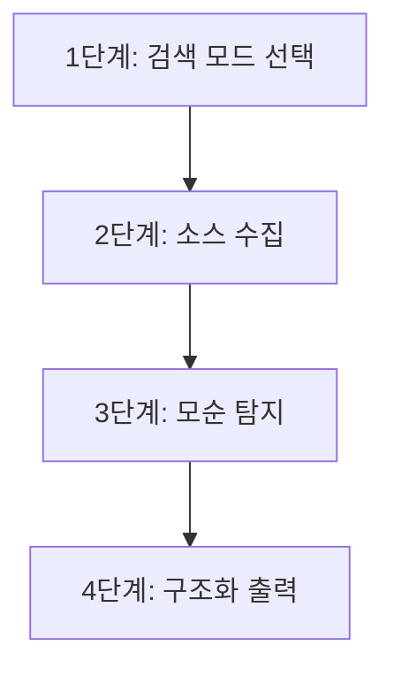

# Research Grounding

출처 검증 및 신뢰도 자동 평가 스킬입니다. otrebu/gemini-research의 Google Search 그라운딩 패턴을 참조하여, 수집된 정보의 출처를 체계적으로 검증하고 신뢰도를 자동 평가합니다.

> **현재 상태**: 골격(scaffold) 상태 - Gemini CLI 래퍼 미구현, prerequisites 체크 스크립트만 제공. 아래 워크플로우는 Gemini CLI 연동 시 완전히 동작하며, 현재는 WebSearch/WebFetch 기반의 수동 검증 가이드로 활용 가능합니다.

## 목적

- 수집된 정보의 출처를 Google Search 그라운딩으로 자동 검증
- 소스 간 모순(수치/인과/맥락/시점 불일치)을 체계적으로 탐지
- 출처 신뢰도를 5등급(S/A/B/C/D) 체계로 자동 평가
- 검증 결과를 JSON 구조화 형식으로 출력하여 후속 분석에 활용
- 인용(citation) + URL + 인용문(quote)을 강제하여 추적 가능성 보장

## 핵심 원칙

1. **증거 기반**: 모든 주장에 검증 가능한 출처를 강제 부여
2. **모순 가시화**: 소스 간 불일치를 숨기지 않고 명시적으로 보고
3. **등급 투명성**: 출처 등급 부여 근거를 항상 기록
4. **구조화 출력**: JSON 형식으로 기계 판독 가능한 결과 생성
5. **Graceful Degradation**: Gemini CLI 미설치 시 수동 검증 워크플로우로 폴백

## Prerequisites

이 스킬의 전체 자동화 기능을 사용하려면 다음 사전 요건이 필요합니다.

| 요건 | 확인 방법 | 필수 여부 |
|------|----------|----------|
| Gemini CLI | `which gemini` 또는 `gemini --version` | 자동 검증 시 필수 |
| Google API Key | `$GOOGLE_API_KEY` 환경변수 | 자동 검증 시 필수 |

**Prerequisites 체크 스크립트:**

```bash
bash .claude/skills/research-grounding/scripts/check_prerequisites.sh
```

**미충족 시 폴백 절차:**

1. `check_prerequisites.sh` 실행하여 사전 요건 확인
2. 미충족 시 안내 메시지 출력 및 exit code 1 반환
3. 스킬은 수동 검증 모드로 전환: WebSearch/WebFetch 기반 교차 검증 수행
4. `references/cross-validation.md`의 체크리스트를 수동으로 적용
5. 수동 모드임을 리포트에 명시

## 워크플로우 (4단계)



### 1단계: 검색 모드 선택

검증 대상의 중요도와 범위에 따라 검색 모드를 선택합니다.

| 모드 | 소스 수 | 용도 | 예상 시간 |
|------|---------|------|----------|
| Quick | 5-8개 | 단일 주장/사실 검증, 빠른 팩트체크 | 30초-1분 |
| Comprehensive | 10-15개 | 핵심 결론 검증, 중요 의사결정 근거 확인 | 1-3분 |
| Deep | 전체 가용 소스 | 연구 리포트 전체 검증, 최고 품질 요구 | 3-10분 |

**모드 선택 기준:**
- 핵심 결론에 직접 영향하는 주장: Comprehensive 이상
- 보조 정보/배경 지식: Quick
- Level 4 품질 기준 적용 시: Deep

### 2단계: Google Search 그라운딩 기반 소스 수집

**자동 모드 (Gemini CLI 사용 가능 시):**

1. 검증 대상 주장(claim)을 구조화된 쿼리로 변환
2. Gemini CLI의 Google Search 그라운딩을 통해 관련 소스 수집
3. 각 소스에 대해 URL, 제목, 관련 인용문(quote)을 자동 추출
4. `references/source-evaluation.md`의 URL 패턴별 기본 신뢰도를 자동 부여

**수동 모드 (Gemini CLI 미사용 시):**

1. 검증 대상 주장을 검색 키워드로 분해
2. WebSearch로 관련 소스 수집 (모드별 목표 소스 수 이상)
3. WebFetch로 각 소스의 상세 내용 확인
4. 수동으로 URL, 제목, 관련 인용문 기록
5. `references/source-evaluation.md` 기준에 따라 수동 등급 부여

**소스 수집 시 필수 기록 항목:**
- URL (전체 경로)
- 소스 제목
- 작성/업데이트 날짜
- 관련 인용문 (원문 그대로)
- 초기 신뢰도 등급 (S/A/B/C/D)

### 3단계: 모순 탐지

수집된 소스 간 모순을 체계적으로 탐지합니다. `references/cross-validation.md`의 체크리스트를 활용합니다.

**모순 탐지 체크리스트:**

- [ ] **수치 불일치**: 소스별 수치(성능, 날짜, 통계 등)가 일치하는가?
- [ ] **인과 관계 모순**: "원인 A -> 결과 B" 주장이 소스 간 상충하는가?
- [ ] **맥락/범위 차이**: 동일 용어를 다른 의미로 사용하고 있지 않은가?
- [ ] **시점 차이**: 작성 시점이 달라 버전/상황 차이가 발생하는가?
- [ ] **이해관계 편향**: 특정 소스가 자사 제품/기술을 옹호하는 편향이 있는가?

**모순 발견 시 처리:**

1. 어떤 소스에서 어떤 주장이 충돌하는지 명확히 기록
2. 각 주장의 원본 출처(primary source)를 추적하여 파생 오류 가능성 제거
3. 최신 소스 우선, 시점 차이 명시
4. 해소되지 않는 모순은 양측 주장을 병기하고 판단 근거 제시

### 4단계: 구조화 출력

검증 결과를 JSON 형식으로 구조화하여 출력합니다.

**JSON 출력 스키마:**

```json
{
  "verification_mode": "quick | comprehensive | deep",
  "total_sources": 0,
  "claims": [
    {
      "claim_id": "C01",
      "statement": "검증 대상 주장 텍스트",
      "verdict": "confirmed | partially_confirmed | unconfirmed | contradicted",
      "confidence": 0.0,
      "sources": [
        {
          "url": "https://...",
          "title": "소스 제목",
          "date": "YYYY-MM-DD",
          "grade": "S | A | B | C | D",
          "quote": "관련 원문 인용",
          "agreement": "agree | partial | disagree"
        }
      ],
      "contradictions": [
        {
          "type": "numeric | causal | contextual | temporal | bias",
          "description": "모순 설명",
          "source_a": "URL",
          "source_b": "URL"
        }
      ]
    }
  ],
  "summary": {
    "confirmed_count": 0,
    "contradicted_count": 0,
    "unconfirmed_count": 0,
    "overall_reliability": "high | medium | low"
  }
}
```

**인용 강제 규칙:**
- 모든 소스에 URL + 인용문(quote) 필수
- 인용문은 원문에서 그대로 발췌 (의역 금지)
- 인용문 길이: 1-3문장 (핵심 부분만)
- URL이 없는 소스는 등급 D로 자동 분류

## 기존 스킬과의 차이

| 항목 | research-general | research-grounding |
|------|-----------------|-------------------|
| 주요 역할 | 정보 수집 및 리포트 작성 | 수집된 정보의 출처 검증 및 신뢰도 평가 |
| 워크플로우 위치 | 정보 수집 단계 | 정보 수집 후 검증 단계 |
| 출력 형식 | 마크다운 리포트 | JSON 구조화 + 마크다운 |
| 모순 탐지 | 수동 (교차 검증 가이드 참조) | 체계적 자동/반자동 탐지 |
| 신뢰도 평가 | source-evaluation.md 참조 (수동) | 자동 등급 부여 + 조정 |
| 외부 의존 | 없음 (WebSearch/WebFetch) | Gemini CLI (선택적, 폴백 가능) |

## 사용 시나리오

1. **리포트 팩트체크**: research-general로 생성된 리포트의 핵심 결론을 검증할 때 Quick/Comprehensive 모드로 사용
2. **기술 선정 검증**: 아키텍처 결정이나 라이브러리 선정 시 비교 데이터의 정확성을 Deep 모드로 검증
3. **외부 정보 신뢰도 확인**: 블로그, 커뮤니티 등에서 수집한 정보의 신뢰도를 등급화하여 의사결정에 반영

## 연관 스킬

| 스킬 | 용도 | 경로 |
|------|------|------|
| research-general | 웹 기반 정보 수집 및 리포트 작성 (검증 대상 정보 제공) | `.claude/skills/research-general/SKILL.md` |
| research-integrated | 웹+코드 통합 조사 (검증 대상 확대) | `.claude/skills/research-integrated/SKILL.md` |
| research-parallel | 병렬 다중 에이전트 조사 (대량 소스 수집 후 검증) | `.claude/skills/research-parallel/SKILL.md` |

## 참조 리소스

| 리소스 | 경로 | 용도 |
|--------|------|------|
| 교차 검증 워크플로우 | `.claude/skills/research-general/references/cross-validation.md` | 모순 탐지 체크리스트, 검증 결과 기록 템플릿 |
| 출처 신뢰도 평가 기준 | `.claude/skills/research-general/references/source-evaluation.md` | 5등급 체계, URL 패턴별 매핑, 등급 조정 기준 |

## 주의사항

1. **인용 강제**: 모든 검증 결과에 원문 인용을 반드시 포함
2. **편향 인식**: 검증자 자신의 확증 편향(confirmation bias)을 경계
3. **시점 명시**: 검증 시점과 소스 작성 시점의 차이를 항상 기록
4. **폴백 명시**: Gemini CLI 미사용 시 수동 검증 모드임을 결과에 명시
5. **등급 근거**: 신뢰도 등급 부여/조정 시 근거를 항상 기록
