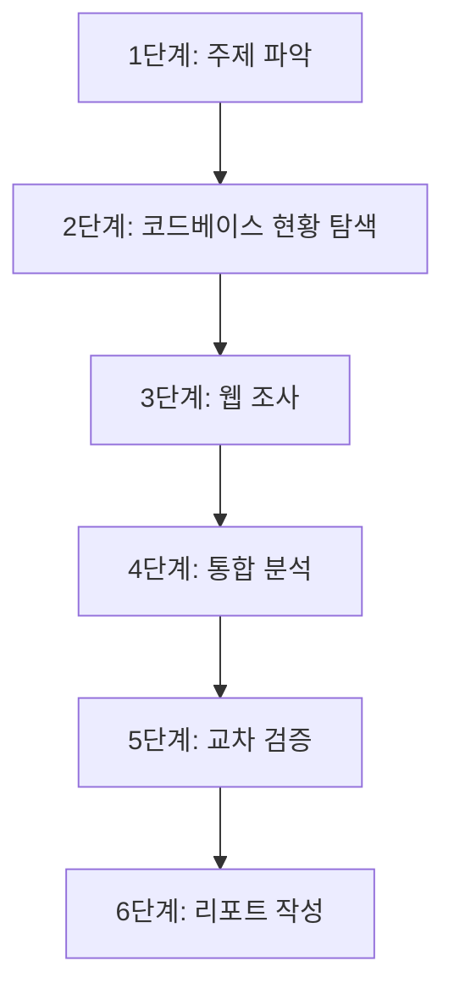

# Research Integrated

웹 검색(WebSearch, WebFetch)과 코드베이스 탐색(Read, Grep, Glob)을 단일 워크플로우로 통합하여, 외부 정보와 내부 코드 현황을 교차 대조하는 복합 조사 스킬입니다.

## 목적

- 웹 최신 동향과 코드베이스 현황을 하나의 워크플로우에서 동시에 분석
- 외부 기술/라이브러리의 최신 정보와 프로젝트 내 실제 사용 현황을 교차 대조
- 코드 기반의 구체적 맥락을 활용하여 웹 조사의 초점을 좁히고 관련성 높은 결과 도출
- 분석 결과를 실행 가능한 권고사항으로 정리

## 기존 스킬과의 차이

| 항목 | command-research | deep-research | research-integrated |
|------|-----------------|---------------|-------------------|
| 주요 대상 | 웹 (WebSearch, WebFetch) | 코드베이스 (Read, Grep, Glob) | 웹 + 코드베이스 통합 |
| 컨텍스트 | 메인 컨텍스트 | 격리 (context:fork, Explore) | 메인 컨텍스트 |
| 쓰기 권한 | 리포트 작성 가능 | 읽기 전용 | 리포트 작성 가능 |
| 모델 | 현재 모델 | Haiku (Explore 에이전트) | 현재 모델 |
| 핵심 강점 | 웹 정보 수집 및 리포트 작성 | 대규모 코드 탐색, 저비용 | 웹+코드 교차 대조, 갭 분석 |
| 토큰 비용 | 중간 (웹 결과 축적) | 낮음 (요약만 반환) | 높음 (웹+코드 양쪽 축적) |
| 적합한 상황 | 외부 기술 트렌드 조사, 문서 수집 | 대규모 코드 패턴 발견, 의존성 추적 | 기술 마이그레이션 평가, 라이브러리 업데이트 영향 분석 |

**언제 어떤 스킬을 사용할지:**

- **command-research**: 순수 웹 조사 (기술 트렌드, 비교 분석, 문서 수집)
- **deep-research**: 순수 코드 탐색 (구조 분석, 패턴 발견, 의존성 추적)
- **research-integrated**: 웹 정보와 코드 현황을 함께 봐야 하는 복합 조사

## 워크플로우

6단계 통합 워크플로우로 웹 조사와 코드 탐색을 결합합니다.



### 1단계: 주제 파악

사용자 요청에서 통합 조사 주제를 파악하고 범위를 정의합니다.

**확인 항목:**
- 조사 주제는 무엇인가? (기술, 라이브러리, 패턴, 아키텍처 등)
- 웹 조사 범위: 어떤 외부 정보가 필요한가?
- 코드 탐색 범위: 어떤 내부 코드를 분석해야 하는가?
- 최종 산출물: 갭 분석인가, 마이그레이션 평가인가, 현황 리포트인가?

### 2단계: 코드베이스 현황 탐색

Grep, Glob, Read를 사용하여 프로젝트 내 현행 사용 패턴을 식별합니다.

**탐색 절차:**

1. **파일 구조 파악**: Glob으로 관련 파일/디렉토리 식별
2. **키워드 검색**: Grep으로 관련 코드 패턴, import 문, 설정 파일 검색
3. **상세 분석**: Read로 핵심 파일의 실제 사용 패턴 확인
4. **현황 정리**: 사용 중인 버전, 패턴, 의존성 목록 정리

**결과물:**
- 현행 기술/라이브러리 사용 목록
- 코드 내 사용 패턴 및 빈도
- 설정 파일 및 의존성 정보
- 잠재적 문제점이나 개선 포인트

### 3단계: 웹 조사

WebSearch, WebFetch를 사용하여 2단계에서 식별된 기술의 최신 동향을 수집합니다.

**조사 절차:**

1. **최신 동향 검색**: WebSearch로 기술의 최신 버전, 변경사항, 로드맵 조사
2. **공식 문서 확인**: WebFetch로 공식 문서, 마이그레이션 가이드, 릴리스 노트 상세 확인
3. **대안 탐색**: 2단계에서 발견된 패턴의 개선된 대안이나 대체 기술 조사
4. **베스트 프랙티스 수집**: 현재 프로젝트 패턴과 비교할 업계 베스트 프랙티스 수집

**소스 우선순위:** `references/source-evaluation.md`의 5등급 체계를 적용하여 S-A 등급 소스를 우선 활용합니다.

### 4단계: 통합 분석

코드 현황(2단계)과 웹 정보(3단계)를 교차 대조하여 갭과 기회를 식별합니다.

**분석 항목:**

| 분석 유형 | 설명 | 예시 |
|----------|------|------|
| 버전 갭 | 사용 중 버전 vs 최신 안정 버전 | React 17 vs React 19 |
| 패턴 갭 | 현행 패턴 vs 권장 패턴 | Class 컴포넌트 vs Hooks |
| 기능 갭 | 미활용 기능 식별 | 사용 가능하지만 미적용된 최적화 |
| 리스크 | 알려진 취약점, 지원 종료 예정 | EOL 라이브러리, 보안 패치 미적용 |
| 기회 | 성능 개선, 개발 생산성 향상 가능성 | 새 API로 코드 단순화 가능 |

### 5단계: 교차 검증

`references/cross-validation.md`의 워크플로우에 따라 핵심 결론을 다중 소스에서 검증합니다.

**검증 절차:**

1. 4단계의 핵심 결론/권고마다 최소 3개 독립 소스에서 확인
2. 소스 간 모순 탐지 체크리스트 적용 (수치/날짜 불일치, 인과 관계 모순, 범위/맥락 차이, 시점 차이, 이해관계 편향)
3. 모순 발견 시 원본 추적 및 시점 확인 후 양측 병기
4. 코드 현황 자체가 1차 소스로 기능 (실제 동작하는 코드는 S등급 신뢰도)

### 6단계: 리포트 작성

통합 분석 결과를 구조화된 리포트로 작성합니다.

**리포트 구조:**

```markdown
# [통합 조사 주제]

- 조사 일시: YYYY-MM-DD HH:MM:SS (KST)
- 조사 유형: 통합 조사 (웹+코드)

## 요약
[핵심 발견사항 1-3문장]

## 코드베이스 현황
[2단계 결과: 현행 사용 패턴, 버전, 의존성]

## 외부 동향
[3단계 결과: 최신 버전, 변경사항, 베스트 프랙티스]

## 갭 분석
[4단계 결과: 버전/패턴/기능/리스크/기회]

## 권고사항
[우선순위별 실행 가능한 권고]

## 참고 자료
[등급별 소스 목록]
```

## 사용 시나리오

### 시나리오 1: 라이브러리 업데이트 영향 분석

프로젝트가 사용하는 라이브러리의 최신 버전 특징을 조사하고, 코드 내 해당 라이브러리 사용 현황을 분석하여 업데이트 영향도와 마이그레이션 전략을 도출합니다.

- **코드 탐색**: package.json에서 현재 버전 확인, import 문으로 사용 패턴 파악, deprecated API 사용 여부 검색
- **웹 조사**: 최신 버전 릴리스 노트, breaking changes, 마이그레이션 가이드 수집
- **통합 분석**: 현행 코드에서 breaking change 영향 범위 산정, 마이그레이션 우선순위 도출

### 시나리오 2: 아키텍처 패턴 현대화 평가

현재 프로젝트의 아키텍처 패턴을 분석하고, 업계 최신 베스트 프랙티스와 비교하여 현대화 기회를 식별합니다.

- **코드 탐색**: 디렉토리 구조, 모듈 간 의존성, 현행 설계 패턴 식별
- **웹 조사**: 해당 기술 스택의 최신 아키텍처 권고, 성공 사례, 마이그레이션 경험담 수집
- **통합 분석**: 현행 패턴과 권장 패턴의 갭 정량화, 현대화 로드맵 제안

### 시나리오 3: 보안 취약점 대응 현황 점검

프로젝트의 의존성 보안 상태를 코드 분석과 외부 취약점 데이터베이스 조회를 통합하여 점검합니다.

- **코드 탐색**: 의존성 목록 추출, 보안 관련 설정 파일 확인, 인증/암호화 패턴 검색
- **웹 조사**: CVE 데이터베이스, 보안 어드바이저리, 패치 릴리스 정보 수집
- **통합 분석**: 취약 의존성 식별, 영향 범위 분석, 패치 우선순위 제안

### 시나리오 4: 기술 스택 선정을 위한 비교 조사

신규 기능 구현에 사용할 기술을 선정하기 위해, 현재 프로젝트의 기술 스택과 호환되는 후보 기술들을 비교 분석합니다.

- **코드 탐색**: 현행 기술 스택, 빌드 시스템, 테스트 프레임워크 파악
- **웹 조사**: 후보 기술별 특징, 성능 벤치마크, 커뮤니티 활성도 수집
- **통합 분석**: 현행 스택과의 호환성, 학습 비용, 마이그레이션 복잡도 비교

## 주의사항

1. **코드 우선 원칙**: 코드베이스 현황 탐색(2단계)을 반드시 웹 조사(3단계) 전에 수행하여, 실제 코드 맥락에 기반한 목적성 있는 웹 검색 수행
2. **토큰 관리**: 웹+코드 양쪽 정보가 축적되므로 토큰 사용량이 높음. 불필요한 파일 전체 읽기를 피하고 핵심 부분만 탐색
3. **교차 검증 필수**: 핵심 결론은 `references/cross-validation.md` 워크플로우 준수. 코드 현황 자체를 1차 소스로 활용 가능
4. **출처 등급 적용**: `references/source-evaluation.md`의 5등급 체계(S/A/B/C/D) 적용. 핵심 결론은 S-A 등급 소스에 근거
5. **역할 구분**: 순수 웹 조사는 command-research, 순수 코드 탐색은 deep-research 사용. 양쪽을 결합해야 할 때만 이 스킬 사용

## 연관 스킬

| 스킬 | 용도 | 경로 |
|------|------|------|
| command-research | 웹 중심 조사, 리포트 작성 | `.claude/skills/command-research/SKILL.md` |
| deep-research | context:fork 기반 코드베이스 심층 탐색 | `.claude/skills/deep-research/SKILL.md` |
| research-parallel | 다중 에이전트 병렬 연구 (골격) | `.claude/skills/research-parallel/SKILL.md` |
| research-grounding | 출처 검증 및 신뢰도 자동 평가 (골격) | `.claude/skills/research-grounding/SKILL.md` |
