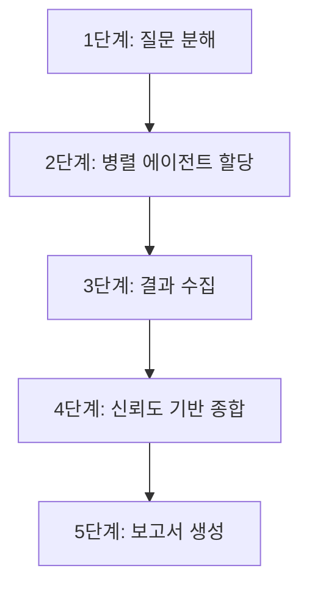

# Research Parallel

다중 에이전트 병렬 연구 스킬입니다. danielmiessler/research 패턴을 참조하여 설계되었습니다.

## 현재 상태

> **골격(scaffold) 상태** - 병렬 에이전트 실행 로직 미구현, 단계별 가이드라인만 제공

이 스킬은 워크플로우 가이드라인과 구조만 정의된 상태이며, 실제 병렬 에이전트 실행 로직(Perplexity/Gemini API 연동, 에이전트 풀 관리, 타임아웃 처리 등)은 별도 구현이 필요합니다. 현재는 command-research 스킬의 순차 조사 워크플로우를 병렬화하기 위한 설계 청사진 역할을 합니다.

## 목적

- 사용자 질문을 3-10개 하위 질문으로 분해하여 조사 범위를 구조화
- 하위 질문별 병렬 에이전트를 할당하여 동시 조사 수행
- 신뢰도 기반 가중치로 결과를 종합하여 보고서 생성
- 순차 조사(5-10분) 대비 병렬 조사(1분 이내) 시간 단축

## 핵심 원칙

1. **질문 분해 우선**: 복합 질문을 독립적 하위 질문으로 분해한 후 조사 시작
2. **병렬 실행**: 하위 질문별 에이전트를 동시에 실행하여 조사 시간 최소화
3. **신뢰도 기반 종합**: 출처 등급(S/A/B/C/D)별 가중치를 적용하여 결과 종합
4. **Graceful Fallback**: 외부 API 미설정 시 command-research로 자동 전환

## Prerequisites

### 필수 요건

| 요건 | 확인 방법 | 미충족 시 |
|------|----------|----------|
| Claude Code CLI | 기본 설치됨 | - |
| WebSearch/WebFetch 도구 | 기본 사용 가능 | - |

### 선택 요건 (병렬 에이전트 풀 확장용)

| 요건 | 확인 방법 | 미충족 시 |
|------|----------|----------|
| Perplexity API 키 | `echo $PERPLEXITY_API_KEY` | command-research 폴백 |
| Gemini API 키 | `echo $GOOGLE_API_KEY` | command-research 폴백 |
| Gemini CLI | `which gemini` | command-research 폴백 |

### Graceful Fallback 절차

외부 API 키가 설정되지 않은 경우 다음 절차로 자동 전환합니다.

1. **환경 변수 확인**: `PERPLEXITY_API_KEY`, `GOOGLE_API_KEY` 존재 여부 체크
2. **API 키 미설정 시**: 병렬 에이전트 풀을 WebSearch/WebFetch 기반 에이전트로 축소
3. **WebSearch도 불가 시**: command-research 스킬의 순차 5단계 워크플로우로 완전 폴백
4. **폴백 기록**: 리포트에 "병렬 조사 미수행 - command-research 순차 조사로 대체" 명시

```
확인 순서:
  Perplexity API -> 사용 가능하면 Perplexity Researcher 에이전트 활성화
  Gemini API     -> 사용 가능하면 Gemini Researcher 에이전트 활성화
  WebSearch      -> 기본 에이전트 (항상 활성화)
  모두 불가      -> command-research 순차 폴백
```

## 워크플로우



### 1단계: 질문 분해

사용자 질문을 3-10개 독립적인 하위 질문으로 분해합니다.

**분해 기준:**

- 각 하위 질문은 독립적으로 조사 가능해야 함
- 하위 질문 간 중복을 최소화
- "What(사실)", "Why(원인)", "How(방법)", "Compare(비교)" 유형으로 분류

**분해 예시:**

원본 질문: "React vs Vue 2026년 현황 비교"

| # | 하위 질문 | 유형 | 예상 소스 |
|---|----------|------|----------|
| 1 | React 2026년 최신 버전 및 주요 변경사항은? | What | 공식 문서, 릴리스 노트 |
| 2 | Vue 2026년 최신 버전 및 주요 변경사항은? | What | 공식 문서, 릴리스 노트 |
| 3 | React와 Vue의 성능 벤치마크 비교는? | Compare | 벤치마크 사이트, 기술 블로그 |
| 4 | 각 프레임워크의 생태계(라이브러리, 도구) 현황은? | What | npm 통계, GitHub 트렌드 |
| 5 | 기업 채택률 및 채용 시장 트렌드는? | What | 설문 조사, 채용 사이트 |
| 6 | 각 프레임워크의 학습 곡선과 DX 비교는? | Compare | 개발자 설문, 커뮤니티 평가 |

### 2단계: 병렬 에이전트 할당

각 하위 질문을 서브에이전트에 배분합니다.

**에이전트 풀 구성 (목표 상태):**

| 에이전트 | 소스 | 강점 | 의존성 |
|----------|------|------|--------|
| WebSearch Researcher | WebSearch 도구 | 범용 웹 검색, 최신 정보 | 없음 (기본) |
| WebFetch Researcher | WebFetch 도구 | 특정 페이지 심층 분석 | 없음 (기본) |
| Perplexity Researcher | Perplexity API | 학술/기술 심층 검색 | PERPLEXITY_API_KEY |
| Gemini Researcher | Gemini CLI | Google Search 그라운딩, 모순 탐지 | GOOGLE_API_KEY |

**현재 구현 가능한 에이전트:**

현재 scaffold 상태에서는 WebSearch/WebFetch 기반 에이전트만 활용 가능합니다. 각 하위 질문에 대해 Task 도구를 사용하여 서브에이전트를 병렬 호출합니다.

```
# 병렬 호출 패턴 (의사 코드)
Task("하위 질문 1에 대해 WebSearch로 조사") -- 동시 실행
Task("하위 질문 2에 대해 WebSearch로 조사") -- 동시 실행
Task("하위 질문 3에 대해 WebSearch로 조사") -- 동시 실행
```

### 3단계: 결과 수집

각 에이전트의 조사 결과를 수집하고 타임아웃을 처리합니다.

**수집 기준:**

| 항목 | 기준 |
|------|------|
| 대기 시간 | 에이전트당 15-30초 |
| 타임아웃 처리 | 30초 초과 시 해당 에이전트 결과 제외, 나머지로 종합 |
| 최소 결과 수 | 하위 질문의 50% 이상 응답 필요 (미달 시 순차 폴백) |
| 결과 형식 | 각 에이전트는 (소스 목록, 핵심 내용, 신뢰도 등급) 반환 |

### 4단계: 신뢰도 기반 종합

출처 등급별 가중치를 적용하여 결과를 종합합니다.

**가중치 체계:**

`references/source-evaluation.md`의 5등급 체계를 적용합니다.

| 등급 | 가중치 | 설명 |
|:----:|:------:|------|
| S | 1.0 | 공식 문서, 표준 규격 |
| A | 0.8 | 학술 논문, 기업 공식 기술 블로그 |
| B | 0.5 | 전문가 기술 블로그, 기술 매거진 |
| C | 0.3 | 커뮤니티 콘텐츠 (SO, Reddit 등) |
| D | 0.1 | 비검증 콘텐츠 |

**종합 규칙:**

1. 동일 주장에 대해 가중치 합산이 가장 높은 결론을 채택
2. S-A 등급 소스와 B-D 등급 소스의 결론이 상충할 경우 S-A 등급 우선
3. 모순이 해소되지 않는 경우 양측 주장을 병기하고 판단 근거 제시
4. `references/cross-validation.md`의 모순 탐지 체크리스트 준수

### 5단계: 보고서 생성

종합 결과를 구조화된 보고서로 작성합니다.

**보고서 구조:**

```markdown
# [연구 주제]

## 조사 개요
- 원본 질문: [사용자 질문]
- 하위 질문 수: N개
- 활성 에이전트 수: M개
- 조사 방식: 병렬 / 순차 폴백
- 소요 시간: X초

## 하위 질문별 결과

### Q1: [하위 질문 1]
- **결론**: [종합 결론]
- **소스**: [등급별 소스 목록]

### Q2: [하위 질문 2]
...

## 종합 분석
[하위 질문 결과를 통합한 종합 분석]

## 모순 및 불확실성
[소스 간 모순 사항, 미해결 쟁점]

## 참고 자료
| 등급 | 출처 | 비고 |
|:----:|------|------|
| S | [소스](URL) | [설명] |
| A | [소스](URL) | [설명] |
```

## 기존 스킬과의 차이

| 항목 | command-research | deep-research | research-parallel |
|------|-----------------|---------------|-------------------|
| 주요 대상 | 웹 (WebSearch, WebFetch) | 코드베이스 (Read, Grep, Glob) | 웹 (다중 소스 병렬) |
| 실행 방식 | 순차 5단계 | 격리 컨텍스트(context:fork) | 병렬 에이전트 (Task 동시 호출) |
| 조사 시간 | 5-10분 | 2-5분 | 1분 이내 (목표) |
| 교차 검증 | references/ 수동 참조 | 없음 | 신뢰도 기반 자동 종합 |
| 적합한 상황 | 단일 주제 웹 조사 | 코드베이스 심층 탐색 | 복합 질문, 다중 관점 종합 조사 |
| 외부 의존성 | 없음 | 없음 | 선택적 (Perplexity, Gemini) |

## 사용 시나리오

1. **기술 선택 종합 비교**: "React vs Vue vs Svelte 2026년 기준 종합 비교" - 각 프레임워크별 에이전트가 독립 조사 후 통합 비교표 생성
2. **보안 취약점 종합 조사**: "Log4j 이후 Java 생태계 보안 현황" - CVE 데이터베이스, 공식 패치, 커뮤니티 대응 현황을 병렬 수집
3. **시장/기술 트렌드 분석**: "2026년 AI 코딩 어시스턴트 시장 현황" - 각 제품별 에이전트가 기능/가격/사용자 평가를 동시 수집

## 참고

- danielmiessler/PAIPlugin: https://github.com/danielmiessler/PAIPlugin
- command-research 스킬: `.claude/skills/command-research/SKILL.md`
- 출처 신뢰도 평가: `.claude/skills/command-research/references/source-evaluation.md`
- 교차 검증 워크플로우: `.claude/skills/command-research/references/cross-validation.md`
