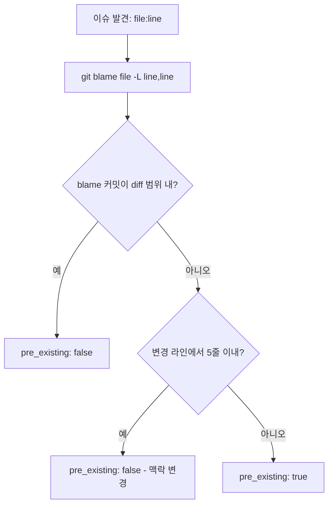

# Code Review Pipeline

멀티에이전트 병렬 분석, confidence scoring, pre-existing 판별, 중복 제거, 랭킹을 수행하는 내부 전용 리뷰 파이프라인 스킬.

## Overview

이 스킬은 기존 리뷰 스킬(review-code-quality, review-security, review-architecture, review-performance)을 병렬로 호출하여 이슈를 수집한 뒤, 검증-중복제거-랭킹의 3단계 후처리를 적용하는 파이프라인을 정의한다. review-comprehensive가 이 파이프라인을 호출하여 통합 판정의 정밀도를 높인다.

## 4단계 파이프라인

### Stage 1: 병렬 호출 (Parallel Collection)

기존 리뷰 스킬을 동시에 실행하여 각 영역의 이슈를 독립적으로 수집한다.

**호출 대상:**

| 스킬 | 영역 | 산출물 |
|------|------|--------|
| review-code-quality | 코드 품질, DRY/KISS/YAGNI, 복잡도 | 이슈 목록 + CQS 점수 |
| review-security | 보안, OWASP Top 10, 비밀키 감지 | 이슈 목록 + 위험도 |
| review-architecture | 아키텍처, 의존성, 관심사 분리 | 이슈 목록 + 구조 분석 |
| review-performance | 성능, 알고리즘 복잡도, N+1 | 이슈 목록 + 병목 분석 |

**병렬 실행 패턴:**

```
Task(review-code-quality, target_files)  -- 동시 실행 -->  issues_quality[]
Task(review-security, target_files)      -- 동시 실행 -->  issues_security[]
Task(review-architecture, target_files)  -- 동시 실행 -->  issues_architecture[]
Task(review-performance, target_files)   -- 동시 실행 -->  issues_performance[]
```

각 스킬은 독립적으로 이슈를 산출하며, 모든 결과가 수집된 후 Stage 2로 진행한다.

### Stage 2: 검증 (Validation)

수집된 이슈에 대해 pre-existing 여부를 판별하고 confidence score를 산정한다.

**2a. Pre-existing 판별:**

각 이슈의 대상 라인이 현재 변경(diff)에 포함되는지 판별한다.

```
1. git blame <file> -L <line>,<line> 실행
   -> 해당 라인의 최종 수정 커밋 해시를 획득

2. git diff <base>..HEAD --name-only 로 변경 파일 목록 확인
   git diff <base>..HEAD -- <file> 로 변경 라인 범위 확인

3. 판별 로직:
   - 이슈 라인이 diff의 변경 범위(추가/수정된 라인) 내 -> pre_existing: false
   - 이슈 라인이 diff의 변경 범위 밖 -> pre_existing: true
   - 이슈 라인이 변경된 라인에서 5줄 이내 인접 -> pre_existing: false (맥락 변경 간주)
```

- 외부 도구 의존 없이 git 내장 명령어(blame, diff)만 사용
- base 커밋은 리뷰 대상 브랜치의 분기점 또는 `git merge-base`로 결정

**2b. Confidence Score 산정:**

각 이슈에 0-100 범위의 confidence score를 부여한다.

| 기준 | 배점 | 설명 |
|------|------|------|
| 코드 변경과의 직접 관련성 | 40점 | 이슈가 현재 diff의 변경 라인에 직접 해당하는가. pre_existing: true이면 0점 |
| 이슈 증거의 구체성 | 30점 | 파일:라인 참조, 구체적 코드 스니펫, 도구 실행 결과 등 증거가 있는가 |
| 영역 간 교차 검증 일치도 | 30점 | 복수 영역의 스킬이 동일 이슈를 독립적으로 보고했는가 |

**배점 상세:**

- **변경 관련성 (40점)**: diff 변경 라인 직접 해당 40점, 인접 5줄 이내 25점, 변경 파일 내 비변경 라인 10점, 변경 파일 외 0점
- **증거 구체성 (30점)**: 도구 실행 결과 + 파일:라인 30점, 파일:라인만 20점, 파일만 10점, 일반적 지적 0점
- **교차 검증 (30점)**: 3개 이상 영역 일치 30점, 2개 영역 일치 20점, 단일 영역 0점

### Stage 3: 중복 제거 (Deduplication)

복수 에이전트가 동일 위치에 대해 보고한 이슈를 병합한다.

**중복 판정 기준:**

```
동일 이슈로 판정하는 조건 (모두 충족):
  1. 동일 파일 경로
  2. 라인 번호 차이 3줄 이내
  3. 이슈 카테고리가 의미적으로 동일 (예: "미사용 변수" + "dead code")
```

**병합 규칙:**

- severity: 가장 높은 심각도를 채택 (Critical > Important > Minor)
- confidence: 각 이슈의 confidence score 중 최고값을 채택
- domain: 최초 보고 영역을 primary로, 나머지를 cross_validated 목록에 기록
- extended_reasoning: 모든 영역의 분석을 병합하여 기록
- 교차 검증 일치도 점수 갱신: 병합된 이슈 수에 따라 재산정

### Stage 4: 랭킹 (Ranking)

최종 이슈 목록을 우선순위에 따라 정렬한다.

**정렬 규칙 (우선순위 순):**

1. **REVIEW.md always_check 패턴 매칭**: 이슈 파일이 `always_check` 패턴에 매칭되면 severity를 Critical로 자동 승격
2. **Severity 내림차순**: Critical > Important > Minor
3. **Confidence score 내림차순**: 동일 severity 내에서 confidence가 높은 이슈 우선
4. **Pre-existing 구분**: pre_existing: false 이슈가 pre_existing: true 이슈보다 우선

**Critical 자동 승격:**

REVIEW.md의 `always_check` 섹션에 정의된 glob 패턴과 이슈 파일 경로를 매칭한다.

```
always_check 패턴: **/auth/**
이슈 파일: src/auth/login.ts:42
-> 패턴 매칭 성공 -> severity를 Critical로 승격
-> extended_reasoning에 승격 근거 추가: "REVIEW.md always_check 패턴 '**/auth/**' 매칭"
```

## Confidence Score 산정 기준

### 점수 구간별 의미

| 구간 | 의미 | 처리 |
|------|------|------|
| 90-100 | 높은 확신: 도구 검증 + 변경 직접 관련 + 교차 검증 일치 | 즉시 보고 |
| 70-89 | 중간 확신: 변경 관련 + 일부 증거 | 기본 보고 (threshold 이상 시) |
| 50-69 | 낮은 확신: 간접 관련 또는 증거 부족 | filtered_issues로 분류 가능 |
| 0-49 | 매우 낮은 확신: pre-existing 또는 추측 기반 | filtered_issues로 분류 |

### 기본 threshold

- 기본값: 80 (REVIEW.md의 `confidence_threshold`로 오버라이드 가능)
- threshold 미만 이슈는 `filtered_issues` 섹션으로 분류
- filtered_issues도 동일 필드 구조를 유지하되 `filter_reason` 필드 추가

## Pre-existing 판별 로직

### 절차



### 판별 결과별 처리

| pre_existing | confidence 영향 | 보고 방식 |
|-------------|----------------|----------|
| false | 변경 관련성 40점 정상 부여 | issues 섹션에 포함 |
| true | 변경 관련성 0점 | pre_existing 라벨과 함께 보고, confidence 하락으로 filtered_issues 분류 가능 |

### 주의사항

- 파일 전체 리팩터링 시 모든 라인이 변경으로 간주될 수 있으므로, 단순 포맷 변경(whitespace-only diff)은 변경에서 제외
- 새로 추가된 파일은 모든 라인이 변경 범위이므로 pre_existing: false
- 삭제된 파일의 이슈는 리뷰 대상에서 제외

## Extended Reasoning 필드 가이드

각 이슈에 `extended_reasoning` 필드를 부여하여 발견 경위와 판단 근거를 구조화된 형태로 기록한다.

### 형식

```yaml
extended_reasoning: |
  [발견] <이슈를 발견한 경위와 도구/검사 항목>
  [근거] <해당 코드가 이슈인 이유, 위반하는 원칙/규칙>
  [대안] <고려한 대안적 해석이나 반론, 왜 기각했는지>
```

### 작성 기준

| 항목 | 포함 내용 | 예시 |
|------|----------|------|
| 발견 | 어떤 검사 항목/도구에서 감지되었는가 | "review-security의 OWASP A03 체크리스트에서 감지" |
| 근거 | 왜 이것이 이슈인가, 어떤 원칙을 위반하는가 | "사용자 입력이 SQL 쿼리에 직접 삽입되어 인젝션 위험" |
| 대안 | 반론이나 대안적 해석, 왜 기각했는가 | "prepared statement로 감쌀 가능성 검토했으나 해당 ORM이 미지원" |

### 교차 검증 시 병합

복수 영역에서 동일 이슈를 보고한 경우 extended_reasoning을 병합한다:

```yaml
extended_reasoning: |
  [발견:security] review-security OWASP A03에서 SQL 인젝션 패턴 감지
  [발견:code_quality] review-code-quality에서 미검증 외부 입력 사용 감지
  [근거] 2개 영역이 독립적으로 동일 위험을 식별, 교차 검증 확인
  [대안] ORM 레벨 이스케이프 가능성 검토했으나 raw query 사용으로 미적용
```

## 파이프라인 Output Format

```yaml
pipeline_result:
  total_raw_issues: {수집된 원본 이슈 수}
  total_after_dedup: {중복 제거 후 이슈 수}
  total_filtered: {threshold 미만으로 필터링된 이슈 수}
  issues:
    - id: "{PREFIX}-{NNN}"
      severity: critical | important | minor
      domain: code_quality | security | architecture | performance
      file: "{path}:{line}"
      finding: "{설명}"
      suggested_action: "{수정 방안}"
      confidence: {0-100}
      pre_existing: true | false
      extended_reasoning: |
        [발견] ...
        [근거] ...
        [대안] ...
      cross_validated:
        - {domain1}
        - {domain2}
  filtered_issues:
    - id: "{PREFIX}-{NNN}"
      severity: critical | important | minor
      domain: code_quality | security | architecture | performance
      file: "{path}:{line}"
      finding: "{설명}"
      suggested_action: "{수정 방안}"
      confidence: {0-100}
      pre_existing: true | false
      extended_reasoning: "..."
      filter_reason: "confidence_below_threshold"
```

## Critical Rules

1. **병렬 실행 필수**: Stage 1에서 4개 리뷰 스킬은 반드시 동시에 실행하여 지연을 최소화한다
2. **git 내장 명령어만 사용**: pre-existing 판별에 외부 도구를 사용하지 않으며, git blame과 git diff만 사용한다
3. **기존 필드 유지**: issues 항목의 기존 6개 필드(id, severity, domain, file, finding, suggested_action)를 삭제하거나 이름 변경하지 않는다
4. **threshold 존중**: REVIEW.md에 confidence_threshold가 설정되어 있으면 해당 값을 사용하고, 미설정 시 기본값 80을 적용한다
5. **중복 제거 시 정보 보존**: 병합 시 severity는 최고값, confidence는 최고값을 채택하여 정보가 유실되지 않도록 한다

## 연관 스킬

| 스킬 | 경로 | 관계 |
|------|------|------|
| review-comprehensive | `.claude/skills/review-comprehensive/SKILL.md` | 이 파이프라인의 결과를 수신하여 통합 판정에 반영 |
| review-code-quality | `.claude/skills/review-code-quality/SKILL.md` | Stage 1 병렬 호출 대상 (코드 품질 영역) |
| review-security | `.claude/skills/review-security/SKILL.md` | Stage 1 병렬 호출 대상 (보안 영역) |
| review-architecture | `.claude/skills/review-architecture/SKILL.md` | Stage 1 병렬 호출 대상 (아키텍처 영역) |
| review-performance | `.claude/skills/review-performance/SKILL.md` | Stage 1 병렬 호출 대상 (성능 영역) |
