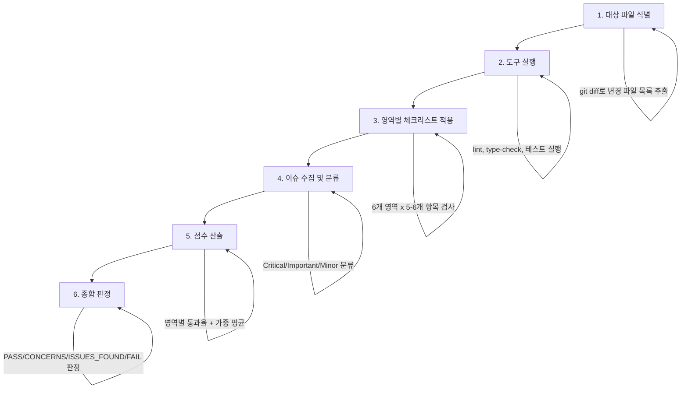

# Comprehensive Review

모든 리뷰 영역을 하나의 통합 워크플로우로 실행하여 종합 판정을 산출하는 스킬.

## Overview

종합 리뷰는 개별 리뷰 영역(코드 품질, 보안, 아키텍처, 성능, 테스트, 요구사항 충족도)을 일괄로 검사하여 단일 판정 결과를 생성한다. 주요 기능 완성 후, 릴리스 전 종합 점검, 머지 전 최종 리뷰 시점에 사용한다.

**목적:**
- 개별 리뷰를 각각 수행하는 대신 하나의 통합 워크플로우로 전 영역 검사
- 영역 간 교차 이슈(보안-성능 트레이드오프, 아키텍처-테스트 갭 등) 식별
- 정량적 체크리스트 통과율 기반의 객관적 판정
- 프로덕션 배포 전 최종 품질 게이트 역할

## 기존 스킬과의 관계

종합 리뷰는 기본 계층 스킬과 심화 계층 스킬을 오케스트레이션하는 상위 계층 스킬이다. 개별 스킬의 결과를 수집하고 통합 판정으로 종합한다.

| 스킬 | 계층 | 역할 | 종합 리뷰에서의 위치 |
|------|------|------|---------------------|
| review-requesting | 기본 | 리뷰 체크리스트, 이슈 분류 | 리뷰 프레임워크 제공 |
| review-code-quality | 기본 | 린트/타입체크, 코드 메트릭, CQS 산출 | 코드 품질 영역 데이터 공급 |
| review-security | 심화 | 보안 전문 검사 | 보안 영역 체크리스트 수행 |
| review-architecture | 심화 | 아키텍처 전문 검사 | 아키텍처 영역 체크리스트 수행 |
| review-frontend | 심화 | 프론트엔드 전문 검사 | 해당 시 프론트엔드 영역 추가 |
| review-performance | 심화 | 성능 전문 검사 | 성능 영역 체크리스트 수행 |
| **review-comprehensive** | **통합** | **전 영역 오케스트레이션, 통합 판정** | **본 스킬** |

**오케스트레이션 원칙:**
- 종합 리뷰는 개별 스킬의 결과를 재검사하지 않는다
- 각 영역의 전문 스킬이 산출한 이슈와 점수를 수집하여 통합 판정에 반영한다
- 심화 스킬이 로드되지 않은 영역은 본 스킬의 내장 체크리스트로 기본 검사를 수행한다

## 통합 체크리스트

6개 영역, 각 영역당 5-6개 항목으로 구성한다. 각 항목은 PASS/FAIL로 판정한다.

### 1. 코드 품질 (Code Quality)

- [ ] 린트/포맷 도구 실행 결과 에러 0건
- [ ] 타입체크 통과 (해당 언어에 한함)
- [ ] 순환 복잡도 20 이하 (모든 함수)
- [ ] 함수 크기 50줄 이하, 파일 크기 500줄 이하
- [ ] DRY/KISS/YAGNI 원칙 위반 없음
- [ ] 에러 처리가 적절하며 예외 누락 없음

### 2. 보안 (Security)

- [ ] 하드코딩된 자격증명/비밀키 없음
- [ ] 사용자 입력 유효성 검증 존재
- [ ] SQL 인젝션/XSS/CSRF 방어 적용
- [ ] 인증/인가 로직 적절
- [ ] 민감 데이터 로깅 없음

### 3. 아키텍처 (Architecture)

- [ ] 관심사 분리 준수 (계층 간 경계 명확)
- [ ] 순환 의존성 없음
- [ ] 의존성 방향이 안정적 방향(추상 -> 구체)
- [ ] 확장성 고려 (새 기능 추가 시 변경 최소화)
- [ ] 프로젝트 기존 아키텍처 패턴 준수

### 4. 성능 (Performance)

- [ ] O(n^2) 이상 알고리즘 부재 또는 정당화됨
- [ ] N+1 쿼리 문제 없음
- [ ] 불필요한 메모리 할당/복사 없음
- [ ] 적절한 캐싱/배치 처리 적용
- [ ] 병목 가능 지점에 대한 고려 존재

### 5. 테스트 (Testing)

- [ ] 모든 테스트 통과
- [ ] 핵심 로직에 대한 단위 테스트 존재
- [ ] 엣지 케이스 커버리지 확인
- [ ] 목(mock)만 테스트하지 않고 실제 로직 검증
- [ ] 필요한 곳에 통합 테스트 존재

### 6. 요구사항 충족도 (Requirements)

- [ ] 계획서/스펙의 모든 요구사항 구현 완료
- [ ] 구현이 스펙과 일치 (과잉 구현 없음)
- [ ] 범위 확대(scope creep) 없음
- [ ] 브레이킹 체인지 문서화 완료
- [ ] 하위 호환성 유지 (해당 시)

### 체크리스트 통과율 산출

```
영역별 통과율 = (PASS 항목 수 / 전체 항목 수) x 100
종합 통과율 = 6개 영역 통과율의 가중 평균
```

**가중치:**
| 영역 | 가중치 | 근거 |
|------|--------|------|
| 코드 품질 | 20% | 기본 품질 |
| 보안 | 25% | 프로덕션 안전성 |
| 아키텍처 | 15% | 장기 유지보수성 |
| 성능 | 15% | 사용자 경험 |
| 테스트 | 15% | 회귀 방지 |
| 요구사항 충족도 | 10% | 목표 달성 |

## 4단계 판정 체계

| 판정 | 조건 | 의미 | 후속 조치 |
|------|------|------|----------|
| **PASS** | 모든 영역 80% 이상, Critical 0건 | 프로덕션 준비 완료 | 머지 진행 |
| **CONCERNS** | 일부 영역 60-80%, Critical 0건, Important 3건 이하 | 조건부 통과 | 지적 사항 검토 후 판단 |
| **ISSUES_FOUND** | 1개 이상 영역 60% 미달 또는 Critical 존재 | 수정 필요 | Critical/주요 이슈 수정 후 재리뷰 |
| **FAIL** | 다수 영역 실패 또는 보안 Critical 존재 | 근본적 재작업 필요 | 설계 재검토 후 재구현 |

**기존 이슈 분류와의 매핑:**

| review-requesting 분류 | 판정 영향 |
|-------------------------------------|----------|
| Critical (보안/데이터 손실/기능 장애) | 1건 이상 시 ISSUES_FOUND 이상. 보안 Critical은 FAIL |
| Important (아키텍처/성능/잠재적 버그) | 4건 이상 시 CONCERNS 이상 |
| Minor (스타일/최적화/문서) | 판정에 직접 영향 없음. 기록만 유지 |

## 실행 워크플로우



**단계별 상세:**

1. **대상 파일 식별**: `git diff`로 변경 파일 목록을 추출하고 언어/프레임워크를 식별한다
2. **도구 실행**: 프로젝트에서 사용 가능한 린트/타입체크/테스트 도구를 자동 감지하여 실행한다
3. **영역별 체크리스트 적용**: 6개 영역의 체크리스트를 순서대로 적용한다. 심화 스킬이 로드된 영역은 해당 스킬의 상세 체크리스트를 사용한다
4. **이슈 수집 및 분류**: 모든 영역에서 발견된 이슈를 Critical/Important/Minor로 분류하고 파일:라인 참조를 부여한다
5. **점수 산출**: 영역별 통과율을 계산하고 가중 평균으로 종합 점수를 산출한다
6. **종합 판정**: 4단계 판정 기준에 따라 최종 판정을 결정한다

## Output Format

```yaml
verdict: PASS | CONCERNS | ISSUES_FOUND | FAIL
checklist_pass_rate: {0-100}%
domain_scores:
  code_quality:
    pass_rate: {0-100}%
    items_passed: {n}/{total}
  security:
    pass_rate: {0-100}%
    items_passed: {n}/{total}
  architecture:
    pass_rate: {0-100}%
    items_passed: {n}/{total}
  performance:
    pass_rate: {0-100}%
    items_passed: {n}/{total}
  testing:
    pass_rate: {0-100}%
    items_passed: {n}/{total}
  requirements:
    pass_rate: {0-100}%
    items_passed: {n}/{total}
total_issues:
  critical: {count}
  important: {count}
  minor: {count}
issues:
  - id: "{PREFIX}-{NNN}"
    severity: critical | important | minor
    domain: code_quality | security | architecture | performance | testing | requirements
    file: "{path}:{line}"
    finding: "{설명}"
    suggested_action: "{수정 방안}"
summary: |
  {1-3문장 종합 평가}
```

## Critical Rules

1. **전 영역 검사 필수**: 6개 영역 중 하나라도 건너뛰지 않는다. 해당 없는 영역은 N/A로 표기하되 판정에서 제외한다
2. **도구 실행 우선**: 사용 가능한 린트/타입체크/테스트 도구가 있으면 수동 검사 전에 반드시 실행한다
3. **증거 기반 판정**: 모든 이슈는 파일:라인 참조를 포함해야 하며, 주관적 판단만으로 Critical을 부여하지 않는다
4. **판정 기준 엄수**: 4단계 판정 기준의 수치 조건을 임의로 완화하거나 강화하지 않는다
5. **기존 스킬 결과 존중**: 심화 스킬이 이미 수행한 검사를 중복 수행하지 않으며, 해당 스킬의 판정 결과를 통합 판정에 반영한다

## 연관 스킬

| 스킬 | 경로 | 관계 |
|------|------|------|
| review-requesting | `.claude/skills/review-requesting/SKILL.md` | 리뷰 프레임워크 및 이슈 분류 체계 제공 |
| review-code-quality | `.claude/skills/review-code-quality/SKILL.md` | 코드 품질 영역 정량적 데이터 공급 |
| review-security | `.claude/skills/review-security/SKILL.md` | 보안 영역 전문 체크리스트 수행 |
| review-architecture | `.claude/skills/review-architecture/SKILL.md` | 아키텍처 영역 전문 체크리스트 수행 |
| review-frontend | `.claude/skills/review-frontend/SKILL.md` | 프론트엔드 영역 전문 체크리스트 수행 (해당 시) |
| review-performance | `.claude/skills/review-performance/SKILL.md` | 성능 영역 전문 체크리스트 수행 |
