# Architecture & Modern Patterns (아키텍처 및 현대 패턴)

아키텍처 패턴 16개의 상세 참조 문서.

## Table of Contents

1. [MVC](#1-mvc)
2. [MVP](#2-mvp)
3. [MVVM](#3-mvvm)
4. [Repository](#4-repository)
5. [Dependency Injection](#5-dependency-injection)
6. [Event Sourcing](#6-event-sourcing)
7. [CQRS](#7-cqrs)
8. [Microservices](#8-microservices)
9. [Saga](#9-saga)
10. [Circuit Breaker](#10-circuit-breaker)
11. [API Gateway](#11-api-gateway)
12. [BFF](#12-bff)
13. [Clean Architecture](#13-clean-architecture)
14. [Hexagonal Architecture](#14-hexagonal-architecture)
15. [DDD](#15-ddd)
16. [EDA](#16-eda)
17. [패턴 조합 가이드](#패턴-조합-가이드)

---

## 1. MVC

**의도**: UI, 데이터, 제어 로직을 Model-View-Controller로 분리.

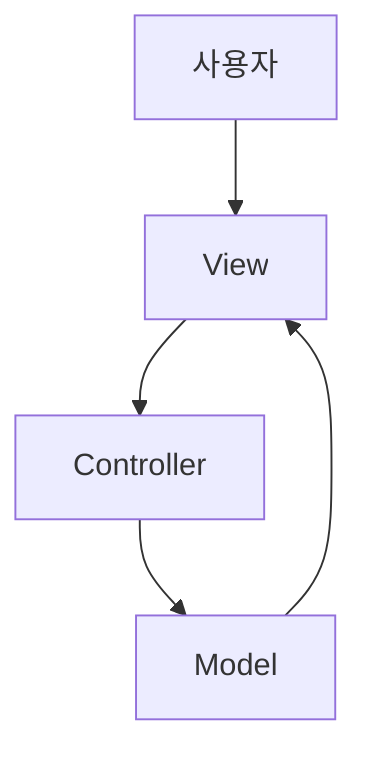

| 참여자 | 역할 |
|--------|------|
| Model | 비즈니스 로직 + 데이터, 상태 변경 시 View 통지 |
| View | 시각적 표현, 입력을 Controller에 전달 |
| Controller | 입력 해석, Model 갱신 또는 View 선택 |

**적용**: 서버 사이드 웹 (Rails, Django, Spring MVC, ASP.NET MVC)
**장점**: 관심사 분리, View-Model 독립 개발 | **단점**: Fat Controller 위험, 복잡한 UI에서 데이터 흐름 추적 어려움

---

## 2. MVP

**의도**: View를 수동적으로 만들고 Presenter가 모든 상호작용 중재.

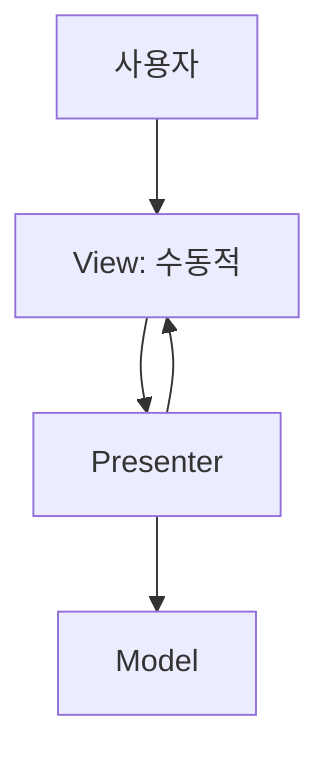

**적용**: 테스트 가능성 중시 데스크톱/모바일 앱, Windows Forms, Android 전통 개발
**장점**: View 인터페이스 기반 Mock 테스트 용이 | **단점**: Fat Presenter, 1:1 관계로 클래스 증가

---

## 3. MVVM

**의도**: 데이터 바인딩으로 View-ViewModel을 선언적 연결, UI/비즈니스 로직 완전 분리.

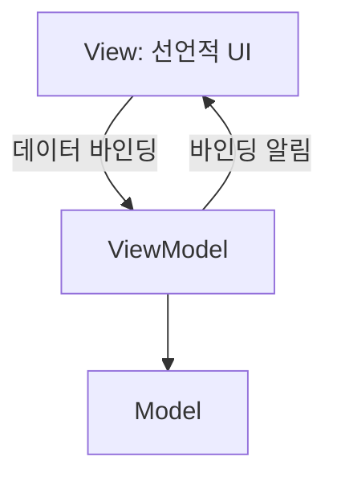

**적용**: WPF, MAUI, Jetpack Compose, SwiftUI, React/Vue (유사 패턴)
**장점**: 보일러플레이트 감소, 반응형 UI | **단점**: 바인딩 디버깅 어려움, 런타임 오류

**MVC/MVP/MVVM 비교**:

| 항목 | MVC | MVP | MVVM |
|------|-----|-----|------|
| View-로직 연결 | Controller | Presenter (인터페이스) | 데이터 바인딩 |
| 테스트 용이성 | 중간 | 높음 | 높음 |
| 주 사용 영역 | 서버 사이드 | 데스크톱/모바일 | 선언적 UI |

---

## 4. Repository

**의도**: 데이터 접근 로직을 추상화하여 비즈니스 로직과 저장소 간 중간 계층 제공.

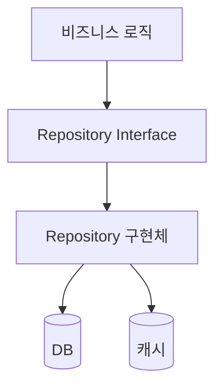

**적용**: 웹 앱 DB 상호작용, DDD Aggregate Root 영속성, API 데이터 접근
**장점**: 유지보수성, 테스트 용이성, 저장소 교체 유연성 | **단점**: CRUD에는 과도한 추상화, 복잡 쿼리 표현 어려움
**관련 패턴**: Unit of Work, Data Mapper, CQRS

---

## 5. Dependency Injection

**의도**: 객체가 의존성을 직접 생성하지 않고 외부에서 주입받아 느슨한 결합 달성. IoC 구현.

| DI 유형 | 설명 | 특징 |
|---------|------|------|
| Constructor | 생성자로 주입 | 불변성 보장, 가장 권장 |
| Setter | Setter로 주입 | 선택적 의존성, 불완전 상태 위험 |
| Interface | 인터페이스 메서드로 주입 | 유연, 복잡도 증가 |
| Method | 메서드 호출 시 전달 | 일회성 의존성 |

**적용**: Spring, .NET Core, Angular, 단위 테스트 Mock 주입, 플러그인 아키텍처
**장점**: 느슨한 결합, SOLID DIP 구현, 테스트 용이 | **단점**: 설정 복잡, 런타임 오류 가능

---

## 6. Event Sourcing

**의도**: 상태 변경을 불변 이벤트 시퀀스로 기록, 이벤트 재생으로 상태 복원.

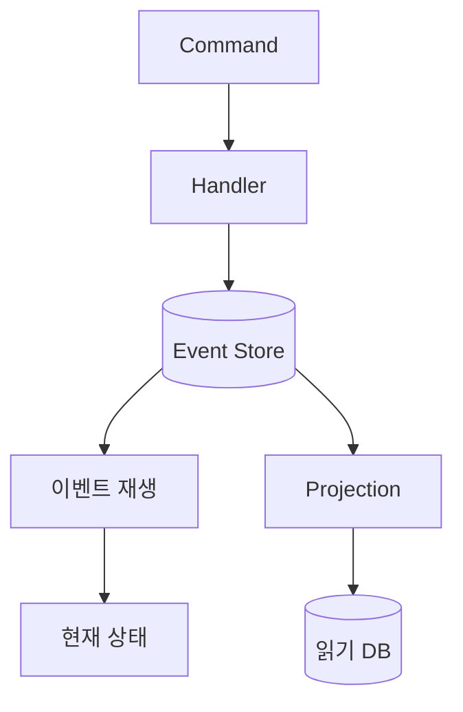

| 참여자 | 역할 |
|--------|------|
| Event | 불변의 사실, 타임스탬프+유형+데이터 |
| Event Store | append-only 저장소 |
| Aggregate | 이벤트 발생/재생으로 상태 관리 |
| Projection | 읽기 모델 구성 |

**적용**: 금융 시스템 감사, 주문 이력, 마이크로서비스 데이터 동기화
**장점**: 완전한 이력, 시간 여행 디버깅 | **단점**: 높은 복잡도, 이벤트 스키마 버전닝, 저장소 증가
**관련 패턴**: CQRS, Saga, Snapshot

---

## 7. CQRS

**의도**: 읽기(Query)와 쓰기(Command)를 별도 모델로 분리, 독립 최적화/확장.

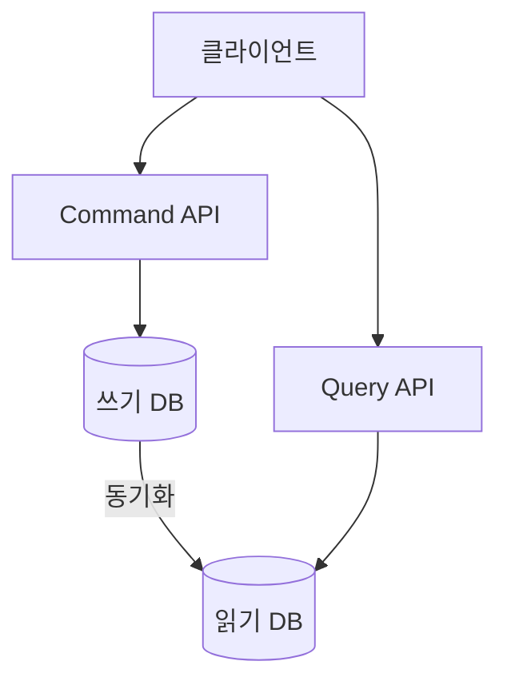

**적용**: 읽기/쓰기 워크로드가 다른 시스템, 대시보드, Event Sourcing 결합
**장점**: 독립 확장, 용도별 최적화 | **단점**: 아키텍처 복잡도 대폭 증가, Eventual Consistency

---

## 8. Microservices

**의도**: 애플리케이션을 작고 독립적인 서비스로 분해, 독립 개발/배포/확장.

| 핵심 특성 | 설명 |
|-----------|------|
| 독립 배포 | 서비스별 빌드/테스트/배포 |
| 기술 다양성 | 서비스마다 적합한 스택 |
| 데이터 분산 | Database per Service |
| 장애 격리 | 서비스 장애의 전체 전파 방지 |

**장점**: 독립 배포, 기술 유연성, 확장성 | **단점**: 분산 시스템 복잡성, 네트워크 레이턴시, 데이터 일관성

---

## 9. Saga

**의도**: 분산 트랜잭션을 로컬 트랜잭션 시퀀스로 관리, 실패 시 보상 트랜잭션 실행.

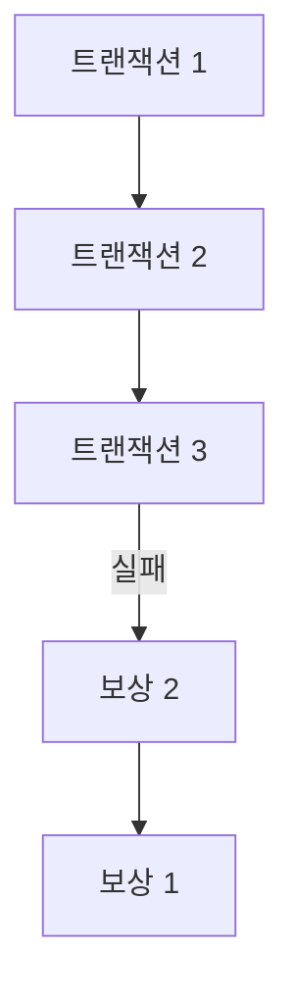

| 방식 | 설명 | 장점 | 단점 |
|------|------|------|------|
| Choreography | 이벤트 발행/구독 | 느슨한 결합 | 흐름 추적 어려움 |
| Orchestration | 중앙 조정자 관리 | 명확한 흐름 | 단일 실패 지점 |

**적용**: 주문-결제-배송 프로세스, 2PC 불가 환경
**관련 패턴**: Event Sourcing, CQRS, Compensating Transaction

---

## 10. Circuit Breaker

**의도**: 원격 호출 실패 감지, 임계치 초과 시 호출 차단하여 장애 연쇄 전파 방지.

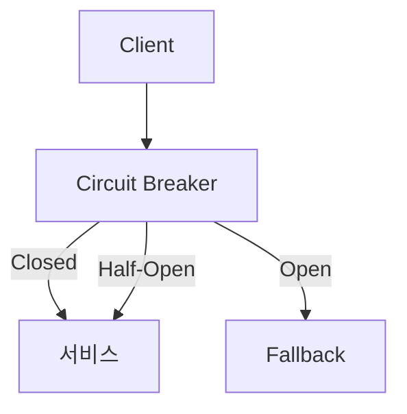

| 상태 | 설명 |
|------|------|
| Closed | 정상, 실패율 모니터링 |
| Open | 임계치 초과, 즉시 Fallback |
| Half-Open | 제한적 요청으로 복구 확인 |

**적용**: 마이크로서비스 간 호출, 외부 API, DB 연결 장애
**관련 패턴**: Retry, Bulkhead, Timeout, Fallback

---

## 11. API Gateway

**의도**: 모든 클라이언트 요청의 단일 진입점. 라우팅, 인증, 로드밸런싱, 응답 집약.

| 기능 | 설명 |
|------|------|
| 라우팅 | 요청을 적절한 서비스로 |
| 인증/인가 | 중앙화 보안 |
| Rate Limiting | 서비스 보호 |
| 프로토콜 변환 | REST/gRPC/WebSocket |

**장점**: 클라이언트 단순화, 서비스 구조 은닉 | **단점**: SPOF 위험, 추가 레이턴시

---

## 12. BFF

**의도**: 프론트엔드 플랫폼별(웹/모바일/IoT) 전용 백엔드 서비스 제공.

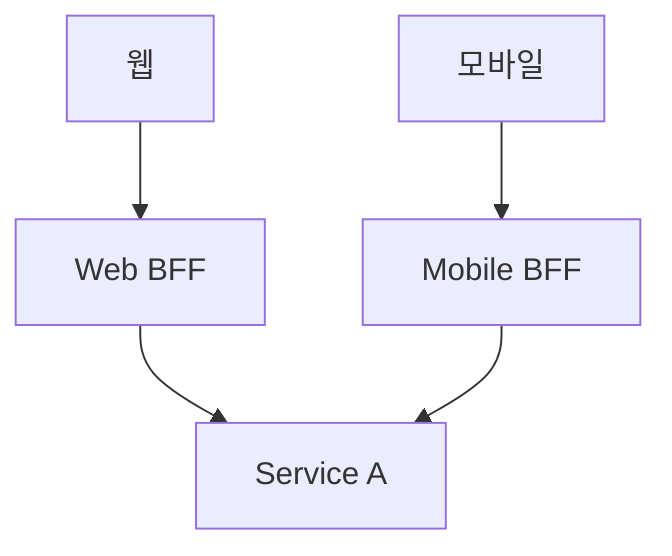

**적용**: 다중 플랫폼 시스템, 플랫폼별 API 최적화
**장점**: 성능 최적화, API 진화 단순화 | **단점**: BFF 수 증가, 코드 중복
**관련 패턴**: API Gateway, Facade, Adapter

---

## 13. Clean Architecture

**의도**: 비즈니스 규칙을 프레임워크/UI/DB로부터 독립시키는 아키텍처.

**핵심: 의존성 규칙** - 바깥 계층이 안쪽에 의존 (반대 금지).

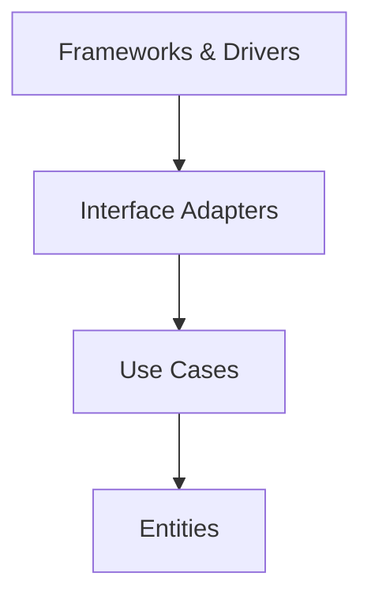

| 계층 | 역할 |
|------|------|
| Entities | 엔터프라이즈 비즈니스 규칙 |
| Use Cases | 애플리케이션 비즈니스 규칙 |
| Interface Adapters | Controllers, Presenters, Gateways |
| Frameworks & Drivers | 웹, DB, UI |

**장점**: 프레임워크 독립, 테스트 용이, 장기 유지보수 | **단점**: 초기 비용, 소규모에 과도

---

## 14. Hexagonal Architecture

**의도**: Ports & Adapters로 핵심 로직을 외부와 격리, 기술 스택 교체 보험.

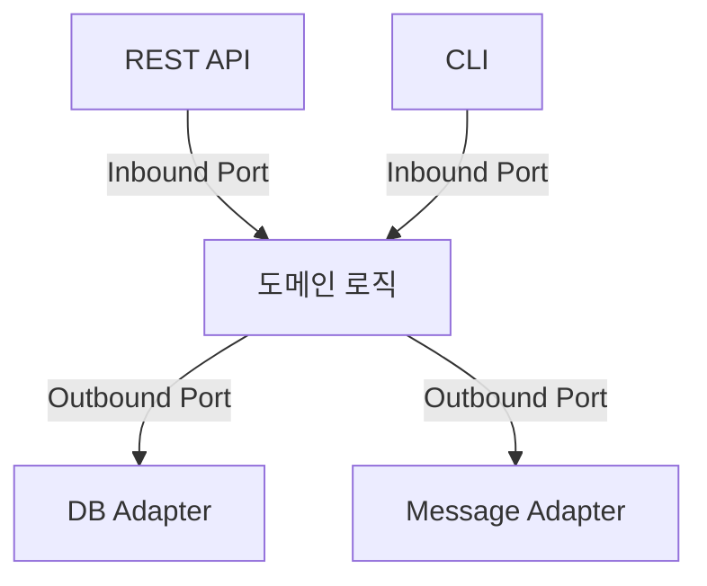

| 개념 | 설명 |
|------|------|
| Port | 경계 인터페이스 (Inbound/Outbound) |
| Adapter | Port 구현, 외부 기술 연결 |
| Application Core | 포트 통해서만 외부 통신 |

**장점**: 기술 교체 용이, 도메인 보호 | **단점**: 초기 복잡도, 포트/어댑터 설계 판단
**관련 패턴**: Clean Architecture, Onion Architecture, DDD

---

## 15. DDD

**의도**: 도메인 전문가 입력에 따라 도메인 모델 중심으로 설계, 비즈니스 복잡성 관리.

**전략적 설계**:

| 패턴 | 설명 |
|------|------|
| Bounded Context | 도메인 모델의 일관성 경계, 마이크로서비스와 매핑 |
| Ubiquitous Language | 개발자-도메인 전문가 공유 언어 |
| Context Map | Bounded Context 간 관계 시각화 |

**전술적 설계**:

| 패턴 | 설명 |
|------|------|
| Entity | 고유 식별자, 생명주기 추적 |
| Value Object | 속성 값으로만 정의, 불변 |
| Aggregate | 데이터 변경 단위, Root Entity 통해 접근 |
| Domain Event | 도메인에서 발생한 의미 있는 사건 |
| Domain Service | Entity/VO에 속하지 않는 도메인 로직 |

**장점**: 비즈니스-기술 소통, 명확한 경계, 복잡성 관리 | **단점**: 높은 학습 곡선, 도메인 전문가 필수

---

## 16. EDA

**의도**: 이벤트 발행/소비로 컴포넌트 간 통신, 느슨한 결합과 실시간 반응성.

| 패턴 | 설명 |
|------|------|
| Pub-Sub | 발행자가 채널에 발행, 구독자가 수신 |
| Event Streaming | 브로커에 저장, 임의 위치에서 읽기 |
| Event Notification | 발생만 알리고, 소비자가 직접 조회 |
| Event-Carried State Transfer | 이벤트에 상태 데이터 포함 |

**기술**: Apache Kafka, RabbitMQ, Amazon EventBridge
**장점**: 느슨한 결합, 실시간, 확장성 | **단점**: 순서 보장 어려움, 디버깅 복잡

---

## 패턴 조합 가이드

| 조합 | 시너지 효과 |
|------|------------|
| Microservices + DDD | Bounded Context로 서비스 경계 설계 |
| CQRS + Event Sourcing | 이벤트 기록 + Projection으로 읽기 최적화 |
| API Gateway + BFF | 중앙 게이트웨이 + 플랫폼별 전용 백엔드 |
| Circuit Breaker + Retry + Bulkhead | 다층 복원력 스택 |
| Saga + EDA | 이벤트 기반 분산 트랜잭션 |
| Clean/Hexagonal + DI | 의존성 역전으로 계층 간 느슨한 결합 |

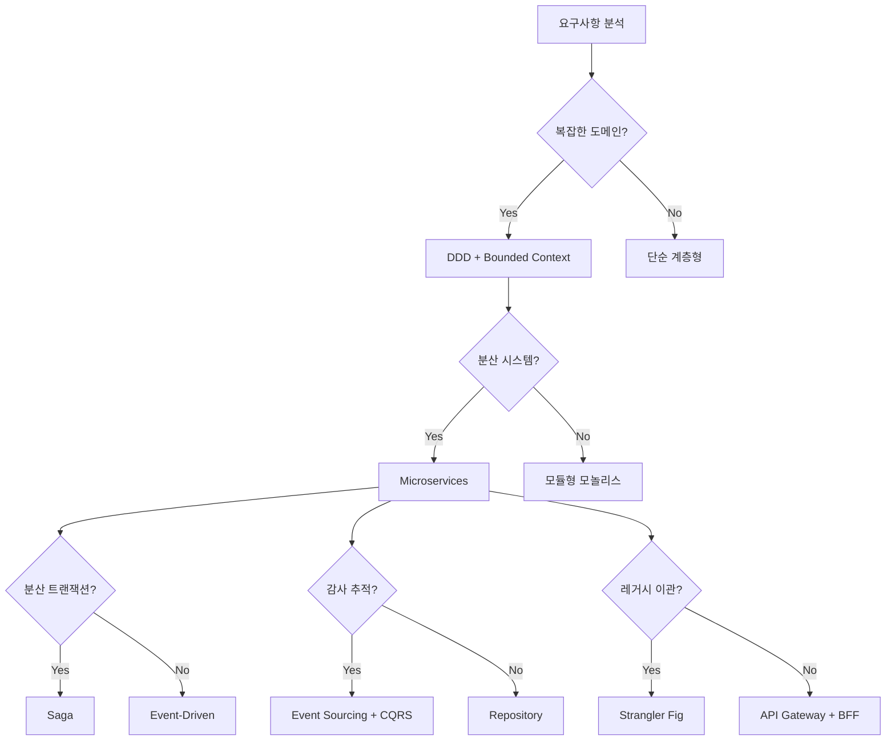

**Strangler Fig**: 레거시를 점진적으로 새 서비스로 이관. 라우터/프록시가 신규/레거시 분배. Transform --> Coexist --> Eliminate 3단계.

**Service Mesh / Sidecar**: 서비스 간 통신을 전용 인프라 계층에서 관리. 로드밸런싱, 보안, 관찰성을 서비스 코드 밖에서 처리. 기술: Istio, Linkerd, Envoy.
