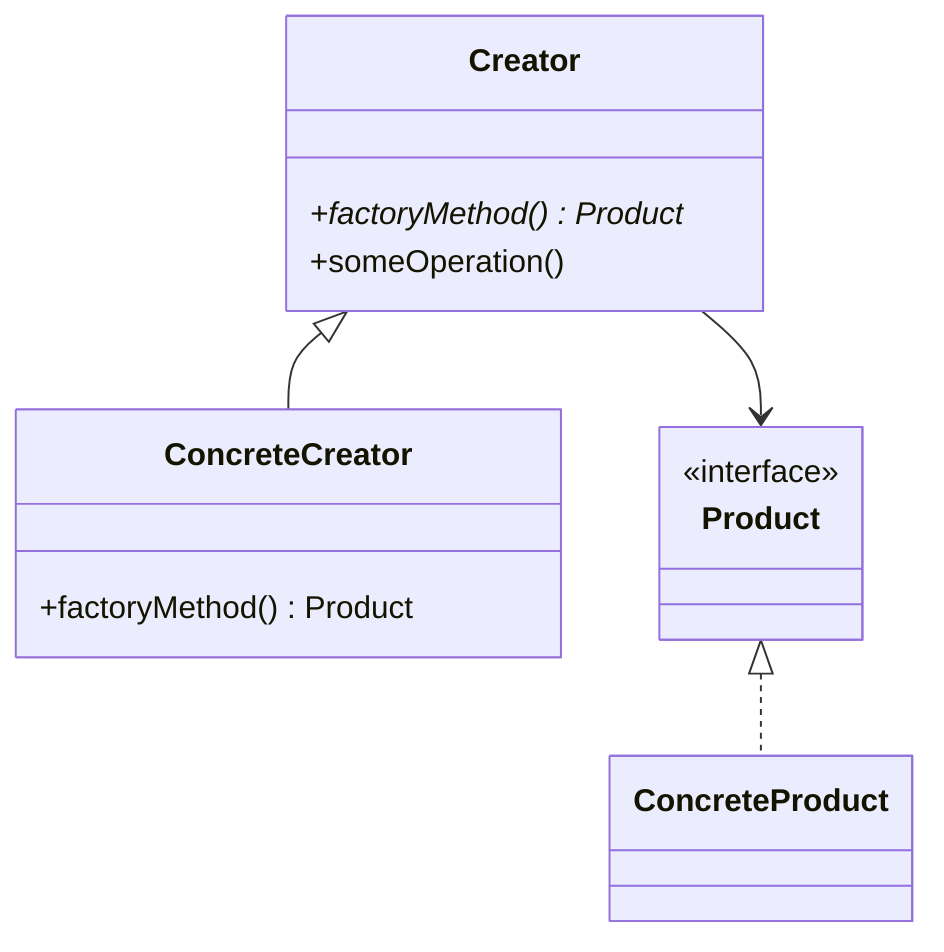
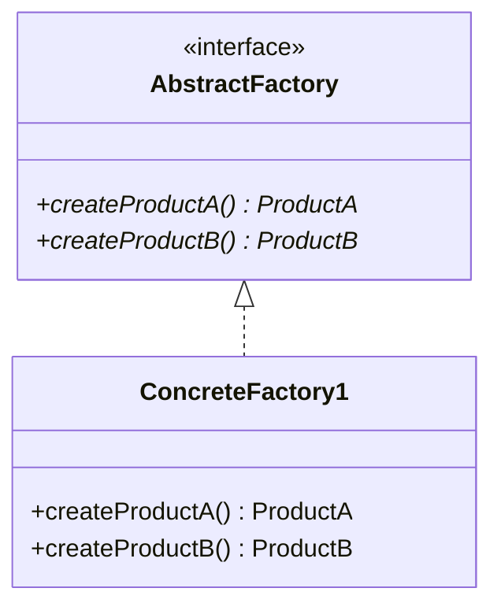
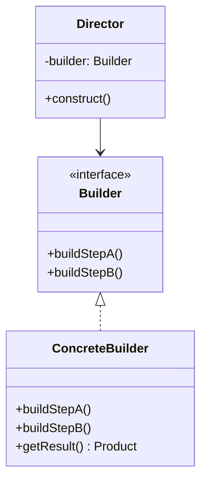
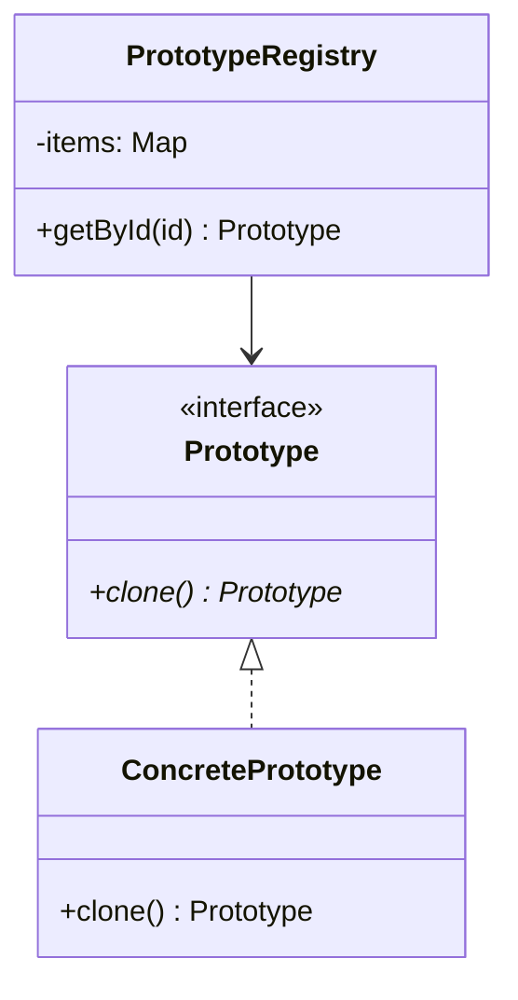
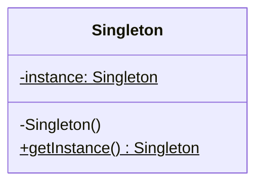

# Creational Patterns (생성 패턴)

GoF 생성 패턴 5개의 상세 참조 문서.

## Table of Contents

1. [Factory Method](#1-factory-method)
2. [Abstract Factory](#2-abstract-factory)
3. [Builder](#3-builder)
4. [Prototype](#4-prototype)
5. [Singleton](#5-singleton)
6. [비교 요약](#비교-요약)

---

## 1. Factory Method

**의도**: 객체 생성 인터페이스를 상위 클래스에 정의하되, 구체 클래스 결정은 서브클래스에 위임.

**해결하는 문제**: `new` 연산자의 직접 사용이 분산되어 OCP 위반, 새 타입 추가 시 광범위한 수정 필요.



| 참여자 | 역할 |
|--------|------|
| Product | 팩토리 메서드가 생성하는 객체의 인터페이스 |
| ConcreteProduct | Product의 구체 구현 |
| Creator | 팩토리 메서드를 선언하는 상위 클래스 |
| ConcreteCreator | 팩토리 메서드를 오버라이드하여 특정 제품 반환 |

**적용**: 프레임워크 확장, 로거/커넥터 생성, UI 컴포넌트 팩토리

```typescript
interface Transport { deliver(): string; }
class Truck implements Transport { deliver() { return "육로 배송"; } }
class Ship implements Transport { deliver() { return "해상 배송"; } }

abstract class Logistics {
  abstract createTransport(): Transport;
  planDelivery(): string {
    return `물류: ${this.createTransport().deliver()}`;
  }
}
class RoadLogistics extends Logistics {
  createTransport() { return new Truck(); }
}
```

| 장점 | 단점 |
|------|------|
| Creator-Product 결합도 제거 | 클래스 수 증가 |
| SRP/OCP 준수 | 간단한 경우 과도한 설계 |

**관련 패턴**: Abstract Factory (진화), Template Method (내부 호출), Prototype (대안)

---

## 2. Abstract Factory

**의도**: 관련 객체 제품군을 구체 클래스 명시 없이 생성하는 인터페이스 제공.

**해결하는 문제**: 제품군 내 불일치 조합 방지, 새 변형 추가 용이.



**적용**: 크로스 플랫폼 UI, 결제 프로바이더, DB 추상화, 테마 시스템

```typescript
interface GUIFactory {
  createButton(): Button;
  createCheckbox(): Checkbox;
}
class WindowsFactory implements GUIFactory {
  createButton() { return new WindowsButton(); }
  createCheckbox() { return new WindowsCheckbox(); }
}
function buildUI(factory: GUIFactory) {
  const btn = factory.createButton();
  const chk = factory.createCheckbox();
}
```

| 장점 | 단점 |
|------|------|
| 제품군 호환성 보장 | 인터페이스/클래스 수 증가 |
| SRP/OCP 준수 | 새 제품 타입 추가 시 모든 팩토리 수정 |

**관련 패턴**: Factory Method (구현 수단), Singleton (팩토리 인스턴스), Facade (대안)

---

## 3. Builder

**의도**: 복잡한 객체의 생성과 표현을 분리, 동일 과정으로 다른 표현 생성.

**해결하는 문제**: 텔레스코핑 생성자, 서브클래스 폭발, 복잡한 조립 로직.



**적용**: HTTP 요청/SQL 쿼리 빌더, 문서 생성, 게임 캐릭터, Composite 트리 구성

```typescript
class HouseBuilder {
  private house = new House();
  reset() { this.house = new House(); }
  buildWalls(n: number) { this.house.walls = n; return this; }
  buildDoors(n: number) { this.house.doors = n; return this; }
  buildGarage() { this.house.hasGarage = true; return this; }
  getResult() { return this.house; }
}
// Fluent: builder.buildWalls(4).buildDoors(2).buildGarage().getResult()
```

| 장점 | 단점 |
|------|------|
| 단계별 구성, Fluent API | 새 클래스 다수 필요 |
| 동일 코드로 다양한 표현 | Builder가 가변(mutable) |

**관련 패턴**: Abstract Factory (즉시 vs 단계별), Composite (트리 구성), Bridge (결합)

---

## 4. Prototype

**의도**: 프로토타입 인스턴스를 복제(clone)하여 새 객체 생성.

**해결하는 문제**: private 필드 접근 불가, 구체 클래스 의존, 비용이 큰 초기화 반복.



**얕은 복사 vs 깊은 복사**: 원시/불변 필드만 있으면 얕은 복사. 가변 참조 필드가 있으면 깊은 복사 필요. 순환 참조 시 무한 루프 주의.

**적용**: 게임 프리셋 복제, 설정 템플릿, 문서 템플릿, 서드파티 객체 복제

```typescript
class Shape {
  constructor(public x: number, public y: number, public color: string) {}
  clone(): Shape { return new Shape(this.x, this.y, this.color); }
}
class ShapeRegistry {
  private shapes = new Map<string, Shape>();
  register(key: string, shape: Shape) { this.shapes.set(key, shape); }
  get(key: string) { return this.shapes.get(key)?.clone(); }
}
```

| 장점 | 단점 |
|------|------|
| 구체 클래스 의존성 제거 | 순환 참조 복제 복잡 |
| 반복 초기화 코드 제거 | 깊은 복사 구현 어려움 |

**관련 패턴**: Factory Method (대안), Memento (상태 복제 활용)

---

## 5. Singleton

**의도**: 클래스 인스턴스를 하나로 보장하고 전역 접근점 제공.

**해결하는 문제**: 공유 리소스(DB 풀, 설정, 로거)의 단일 접근 제어.



**스레드 안전성 구현 방식**:
- Eager Init: 클래스 로딩 시 생성 (간단, 불필요한 메모리 점유)
- Double-Checked Locking: 동기화 + null 이중 검사
- Holder Pattern: 내부 정적 클래스 (JVM 권장)
- Enum Singleton: 직렬화/리플렉션 안전 (Java)

```typescript
class Database {
  private static instance: Database | null = null;
  private constructor() {}
  static getInstance(): Database {
    if (!Database.instance) Database.instance = new Database();
    return Database.instance;
  }
}
```

| 장점 | 단점 |
|------|------|
| 단일 인스턴스 보장 | SRP 위반 (생성 제어 + 비즈니스 로직) |
| 지연 초기화로 자원 절약 | 테스트 어려움 (전역 상태) |

**안티패턴 논란**: 전역 상태 도입, 숨겨진 의존성, 테스트 어려움. DI 컨테이너가 더 깔끔한 대안. 하드웨어 리소스/DI 컨테이너 자체에는 여전히 유효.

**관련 패턴**: Facade (Singleton으로 구현), Flyweight (다수 인스턴스 허용과 차이)

---

## 비교 요약

| 패턴 | 핵심 메커니즘 | 생성 시점 | 핵심 가치 |
|------|-------------|----------|----------|
| Factory Method | 상속 + 오버라이드 | 즉시 | 서브클래스에 생성 위임 |
| Abstract Factory | 인터페이스 조합 | 즉시 | 제품군 호환성 보장 |
| Builder | 단계별 조립 | 지연 | 복잡한 객체의 단계별 생성 |
| Prototype | 복제 (clone) | 즉시 | 기존 객체 기반 생성 |
| Singleton | 접근 제어 | 지연 | 단일 인스턴스 보장 |

**진화 경로**: Factory Method --> Abstract Factory (제품군 관리) / Builder (유연성) / Prototype (상속 회피). 팩토리들은 Singleton으로 구현 가능.
