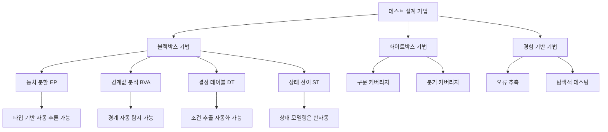
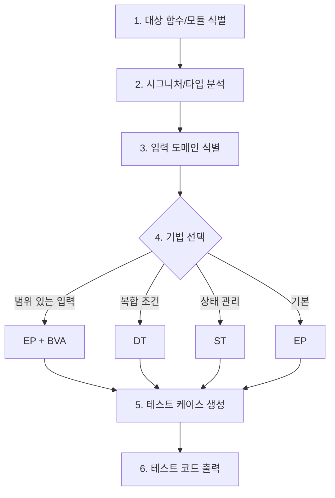

# Test Design - ISTQB v4.0 Test Design Techniques

함수 시그니처와 타입 정보를 분석하여 ISTQB v4.0 블랙박스 테스트 설계 기법 기반의 테스트 케이스를 체계적으로 생성하는 스킬.

## Overview

ISTQB CTFL v4.0은 테스트 설계 기법을 블랙박스, 화이트박스, 경험 기반 3개 카테고리로 분류한다. 이 스킬은 블랙박스 기법 중 자동화 가능성이 높은 4개 기법(EP, BVA, DT, ST)에 집중하여, 코드의 타입 시스템과 함수 시그니처로부터 테스트 케이스를 자동 도출한다.

### 기법 적용 우선순위

| 우선순위 | 기법 | 자동화 가능성 | 적용 조건 |
|---------|------|-------------|----------|
| 1 | 동치 분할 (EP) | 높음 | 모든 함수에 기본 적용 |
| 2 | 경계값 분석 (BVA) | 높음 | 숫자/문자열/배열 등 범위가 있는 입력 |
| 3 | 결정 테이블 (DT) | 중간 | 복합 조건 분기가 있는 함수 |
| 4 | 상태 전이 (ST) | 중간 | 상태를 관리하는 클래스/모듈 |

### ISTQB v4.0 테스트 설계 기법 체계



## 기법별 상세

### 1. 동치 분할 (Equivalence Partitioning, EP)

입력 도메인을 동등하게 처리되는 그룹(등가 클래스)으로 분할하고, 각 클래스에서 대표값을 선정하여 테스트한다. 동일 등가 클래스 내의 값은 동일한 결함을 탐지한다는 원리에 기반한다.

**타입 기반 자동 추론 패턴:**

| 타입 | 유효 파티션 | 무효 파티션 |
|------|-----------|-----------|
| `number` | 양수, 음수, 0 | NaN, Infinity, -Infinity |
| `string` | 비어있지 않은 문자열 | 빈 문자열, 공백만 포함 |
| `boolean` | true, false | (타입 안전 언어에서 무효 없음) |
| `enum` | 각 열거값 | 미정의 값 |
| `array` / `list` | 빈 배열, 단일 요소, 다중 요소 | null/undefined |
| `optional<T>` | 값 존재 (Some/defined) | 값 부재 (None/undefined) |
| `union A \| B` | 각 유니언 멤버별 대표값 | 미포함 타입 |

**적용 절차:**

1. 함수 파라미터의 타입 정보 추출
2. 각 파라미터의 입력 도메인을 등가 클래스로 분할
3. 유효/무효 파티션 각각에서 대표값 선정
4. 파티션 간 조합으로 테스트 케이스 생성 (각 파티션 최소 1회 사용)

**예시 - `calculateDiscount(price: number, memberType: 'gold' | 'silver' | 'normal')`:**

```
EP 분석:
  price: {양수}, {0}, {음수} (유효: 양수, 0 / 무효: 음수)
  memberType: {'gold'}, {'silver'}, {'normal'} (유효: 각 열거값)

테스트 케이스:
  TC1: price=100, memberType='gold'     -- 유효+유효
  TC2: price=0, memberType='silver'     -- 경계+유효
  TC3: price=-10, memberType='normal'   -- 무효+유효
```

### 2. 경계값 분석 (Boundary Value Analysis, BVA)

동치 분할의 경계에서 결함이 집중된다는 원리에 기반하여, 각 파티션 경계의 최솟값과 최댓값에서 테스트 값을 선정한다. ISTQB v4.0은 2-값 BVA(경계값, 경계 바로 옆 값)와 3-값 BVA(경계값, 양쪽 인접값)를 정의한다.

**타입 기반 경계 자동 탐지 패턴:**

| 타입/제약 | 경계값 |
|----------|--------|
| `number` (제약 없음) | 0, -1, 1, Number.MIN_SAFE_INTEGER, Number.MAX_SAFE_INTEGER |
| `number` (min: a, max: b) | a-1, a, a+1, b-1, b, b+1 |
| `string` (minLength: m, maxLength: n) | 길이 m-1, m, m+1, n-1, n, n+1 |
| `array` (minItems: m, maxItems: n) | 길이 m-1, m, m+1, n-1, n, n+1 |
| `integer` (0..100) | -1, 0, 1, 99, 100, 101 |

**제약 조건 추출 소스:**

| 소스 | 추출 대상 |
|------|----------|
| TypeScript 타입 | 리터럴 유니언, 제네릭 제약, 조건부 타입 |
| Zod 스키마 | `.min()`, `.max()`, `.length()`, `.regex()` |
| JSDoc / docstring | `@param {number} age - 0-150` 패턴 |
| 함수 내 guard 절 | `if (x < 0) throw`, `assert x >= 0` |
| 도메인 지식 | 나이(0-150), 퍼센트(0-100), 포트(0-65535) |

**2-값 BVA (기본):** 각 경계에서 경계값과 바로 옆 값

```
범위 [1, 100]:
  하한 경계: 0 (무효), 1 (유효)
  상한 경계: 100 (유효), 101 (무효)
```

**3-값 BVA (강화):** 각 경계에서 양쪽 인접값과 경계값

```
범위 [1, 100]:
  하한 경계: 0 (무효), 1 (유효), 2 (유효)
  상한 경계: 99 (유효), 100 (유효), 101 (무효)
```

### 3. 결정 테이블 (Decision Table, DT)

복수의 조건(conditions)과 그 조합에 따른 행동(actions)을 테이블로 정리하여, 모든 의미 있는 조건 조합을 테스트한다. 복합 비즈니스 로직의 누락된 조합을 체계적으로 발견한다.

**적용 절차:**

1. 함수 내 조건문(if/else, switch, 삼항 연산자)에서 조건 추출
2. 각 조건의 가능한 값(T/F 또는 다중값) 식별
3. 조건 조합 테이블 생성 (2^n 또는 축소된 조합)
4. 각 조합에 대한 기대 행동(action) 매핑
5. "불가능한 조합"을 제거하여 테이블 축소

**축소 전략:**

| 전략 | 설명 | 적용 시점 |
|------|------|----------|
| 불가능 조합 제거 | 비즈니스 규칙상 발생 불가한 조합 | 항상 |
| Don't Care 병합 | 결과에 영향 없는 조건을 `-`로 병합 | 조건 4개 이상 시 |
| 쌍대 조합 (Pairwise) | 모든 2-조건 쌍 커버로 축소 | 조건 6개 이상 시 |

**예시 - 배송비 계산:**

```
조건:
  C1: 주문금액 >= 50,000원  (T/F)
  C2: 회원 등급 = VIP       (T/F)
  C3: 도서산간 지역          (T/F)

결정 테이블:
  Rule | C1 | C2 | C3 | 배송비
  R1   | T  | T  | F  | 무료
  R2   | T  | T  | T  | 3,000원
  R3   | T  | F  | F  | 무료
  R4   | T  | F  | T  | 3,000원
  R5   | F  | T  | F  | 무료
  R6   | F  | T  | T  | 3,000원
  R7   | F  | F  | F  | 2,500원
  R8   | F  | F  | T  | 5,500원
```

### 4. 상태 전이 (State Transition, ST)

시스템의 상태(state), 이벤트(event), 전이(transition), 액션(action)을 모델링하여, 유효/무효 전이 경로를 테스트한다.

**적용 절차:**

1. 상태 열거 (코드의 enum, 상수, 상태 변수에서 추출)
2. 이벤트/트리거 식별 (메서드, 외부 입력)
3. 전이 테이블 작성 (현재 상태 + 이벤트 -> 다음 상태 + 액션)
4. 테스트 경로 생성:
   - 0-스위치 커버리지: 모든 유효 전이 최소 1회 실행
   - 1-스위치 커버리지: 모든 유효 전이 쌍(연속 2개 전이) 최소 1회 실행
   - 무효 전이 테스트: 허용되지 않는 상태+이벤트 조합 테스트

**예시 - 주문 상태:**

```
상태: CREATED -> PAID -> SHIPPED -> DELIVERED | CANCELLED
이벤트: pay(), ship(), deliver(), cancel()

전이 테이블:
  State     | pay()    | ship()   | deliver()  | cancel()
  CREATED   | PAID     | -        | -          | CANCELLED
  PAID      | -        | SHIPPED  | -          | CANCELLED
  SHIPPED   | -        | -        | DELIVERED  | -
  DELIVERED | -        | -        | -          | -
  CANCELLED | -        | -        | -          | -

유효 전이 테스트:
  TC1: CREATED -> pay() -> PAID
  TC2: PAID -> ship() -> SHIPPED
  TC3: SHIPPED -> deliver() -> DELIVERED
  TC4: CREATED -> cancel() -> CANCELLED
  TC5: PAID -> cancel() -> CANCELLED

무효 전이 테스트:
  TC6: CREATED -> ship() -> 에러 기대
  TC7: SHIPPED -> cancel() -> 에러 기대
  TC8: DELIVERED -> pay() -> 에러 기대
```

## Workflow

### 실행 흐름



### 1. 대상 함수/모듈 식별

변경된 파일 또는 지정된 파일에서 public 함수/메서드를 식별한다.

### 2. 시그니처/타입 분석

각 함수의 파라미터 타입, 반환 타입, 제약 조건을 추출한다.

| 언어 | 타입 추출 소스 |
|------|-------------|
| TypeScript | 타입 어노테이션, 인터페이스, Zod 스키마 |
| Python | 타입 힌트(PEP 484), docstring, beartype 데코레이터 |
| Go | 함수 시그니처, 구조체 필드 |
| Rust | 타입 시스템, trait 바운드 |
| Java/Kotlin | 타입 선언, 어노테이션(@NotNull, @Min, @Max) |

### 3. 입력 도메인 식별

타입 정보로부터 각 파라미터의 유효/무효 입력 도메인을 자동 도출한다.

### 4. 기법 선택

| 판단 기준 | 선택 기법 |
|----------|----------|
| 숫자/문자열에 범위 제약 존재 | EP + BVA |
| 조건문(if/switch) 3개 이상 | DT |
| enum/상태 변수와 전이 메서드 존재 | ST |
| 위 조건 해당 없음 | EP (기본) |

기법은 복수 선택 가능하다. EP는 모든 함수에 기본 적용하고, BVA/DT/ST는 해당 조건 충족 시 추가 적용한다.

### 5. 테스트 케이스 생성

선택된 기법에 따라 테스트 케이스를 생성한다. 각 테스트 케이스는 입력값, 기대 결과, 적용 기법, 테스트 목적을 포함한다.

### 6. 테스트 코드 출력

프로젝트의 테스트 프레임워크에 맞는 테스트 코드를 생성한다.

| 언어 | 프레임워크 |
|------|----------|
| TypeScript/JavaScript | Jest, Vitest, Mocha |
| Python | pytest, unittest |
| Go | testing 패키지 |
| Rust | #[test] 모듈 |
| Java | JUnit 5 |

## 보고 형식

```yaml
test_design:
  target: "src/services/pricing.ts::calculateDiscount"
  techniques_applied:
    - technique: EP
      partitions:
        - param: price
          valid: ["양수", "0"]
          invalid: ["음수", "NaN"]
        - param: memberType
          valid: ["'gold'", "'silver'", "'normal'"]
          invalid: ["미정의 문자열"]
    - technique: BVA
      boundaries:
        - param: price
          values: [-1, 0, 1, 999, 1000, 1001]
          constraint_source: "guard clause: if (price < 0) throw"
    - technique: DT
      conditions: 3
      rules: 8
      reduced_rules: 6
      reduction_strategy: "불가능 조합 제거"
  test_cases:
    total: 14
    by_technique:
      EP: 6
      BVA: 4
      DT: 4
    coverage:
      partitions_covered: "100%"
      boundaries_covered: "100%"
      decision_rules_covered: "100%"
  generated_file: "tests/services/pricing.test.ts"
```

## Critical Rules

1. **EP 기본 적용**: 모든 대상 함수에 최소 EP 분석을 수행한다
2. **타입 기반 추론 우선**: 타입 정보가 있으면 수동 도메인 분석 전에 타입 기반 자동 추론을 먼저 수행한다
3. **무효 파티션 포함 필수**: 유효 입력만이 아닌 무효 입력(에러 경로)도 반드시 테스트 케이스에 포함한다
4. **경계값은 양쪽 모두**: BVA 적용 시 하한과 상한 경계 모두 테스트한다
5. **DT 축소 근거 명시**: 결정 테이블 축소 시 제거된 조합과 이유를 보고에 포함한다
6. **ST 무효 전이 포함**: 상태 전이 테스트에서 허용되지 않는 전이도 반드시 테스트한다
7. **기존 테스트와 중복 방지**: 생성 전 기존 테스트 파일을 확인하여 이미 커버된 케이스는 제외한다

## code-quality-checker와의 역할 분리

| 영역 | code-quality-checker | testing-design |
|------|---------------------|---------------------|
| 범위 | 코드 품질 정량 검사 | 테스트 설계 기법 기반 케이스 생성 |
| 관점 | 린트/타입 오류가 없는가 | 입력 도메인이 충분히 커버되었는가 |
| 산출물 | 품질 점수 | 테스트 케이스 + 테스트 코드 |
| 시점 | 구현 후 | 테스트 설계 시 |

**상호 보완**: testing-design이 체계적 테스트 케이스를 제공하고, code-quality-checker가 최종 품질을 검증한다.
