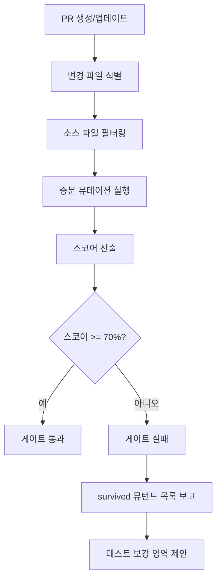

# Mutation Testing - Test Suite Effectiveness Verification

뮤테이션 테스팅을 통해 테스트 스위트의 결함 탐지 능력을 정량적으로 측정하고 품질 게이트를 적용하는 스킬.

## Overview

뮤테이션 테스팅은 소스 코드에 의도적인 결함(뮤턴트)을 삽입한 후 기존 테스트 스위트가 이를 탐지(killed)하는지 확인하여 테스트의 효과성을 검증하는 메타-테스팅 기법이다.

### 핵심 개념

| 용어 | 정의 |
|------|------|
| **뮤턴트 (Mutant)** | 소스 코드에 의도적으로 삽입된 작은 변경. 예: `>` -> `>=`, `+` -> `-`, `true` -> `false` |
| **Killed** | 테스트가 뮤턴트를 탐지하여 실패한 경우. 테스트가 해당 로직을 효과적으로 검증하고 있음을 의미 |
| **Survived** | 테스트가 뮤턴트를 탐지하지 못하고 통과한 경우. 테스트 스위트에 갭이 존재함을 의미 |
| **Timeout** | 뮤턴트로 인해 무한 루프 등이 발생하여 시간 초과된 경우. 일반적으로 killed로 분류 |
| **No Coverage** | 해당 코드 영역을 커버하는 테스트가 없는 경우. 테스트 커버리지 갭 |
| **뮤테이션 스코어** | `killed / (killed + survived) * 100%`. 테스트 스위트의 결함 탐지 능력 지표 |

### 뮤테이션 연산자 예시

| 카테고리 | 원본 | 뮤턴트 | 설명 |
|----------|------|--------|------|
| 산술 연산 | `a + b` | `a - b` | 산술 연산자 교체 |
| 관계 연산 | `x > 0` | `x >= 0` | 경계 조건 변경 |
| 논리 연산 | `a && b` | `a \|\| b` | 논리 연산자 교체 |
| 리터럴 | `return true` | `return false` | 불리언 반전 |
| 제거 | `if (condition) { ... }` | `// removed` | 조건문 제거 |
| 반환값 | `return value` | `return 0` | 반환값 변경 |

## 지원 도구

| 언어 | 도구 | 설치 | 핵심 기능 |
|------|------|------|----------|
| **JS/TS** | **Stryker** | `npm i -D @stryker-mutator/core` | 프레임워크 불문, HTML 보고서, 증분 분석, 뮤턴트 수준 세밀 설정 |
| **Python** | **mutmut** | `pip install mutmut` | pytest 통합, 캐시 기반 증분 실행, JUnit XML 보고서 |
| **Rust** | **cargo-mutants** | `cargo install cargo-mutants` | cargo test 기반, GitHub Actions 주석 자동 생성, 병렬 실행 |

### 도구 자동 감지

```
프로젝트 루트에서 다음 순서로 감지:
1. package.json 존재 -> Stryker (JS/TS)
2. pyproject.toml 또는 setup.py 존재 -> mutmut (Python)
3. Cargo.toml 존재 -> cargo-mutants (Rust)
4. 복수 감지 시 모두 실행하고 결과 통합
```

## Workflow

### 1. 변경 파일 식별

PR 또는 커밋에서 변경된 소스 파일을 식별한다. 테스트 파일, 설정 파일, 문서 파일은 제외한다.

```bash
# 변경된 소스 파일 목록 추출 (예시)
git diff --name-only HEAD~1 -- '*.ts' '*.js' '*.py' '*.rs' | grep -v '__tests__\|test_\|\.test\.\|\.spec\.'
```

### 2. 증분 뮤테이션 실행

전체 코드베이스가 아닌 변경된 파일만 대상으로 뮤테이션 테스팅을 실행하여 실행 시간을 최소화한다.

**JS/TS (Stryker):**
```bash
# 변경 파일만 대상으로 증분 실행
npx stryker run --mutate "src/changed-file.ts" --incremental 2>&1
```

**Python (mutmut):**
```bash
# 특정 파일 대상 뮤테이션 실행
mutmut run --paths-to-mutate src/changed_file.py 2>&1
mutmut results 2>&1
```

**Rust (cargo-mutants):**
```bash
# 특정 파일 대상 뮤테이션 실행
cargo mutants --file src/changed_file.rs 2>&1
```

### 3. 스코어 산출

뮤테이션 테스팅 결과에서 스코어를 계산한다.

```
뮤테이션 스코어 = killed / (killed + survived) * 100%

- timeout은 killed에 포함
- no_coverage는 분모에서 제외하지 않음 (survived로 분류)
- 전체 스코어와 파일별 스코어를 모두 산출
```

### 4. 품질 게이트 검증

산출된 스코어를 임계값과 비교하여 품질 게이트를 적용한다.

| 게이트 | 임계값 | 적용 대상 | 실패 시 조치 |
|--------|--------|----------|-------------|
| **기본 게이트** | 70% | 전체 뮤테이션 스코어 | 경고 출력 |
| **PR 게이트** | 70% | 변경 파일 뮤테이션 스코어 | PR 차단 권고 |
| **엄격 게이트** | 80% | 핵심 비즈니스 로직 | PR 차단 필수 |

## 증분 실행 전략

전체 뮤테이션 테스팅은 실행 시간이 길기 때문에 실용적인 증분 전략을 적용한다.

### PR 단위 증분 실행

1. **변경 파일만 대상**: `git diff`로 변경된 소스 파일만 뮤테이션 대상으로 지정
2. **관련 테스트만 실행**: 뮤턴트별로 관련 테스트만 실행하여 시간 단축
3. **캐시 활용**: 이전 실행 결과를 캐시하여 변경되지 않은 뮤턴트 재실행 방지 (Stryker incremental 모드)

### PR 게이트 통합



**활용 사례**: PR에서 뮤테이션 테스팅을 실행하고 스코어가 70% 이하로 떨어지면 실패 처리함으로써 배포 전 25% 더 많은 논리 버그를 포착할 수 있다 (출처: johal.in 2026 사례 연구).

## 임계값 설정

| 프로젝트 유형 | 기본 임계값 | 엄격 임계값 | 근거 |
|-------------|-----------|-----------|------|
| 일반 어플리케이션 | 70% | 80% | 업계 실무 기준 |
| 핵심 비즈니스 로직 | 80% | 90% | 높은 결함 비용 |
| 유틸리티/라이브러리 | 80% | 90% | 넓은 영향 범위 |
| 프로토타입/PoC | 50% | 70% | 빠른 반복 우선 |

### 임계값 조정 기준

- **점진적 향상**: 기존 코드베이스에 처음 도입 시 50%에서 시작하여 분기별 5-10%씩 상향
- **래칫(Ratchet) 전략**: 현재 달성된 최고 스코어를 새 임계값으로 설정하여 퇴행 방지
- **파일별 차등 적용**: 핵심 모듈은 엄격, 보조 모듈은 기본 임계값 적용

## 보고 형식

```yaml
mutation_testing:
  verdict: PASS | WARN | FAIL
  tool: stryker | mutmut | cargo-mutants
  scope: incremental | full
  summary:
    total_mutants: 150
    killed: 112
    survived: 28
    timeout: 8
    no_coverage: 2
    score: 80.0%
  threshold:
    configured: 70%
    result: PASS
  files:
    - file: "src/auth/login.ts"
      mutants: 42
      killed: 38
      survived: 4
      score: 90.5%
    - file: "src/utils/parser.ts"
      mutants: 18
      killed: 10
      survived: 8
      score: 55.6%
      note: "테스트 보강 필요 - 경계값 검증 부족"
  survived_details:
    - file: "src/utils/parser.ts:23"
      original: "return value > 0"
      mutant: "return value >= 0"
      suggestion: "경계값 0에 대한 테스트 케이스 추가"
    - file: "src/utils/parser.ts:45"
      original: "count + 1"
      mutant: "count - 1"
      suggestion: "증감 연산 결과를 검증하는 assertion 추가"
```

## Survived 뮤턴트 분석 가이드

테스트 보강이 필요한 survived 뮤턴트를 분석하고 개선 방향을 제시한다.

| Survived 패턴 | 원인 | 개선 방향 |
|-------------|------|----------|
| 경계값 뮤턴트 (`>` -> `>=`) | 경계 조건 테스트 부재 | BVA(경계값 분석) 기반 테스트 추가 |
| 산술 연산 뮤턴트 (`+` -> `-`) | 연산 결과 미검증 | 구체적 기대값 assertion 추가 |
| 논리 연산 뮤턴트 (`&&` -> `\|\|`) | 조건 조합 미검증 | 결정 테이블 기반 테스트 추가 |
| 반환값 뮤턴트 | 반환값 미검증 | 각 경로별 반환값 assertion 추가 |
| 제거 뮤턴트 | 코드 블록 효과 미검증 | 부작용(side effect) 검증 테스트 추가 |

## code-quality-checker와의 역할 분리

| 영역 | code-quality-checker | testing-mutation |
|------|---------------------|------------------------|
| 범위 | 린트, 타입체크, 기본 보안 패턴 | 뮤테이션 테스팅 실행 및 스코어 검증 |
| 깊이 | 코드 스타일 및 패턴 검사 | 테스트 스위트 결함 탐지 능력 측정 |
| 도구 | ESLint, TypeScript, Ruff 등 | Stryker, mutmut, cargo-mutants |
| 목적 | 코드 품질 확보 | 테스트 품질 확보 |

**상호 보완**: code-quality-checker가 코드 자체의 품질을 검사하고, testing-mutation이 해당 코드를 검증하는 테스트의 품질을 검사한다. 두 스킬이 동시 로드되면 코드 품질과 테스트 품질을 동시에 보장한다.

## Critical Rules

1. **증분 실행 우선**: 전체 뮤테이션 실행은 지양하고 변경 파일 대상 증분 실행을 기본으로 한다
2. **임계값 준수**: 설정된 임계값 미달 시 명확한 경고 또는 차단을 보고한다
3. **survived 분석 필수**: survived 뮤턴트에 대해 파일:라인 참조와 테스트 보강 제안을 제공한다
4. **도구 자동 감지**: 프로젝트 설정 파일을 기반으로 적합한 도구를 자동 선택한다
5. **시간 제한 설정**: 뮤테이션 실행 시간이 과도하면 timeout으로 처리하고 보고한다
6. **PR 게이트 연동**: 스코어 결과를 PR 프로세스에 통합 가능한 형식으로 보고한다
