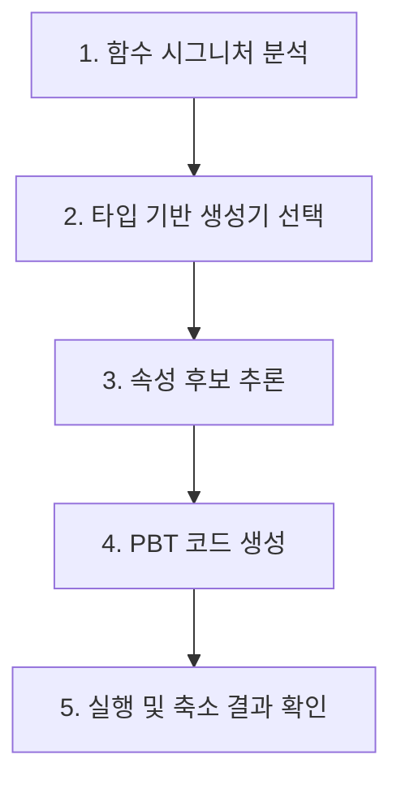

# Property-Based Testing

함수 시그니처와 타입 정보를 분석하여 속성(property)을 추론하고, PBT 코드를 자동 생성하는 스킬.

## Overview

Property-Based Testing(PBT)은 구체적인 입력 예제 대신 **모든 입력에 대해 성립해야 하는 속성**을 정의하고, 프레임워크가 수백~수천 개의 무작위 입력을 자동 생성하여 속성 위반을 탐색하는 테스트 기법이다.

### PBT 핵심 개념

| 개념 | 설명 |
|------|------|
| **속성(Property)** | "모든 (x, y, ...) 에 대해 precondition(x,y,...) 이 성립하면 predicate(x,y,...) 는 참이다" |
| **생성기(Generator)** | 테스트 입력을 자동 생성. 기본 타입부터 복합 구조까지 조합 가능 |
| **축소(Shrinking)** | 실패 발견 시 최소 실패 입력을 자동 탐색하여 디버깅 용이성 향상 |
| **상태 기반 테스팅** | 액션 시퀀스를 자동 생성하여 상태 머신의 속성을 검증 |

### PBT vs 예제 기반 테스트

OOPSLA 2025 실증 연구에 따르면, PBT는 예제 기반 테스트 대비 엣지케이스 발견율이 유의미하게 높다. 95% 라인 커버리지가 놓친 유니코드 처리 버그를 Hypothesis가 발견한 사례가 대표적이다. 예제 기반 테스트가 "이 입력에서 이 출력이 나와야 한다"를 검증하는 반면, PBT는 "어떤 입력이든 이 속성이 성립해야 한다"를 검증하므로 개발자가 예상하지 못한 입력 조합을 탐색할 수 있다.

## 지원 도구

| 언어 | 도구 | 핵심 기능 | 설치 |
|------|------|----------|------|
| Python | **Hypothesis** (6.x) | 풍부한 전략(strategy), 상태 기반 테스팅, Bundle, DB 기반 예제 저장 | `pip install hypothesis` |
| JS/TS | **fast-check** | 테스트 러너 불문(Jest/Vitest/Mocha), 강력한 축소, 비동기 속성 지원 | `npm install fast-check` |
| Haskell | **QuickCheck** | PBT 원조, Arbitrary 타입클래스, Shrinking 개념 대중화 | `cabal install QuickCheck` |

### 도구 자동 감지

```
프로젝트 루트 탐색:
  requirements.txt / pyproject.toml / setup.py -> Hypothesis (Python)
  package.json / tsconfig.json               -> fast-check (JS/TS)
  *.cabal / stack.yaml                       -> QuickCheck (Haskell)
```

## 속성 추론 워크플로우



### 1. 함수 시그니처 분석

대상 함수의 입력 타입, 반환 타입, 사전 조건(precondition)을 추출한다.

```
분석 대상:
  - 함수 파라미터 타입 (int, str, list, dict, 커스텀 클래스 등)
  - 반환 타입 (Optional, Union, 제네릭 등)
  - 타입 힌트 / TypeScript 인터페이스
  - 문서화된 제약 조건 (docstring, JSDoc)
  - 기존 예제 기반 테스트에서의 입력 패턴
```

### 2. 타입 기반 생성기 선택

| 타입 | Hypothesis 전략 | fast-check Arbitrary |
|------|----------------|---------------------|
| int | `st.integers()` | `fc.integer()` |
| float | `st.floats()` | `fc.float()` |
| str | `st.text()` | `fc.string()` |
| bool | `st.booleans()` | `fc.boolean()` |
| list[T] | `st.lists(st.T())` | `fc.array(fc.T())` |
| dict[K,V] | `st.dictionaries(st.K(), st.V())` | `fc.dictionary(fc.K(), fc.V())` |
| Optional[T] | `st.none() \| st.T()` | `fc.option(fc.T())` |
| 커스텀 타입 | `st.builds(MyClass, ...)` | `fc.record({...})` |
| 날짜/시간 | `st.datetimes()` | `fc.date()` |
| 이메일 | `st.emails()` | `fc.emailAddress()` |

### 3. 속성 후보 추론

함수 시그니처와 이름에서 적용 가능한 속성 패턴을 추론한다. 아래 속성 패턴 라이브러리에서 후보를 선정한다.

### 4. PBT 코드 생성

추론된 속성과 생성기를 결합하여 테스트 코드를 생성한다.

**Python (Hypothesis) 예시:**

```python
from hypothesis import given, strategies as st

@given(st.lists(st.integers()))
def test_sort_idempotent(xs):
    """정렬은 멱등적이다: sort(sort(xs)) == sort(xs)"""
    assert sorted(sorted(xs)) == sorted(xs)

@given(st.lists(st.integers()))
def test_sort_preserves_length(xs):
    """정렬은 길이를 보존한다"""
    assert len(sorted(xs)) == len(xs)

@given(st.lists(st.integers()))
def test_sort_preserves_elements(xs):
    """정렬은 원소를 보존한다"""
    assert sorted(sorted(xs)) == sorted(xs)
    assert set(sorted(xs)) == set(xs)
```

**JS/TS (fast-check) 예시:**

```typescript
import fc from 'fast-check';

test('sort is idempotent', () => {
  fc.assert(
    fc.property(fc.array(fc.integer()), (xs) => {
      const once = [...xs].sort((a, b) => a - b);
      const twice = [...once].sort((a, b) => a - b);
      expect(once).toEqual(twice);
    })
  );
});
```

### 5. 실행 및 축소 결과 확인

```bash
# Python
pytest --hypothesis-show-statistics tests/

# JS/TS
npx jest --verbose tests/property/
npx vitest run tests/property/
```

실패 발견 시 프레임워크가 자동으로 최소 실패 입력을 축소(shrink)하여 보고한다.

## 속성 패턴 라이브러리

### 역함수 속성 (Round-trip)

encode/decode, serialize/deserialize 쌍에 적용한다.

```
속성: decode(encode(x)) == x
적용 대상: JSON 파싱, 인코딩, 직렬화, 암호화/복호화, 압축/해제
탐지 키워드: encode/decode, serialize/deserialize, parse/stringify, compress/decompress, encrypt/decrypt
```

### 멱등성 (Idempotency)

동일 연산을 여러 번 적용해도 결과가 동일한 속성.

```
속성: f(f(x)) == f(x)
적용 대상: 정렬, 정규화, 포맷팅, 캐시 갱신, 데이터 정제
탐지 키워드: sort, normalize, format, clean, sanitize, deduplicate, trim
```

### 불변식 (Invariant)

연산 전후로 특정 속성이 보존되는 것.

```
속성: invariant(f(x)) == invariant(x)
적용 대상: 컬렉션 크기 보존, 합계 보존, 타입 보존
탐지 키워드: 컬렉션 연산(map, filter, sort), 금융 계산, 변환 함수
```

### 동치 오라클 (Test Oracle)

동일한 결과를 산출하는 참조 구현과 비교한다.

```
속성: optimized_f(x) == reference_f(x)
적용 대상: 성능 최적화 함수, 알고리즘 리팩토링, 캐시 적용 함수
탐지 키워드: optimize, refactor, cache, 새 버전 vs 구 버전
```

### 모델 기반 (Model-based / Stateful)

상태 머신의 일련의 연산이 모델과 동일한 상태 전이를 하는지 검증한다.

```
속성: model.apply(ops) == system.apply(ops) (모든 연산 시퀀스에 대해)
적용 대상: 데이터 구조(스택, 큐, 맵), 상태 머신, CRUD API
탐지 키워드: state, push/pop, enqueue/dequeue, insert/delete, CRUD, 트랜잭션
```

### 대칭성 / 교환법칙

연산 순서나 인자 순서에 무관한 속성.

```
속성: f(a, b) == f(b, a)  또는  compose(f, g)(x) == compose(g, f)(x)
적용 대상: 수학 연산, 집합 연산(합집합, 교집합), 병합 함수
탐지 키워드: merge, union, intersect, add, multiply, combine
```

## 기존 테스트 스위트에 PBT 추가 절차

기존 예제 기반 테스트에 PBT를 점진적으로 추가하는 권장 절차.

### 1단계: 대상 함수 식별

```
우선순위 기준:
  1. 순수 함수 (부작용 없음) - PBT 적용 최적
  2. 인코딩/디코딩 쌍 - 역함수 속성 즉시 적용
  3. 정렬/변환 함수 - 멱등성/불변식 적용
  4. 높은 순환 복잡도 함수 - 엣지케이스 발견 가능성 높음
  5. 버그 이력이 있는 함수 - 회귀 방지 효과 극대화
```

### 2단계: 속성 추론 및 코드 생성

위 속성 추론 워크플로우(1~4단계) 수행.

### 3단계: 기존 테스트와 공존 설정

```
디렉토리 구조:
  tests/
    unit/          # 기존 예제 기반 테스트
    property/      # PBT 테스트 (신규)
    conftest.py    # 공유 fixtures
```

### 4단계: CI 통합

```bash
# pytest (Hypothesis)
pytest tests/property/ --hypothesis-seed=0 -x

# Jest/Vitest (fast-check)
npx jest tests/property/ --ci
```

Hypothesis의 `@settings(max_examples=200)` 또는 fast-check의 `{ numRuns: 200 }` 파라미터로 CI에서의 실행 시간을 제어한다.

### 5단계: 실패 사례 고정

PBT에서 발견한 실패 입력을 예제 기반 테스트로 고정하여 회귀 방지.

```python
# Hypothesis: @example 데코레이터로 고정
@given(st.text())
@example("")        # PBT가 발견한 엣지케이스
@example("\x00")    # PBT가 발견한 엣지케이스
def test_process_text(s):
    assert process_text(s) is not None
```

## Workflow

### 1. 프로젝트 언어/도구 감지

프로젝트 루트의 설정 파일로 언어와 PBT 도구를 결정한다.

### 2. 대상 함수 식별

변경된 파일 또는 지정된 모듈에서 PBT 적용 대상 함수를 식별한다.

### 3. 속성 추론 및 생성기 선택

함수 시그니처, 타입 힌트, 기존 테스트를 분석하여 적용 가능한 속성 패턴과 생성기를 결정한다.

### 4. PBT 코드 생성

속성 패턴 라이브러리와 생성기를 결합하여 테스트 코드를 생성한다.

### 5. 실행 및 검증

생성된 PBT를 실행하여 속성 위반 여부를 확인한다.

### 6. 보고

```yaml
pbt_scan:
  verdict: PASS | ISSUES_FOUND
  target_functions: 5
  properties_generated: 12
  properties_passed: 11
  properties_failed: 1
  failures:
    - function: "encode_data"
      property: "round_trip"
      counterexample: "input='\\x00\\xff'"
      shrunk_to: "input='\\x00'"
  coverage_delta: "+3.2%"
  tools_used: "hypothesis 6.151.6"
```

## Critical Rules

1. **순수 함수 우선**: 부작용이 있는 함수보다 순수 함수를 PBT 대상으로 우선 선정
2. **생성기 정확성**: 타입 힌트가 없는 경우 기존 테스트의 입력 패턴에서 타입을 추론
3. **실행 시간 제어**: CI 환경에서 `max_examples`/`numRuns`을 적절히 설정하여 타임아웃 방지
4. **실패 고정 필수**: PBT에서 발견한 버그는 반드시 예제 기반 테스트로 고정
5. **점진적 도입**: 전체 테스트 스위트를 한번에 PBT로 전환하지 않고, 우선순위 기반으로 점진적 추가
6. **속성 검증**: 생성된 속성이 실제 비즈니스 로직의 올바른 사양을 반영하는지 확인
7. **축소 결과 활용**: 실패 시 축소된 최소 반례를 버그 리포트에 포함
