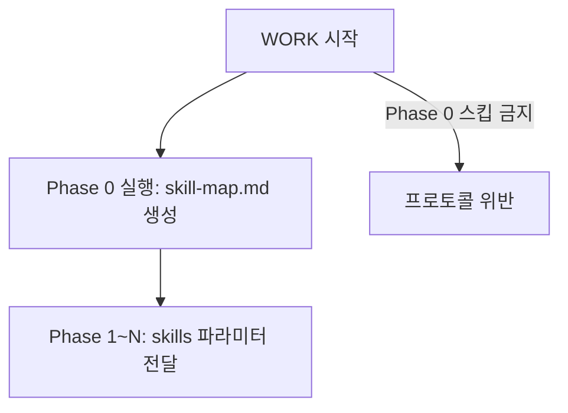

# WORK (worker/explorer Agent)

> **Agent-Skill Binding**
> - Agent: `worker` (model: inherit, maxTurns: 50)
> - Skill: `workflow-agent-work` (항상 바인딩) + command skills (동적 바인딩, command-skill-map.md 참조)
> - Task prompt (full): `command: <command>, workId: <workId>, taskId: <WXX>, planPath: <planPath>, workDir: <workDir>`

> **State Update** before WORK start:
> ```bash
> # full mode (default): transition from PLAN
> python3 .claude/scripts/state/update_state.py both <registryKey> worker PLAN WORK
>
> # noplan mode: transition from INIT (PLAN 스킵)
> python3 .claude/scripts/state/update_state.py both <registryKey> worker INIT WORK
>
> # noreport mode: transition from PLAN (full과 동일, WORK 완료 후 REPORT 스킵)
> python3 .claude/scripts/state/update_state.py both <registryKey> worker PLAN WORK
>
> # noplan+noreport mode: transition from INIT (noplan과 동일, WORK 완료 후 REPORT 스킵)
> python3 .claude/scripts/state/update_state.py both <registryKey> worker INIT WORK
> ```
> Note: strategy 모드에서는 WORK Phase가 없으므로 해당 없음 (INIT -> STRATEGY로 직행).
> Note: noreport/noplan+noreport 모드에서는 WORK 완료 후 REPORT를 스킵하고 바로 DONE으로 진행한다. 오케스트레이터는 WORK step-end 후 reporter를 호출하지 않고 `python3 .claude/scripts/state/update_state.py both <registryKey> done WORK COMPLETED` → DONE step-start → done agent call → DONE step-end 순서로 진행.

> **WORK Phase Rules (REQUIRED)**
>
> | Category | Rule |
> |----------|------|
> | **Allowed calls** | worker, explorer, reporter 에이전트만 호출 가능 |
> | **Re-call MUST NOT** | planner, init 에이전트 재호출 MUST NOT |
> | **Reverse transition MUST NOT** | WORK->PLAN, WORK->INIT 등 역방향 phase 변경 MUST NOT |
> | **Autonomous judgment MUST NOT** | 오케스트레이터가 독자적으로 맥락 보강, 계획 수정, 태스크 추가/삭제/변경을 판단하지 않음 |
> | **Plan tasks only** | 계획서에 명시된 태스크만 순서대로 실행. 계획서에 없는 작업은 수행하지 않음 |

**Detailed Guide:** workflow-agent-work skill 참조

> **Worker Internal Procedure (5 steps):** 각 worker는 호출 후 내부적으로 `계획서 확인 -> 선행 결과 읽기(종속 시) -> 스킬 로드 -> 작업 진행 -> 실행 내역 작성`의 5단계를 수행합니다. 종속 태스크에서는 선행 작업 내역 파일을 필수로 읽어 판단 근거와 What Didn't Work을 확인합니다.

## Explorer Call Pattern

> **Explorer Agent-Skill Binding**
> - Agent: `explorer` (model: sonnet, maxTurns: 30)
> - Skill: `workflow-agent-explore` (항상 바인딩)
> - Task prompt: `command: <command>, workId: <workId>, taskId: <WXX>, planPath: <planPath>, workDir: <workDir>`

Explorer는 WORK Phase에서 Worker와 동일 레벨로 호출되는 탐색 전용 서브에이전트입니다. Planner가 계획서에서 서브에이전트 타입을 `Explorer`로 지정한 태스크에 대해 호출합니다.

**Explorer 호출 형식:**
```
Task(subagent_type="explorer", prompt="command: <command>, workId: <workId>, taskId: <WXX>, planPath: <planPath>, workDir: <workDir>")
```

**usage-pending 등록:**
```bash
# Worker와 동일한 방식으로 usage-pending 등록
python3 .claude/scripts/state/update_state.py task-status <registryKey> <taskId> running
python3 .claude/scripts/state/update_state.py usage-pending <registryKey> <taskId> <taskId>
```

**반환값 처리:**
- Worker와 동일한 3줄 추출 규칙 적용 (첫 3줄만 추출, 4줄째부터 MUST discard)
- 반환 형식: `상태: 성공|부분성공|실패`, `작업 내역: <path>`, `탐색 파일: N개`

**Worker와의 차이점:**

| 항목 | Worker | Explorer |
|------|--------|----------|
| 서브에이전트 타입 | `worker` | `explorer` |
| 스킬 | workflow-agent-work + command skills | workflow-agent-explore |
| 역할 | 코드 수정/생성, 테스트 실행 | 코드 탐색, 웹 조사, 정보 수집 |
| Edit 도구 | 보유 | 미보유 (코드 수정 불가) |
| 모델 | inherit (Opus) | sonnet (비용-품질 균형) |
| 반환 3줄째 | `변경 파일: N개` | `탐색 파일: N개` |

**병렬 호출 예시 (Worker + Explorer 혼합):**
```bash
# Phase 1에서 Worker와 Explorer가 병렬 실행
step-start <registryKey> WORK-PHASE 1 "W01,W02,W03" parallel

python3 .claude/scripts/state/update_state.py task-status <registryKey> W01 running
python3 .claude/scripts/state/update_state.py task-status <registryKey> W02 running
python3 .claude/scripts/state/update_state.py task-status <registryKey> W03 running
python3 .claude/scripts/state/update_state.py usage-pending <registryKey> W01 W01
python3 .claude/scripts/state/update_state.py usage-pending <registryKey> W02 W02
python3 .claude/scripts/state/update_state.py usage-pending <registryKey> W03 W03
```
```
Task(subagent_type="worker", prompt="command: implement, workId: <workId>, taskId: W01, planPath: <planPath>, workDir: <workDir>")
Task(subagent_type="explorer", prompt="command: implement, workId: <workId>, taskId: W02, planPath: <planPath>, workDir: <workDir>")
Task(subagent_type="worker", prompt="command: implement, workId: <workId>, taskId: W03, planPath: <planPath>, workDir: <workDir>")
```

---

## Plan Reading for Task Dispatch (REQUIRED)

<!-- plan.md 직접 Read가 불가피한 이유: 서브에이전트 간 직접 통신 불가(플랫폼 제약)로 오케스트레이터만이 디스패치 순서를 제어할 수 있으며, INIT/planner 반환값 줄 수 제한(8줄/3줄)으로 전체 태스크 구조를 전달할 수 없음 -->

WORK 단계 진입 후, 오케스트레이터는 `<workDir>/plan.md`를 **1회만** 읽어 아래 **최소 5개 필드만** 추출합니다:

| 필수 추출 필드 | 설명 |
|---------------|------|
| `taskId` | 태스크 ID (W01, W02, ...) |
| `phase` | Phase 할당 (Phase 0, Phase 1, Phase 2, ...) |
| `dependencies` | 종속성 (dependency chain) |
| `parallelism` | 병렬/순차 여부 (parallel/sequential) |
| `agentType` | 서브에이전트 타입 (Worker/Explorer) |

> **위 5개 필드 외 계획서 내용(작업 설명, 복잡도, 대상 파일 등)은 Worker가 직접 참조합니다. 오케스트레이터 컨텍스트에 보관하지 않습니다.**

이 시점에 `planPath` 변수를 확정하여 후속 Worker/Explorer 호출 시 전달합니다.

> **WARNING: 오케스트레이터는 현재 워크플로우의 `<workDir>/plan.md`만 읽는다. 다른 워크플로우 디렉터리의 파일은 절대 읽지 않는다.** 현재 워크플로우(`<workDir>`) 외부의 `.workflow/` 경로에 있는 파일(다른 워크플로우의 plan.md, report.md, work/*.md 등)을 읽으면 컨텍스트 오염 및 토큰 낭비가 발생합니다.

---

## WORK Phase 역할 구분: Phase 0 vs Phase 1+

WORK Phase는 Phase 0(준비)과 Phase 1+(실행) 두 단계로 구분된다.

- **Phase 0 (준비 단계)**: 계획서에서 명시된 작업을 수행하기 위해 필요한 스킬을 `.claude/skills/` 디렉터리에서 탐색하고 `skill-map.md`로 매핑하는 준비 단계.
- **Phase 1+ (작업 실행 단계)**: `skill-map.md`를 참조하여 계획서의 태스크를 Phase 순서대로 실행하는 단계.

**스킬 미발견 시 폴백:** Phase 0이 스킬을 찾지 못하거나 실패한 경우, Phase 1+는 스킬 없이 작업을 계속 진행한다(Worker 자율 결정).

| Phase | 역할 | 실행 주체 | 산출물 |
|-------|------|----------|--------|
| Phase 0 | 스킬 탐색/매핑 준비 | 1개 Worker (순차) | `skill-map.md` |
| Phase 1+ | 계획서 태스크 실행 | N개 Worker/Explorer (병렬/순차) | `WXX-*.md` 작업 내역, 코드 변경 |

---

## Phase 0 - Preparation (Required, Sequential 1 worker)

> **CRITICAL: Phase 0 스킵 절대 금지.** full 모드 및 noplan 모드에서 Phase 0을 건너뛰고 Phase 1으로 직행하는 것은 워크플로우 프로토콜 위반입니다. Phase 0은 WORK 단계 진입 후 가장 먼저 실행해야 하는 필수 단계이며, 어떤 상황에서도 생략할 수 없습니다.

> **필수 실행**: Phase 0은 모든 full 모드 및 noplan 모드 워크플로우에서 필수로 실행합니다.
> **REQUIRED**: Phase 0 Worker 호출 직전에 반드시 WORK-PHASE 0 배너를 출력해야 합니다.

**Phase 0 실행 흐름:**



**Phase 0 실행 전 자가 검증 (MUST):**
- [ ] WORK 배너 출력 완료했는가?
- [ ] Phase 0 WORK-PHASE 배너를 호출하려 하는가? (Phase 1이 아닌 Phase 0인가?)
- [ ] Phase 0을 스킵하려는 충동이 있는가? → 스킵 금지, 반드시 실행

**Phase 0 실행:**

```bash
# MUST: Phase 0 서브배너 출력 (스킵 금지, taskIds는 반드시 "phase0"으로 전달)
step-start <registryKey> WORK-PHASE 0 "phase0" sequential
```
```bash
# MUST: Phase 0 배너 직후, Task 호출 전에 반드시 아래 3개 명령을 단일 Bash로 실행
mkdir -p <workDir>/work && python3 .claude/scripts/state/update_state.py task-status <registryKey> phase0 running && python3 .claude/scripts/state/update_state.py usage-pending <registryKey> phase0 phase0
```
```
# full mode:
Task(subagent_type="worker", prompt="command: <command>, workId: <workId>, taskId: phase0, planPath: <planPath>, workDir: <workDir>, mode: phase0")

# noplan mode (plan.md 없음, userPromptPath 사용):
Task(subagent_type="worker", prompt="command: <command>, workId: <workId>, taskId: phase0, userPromptPath: <workDir>/user_prompt.txt, workDir: <workDir>, mode: phase0")
```

**Phase 0 완료 후 task-status 갱신:**
```bash
# Worker 반환값 수신 후 (성공/실패에 따라)
python3 .claude/scripts/state/update_state.py task-status <registryKey> phase0 completed   # 성공 시
python3 .claude/scripts/state/update_state.py task-status <registryKey> phase0 failed       # 실패 시
```

Phase 0 기능: (1) `<workDir>/work/` 디렉터리 생성, (2) 계획서 태스크와 스킬을 매핑하여 `<workDir>/work/skill-map.md` 생성.

Phase 0 완료 후, 오케스트레이터는 skill-map.md를 직접 Read하지 않습니다. 대신 Worker 호출 시 `skillMapPath: <workDir>/work/skill-map.md` 경로를 파라미터로 전달하고, Phase 1+ Worker가 직접 읽어 스킬을 결정합니다.

**Phase 0 실패 시 폴백:**

Phase 0이 실행되었으나 실패(상태: 실패)를 반환한 경우, 개별 자율 결정으로 자동 폴백합니다:
1. Phase 0 실패를 로그에 기록
2. skill-map.md 없이 Phase 1로 진행
3. 각 Worker가 skills 파라미터 없이 자율 결정으로 작업 수행

> **GATE: Phase 1 진입 전 Phase 0 완료 필수.** Phase 0 Worker가 반환값을 돌려주지 않았다면 Phase 1으로 진행할 수 없습니다. Phase 0을 실행하지 않고 Phase 1 배너를 출력하는 것은 프로토콜 위반입니다.

## Phase 1~N: Task Execution

Phase 1+는 Phase 0에서 생성된 skill-map.md를 참조하여 계획서의 태스크를 실행하는 단계이다.

### Phase 간 결과 공유 원칙

현행 워크플로우는 **파일 시스템 기반 암묵적 공유** 방식을 사용합니다. 각 Worker는 작업 내역을 `<workDir>/work/WXX-*.md`에 기록하고, 후속 Phase의 종속 Worker가 해당 파일을 직접 탐색하여 읽습니다. 오케스트레이터는 선행 작업 내역 경로를 별도로 전달하지 않습니다.

**Phase 2+ Worker의 선행 결과 참조:**
- 종속 태스크를 수행하는 Worker는 `<workDir>/work/` 디렉터리에서 선행 태스크의 작업 내역 파일을 **필수로 읽어야** 합니다
- Worker는 `Glob("<workDir>/work/W01-*.md")` 패턴으로 선행 작업 내역 파일을 자율적으로 탐색합니다
- 선행 작업의 판단 근거, What Didn't Work, 핵심 발견을 확인하여 불필요한 시행착오를 방지합니다
- 종속성이 없는 독립 태스크(Phase 1 등)에서는 이 과정이 불필요합니다

계획서의 Phase 순서대로 실행합니다. 각 Phase의 Worker 호출 **직전**에 Phase 서브배너를 출력합니다:

```bash
# Phase N 서브배너 출력 (Worker 호출 직전, 각 Phase마다 1회)
step-start <registryKey> WORK-PHASE <N> "<taskIds>" <parallel|sequential>
```

**Independent tasks (parallel):**
```bash
# Phase 서브배너 출력
step-start <registryKey> WORK-PHASE 1 "W01,W02" parallel
```
```bash
# MUST: Phase 배너 직후, Task 호출 직전에 반드시 단일 Bash로 일괄 실행 (스킵 금지)
python3 .claude/scripts/state/update_state.py task-status <registryKey> W01 running && python3 .claude/scripts/state/update_state.py task-status <registryKey> W02 running && python3 .claude/scripts/state/update_state.py usage-pending <registryKey> W01 W01 && python3 .claude/scripts/state/update_state.py usage-pending <registryKey> W02 W02
```
```
Task(subagent_type="worker", prompt="command: <command>, workId: <workId>, taskId: W01, planPath: <planPath>, workDir: <workDir>, skills: <스킬명>")
Task(subagent_type="worker", prompt="command: <command>, workId: <workId>, taskId: W02, planPath: <planPath>, workDir: <workDir>")
```

**Dependent tasks (sequential):**
```bash
# Phase 서브배너 출력
step-start <registryKey> WORK-PHASE 2 "W04" sequential
```
```bash
# MUST: Phase 배너 직후, Task 호출 직전에 반드시 단일 Bash로 실행 (스킵 금지)
python3 .claude/scripts/state/update_state.py task-status <registryKey> W04 running && python3 .claude/scripts/state/update_state.py usage-pending <registryKey> W04 W04
```
```
Task(subagent_type="worker", prompt="command: <command>, workId: <workId>, taskId: W04, planPath: <planPath>, workDir: <workDir>")
```

> **skills parameter**: 계획서에 태스크별 스킬이 명시된 경우 전달. Phase 0 skill-map.md는 오케스트레이터가 읽지 않고, Worker에게 `skillMapPath: <workDir>/work/skill-map.md`로 경로만 전달하여 Worker가 직접 참조. 미명시 태스크는 worker가 자동 결정.

## Error Handling

Worker 실패 시 태스크 종속성과 전체 실패율에 따라 처리합니다.

### 독립 태스크 실패

같은 Phase 내 독립(병렬) 태스크가 실패한 경우, 다른 독립 태스크는 계속 진행합니다. 실패한 태스크의 상태만 기록하고 후속 Phase로 이동합니다.

```
# Phase 1 (병렬): W01, W02, W03
results = parallel_execute([W01, W02, W03])
# W02가 실패해도 W01, W03 결과는 유효
failed = [r for r in results if r.status == "실패"]
# 실패 태스크를 기록하고 계속 진행
```

### 종속 태스크 체인 중단

선행 태스크가 실패한 경우, 해당 태스크에 종속된 후속 태스크 체인을 중단합니다. 종속 관계가 없는 다른 체인은 정상 진행합니다.

```
# W01 실패 → W04(W01 종속) 스킵, W05(W02 종속) 정상 진행
if dependency_task.status == "실패":
    log("[WARN] {taskId} 스킵: 선행 태스크 {dependency} 실패")
    skip_task(taskId)
```

### 50% 실패율 기준 워크플로우 중단

전체 태스크 중 50% 이상이 실패하면 워크플로우를 중단하고 사용자에게 확인을 요청합니다.

```
total_tasks = count(all_tasks)
failed_tasks = count(tasks where status == "실패" or status == "스킵")

if failed_tasks / total_tasks >= 0.5:
    AskUserQuestion("전체 {total_tasks}개 태스크 중 {failed_tasks}개가 실패했습니다. 계속 진행하시겠습니까?")
```

| 상황 | 처리 |
|------|------|
| 독립 태스크 실패 | 다른 독립 태스크 계속 진행 |
| 종속 선행 태스크 실패 | 해당 종속 체인 중단, 다른 체인 계속 |
| 실패율 >= 50% | 워크플로우 중단, AskUserQuestion으로 사용자 확인 |
| Worker 반환 상태 "실패" | 최대 3회 재호출. 3회 모두 실패 시 해당 태스크를 실패로 기록하고 종속성 규칙에 따라 처리 |

## Worker/Explorer Return Value Processing (REQUIRED)

> **WARNING: Worker/Explorer 반환값이 3줄을 초과하면 메인 컨텍스트가 폭증하여 시스템 장애가 발생합니다.**

Task(worker/explorer) 호출 후 반환값 처리 규칙:
1. 반환값에서 **첫 3줄만** 추출하여 컨텍스트에 보관 (4줄째부터는 MUST discard)
2. 나머지는 무시 (상세 내용은 .workflow/ 파일에 이미 저장됨)
3. 3줄 형식이 아닌 반환값이라도 첫 3줄만 사용, 초과분은 MUST NOT retain

**Task Status Update (REQUIRED):**

Worker 반환값 수신 후, 반환 상태에 따라 `task-status`를 갱신합니다:

```bash
# 반환값 첫 줄이 "상태: 성공" 또는 "상태: 부분성공"인 경우
python3 .claude/scripts/state/update_state.py task-status <registryKey> <taskId> completed

# 반환값 첫 줄이 "상태: 실패"인 경우
python3 .claude/scripts/state/update_state.py task-status <registryKey> <taskId> failed
```

> **MUST: Worker 반환값 수신 직후, 다음 Phase 배너 호출 전에 반드시 task-status를 갱신합니다. 스킵 금지.** 병렬 Worker의 경우, 모든 Worker 반환 후 단일 Bash로 일괄 갱신합니다.

> **Note:** task-status 갱신은 반환값 처리(3줄 추출) 직후, 다음 Worker 호출 전에 실행합니다. 병렬 Worker의 경우 각 Worker 반환 시점에 개별적으로 갱신합니다.

## Usage Tracking: usage-pending (REQUIRED)

> Worker 토큰 사용량을 taskId 단위로 정확히 추적하기 위해, **모든 Worker Task 호출 직전에** `usage-pending`을 실행해야 합니다.

**목적:** SubagentStop Hook(`usage_sync.py`)이 Worker 종료 시 `_pending_workers` 매핑을 조회하여 토큰을 올바른 taskId에 귀속시킵니다.

**호출 규칙:**

| 상황 | 패턴 | 비고 |
|------|------|------|
| 병렬 Worker (Phase 1) | 각 Worker 호출 직전마다 개별 `usage-pending` | 모든 pending을 일괄 등록 후 병렬 Task 호출 |
| 순차 Worker (Phase 2+) | Worker 호출 직전에 `usage-pending` | 1:1 매핑 |

```bash
# 형식: python3 .claude/scripts/state/update_state.py usage-pending <registryKey> <agent_id_or_taskId> <taskId>
python3 .claude/scripts/state/update_state.py usage-pending <registryKey> W01 W01
```

## Hooks 수정 태스크 실행 패턴

> hooks/scripts 디렉터리(`.claude/hooks/`, `.claude/scripts/`)의 파일을 수정하는 태스크는 `hooks-self-guard.py`에 의해 차단됩니다.
> 오케스트레이터가 `python3 .claude/scripts/state/update_state.py env` 명령으로 `HOOKS_EDIT_ALLOWED=1` 환경변수를 설정한 후 Worker를 호출하고, 완료 후 해제해야 합니다.

**실행 순서:**

```bash
# 1. Worker 호출 전: hooks 수정 허용 환경변수 설정
python3 .claude/scripts/state/update_state.py env <registryKey> set HOOKS_EDIT_ALLOWED 1

# 2. Worker 호출 (hooks 파일 수정 태스크)
python3 .claude/scripts/state/update_state.py task-status <registryKey> W01 running
python3 .claude/scripts/state/update_state.py usage-pending <registryKey> W01 W01
```
```
Task(subagent_type="worker", prompt="command: implement, workId: <workId>, taskId: W01, planPath: <planPath>, workDir: <workDir>")
```
```bash
# 3. Worker 완료 후: task-status 갱신 + 환경변수 해제 (반드시 실행)
python3 .claude/scripts/state/update_state.py task-status <registryKey> W01 completed   # 또는 failed
python3 .claude/scripts/state/update_state.py env <registryKey> unset HOOKS_EDIT_ALLOWED
```

**규칙:**

| 항목 | 설명 |
|------|------|
| 설정 시점 | Worker Task 호출 직전 (usage-pending보다 먼저) |
| 해제 시점 | Worker 반환값 수신 직후 (성공/실패 무관, 반드시 해제) |
| 허용 범위 | `HOOKS_EDIT_ALLOWED` KEY만 사용. 다른 KEY는 `python3 .claude/scripts/state/update_state.py env`의 화이트리스트로 제한 |
| 적용 대상 | 계획서에서 hooks 디렉터리 파일을 수정 대상으로 명시한 태스크만 해당 |
