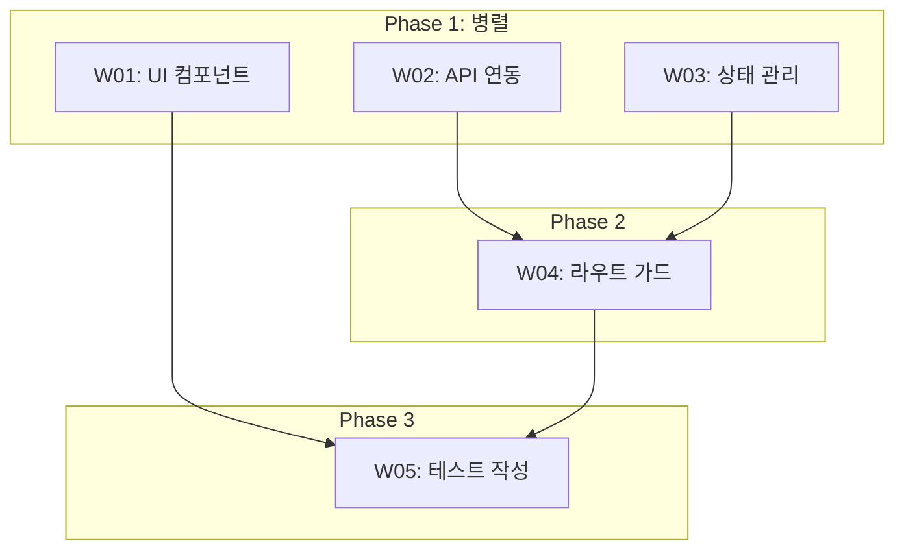
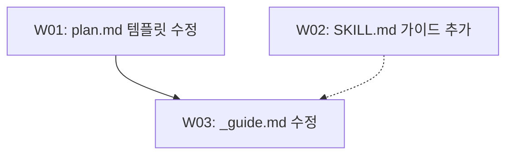

# 작업 흐름도 (Mermaid 다이어그램) 작성 가이드

계획서의 "실행 계획" 섹션 아래에 "작업 흐름도" 섹션을 추가하여 워커 간 실행 순서를 Mermaid 다이어그램으로 시각화합니다.

**기본 규칙:**

| 규칙 | 설명 |
|------|------|
| 방향 | `flowchart TD` (Top-Down) 고정 |
| 노드 라벨 | `W01[W01: 1줄 요약]` 형식 (워커 ID + 설명 포함) |
| 종속 관계 | 실선 화살표 `-->` 사용 |
| 약한 참조 | 점선 화살표 `-.->` 사용 (참고용 의존, 필수 아님) |
| 독립 워커 | 동일 레벨에 배치 (화살표 연결 없음) |
| **방향 표시 필수** | 방향 없는 연결(`---`, `-.-`, `===`) 금지. 반드시 방향 화살표(`-->`, `-.->`, `==>`) 사용 |

**Phase별 서브그래프 사용 기준:**

- Phase가 **3개 이상**일 때만 `subgraph`로 Phase를 감쌈
- Phase가 1-2개일 때는 서브그래프 없이 노드와 화살표만 사용

**서브그래프 예시 (Phase 3개 이상):**

**단순 예시 (Phase 2개 이하):**

**문법 주의사항:**

- 노드 ID에 한글/특수문자 사용 금지 (W01, W02 등 영문+숫자만)
- 라벨 텍스트에는 한글 사용 가능
- 화살표 앞뒤로 공백 포함 (`W01 --> W02`)
- 서브그래프 ID도 영문만 사용 (`subgraph Phase1[Phase 1: 병렬]`)
- **특수문자 이스케이핑:**
  - Mermaid는 `[/ /]`(lean-right), `[\ \]`(lean-left), `( )`, `{ }`, `[ ]`, `> ]` 등을 노드 형상 구문으로 해석한다. 라벨 텍스트에 이 문자들이 포함되면 의도하지 않은 파싱 에러가 발생한다
  - 특히 `/`가 라벨 시작 위치에 올 때 `[/text]`가 lean-right 사다리꼴 형상으로 잘못 파싱됨 (예: `E[/sync:history 커맨드]` -> 에러)
  - **해결 방법 1 - 큰따옴표 래핑:** 라벨을 큰따옴표로 감싸면 내부 특수문자가 형상 구문으로 해석되지 않음. `E["/sync:history 커맨드"]`
  - **해결 방법 2 - HTML 엔티티:** Mermaid가 지원하는 HTML 엔티티로 치환. 슬래시 `#sol;`, 역슬래시 `#bsol;` 등. `E["#sol;sync:history 커맨드"]`
  - **일반 규칙:** 라벨에 `/`, `\`, `(`, `)`, `{`, `}`, `[`, `]`, `>` 중 하나라도 포함되면 큰따옴표로 감싸는 것을 권장 (`["라벨 텍스트"]`)

**렌더링 검증 안내:**

- 다이어그램 작성 후 https://mermaid.live/ 에서 렌더링을 검증할 수 있습니다
- VSCode에서 렌더링되지 않는 경우 Markdown Preview Mermaid Support (`bierner.markdown-mermaid`) 확장 단독 사용을 권장합니다
- 다른 Mermaid 관련 확장이 설치되어 있으면 충돌이 발생할 수 있으므로, `bierner.markdown-mermaid` 외의 Mermaid 확장은 비활성화를 권장합니다
