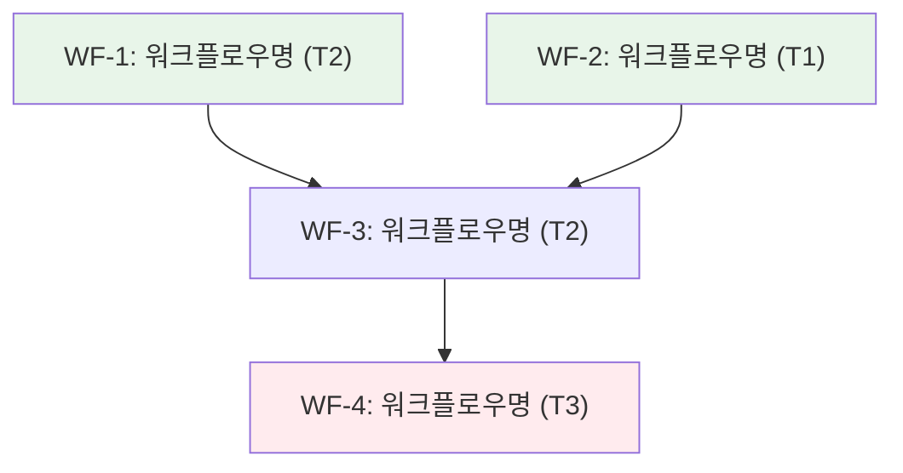
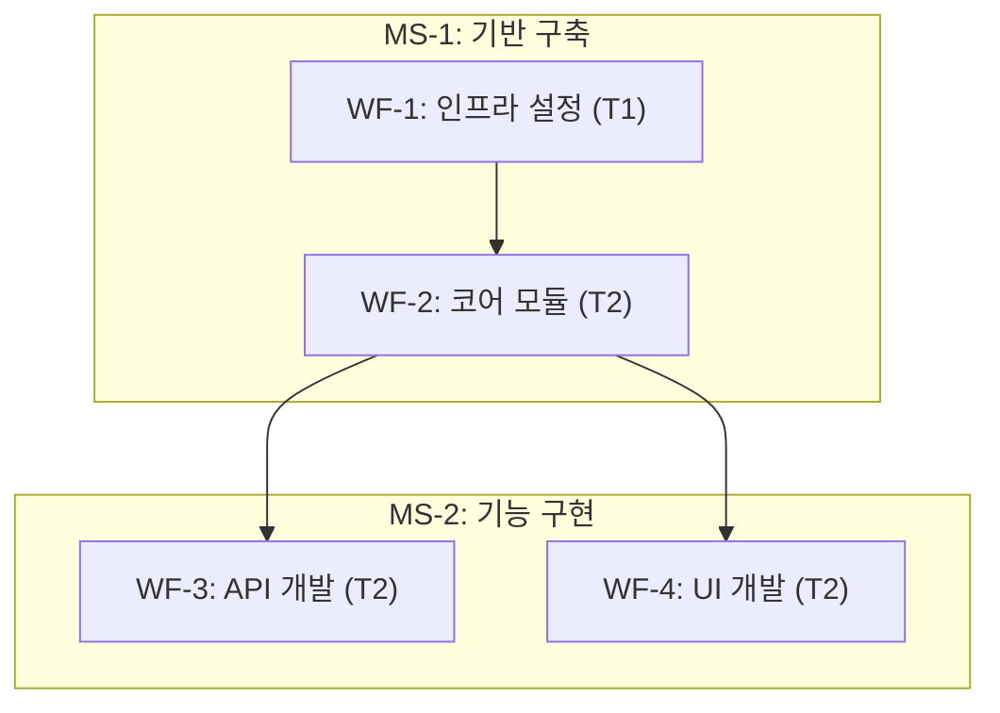

# Strategy

대규모 작업을 다중 워크플로우로 분해하여 실행 가능한 로드맵을 생성하는 전략 수립 스킬.

> 이 스킬은 workflow-agent-orchestration 스킬이 관리하는 워크플로우의 한 단계입니다. 전체 워크플로우 구조는 workflow-agent-orchestration 스킬을 참조하세요.

## 핵심 원칙

1. **현황 기반 판단**: 코드베이스, 워크플로우 이력(`.workflow/`), 기술 스택을 종합적으로 파악
2. **측정 가능한 목표**: 최종 목표(End Goal)와 마일스톤별 완료 기준(Definition of Done)을 정량적으로 정의
3. **종속성 최소화**: 워크플로우 간 병렬 실행을 극대화하고 크리티컬 패스를 최소화
4. **SSOT 준수**: roadmap.md가 계획 정보의 단일 진실 소스, .kanbanboard는 실행 상태 전용

---

## 터미널 출력 원칙

> 내부 분석/사고 과정을 터미널에 출력하지 않는다. 결과만 출력한다.

- **출력 허용**: 반환값 (3줄 규격), 에러 메시지
- **출력 금지**: 분석 과정, 판단 근거 설명, 코드베이스 탐색 과정, 중간 진행 보고, "~를 살펴보겠습니다" 류

---

## 절차

### 기본 모드 (신규 전략 수립)

workDir에 `.kanbanboard` 파일이 **없을 때** 실행한다.

1. **user_prompt.txt 전문 읽기** - `{workDir}/user_prompt.txt`를 Read로 전체 내용 확인
2. **현황 분석** - 코드베이스 구조, 기존 워크플로우 이력(`.workflow/`), 기술 스택, CLAUDE.md Next Steps를 종합적으로 파악
3. **목표 정의** - 최종 목표(End Goal)를 명확화하고, 측정 가능한 마일스톤과 완료 기준(Definition of Done)을 설정
4. **마일스톤 분해** - 목표를 2-5개 마일스톤으로 분해. 각 마일스톤은 독립적으로 가치를 제공해야 함
5. **워크플로우 체인 설계** - 마일스톤별 워크플로우를 식별하고, 워크플로우 간 종속성을 분석하여 실행 순서를 결정
6. **종속성 그래프 생성** - 워크플로우가 4개 이상일 때 Mermaid flowchart로 시각화
7. **roadmap.md 생성** - 로드맵 템플릿에 따라 `{workDir}/roadmap.md`에 Write로 저장
8. **.kanbanboard 생성** - roadmap.md 파싱 후 kanbanboard 템플릿에 따라 `{workDir}/.kanbanboard`에 Write로 저장

### Judge 모드 (재호출 시 진행 상황 평가)

workDir에 `.kanbanboard` 파일이 **있을 때** 실행한다.

1. **기존 산출물 로드** - `{workDir}/roadmap.md`와 `{workDir}/.kanbanboard`를 Read로 로드
2. **워크플로우 이력 확인** - `.workflow/` 디렉터리에서 완료된 워크플로우를 확인하여 마일스톤 진행 상황을 파악
3. **roadmap.md 갱신** - 완료된 마일스톤에 상태/완료일을 추가
4. **.kanbanboard 갱신** - 컬럼 이동 규칙에 따라 마일스톤 카드를 Planned/In Progress/Done 간 이동
5. **프로젝트 완료 판단** - 모든 마일스톤이 Done이면 프로젝트 완료 처리

---

## 복잡도 산정 가이드

워크플로우 단위의 복잡도를 산정하여 일정 예측과 리소스 배분의 근거를 제공한다.

### 태스크 복잡도 점수 공식 (참조)

```
태스크 복잡도 = action_verbs * 2 + connectors * 2 + domain + scope + risk
```

| 요소 | 설명 | 점수 범위 |
|------|------|----------|
| `action_verbs` | 행위 동사 수 (생성, 수정, 삭제, 연동, 분석 등) | 0-5 (x2) |
| `connectors` | 접속사/조건 ("~하고", "~한 후", "~이면", 종속성) | 0-3 (x2) |
| `domain` | 도메인 전문성 필요도 (0: 일반, 1: 중간, 2: 전문) | 0-2 |
| `scope` | 영향 범위 (0: 단일 파일, 1: 모듈, 2: 시스템, 3: 크로스커팅) | 0-3 |
| `risk` | 부작용 위험도 (0: 안전, 1: 주의, 2: 높음) | 0-2 |

### 워크플로우 복잡도 산정

```
워크플로우 복잡도 = sum(태스크 복잡도) + phase_penalty + dependency_penalty
```

| 요소 | 설명 | 점수 |
|------|------|------|
| `sum(태스크 복잡도)` | 워크플로우 내 모든 태스크의 복잡도 점수 합계 | - |
| `phase_penalty` | Phase 수에 따른 조정 (2 Phase: +2, 3 Phase: +5, 4+ Phase: +8) | 0-8 |
| `dependency_penalty` | 크로스 Phase 종속성 수 x 2 | 0-N |

### 워크플로우 티어 분류

| 티어 | 점수 범위 | 분류 | 특성 |
|------|----------|------|------|
| T1 | < 10 | 단순 | 단일 Phase, 1-2개 태스크. 1회 세션에 완료 가능 |
| T2 | 10 - 30 | 중간 | 2-3 Phase, 3-6개 태스크. 종속성 있으나 관리 가능 |
| T3 | > 30 | 복잡 | 3+ Phase, 7개 이상 태스크. 아키텍처 변경 포함, 단계적 실행 필수 |

### 산정 예시

| 워크플로우 | 태스크 합산 | Phase | 종속성 | 최종 복잡도 |
|-----------|-----------|-------|--------|-----------|
| 설정 파일 3개 수정 | T1(2)+T1(2)+T1(3)=7 | 1 Phase (+0) | 0 | T1(7) |
| API 모듈 리팩토링 | T2(8)+T2(10)+T1(4)=22 | 2 Phase (+2) | 1 (+2) | T2(26) |
| 마이크로서비스 분리 | T3(18)+T2(12)+T3(16)+T2(9)=55 | 3 Phase (+5) | 3 (+6) | T3(66) |

---

## 종속성 그래프 생성

워크플로우 간 종속성을 분석하고 Mermaid flowchart로 시각화하는 절차.

### 분석 절차

1. **워크플로우 식별**: 마일스톤별로 필요한 워크플로우를 나열
2. **종속성 유형 분류**:
   - **데이터 종속성**: 선행 워크플로우의 산출물이 후행의 입력이 되는 경우
   - **구조 종속성**: 선행 워크플로우가 생성한 코드/인프라 위에 구축하는 경우
   - **지식 종속성**: 선행 워크플로우의 조사/분석 결과가 후행의 의사결정에 필요한 경우
3. **병렬 그룹 판별**: 종속성이 없는 워크플로우를 병렬 실행 그룹으로 묶기
4. **크리티컬 패스 식별**: 가장 긴 종속 체인을 파악하여 일정의 병목 구간 확인

### Mermaid flowchart 출력 형식



**스타일 규칙:**

| 상태 | 색상 | 의미 |
|------|------|------|
| `fill:#e8f5e9` | 연한 녹색 | 독립 실행 가능 (선행 종속성 없음) |
| `fill:#fff3e0` | 연한 주황색 | 종속성 있음 (선행 완료 대기) |
| `fill:#ffebee` | 연한 빨간색 | 크리티컬 패스 (일정 병목) |
| `fill:#e3f2fd` | 연한 파란색 | 마일스톤 완료 지점 |

**다이어그램 규칙:**

- `flowchart TD` 키워드 사용 (top-down 방향)
- 노드 ID는 영문+숫자만 (예: `WF1`, `WF2`)
- 라벨에는 한글 사용 가능
- 방향 없는 연결(`---`, `-.-`) 금지, 반드시 방향 화살표(`-->`, `-.->`) 사용
- 마일스톤 경계는 subgraph로 표현

### 마일스톤 경계 포함 예시



---

## 로드맵 템플릿

cc:strategy 명령어의 최종 산출물인 `roadmap.md`의 표준 구조.

```markdown
# [프로젝트/목표명] 로드맵

## 목표

- **최종 목표**: [End Goal 기술]
- **배경**: [왜 이 작업이 필요한지]
- **성공 지표**: [정량적 측정 가능한 기준]

## 마일스톤

### MS-1: [마일스톤명]
- **완료 기준**: [Definition of Done]
- **예상 워크플로우**: N개
- **예상 복잡도**: T2(합산 점수)

### MS-2: [마일스톤명]
- **완료 기준**: [Definition of Done]
- **예상 워크플로우**: N개
- **예상 복잡도**: T2(합산 점수)

## 워크플로우 체인

| ID | 워크플로우 | 명령어 | 마일스톤 | 종속성 | 복잡도 | 우선순위 | Linked WF |
|----|-----------|--------|---------|--------|--------|---------|-----------|
| WF-1 | [워크플로우명] | implement | MS-1 | - | T2(N) | P0 | - |
| WF-2 | [워크플로우명] | research | MS-1 | WF-1 | T1(N) | P1 | WF-1 |
| WF-3 | [워크플로우명] | implement | MS-2 | WF-2 | T2(N) | P1 | WF-2 |

## 종속성 그래프

(Mermaid flowchart - 위 "종속성 그래프 생성" 섹션의 형식 준수)

## 리스크 및 완화 전략

| ID | 리스크 | 심각도 | 영향 워크플로우 | 완화 전략 |
|----|--------|--------|---------------|----------|
| R1 | [리스크 설명] | 높음/중간/낮음 | WF-N | [구체적 완화 방안] |

## 일정

| Phase | 워크플로우 | 실행 방식 | 비고 |
|-------|-----------|----------|------|
| Phase 1 | WF-1, WF-2 | 병렬 | 선행 종속성 없음 |
| Phase 2 | WF-3 | 순차 | WF-1, WF-2 완료 후 |
```

### 템플릿 사용 가이드

- **목표 섹션**: 반드시 정량적 성공 지표를 포함 (예: "명령어 수 8개에서 5개로 축소", "테스트 커버리지 80% 이상")
- **마일스톤**: 2-5개 범위. 각 마일스톤은 독립적으로 가치를 제공해야 함
- **워크플로우 체인**: 명령어 컬럼은 implement, research, review, strategy 중 하나. `Linked WF` 컬럼은 해당 워크플로우의 입력이 되는 선행 워크플로우 ID를 명시한다 (종속성과 별개로, 산출물 연결 관계를 표현)
- **종속성 그래프**: 워크플로우가 4개 이상일 때 필수 포함
- **리스크**: 최소 1개 이상 식별. 기술적 리스크와 일정 리스크를 구분
- **일정**: 병렬 실행 가능 워크플로우를 명시하여 총 소요 시간 최적화

---

## .kanbanboard 생성 절차

roadmap.md 생성 직후 동일 디렉터리에 `.kanbanboard` 파일을 자동 생성한다. 템플릿은 `design-strategy/templates/kanbanboard.md`를 사용한다.

### SSOT 원칙

| 파일 | 역할 | 소유 데이터 |
|------|------|------------|
| roadmap.md | 계획 정보의 단일 진실 소스 | 마일스톤 ID/명/DoD, 워크플로우 체인 정의, 종속성, 일정 |
| .kanbanboard | 실행 상태 전용 | 컬럼 배치(Planned/In Progress/Done), 워크플로우 체크 상태, 완료일 |

- roadmap.md의 마일스톤 ID/명/DoD를 **그대로 복제**하여 .kanbanboard 카드에 기록한다
- 워크플로우 체인 테이블의 ID/명/명령어를 **마일스톤별로 그룹핑**하여 각 마일스톤 카드의 워크플로우 목록에 기록한다
- .kanbanboard는 roadmap.md에 없는 마일스톤이나 워크플로우를 독자적으로 추가하지 않는다
- 계획 변경이 필요하면 roadmap.md를 먼저 수정하고, .kanbanboard를 재생성 또는 갱신한다

### 생성 절차

1. **roadmap.md 파싱**: 생성된 roadmap.md에서 다음 데이터를 추출한다
   - H1 제목에서 프로젝트명 추출
   - `## 마일스톤` 섹션에서 각 마일스톤의 ID, 명칭, 완료 기준(DoD) 추출
   - `## 워크플로우 체인` 테이블에서 각 워크플로우의 ID, 명칭, 명령어, 소속 마일스톤 추출

2. **마일스톤별 워크플로우 그룹핑**: 워크플로우 체인 테이블의 `마일스톤` 컬럼을 기준으로 워크플로우를 마일스톤별로 그룹핑한다

3. **마일스톤 카드 생성**: 각 마일스톤에 대해 카드 블록을 생성한다
   ```
   ### {{ms_id}}: {{ms_name}}
   - **ID**: {{ms_id}}
   - **완료 기준 (DoD)**:
     - [ ] {{dod_item_1}}
     - [ ] {{dod_item_2}}
   - **워크플로우**:
     - [ ] {{wf_id}}: {{wf_name}} ({{wf_command}})
   - **상태**: 0/{{wf_total}} 완료
   ```

4. **템플릿 치환**: `design-strategy/templates/kanbanboard.md` 템플릿의 placeholder를 치환한다
   - `{{project}}` -> 추출한 프로젝트명
   - `{{roadmap_path}}` -> roadmap.md의 상대 경로
   - `{{created_date}}`, `{{updated_date}}` -> 현재 날짜 (YYYY-MM-DD)
   - `{{planned_cards}}` -> 생성된 모든 마일스톤 카드 블록 (초기에는 전부 Planned)
   - `{{in_progress_cards}}`, `{{done_cards}}` -> 빈 값 (초기 생성 시)

5. **파일 저장**: 치환 완료된 내용을 roadmap.md와 동일한 디렉터리에 `.kanbanboard` 파일로 저장한다

---

## Judge 모드 상세

strategy 재호출 시(`.kanbanboard` 존재) 실행되는 Judge 모드의 상세 로직.

### roadmap.md 갱신 로직

완료된 마일스톤의 정보를 roadmap.md에 반영한다.

**갱신 절차**:

1. `.kanbanboard`의 Done 컬럼에 위치한 마일스톤 ID를 수집한다
2. roadmap.md의 해당 마일스톤 항목에 다음 필드를 추가/갱신한다:
   - `- **상태**: 완료` (신규 추가)
   - `- **완료일**: YYYY-MM-DD` (신규 추가, .kanbanboard의 완료일 사용)
3. 워크플로우 체인 테이블에서 해당 마일스톤 소속 워크플로우의 상태를 확인할 수 있도록 비고를 추가한다

**예시**:

```markdown
### MS-1: 기반 구축
- **완료 기준**: API 엔드포인트 3개 구현
- **예상 워크플로우**: 2개
- **예상 복잡도**: T2(18)
- **상태**: 완료
- **완료일**: 2026-02-20
```

### .kanbanboard 갱신 로직

Judge 모드 실행 시 `.kanbanboard`의 상태를 최신화한다.

**컬럼 이동 규칙**:

| 현재 컬럼 | 조건 | 이동 대상 |
|----------|------|----------|
| Planned | 해당 마일스톤의 첫 워크플로우가 시작됨 | In Progress |
| In Progress | 해당 마일스톤의 모든 워크플로우 체크박스가 `[x]`이고 모든 DoD 항목이 충족됨 | Done |
| Done | - | 이동 없음 (최종 상태) |

**Done 컬럼 이동 시 추가 작업**:

1. 마일스톤 카드에 `- **완료일**: YYYY-MM-DD` 필드를 추가한다 (현재 날짜)
2. `- **상태**:` 필드를 `N/N 완료`로 갱신한다
3. frontmatter의 `updated` 날짜를 현재 날짜로 갱신한다

### 프로젝트 완료 판단 조건

다음 조건이 **모두** 충족되면 프로젝트를 완료로 판단한다:

1. `.kanbanboard`의 **모든 마일스톤**이 Done 컬럼에 위치한다
2. Planned 컬럼과 In Progress 컬럼이 비어 있다
3. roadmap.md의 모든 마일스톤에 완료 상태가 기록되어 있다

**프로젝트 완료 시 수행 작업**:

1. `.kanbanboard` frontmatter에 `completed: YYYY-MM-DD` 필드를 추가한다
2. 최종 성과 요약을 출력한다:
   - 전체 마일스톤 수 및 완료 마일스톤 수
   - 전체 워크플로우 수 및 완료 워크플로우 수
   - 프로젝트 시작일(`.kanbanboard` created)과 완료일 사이의 소요 기간
3. roadmap.md의 `## 목표` 섹션에 프로젝트 완료 상태를 기록한다:
   - `- **프로젝트 상태**: 완료 (YYYY-MM-DD)`

---

## 산출물 규격

| 산출물 | 경로 | 형식 |
|--------|------|------|
| 로드맵 | `{workDir}/roadmap.md` | 로드맵 템플릿 준수 |
| 칸반보드 | `{workDir}/.kanbanboard` | kanbanboard 템플릿 준수 |

---

## 관련 스킬

| 스킬 | 용도 | 참조 시점 |
|------|------|----------|
| design-strategy | 워커용 커맨드 스킬 (레거시 참조) | kanbanboard 템플릿 경로 참조 |
| management-scope-decomposer | 요청을 에픽/스토리로 분해, RICE 우선순위 판단 | 목표 정의 및 워크플로우 분해 단계에서 활용 |
| workflow-agent-plan | 개별 워크플로우 내부의 태스크 분해 및 Phase 설계 | 워크플로우별 상세 계획 수립 시 참조 |
| design-mermaid-diagrams | Mermaid 다이어그램 생성 | 종속성 그래프 시각화 시 참조 |
