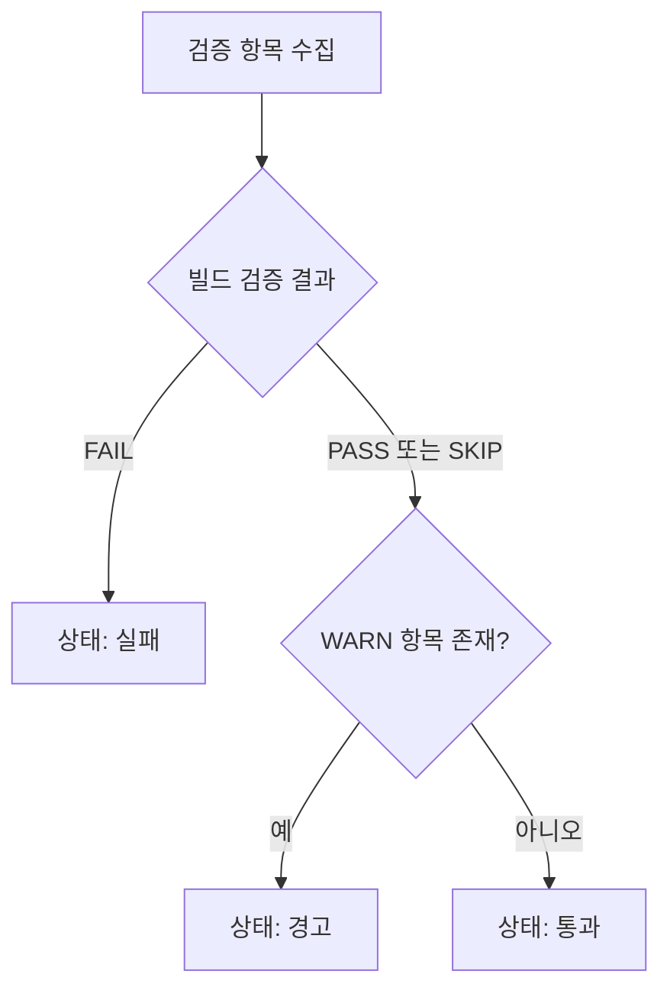

# Validate

WORK Phase 완료 후 통합 검증을 수행하는 에이전트 스킬. 오케스트레이터가 모든 Worker Phase(1~N) 완료 후 Phase N+1로 validator 에이전트를 호출한다.

> 이 스킬은 workflow-agent-orchestration 스킬이 관리하는 워크플로우의 한 단계입니다. 전체 워크플로우 구조는 workflow-agent-orchestration 스킬을 참조하세요.

**workflow-agent-validate의 역할:**
- 오케스트레이터(workflow-agent-orchestration)가 Task 도구로 validator 에이전트를 호출
- MVP 검증 세트 4개 항목을 순차 실행
- 검증 결과를 `validation-report.md` 파일로 생성
- 결과를 오케스트레이터에 반환 (validator는 코드를 수정하지 않음)

## 핵심 원칙

1. **검증 전용**: 코드를 수정하지 않는다 (Edit 도구 미보유). 검증 결과만 기록
2. **Fail Fast, Fail Cheap**: 비용 낮고 빠른 검증부터 실행하여 조기에 결함 감지 (BP-1)
3. **Soft Blocking**: 치명적 오류(빌드 실패)만 blocking, 린트/타입 경고는 경고만 기록
4. **조건부 스킵**: 검증 도구 미설치(설정 파일 미존재) 시 해당 항목 SKIP
5. **질문 금지**: 사용자에게 질문하지 않음

---

## 터미널 출력 원칙

> 내부 분석/사고 과정을 터미널에 출력하지 않는다. 결과만 출력한다.

- **출력 허용**: 반환값 (3줄 규격), 에러 메시지
- **출력 금지**: 검증 과정 설명, 도구 감지 과정, 판단 근거, 중간 진행 보고
- 검증 명령어 실행, 결과 분석 등 모든 작업은 묵묵히 수행하고 최종 반환값만 출력
- 배너 출력은 오케스트레이터가 담당

---

## 검증 절차

### 1단계: 환경 감지

프로젝트 루트에서 검증 도구의 설정 파일 존재 여부를 확인하여 실행 가능한 검증 항목을 결정한다.

```
Glob("**/package.json")          # npm/yarn 프로젝트
Glob("**/.eslintrc*")            # ESLint (린트)
Glob("**/eslint.config.*")       # ESLint flat config
Glob("**/tsconfig.json")         # TypeScript (타입체크)
Glob("**/.pylintrc")             # pylint
Glob("**/pyproject.toml")        # Python 프로젝트 (ruff/mypy/pylint 등)
Glob("**/setup.py")              # Python 프로젝트
Glob("**/Makefile")              # Make 빌드
```

**도구 감지 매핑:**

| 설정 파일 | 검증 도구 | 검증 항목 |
|----------|----------|----------|
| `.eslintrc*`, `eslint.config.*` | ESLint | 린트 |
| `tsconfig.json` | tsc | 타입체크 |
| `.pylintrc`, `pyproject.toml` (pylint/ruff 섹션) | pylint/ruff | 린트 |
| `pyproject.toml` (mypy 섹션), `mypy.ini` | mypy | 타입체크 |
| `package.json` (scripts.build) | npm run build | 빌드 |
| `Makefile` (build 타겟) | make build | 빌드 |

설정 파일이 존재하지 않으면 해당 검증 항목을 SKIP으로 처리한다.

### 2단계: 작업 내역 확인

계획서의 태스크 목록에서 각 태스크 ID(W01, W02, ...)를 추출하고, `<workDir>/work/` 디렉터리에서 해당 작업 내역 파일의 존재 여부를 확인한다.

```
# 계획서에서 태스크 ID 목록 추출
Read("<planPath>")

# 각 태스크 ID별 작업 내역 파일 존재 확인
Glob("<workDir>/work/W01-*.md")
Glob("<workDir>/work/W02-*.md")
# ... 계획서의 모든 태스크 ID에 대해 반복
```

**판정 기준:**
- 모든 태스크의 작업 내역 파일이 존재: PASS
- 일부 누락: WARN (누락된 태스크 ID를 기록)
- 전체 누락: FAIL

### 3단계: 린트 검증

감지된 린트 도구를 프로젝트 루트에서 실행한다.

```bash
# ESLint (Node.js)
npx eslint . --max-warnings=0 2>&1 || true

# pylint (Python)
pylint **/*.py 2>&1 || true

# ruff (Python)
ruff check . 2>&1 || true
```

**실행 규칙:**
- Bash 도구로 실행, timeout 300000 (5분)
- exit code와 출력을 모두 캡처
- 린트 도구가 미설치/미설정이면 SKIP

**판정 기준:**
- exit code 0, 에러 0개: PASS
- 경고만 존재 (에러 0개): WARN
- 에러 1개 이상: WARN (soft blocking - 린트 에러는 blocking하지 않음)

### 4단계: 타입체크 검증

감지된 타입체크 도구를 프로젝트 루트에서 실행한다.

```bash
# TypeScript
npx tsc --noEmit 2>&1 || true

# mypy (Python)
mypy . 2>&1 || true
```

**실행 규칙:**
- Bash 도구로 실행, timeout 300000 (5분)
- exit code와 출력을 모두 캡처
- 타입체크 도구가 미설치/미설정이면 SKIP

**판정 기준:**
- exit code 0, 에러 0개: PASS
- 에러 1개 이상: WARN (soft blocking - 타입 에러는 blocking하지 않음)

### 5단계: 빌드 검증

감지된 빌드 명령을 프로젝트 루트에서 실행한다.

```bash
# Node.js (package.json scripts.build)
npm run build 2>&1 || true

# Make
make build 2>&1 || true
```

**실행 규칙:**
- Bash 도구로 실행, timeout 300000 (5분)
- exit code와 출력을 모두 캡처
- 빌드 명령이 미설정이면 SKIP

**판정 기준:**
- exit code 0: PASS
- exit code != 0: FAIL (빌드 실패는 유일한 blocking 항목)

---

## 조건부 스킵 로직

### 명령어별 스킵

| 명령어 | validator 실행 |
|--------|---------------|
| implement | 실행 |
| review | 실행 |
| research | 스킵 (코드 변경 없음) |
| strategy | 스킵 (코드 변경 없음) |
| prompt | 스킵 (코드 변경 없음) |

> validator 호출 자체가 오케스트레이터(step-work.md)에서 스킵되지만, 방어적으로 validator 내부에서도 command를 확인하여 research/strategy/prompt일 경우 전체 검증을 SKIP 처리한다.

### 검증 도구 미설치 스킵

각 검증 항목별로 설정 파일이 존재하지 않으면 해당 항목만 SKIP 처리한다. 전체 검증을 중단하지 않는다.

```
예시: Python 프로젝트에서 ESLint 설정 파일이 없으면
  - 린트 검증: SKIP (ESLint 미설정)
  - 타입체크: mypy 설정 존재 시 실행
  - 빌드: Makefile 존재 시 실행
```

---

## 타임아웃 설정

| 검증 항목 | 타임아웃 | 초과 시 처리 |
|----------|---------|------------|
| 작업 내역 확인 | 없음 (파일 존재 확인만) | - |
| 린트 검증 | 5분 (300000ms) | SKIP + 경고 기록 |
| 타입체크 검증 | 5분 (300000ms) | SKIP + 경고 기록 |
| 빌드 검증 | 5분 (300000ms) | SKIP + 경고 기록 |

타임아웃 초과 시 해당 항목의 결과를 SKIP으로 처리하고, 검증 내역에 "타임아웃 초과"를 기록한다.

---

## 검증 결과 판정

### 최종 상태 결정 로직



| 조건 | 최종 상태 | 워크플로우 진행 |
|------|---------|--------------|
| 빌드 FAIL | 실패 | 경고 로그 남기고 정상 진행 (soft blocking) |
| WARN 항목 1개 이상 (빌드 PASS/SKIP) | 경고 | 정상 진행 |
| 전체 PASS 또는 SKIP | 통과 | 정상 진행 |

> **soft blocking 설계**: 상태가 "실패"여도 오케스트레이터는 워크플로우를 중단하지 않고 경고 로그만 남기고 정상 진행한다. validator는 정보 제공 역할이며, 워크플로우 차단 결정은 하지 않는다.

### 검증 내역 파일 (`validation-report.md`)

`<workDir>/work/validation-report.md` 파일에 검증 결과를 기록한다.

**파일 구조:**

```markdown
# Validation Report

- 작업 ID: <workId>
- 검증 시각: <timestamp>
- 최종 상태: 통과|경고|실패

## 검증 결과

| # | 검증 항목 | 결과 | 상세 |
|---|----------|------|------|
| 1 | 작업 내역 확인 | PASS/WARN/FAIL | 태스크 N개 중 N개 확인 |
| 2 | 린트 검증 | PASS/WARN/FAIL/SKIP | 에러 N개, 경고 N개 |
| 3 | 타입체크 검증 | PASS/WARN/FAIL/SKIP | 에러 N개 |
| 4 | 빌드 검증 | PASS/FAIL/SKIP | exit code N |

## 상세 출력

### 린트 검증
[린트 도구 출력 (에러/경고가 있는 경우만)]

### 타입체크 검증
[타입체크 도구 출력 (에러가 있는 경우만)]

### 빌드 검증
[빌드 도구 출력 (실패한 경우만)]
```

---

## 반환 형식

오케스트레이터에게 반환할 때 반드시 아래 3줄 형식만 사용한다.

```
상태: 통과|경고|실패
검증 내역: <workDir>/work/validation-report.md
검증 항목: N개
```

> **금지 항목**: 검증 결과 테이블, 에러 목록, 상세 출력, "다음 단계" 안내 등을 반환에 포함하지 않는다. 이러한 정보는 검증 내역 파일에만 기록한다.

---

## 에러 처리

| 에러 유형 | 처리 방법 |
|----------|----------|
| 검증 도구 실행 실패 | 해당 항목 SKIP, 에러 사유 기록 |
| 파일 읽기/쓰기 실패 | 최대 3회 재시도 |
| 타임아웃 초과 | 해당 항목 SKIP + 경고 기록 |
| 전체 검증 불가 | 상태 "통과" + 전 항목 SKIP으로 반환 (검증 불가 환경) |

**재시도 정책**: 최대 3회, 각 시도 간 1초 대기

---

## 역할 경계

**validator가 수행하는 행위:**
- 검증 명령어 실행 (Bash)
- 작업 내역 파일 존재 확인 (Glob/Read)
- 검증 결과 기록 (`validation-report.md` 작성)

**validator가 수행하지 않는 행위:**
- 소스 코드 수정 (Edit 도구 미보유)
- 린트/타입 에러 자동 수정 (auto-fix)
- 워크플로우 중단 결정
- 최종 보고서(`report.md`) 생성

---

## 연관 스킬

| 스킬 | 관계 | 설명 |
|------|------|------|
| devops-verification | 유사 | Worker 개별 태스크 수준 검증. validator는 워크플로우 전체 수준 통합 검증 |
| review-code-quality | 유사 | Worker가 로드하는 린트/타입체크 스킬. validator는 최종 통합 검증 |
