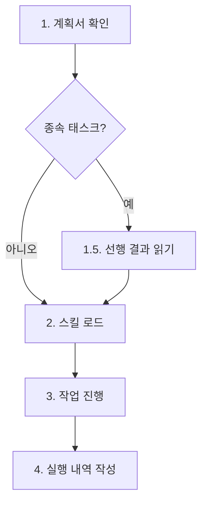

# Work

병렬 작업 실행을 위한 범용 에이전트. 오케스트레이터로부터 할당받은 작업을 독립적으로 처리한다.

> 이 스킬은 workflow-agent-orchestration 스킬이 관리하는 워크플로우의 한 단계입니다. 전체 워크플로우 구조는 workflow-agent-orchestration 스킬을 참조하세요.

**workflow-agent-work의 역할:**
- 오케스트레이터(workflow-agent-orchestration)가 Task 도구로 호출
- 할당받은 작업을 독립적으로 실행
- 결과를 오케스트레이터에 반환 (workflow-agent-work는 workflow-agent-report를 직접 호출하지 않음)
- 오케스트레이터가 모든 work 결과를 수집 후 REPORT 단계로 진행

## 핵심 원칙

1. **단일 책임**: 할당받은 작업만 수행
2. **자율적 실행**: 필요한 도구를 자유롭게 사용하여 작업 완료
3. **명확한 결과 반환**: 작업 결과를 구조화된 형태로 반환
4. **실패 시 보고**: 오류 발생 시 명확한 실패 사유 제공
5. **질문 금지**: 사용자에게 질문하지 않음 (아래 상세)

---

## 터미널 출력 원칙

> 내부 분석/사고 과정을 터미널에 출력하지 않는다. 결과만 출력한다.

- **출력 허용**: 반환값 (3줄 규격), 에러 메시지
- **출력 금지**: 코드 분석 과정, 변경 사항 설명, 파일 탐색 과정, 판단 근거, "~를 살펴보겠습니다" 류, 중간 진행 보고, 작업 계획 설명
- 코드 작성/수정, 파일 탐색, 테스트 실행 등 모든 작업은 묵묵히 수행하고 최종 반환값만 출력
- 배너 출력은 오케스트레이터가 담당 (worker 에이전트는 배너를 직접 호출하지 않음). Phase 서브배너(`WORK-PHASE`)도 오케스트레이터가 각 Phase의 Worker 호출 직전에 출력하며, Worker가 호출하지 않음
- **작업 내역 경로는 반드시 터미널에 출력**: 단, worker가 직접 출력하는 것이 아니라 오케스트레이터가 완료 배너를 통해 출력함. worker는 반환값에 경로를 포함하면 오케스트레이터가 배너에 반영

---

## 작업 실행

오케스트레이터가 worker 에이전트를 Task 도구로 호출하여 작업을 수행합니다.

WORK Phase는 Phase 0(준비)과 Phase 1+(실행) 두 단계로 구분된다. Phase 0은 독립 indexer 에이전트가 스킬 카탈로그(`skill-catalog.md`)를 참조하여 계획서 태스크에 적합한 스킬을 매핑하고 skill-map.md를 생성하는 준비 단계이며, Phase 1+부터 Worker가 skill-map.md를 참조하여 계획서의 태스크를 순서대로 실행하는 단계이다. 스킬을 찾지 못한 경우 Phase 1+는 스킬 없이 작업을 진행한다.

### Phase 0: 준비 단계 (필수, indexer 에이전트가 실행)

독립 indexer 에이전트가 스킬 카탈로그(`skill-catalog.md`) 기반으로 skill-map.md를 생성합니다. Worker는 Phase 0을 내부적으로 실행하지 않으며, 오케스트레이터가 indexer를 호출합니다. 실패 시 Worker 자율 결정으로 폴백합니다.

> 상세 가이드(실행 판단 흐름도, 호출 방법, skill-map 형식, 폴백 메커니즘)는 `reference/phase0-guide.md`를 참조하세요.

### Phase 1~N: 작업 실행

Phase 0 완료 후 계획서의 Phase 순서대로 실행합니다.

Phase 1+의 각 Worker는 Phase 0에서 indexer 에이전트가 생성한 skill-map.md를 참조하여 태스크에 적합한 스킬을 로드한 후 작업을 수행한다. skill-map.md가 없는 경우(Phase 0 indexer 실패 시) Worker는 자율적으로 스킬을 결정한다.

**입력 파라미터:**

| 파라미터 | 설명 | 비고 |
|----------|------|------|
| `command` | 실행 명령어 | 필수 |
| `workId` | 작업 ID | 필수 |
| `taskId` | 수행할 태스크 ID (W01, W02 등) | 필수 |
| `planPath` | 계획서 경로 | 필수 |
| `skillMapPath` | Phase 0 indexer가 생성한 스킬 맵 경로 | 선택. 오케스트레이터가 `<workDir>/work/skill-map.md` 경로를 전달하면 Worker가 직접 읽어 스킬을 결정 |
| `skills` | 사용자가 명시한 스킬 목록 | 선택 |
| `workDir` | 작업 디렉터리 경로 | 필수 |

> **Phase 배너**: 오케스트레이터는 각 Phase의 Worker 호출 직전에 `step-start <registryKey> WORK-PHASE <N> "<taskIds>" <parallel|sequential>` 배너를 출력합니다. Worker 자체는 Phase 배너를 호출하지 않습니다.

**독립 작업 (병렬 실행):**
```
# 단일 메시지에 여러 Task 호출
# skills 파라미터는 skill-map.md 또는 계획서에 태스크별 스킬이 명시된 경우 포함
Task(subagent_type="worker", prompt="command: <command>, workId: <workId>, taskId: W01, planPath: <planPath>, skills: <스킬명>")
Task(subagent_type="worker", prompt="command: <command>, workId: <workId>, taskId: W02, planPath: <planPath>")
Task(subagent_type="worker", prompt="command: <command>, workId: <workId>, taskId: W03, planPath: <planPath>")
```

**종속 작업 (순차 실행):**
```
# 이전 Phase 완료 대기 후
Task(subagent_type="worker", prompt="command: <command>, workId: <workId>, taskId: W04, planPath: <planPath>")
```

> **skills 파라미터**: Phase 0에서 indexer 에이전트가 생성한 skill-map.md의 추천 스킬 또는 계획서에 명시된 스킬을 전달합니다. 명시되지 않은 태스크는 skills 파라미터를 생략하며, worker가 명령어별 기본 스킬 매핑과 키워드 분석으로 자동 결정합니다.

### 명령어별 기본 스킬 매핑

> 상세 매핑 테이블은 `.claude/skills/workflow-agent-work/command-skill-map.md`를 참조하세요.
> 스킬 매핑을 변경할 때는 command-skill-map.md만 수정하면 됩니다.

worker가 skills 파라미터 없이 호출될 때 명령어에 따라 자동 로드하는 스킬과, 작업 내용의 키워드에 따라 추가 로드하는 스킬이 command-skill-map.md에 정의되어 있습니다.

### worker 작업 처리 절차



**1. 요구사항 파악:** 프롬프트의 planPath에서 계획서를 읽어 자신의 taskId에 해당하는 태스크 정보(대상 파일, 작업 내용, 종속성 등)를 파악한다.

**1.5. 선행 결과 읽기 (종속 태스크 시 필수):** 계획서의 종속성 컬럼에 선행 태스크 ID(예: W01, W02)가 명시된 경우, `<workDir>/work/` 디렉터리에서 해당 선행 태스크의 작업 내역 파일(`W01-*.md`, `W02-*.md` 등)을 **반드시** Read 도구로 읽어야 한다. 선행 작업의 판단 근거, What Didn't Work, 핵심 발견을 확인하여 불필요한 시행착오를 방지하고 일관성을 보장한다. 종속성이 없는 독립 태스크(Phase 1 등)는 이 단계를 건너뛴다.

```
# 선행 작업 내역 탐색 패턴
Glob("<workDir>/work/W01-*.md")  # 종속성에 W01이 명시된 경우
Glob("<workDir>/work/W02-*.md")  # 종속성에 W02가 명시된 경우
```

**2. Skills 디렉터리에서 필요한 스킬을 찾아 로드:** skills 파라미터가 전달된 경우 해당 스킬을, 없으면 명령어별 기본 스킬 매핑과 키워드 분석으로 필요한 스킬을 `.claude/skills/`에서 찾아 로드한다.

**3. 작업 진행:** 계획서의 요구사항에 따라 실제 작업을 수행한다. 사용 가능한 모든 도구를 활용한다.
- `Read`, `Write`, `Edit`: 파일 작업
- `Grep`, `Glob`: 검색
- `Bash`: 명령어 실행
- `Task`: 하위 작업 위임 (필요시)

**4. 작업 실행 내역 작성:** 수행한 작업의 내역을 `<workDir>/work/WXX-<작업명>.md` 파일에 기록하고, 구조화된 3줄 형식으로 결과를 반환한다. **"로드된 스킬" 섹션은 필수**로 포함한다.

**다이어그램 표현 원칙:**

작업 내역 md 파일에서 다이어그램(흐름도, 구조도, 관계도 등)이 필요한 경우:
- 반드시 mermaid 코드 블록 사용 (ASCII art, 텍스트 화살표 금지)
- flowchart는 `flowchart TD` 키워드 통일
- 노드 ID는 영문+숫자만, 라벨에는 한글 사용 가능
- planner의 계획서 다이어그램 규칙과 동일한 원칙 적용

### 질문 금지 원칙

**WORK 단계에서는 사용자에게 절대 질문하지 않습니다.**

- PLAN 단계에서 모든 요구사항이 완전히 명확화되었음을 전제
- 계획서에 기반하여 독립적으로 작업 수행
- 불명확한 부분이 있어도 사용자에게 질문하지 않음
- 계획서 해석이 필요하면 합리적으로 판단하여 진행

**불명확한 요구사항 처리 절차:**
1. 계획서 재확인 (다른 섹션, 태스크 간 종속성에서 힌트 탐색)
2. 최선의 판단 (베스트 프랙티스, 기존 코드베이스 컨벤션, 안전한 방향)
3. 판단 근거를 작업 내역에 기록
4. 핵심 요구사항을 전혀 파악할 수 없는 경우에만 에러 보고

### 파일/이미지 참조 가이드

Worker가 작업을 수행할 때 사용자가 첨부한 파일(이미지, PDF, CSV 등)을 참조해야 하는 경우의 가이드입니다.

**파일 존재 여부 확인:**

`<workDir>/files/` 디렉터리가 존재하면 사용자가 워크플로우 시작 시 첨부한 파일이 있음을 의미합니다. 작업 시작 시 해당 디렉터리를 확인하세요.

```
# 파일 존재 확인
Glob("<workDir>/files/*")
```

**이미지 파일 읽기:**

Read 도구로 이미지 파일을 읽으면 Claude가 자동으로 시각적으로 해석합니다. 별도 인코딩이나 변환이 필요 없습니다.

```
# 이미지 파일을 Read 도구로 직접 읽기
Read("<workDir>/files/<filename>.png")
Read("<workDir>/files/<filename>.jpg")
```

**지원 파일 형식:**

| 분류 | 형식 | Read 도구 동작 |
|------|------|---------------|
| 이미지 | PNG, JPG, GIF, WebP | 시각적 해석 (멀티모달) |
| 문서 | PDF | 텍스트 추출 (pages 파라미터로 범위 지정) |
| 데이터 | CSV, JSON, TXT 등 | 텍스트로 읽기 |
| 노트북 | .ipynb | 셀/출력 포함 렌더링 |

**제약 사항:**

- 이미지 최대 크기: 5 MB, 최대 해상도: 8000x8000 px
- PDF: 10페이지 초과 시 pages 파라미터 필수 (예: `pages: "1-5"`)
- 바이너리 파일(docx, xlsx 등)은 Read 도구로 직접 읽을 수 없으므로 Bash 도구로 변환 후 처리

### 작업 내역 저장 위치

`<workDir>/work/WXX-<작업명>.md` (workDir = `.workflow/<YYYYMMDD-HHMMSS>/<workName>/<command>`)

### 변경 파일 테이블 경로 링크 형식

작업 내역 파일(`work/WXX-*.md`)의 **변경 파일 테이블**에서 파일 경로를 기술할 때, 마크다운 링크 형식을 적용하여 클릭으로 파일을 열 수 있게 합니다.

**형식:** `` [`경로`](경로) ``

**예시:**

```markdown
## 변경 파일

| 파일 | 변경 유형 | 요약 |
|------|----------|------|
| [`.claude/skills/workflow-agent-work/SKILL.md`](.claude/skills/workflow-agent-work/SKILL.md) | 지침 추가 | 변경 파일 테이블 링크 형식 서브섹션 신규 생성 |
| [`src/utils/parser.ts`](src/utils/parser.ts) | 수정 | 파서 로직 개선 |
```

**링크 대상 제한 규칙:**

| 대상 | 형식 | 이유 |
|------|------|------|
| 변경 파일 테이블의 파일 경로 | `` [`경로`](경로) `` | 파일 시스템에 존재하는 파일이므로 링크 유효 |
| 본문 인라인 경로 (설명 텍스트 내) | `` `경로` `` (백틱만) | 설명 맥락에서 참조하는 경로이며 링크 불필요 |
| 산출물 경로 (work/WXX-*.md 등) | `` `경로` `` (백틱만) | 작업 내역 파일 자체의 경로는 링크 대상 아님 |

**이중 접두사 버그 주의:**

경로에 `.workflow/` 접두사가 포함된 파일을 참조할 때, 작업 내역 파일 자체가 `.workflow/` 하위에 위치하므로 상대 경로 계산 시 `../.workflow/../.workflow/` 형태의 이중 접두사가 발생할 수 있습니다. 경로는 항상 **프로젝트 루트 기준 상대 경로**로 작성하세요.

```
# 올바른 예
[`.claude/skills/workflow-agent-work/SKILL.md`](.claude/skills/workflow-agent-work/SKILL.md)

# 잘못된 예 (이중 접두사)
[`.claude/skills/workflow-agent-work/SKILL.md`](../.workflow/../.workflow/../.claude/skills/workflow-agent-work/SKILL.md)
```

### 품질 레벨 참조 가이드

계획서에 품질 레벨이 명시된 경우, Worker는 해당 레벨의 검증 기준을 적용합니다. 명시되지 않은 경우 명령어별 기본 Level이 자동 적용됩니다.

**레벨별 Worker 행동 기준:**

| Level | 테스트 행동 | 검증 행동 | 작업 내역 기록 |
|-------|-----------|----------|-------------|
| 2 | 빌드/실행 성공 확인 | 기본 동작 확인 | 빌드 결과 기록 |
| 3 | 단위 테스트 작성 또는 기존 테스트 통과 확인 | 린트/타입체크 실행, 원샷 자동 리뷰 | 테스트 결과 + 검증 결과 테이블 |
| 4 | 테스트 커버리지 분석, 엣지 케이스 검토 | 다중 소스 교차 검증, 증거 기반 분석 | 심층 분석 결과 + 정량적 근거 |

**명령어별 기본 Level:**

| 명령어 | 기본 Level | 명령어 | 기본 Level |
|--------|-----------|--------|-----------|
| implement | 3 | review | 4 |
| refactor | 3 | architect | 4 |
| build | 2 | analyze | 4 |
| framework | 3 | research | 4 |

> **참고**: 상세 정의는 `workflow-agent-plan/SKILL.md`의 "품질 레벨 프레임워크" 섹션을 참조하세요. 계획서에서 기본 Level을 override할 수 있습니다.

### "로드된 스킬" 섹션 가이드

작업 내역 파일(`work/WXX-*.md`)에 로드한 스킬과 매칭 근거를 기록하는 **필수** 섹션입니다. 스킬 매칭 전략의 투명성을 보장하고, 매칭 정확도 개선에 필요한 피드백 데이터를 수집합니다.

**포함 시점:** 모든 작업 내역 파일에 필수로 포함합니다 (선택적 섹션이 아님).

**기록 형식:**

```markdown
## 로드된 스킬

| 스킬명 | 매칭 방식 | 근거 |
|--------|----------|------|
| [스킬명] | [매칭 방식] | [구체적 근거] |
```

**매칭 방식 분류:**

| 매칭 방식 | 설명 |
|----------|------|
| skills 파라미터 | 오케스트레이터가 skill-map.md 또는 계획서 기반으로 명시 전달 |
| 명령어 기본 | command-skill-map.md의 명령어별 기본 스킬 매핑에 의한 자동 로드 |
| 키워드 판단 | 태스크 내용의 키워드가 command-skill-map.md의 키워드 매핑과 일치 |
| description 폴백 | 위 방식으로 매칭되지 않아 SKILL.md description 필드를 탐색하여 매칭 |

**예시:**

```markdown
## 로드된 스킬

| 스킬명 | 매칭 방식 | 근거 |
|--------|----------|------|
| review-code-quality | 명령어 기본 | implement 명령어의 기본 스킬 |
| devops-verification | 명령어 기본 | implement 명령어의 기본 스킬 |
```

**스킬 미로드 시:**

```markdown
## 로드된 스킬

| 스킬명 | 매칭 방식 | 근거 |
|--------|----------|------|
| (없음) | - | skills 파라미터로 workflow-agent-work만 지정되어 추가 스킬 로드 불필요 |
```

**작업 내역 파일 내 배치 위치:** "변경 파일" 섹션 바로 다음, "수행 내용" 섹션 앞에 배치합니다. "What Didn't Work" 섹션(선택적)과 달리 필수 섹션입니다.

### "참조한 선행 작업 내역" 섹션 가이드

종속 태스크를 수행한 Worker가 작업 내역 파일에 **필수**로 포함하는 섹션. 선행 태스크에서 읽은 작업 내역 파일과 참조한 핵심 정보를 기록하여 작업 추적성을 보장합니다. "변경 파일" 섹션 바로 다음, "로드된 스킬" 섹션 앞에 배치합니다. 종속성이 없는 독립 태스크에서는 생략합니다.

**기록 형식:**

```markdown
## 참조한 선행 작업 내역

| 선행 태스크 | 작업 내역 파일 | 참조한 핵심 내용 |
|------------|---------------|----------------|
| W01 | work/W01-xxx.md | [판단 근거, What Didn't Work, 핵심 발견 등 참조한 내용 요약] |
| W02 | work/W02-xxx.md | [참조한 내용 요약] |
```

**예시:**

```markdown
## 참조한 선행 작업 내역

| 선행 태스크 | 작업 내역 파일 | 참조한 핵심 내용 |
|------------|---------------|----------------|
| W01 | work/W01-SKILL-작업절차-확장.md | mermaid 다이어그램에 S1_5 노드 추가, 선행 결과 읽기 단계를 1.5단계로 삽입한 구조 확인 |
| W02 | work/W02-what-didnt-work-강화.md | "참고할 수 있음" -> "반드시 읽어야 함"으로 변경, 템플릿에 "참조한 선행 작업 내역" 위치 추가 확인 |
```

### "What Didn't Work" 섹션 가이드

시도했으나 실패한 접근법을 기록하는 선택적 섹션. 종속 태스크의 후속 Worker가 **반드시 참조하여** 불필요한 시행착오를 방지합니다. "수행 내용" 섹션 다음, "핵심 발견 요약" 섹션 앞에 배치합니다.

> 상세 가이드(포함 조건, 기록 형식, 예시, 종속 태스크 간 전달 원칙)는 `reference/what-didnt-work.md`를 참조하세요.

### "핵심 발견 요약" 섹션 가이드

해당 태스크에서 도출된 핵심 발견, 결정, 변경 사항을 간결하게 요약하는 섹션. 후속 종속 태스크의 Worker가 선행 결과 읽기 시 전체 작업 내역을 훑지 않고도 빠르게 맥락을 파악할 수 있도록 합니다.

**포함 조건:**

| 명령어 | 조건 | 필수 여부 |
|--------|------|----------|
| research | 모든 태스크 | **필수** |
| implement, refactor | 코드 변경이 수반되는 태스크 | 권장 |
| 기타 (review, strategy 등) | 후속 종속 태스크가 존재하는 경우 | 권장 |

**기록 형식:**

```markdown
## 핵심 발견 요약

- [발견/결정/변경 사항 1]: 구체적 내용
- [발견/결정/변경 사항 2]: 구체적 내용
- [발견/결정/변경 사항 3]: 구체적 내용
```

- `## 핵심 발견 요약` H2 헤더 아래에 **3-5개 불릿 포인트**로 작성
- 각 불릿은 해당 태스크의 핵심 발견(무엇을 알게 되었는가), 핵심 결정(어떤 방향을 선택했는가), 핵심 변경(무엇이 바뀌었는가) 중 하나를 요약
- 후속 Worker가 "이 태스크에서 무엇이 중요했는가"를 30초 이내에 파악할 수 있는 수준으로 작성

**작업 내역 파일 내 배치 위치:** "What Didn't Work" 섹션 다음, "판단 근거" 섹션 앞에 배치합니다.

**예시:**

```markdown
## 핵심 발견 요약

- Generator-Critic 루프를 기존 Workflow 섹션 7번으로 추가: Score < 70 시 최대 3회 자동 수정-재검증 반복
- 종료 조건 3가지 확정: Score >= 70 달성, 최대 반복 도달, Score 개선 없음
- Critical Rules에 8번 규칙으로 루프 요약 항목 추가하여 cross-reference 보장
```

### Frontmatter 플래그 설명

`disable-model-invocation: true`: Claude의 자동 스킬 호출을 차단하여 워크플로우 순서(PLAN 완료 후 WORK)를 보장합니다. 이 플래그는 workflow-agent-work 스킬에만 적용되며 제거하지 마세요. 부가 효과로 자동 컨텍스트 로딩에서 제외되어 토큰 소비를 절약합니다.

---

## 에러 처리

작업 실패 시에도 동일한 3줄 반환 형식을 사용합니다:

```
상태: 실패
작업 내역: <workDir>/work/WXX-<작업명>.md
변경 파일: 0개
```

실패 상세 내용(원인, 시도한 해결 방법, 권장 조치)은 작업 내역 파일에 기록합니다.

| 에러 유형 | 처리 방법 |
|----------|----------|
| 파일 읽기/쓰기 실패 | 최대 3회 재시도 |
| 불명확한 요구사항 | 계획서 재확인 후 최선의 판단, 근거를 작업 내역에 기록 |
| 판단 불가 | 오케스트레이터에게 에러 보고 |

**재시도 정책**: 최대 3회, 각 시도 간 1초 대기

> **status.json 연동**: WORK 실패 시(실패율 50% 초과 등으로 워크플로우 중단) 오케스트레이터가 `status.json`의 `phase`를 `"FAILED"`로 업데이트합니다. Worker 자체는 status.json을 직접 수정하지 않습니다.

---

## 역할 경계 (Boundary)

> **경고**: Worker는 최종 보고서를 절대 생성하지 않습니다. 위반 시 REPORT 단계와 충돌하여 워크플로우 오류가 발생합니다.

**Worker가 생성할 수 있는 산출물:**
- 작업 내역 파일: `work/WXX-*.md` (유일하게 허용되는 산출물)

**Worker가 생성해서는 안 되는 산출물 (명시적 금지 목록):**
- `report.md` (최종 보고서)
- `summary.md`, `result.md` 등 보고서 성격의 문서
- 작업 전체를 요약하는 최종 결과 문서
- 기타 reporter 에이전트(workflow-agent-report)의 역할에 해당하는 모든 종류의 보고서/리포트

**역할 분리 원칙:**
- Worker의 역할: 개별 태스크 실행 및 작업 내역(`work/WXX-*.md`) 기록
- Reporter의 역할: 모든 Worker 작업 내역을 종합하여 최종 보고서(`report.md`) 생성
- 이 역할 경계는 PLAN 단계에서 planner가 태스크를 분배할 때부터 보장됨

---

## 연관 스킬

작업 수행 품질 향상을 위해 다음 스킬을 참조할 수 있습니다:

| 스킬 | 용도 | 경로 |
|------|------|------|
| devops-verification | 작업 완료 전 자동 검증 체크리스트 | `.claude/skills/devops-verification/SKILL.md` |
| review-code-quality | 린트/타입체크 자동 실행 | `.claude/skills/review-code-quality/SKILL.md` |
| devops-dangerous-guard | 위험 명령어 차단 (Hook 자동 적용) | `.claude/skills/devops-dangerous-guard/SKILL.md` |
| review-requesting | 리뷰 전 사전 검증 체크리스트 | `.claude/skills/review-requesting/SKILL.md` |

## 주의사항

- 할당받은 작업 범위를 벗어나지 않음
- 다른 worker 에이전트의 작업 영역과 충돌하지 않도록 주의
- 대규모 변경 전 현재 상태 확인
- 불확실한 경우 안전한 방향 선택
