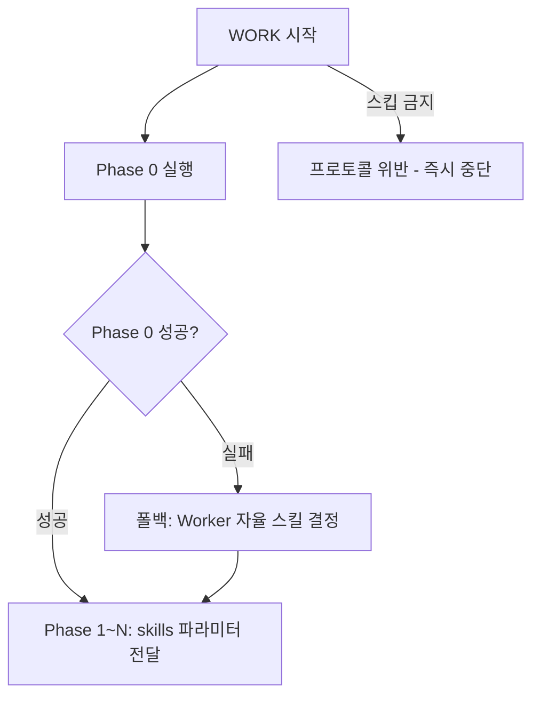

# Phase 0: 준비 단계 상세 가이드

> **역할 구분**: Phase 0은 계획서에서 명시된 작업을 수행하기 위해 필요한 스킬을 탐색하고 skill-map.md로 매핑하는 준비 단계이고, Phase 1+는 skill-map.md를 참조하여 계획서 태스크를 실행하는 단계이다. Phase 0에서 스킬을 찾지 못하면 Phase 1+는 스킬 없이 진행한다.

> **CRITICAL WARNING: Phase 0은 full 모드에서 절대 스킵할 수 없습니다.** 오케스트레이터가 WORK 단계에 진입하면, Phase 1이나 다른 Phase보다 반드시 Phase 0을 가장 먼저 실행해야 합니다. Phase 0을 건너뛰는 것은 워크플로우 프로토콜의 중대한 위반입니다.

> **Phase 배너**: 오케스트레이터는 Phase 0 Worker 호출 직전에 `Workflow <registryKey> WORK-PHASE 0 "phase0" sequential` 배너를 출력합니다. Worker 자체는 Phase 배너를 호출하지 않습니다.

Phase 0은 모든 full 모드 워크플로우에서 **무조건 실행**합니다. 예외 없음. 스킵 사유 없음. 어떤 최적화 판단으로도 생략 불가.

**Phase 0 실행 판단:**



**Phase 0 실행:**

```
Task(subagent_type="worker", prompt="command: <command>, workId: <workId>, taskId: phase0, planPath: <planPath>, workDir: <workDir>, mode: phase0")
```

Phase 0은 **1개 worker 에이전트가 순차적으로** 실행합니다.

**Phase 0의 2가지 기능:**

1. **work 작업 디렉터리 생성**: `<workDir>/work/` 디렉터리를 명시적으로 생성합니다.

2. **스킬 매핑**: 계획서(plan.md)의 태스크 목록과 사용 가능한 스킬 목록(`.claude/skills/` 하위)을 비교하여 각 태스크에 적합한 스킬을 매핑합니다.
   - 명령어별 기본 스킬 매핑 테이블을 기반으로 판단
   - 태스크 내용의 키워드를 분석하여 추가 스킬 추천
   - 계획서에 이미 스킬이 명시된 태스크는 그 값을 존중

**Phase 0 결과물:**
- `<workDir>/work/skill-map.md` 파일에 스킬 매핑 결과 저장

**skill-map.md 형식:**
```markdown
# Skill Map

| 태스크 ID | 태스크 설명 | 추천 스킬 | 판단 근거 |
|-----------|------------|----------|----------|
| W01 | [태스크 설명] | skill-a, skill-b | [근거] |
| W02 | [태스크 설명] | skill-c | [근거] |
```

**Phase 0 완료 후:** Phase 0 완료로 준비 단계(스킬 탐색/매핑)가 종료되고, Phase 1+(작업 실행 단계)로 전환됩니다. 오케스트레이터는 skill-map.md를 참고하여 후속 Phase 1~N의 worker 호출 시 skills 파라미터를 전달합니다.

**Phase 0 실패 시 폴백:**

Phase 0이 실행되었으나 실패를 반환한 경우, C 방식(개별 자율 결정)으로 자동 폴백합니다:
1. Phase 0 실패를 로그에 기록
2. skill-map.md 없이 Phase 1로 진행
3. 각 Worker가 skills 파라미터 없이 자율 결정으로 작업 수행

이 폴백 메커니즘은 Phase 0의 SPOF(단일 장애점) 위험을 완화합니다.

## Phase 0 스킵 방지 체크리스트

오케스트레이터가 WORK 단계 진입 시 반드시 확인:

1. Phase 0 WORK-PHASE 배너를 출력했는가?
2. Phase 0 Worker를 호출했는가?
3. Phase 0 Worker의 반환값을 수신했는가?
4. 위 3개를 모두 완료한 후에야 Phase 1으로 진행하는가?

> 하나라도 "아니오"면 프로토콜 위반. 즉시 Phase 0을 실행하라.

## Phase 0 vs Phase 1+ 역할 비교

| 항목 | Phase 0 (준비 단계) | Phase 1+ (작업 실행 단계) |
|------|---------------------|--------------------------|
| **목적** | 스킬 탐색 및 매핑 | 계획서 태스크 실행 |
| **산출물/입력** | 산출물: `skill-map.md` | 입력: `skill-map.md` |
| **실행 방식** | 1개 worker 순차 실행 | N개 worker 병렬/순차 실행 |
| **스킬 미발견 시** | skill-map.md에 "(없음)" 기록 | 스킬 없이 Worker 자율 결정으로 진행 |
