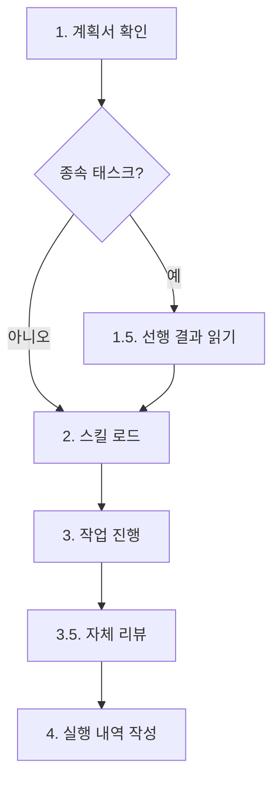

# Work

병렬 작업 실행을 위한 범용 에이전트. 오케스트레이터로부터 할당받은 작업을 독립적으로 처리한다.

> 이 스킬은 workflow-orchestration 스킬이 관리하는 워크플로우의 한 단계입니다. 전체 워크플로우 구조는 workflow-orchestration 스킬을 참조하세요.

**workflow-agent-worker의 역할:**
- 오케스트레이터(workflow-orchestration)가 Task 도구로 호출
- 할당받은 작업을 독립적으로 실행
- 결과를 오케스트레이터에 반환 (workflow-agent-worker는 workflow-agent-reporter를 직접 호출하지 않음)
- 오케스트레이터가 모든 work 결과를 수집 후 REPORT 단계로 진행

## 핵심 원칙

1. **단일 책임**: 할당받은 작업만 수행
2. **자율적 실행**: 필요한 도구를 자유롭게 사용하여 작업 완료
3. **명확한 결과 반환**: 작업 결과를 구조화된 형태로 반환
4. **실패 시 보고**: 오류 발생 시 명확한 실패 사유 제공
5. **질문 금지**: 사용자에게 질문하지 않음 (아래 상세)

---

## 터미널 출력 원칙

> 내부 분석/사고 과정을 터미널에 출력하지 않는다. 결과만 출력한다.

- **출력 허용**: 반환값 (1줄 규격), 에러 메시지
- **출력 금지**: 코드 분석 과정, 변경 사항 설명, 파일 탐색 과정, 판단 근거, "~를 살펴보겠습니다" 류, 중간 진행 보고, 작업 계획 설명
- 코드 작성/수정, 파일 탐색, 테스트 실행 등 모든 작업은 묵묵히 수행하고 최종 반환값만 출력
- 배너 출력은 오케스트레이터가 담당 (worker 에이전트는 배너를 직접 호출하지 않음). Phase 서브배너(`WORK-PHASE`)도 오케스트레이터가 각 Phase의 Worker 호출 직전에 출력하며, Worker가 호출하지 않음
- **작업 내역 경로는 반드시 터미널에 출력**: 단, worker가 직접 출력하는 것이 아니라 오케스트레이터가 완료 배너를 통해 출력함. worker는 반환값에 경로를 포함하면 오케스트레이터가 배너에 반영

---

## 작업 실행

오케스트레이터가 worker 에이전트를 Task 도구로 호출하여 작업을 수행합니다.

WORK Phase는 Phase 0(준비)과 Phase 1+(실행) 두 단계로 구분된다. Phase 0은 `skill_mapper.py` 스크립트가 plan.md skills 컬럼 + 명령어 기본 + TF-IDF fallback으로 skill-map.md를 생성하는 준비 단계이며, Phase 1+부터 Worker가 skill-map.md를 참조하여 계획서의 태스크를 순서대로 실행하는 단계이다. 스킬을 찾지 못한 경우 Phase 1+는 스킬 없이 작업을 진행한다.

### Phase 0: 준비 단계 (필수, skill_mapper.py가 실행)

오케스트레이터가 `flow-skillmap`을 실행하여 skill-map.md를 생성합니다. Worker는 Phase 0을 내부적으로 실행하지 않으며, 오케스트레이터가 스크립트를 호출합니다. 실패 시 Worker 자율 결정으로 폴백합니다. skill-map.md에는 태스크별 스킬 매핑 테이블이 포함되어 있으며, Worker는 매핑 테이블에서 자기 태스크의 스킬 목록을 확인한 후 `.claude/skills/<스킬명>/COMPACT.md` (또는 SKILL.md)를 직접 Read하여 지침을 획득합니다.

### Phase 1~N: 작업 실행

Phase 0 완료 후 계획서의 Phase 순서대로 실행합니다.

Phase 1+의 각 Worker는 Phase 0에서 skill_mapper.py가 생성한 skill-map.md를 1회 Read하여 스킬 목록을 확인한 후 작업을 수행한다. Worker는 skill-map.md에서 자기 태스크의 스킬 목록을 확인한 후, `.claude/skills/<스킬명>/COMPACT.md` (COMPACT.md가 없으면 SKILL.md)를 직접 Read하여 스킬 지침을 획득한다. skill-map.md가 없는 경우(Phase 0 실패 시) Worker는 자율적으로 스킬을 결정한다.

**입력 파라미터:**

| 파라미터 | 설명 | 비고 |
|----------|------|------|
| `command` | 실행 명령어 | 필수 |
| `workId` | 작업 ID | 필수 |
| `taskId` | 수행할 태스크 ID (W01, W02 등) | 필수 |
| `planPath` | 계획서 경로 | 필수 |
| `skillMapPath` | Phase 0 skill_mapper.py가 생성한 스킬 맵 경로 | 선택. 오케스트레이터가 `<workDir>/work/skill-map.md` 경로를 전달하면 Worker가 매핑 테이블을 Read하여 스킬 목록 확인 |
| `skills` | 사용자가 명시한 스킬 목록 | 선택 |
| `workDir` | 작업 디렉터리 경로 | 필수 |

> **Phase 배너**: 오케스트레이터는 각 Phase의 Worker 호출 직전에 `flow-phase <N> "<assignments>"` 배너를 출력합니다. Worker 자체는 Phase 배너를 호출하지 않습니다.

**독립 작업 (병렬 실행):**
```
# 단일 메시지에 여러 Task 호출
# skills 파라미터는 skill-map.md 또는 계획서에 태스크별 스킬이 명시된 경우 포함
Task(subagent_type="worker-opus", prompt="command: <command>, workId: <workId>, taskId: W01, planPath: <planPath>, skills: <스킬명>")
Task(subagent_type="worker-sonnet", prompt="command: <command>, workId: <workId>, taskId: W02, planPath: <planPath>")
Task(subagent_type="worker-sonnet", prompt="command: <command>, workId: <workId>, taskId: W03, planPath: <planPath>")
```

**종속 작업 (순차 실행):**
```
# 이전 Phase 완료 대기 후
Task(subagent_type="worker-opus", prompt="command: <command>, workId: <workId>, taskId: W04, planPath: <planPath>")
```

> **skills 파라미터**: Phase 0에서 skill_mapper.py가 생성한 skill-map.md의 추천 스킬 또는 계획서에 명시된 스킬을 전달합니다. 명시되지 않은 태스크는 skills 파라미터를 생략하며, worker가 skill-map.md를 직접 참조하여 결정합니다.

### 명령어별 기본 스킬 매핑

> 상세 매핑 테이블은 `skill-catalog.md`의 Command Default Mapping / Skill Descriptions 섹션을 참조하세요 (단일 소스).
> 스킬 매핑을 변경할 때는 skill-catalog.md만 수정하면 됩니다 (catalog_sync.py 재실행).

worker가 skill-map.md 없이 호출될 때 명령어에 따라 자동 로드하는 스킬과, 작업 내용의 키워드에 따라 추가 로드하는 스킬이 skill-catalog.md에 정의되어 있습니다.

### worker 작업 처리 절차



**1. 요구사항 파악:** 프롬프트의 planPath에서 계획서를 읽어 자신의 taskId에 해당하는 태스크 정보(대상 파일, 작업 내용, 종속성 등)를 파악한다.

**1.5. 선행 결과 읽기 (종속 태스크 시 필수):** 계획서의 종속성 컬럼에 선행 태스크 ID(예: W01, W02)가 명시된 경우, `<workDir>/work/` 디렉터리에서 해당 선행 태스크의 작업 내역 파일(`W01-*.md`, `W02-*.md` 등)을 **반드시** Read 도구로 읽어야 한다. 선행 작업의 판단 근거, What Didn't Work, 핵심 발견을 확인하여 불필요한 시행착오를 방지하고 일관성을 보장한다. 종속성이 없는 독립 태스크(Phase 1 등)는 이 단계를 건너뛴다.

```
# 선행 작업 내역 탐색 패턴
Glob("<workDir>/work/W01-*.md")  # 종속성에 W01이 명시된 경우
Glob("<workDir>/work/W02-*.md")  # 종속성에 W02가 명시된 경우
```

**2. 스킬 로드 (3계층 바인딩):**

Worker의 스킬은 3계층으로 구성된다:
- **Tier 1 (에이전트 스킬)**: `workflow-agent-worker` — 정적 바인딩, 항상 로드
- **Tier 2 (전문화 스킬)**: 필수 1개 이상. 아래 우선순위로 결정
- **Tier 3 (프로젝트 스킬)**: 반필수. 존재 시 자동 적용

**2a. 전문화 스킬 로드 (필수):**
skill-map.md 1회 Read (매핑 테이블) → 매핑된 스킬 필수 로드(planner 추천) → 추가 필요 시 skill-catalog.md Skill Descriptions 참조하여 자율 추가 선택 가능

> **규칙**: planner 추천 스킬(skill-map.md에 매핑된 스킬)은 반드시 로드해야 하며 생략 불가. 해당 스킬의 `.claude/skills/<스킬명>/COMPACT.md` (없으면 SKILL.md)를 직접 Read하여 지침을 획득한다.

> **자율 추가 선택 가이드**: 추가 스킬이 필요하다고 판단되면 skill-catalog.md의 Skill Descriptions 섹션을 참조하여 선택할 수 있다. 단, 토큰 예산(TOKEN_BUDGET_LIMIT)을 고려하여 최소 필요한 스킬만 추가한다.

**2b. 프로젝트 스킬 로드 (반필수):**
skills 파라미터 → skill-map.md 프로젝트 컬럼 → 없으면 스킵

필요한 스킬을 `.claude/skills/`에서 찾아 로드한다.

**3. 작업 진행:** 계획서의 요구사항에 따라 실제 작업을 수행한다. 사용 가능한 모든 도구를 활용한다.
- `Read`, `Write`, `Edit`: 파일 작업
- `Grep`, `Glob`: 검색
- `Bash`: 명령어 실행
- `Task`: 하위 작업 위임 (필요시)

### 보고 전 자체 리뷰 (Self-Review)

> **강제 조건**: 환경변수 `ENFORCE_SELF_REVIEW=true` 시 적용. false 시 자체 리뷰는 선택적.

작업 완료 후 실행 내역 작성 전에 4축 자체 리뷰를 수행한다.

| 축 | 질문 | 미충족 시 조치 |
|----|------|-------------|
| 완전성 | 계획서의 모든 요구사항을 구현했는가? | 누락 항목 구현 후 재검증 |
| 품질 | 이름이 명확하고 코드가 깔끔하고 유지보수 가능한가? | 리팩터링 후 재검증 |
| 규율 | YAGNI를 지켰는가? 요청된 것만 구현했는가? | 불필요한 추가분 제거 |
| 테스트 | 테스트가 mock이 아닌 실제 동작을 검증하는가? | 테스트 보강 또는 수정 |

4축 중 하나라도 미충족이면 해당 항목을 수정한 후 다시 자체 리뷰를 수행한다. 모든 축이 충족되어야 4단계(실행 내역 작성)로 진행한다.

**4. 작업 실행 내역 작성:** 수행한 작업의 내역을 `<workDir>/work/WXX-<작업명>.md` 파일에 기록하고, 상태 1줄로 결과를 반환한다. **"로드된 스킬" 섹션은 필수**로 포함한다.

#### WXX-*.md 필수 섹션 구조

작업 내역 파일은 다음 5개 필수 섹션을 반드시 포함해야 합니다. 이 구조는 후속 워커가 선행 결과를 빠르게 파악하고, 작업 추적성을 보장합니다.

**필수 섹션 템플릿:**

```markdown
## 변경 파일

| 파일 | 변경 유형 | 요약 |
|------|----------|------|
| [`파일경로1`](파일경로1) | 추가/수정/삭제 | 변경 내용 요약 |
| [`파일경로2`](파일경로2) | 추가/수정 | 변경 내용 요약 |

## 핵심 발견

- 발견/결정/변경 사항 1: 구체적 내용
- 발견/결정/변경 사항 2: 구체적 내용
- 발견/결정/변경 사항 3: 구체적 내용

## 후속 워커 참조용 요약

이 태스크에서 수행한 작업을 1-3문장으로 간결하게 요약. 후속 워커가 이 태스크의 결과를 30초 내에 파악할 수 있는 수준으로 작성합니다.

## 로드된 스킬

| 스킬명 | 분류 | 매칭 방식 | 근거 |
|--------|------|----------|------|
| [스킬명] | [전문화/프로젝트] | [매칭 방식] | [구체적 근거] |

## 검증 결과

| 주장 | 검증 방법 | 결과 | 증거 |
|------|----------|------|------|
| [주장 내용] | [실행한 명령어] | PASS/FAIL/SKIP | [출력 수치 또는 핵심 결과] |
```

> **강제 조건**: 환경변수 `ENFORCE_VRT=true` 시 적용. false 시 VRT는 선택적.
> implement/refactor 명령어 시 필수, research 명령어 시 SKIP 허용.

**섹션별 설명:**

- **변경 파일**: 모든 작업 내역 파일에서 **필수**. 수정한 파일 목록을 테이블로 작성합니다. 파일 경로는 마크다운 링크 형식 `` [`경로`](경로) ``으로 작성하여 클릭으로 파일 열기 가능하게 합니다. (상세: "변경 파일 테이블 경로 링크 형식" 섹션 참조)
- **핵심 발견**: 해당 태스크의 핵심 발견, 결정, 변경 사항을 3-5개 불릿으로 요약합니다. research 명령어 태스크는 필수, implement/refactor 태스크에서 코드 변경이 수반될 때도 권장합니다. (상세: "핵심 발견 요약" 섹션 가이드 참조)
- **후속 워커 참조용 요약**: 모든 작업 내역 파일에서 **필수**. 종속 태스크가 존재하는 경우 특히 중요합니다. 후속 워커가 전체 작업 내역을 읽지 않고도 이 태스크의 결과를 즉시 파악할 수 있도록 1-3문장으로 요약합니다. (상세: 본 섹션 아래 "작성 예시" 참조)
- **로드된 스킬**: 모든 작업 내역 파일에서 **필수**. 이 태스크를 수행할 때 로드한 스킬과 매칭 근거를 기록합니다. (상세: "로드된 스킬" 섹션 가이드 참조)
- **검증 결과**: implement/refactor 작업 내역 파일에서 **필수**. 모든 완료/성공 주장을 VRT 4컬럼 테이블(주장/검증방법/결과/증거)로 기록합니다. research 명령어 시 SKIP 허용. (상세: `workflow-system-verification/SKILL.md`의 "Verification Result Table" 섹션 참조)

**작성 예시:**

```markdown
## 후속 워커 참조용 요약

이 태스크에서 FSM 전이 규칙을 6개에서 8개로 확장했고, 경쟁 조건 해소를 위해 파일 락 방식을 적용했다. 후속 태스크는 `update_state.py`의 `acquire_lock()` 함수 변경을 전제로 진행해야 한다.
```

**다이어그램 표현 원칙:**

작업 내역 md 파일에서 다이어그램(흐름도, 구조도, 관계도 등)이 필요한 경우:
- 반드시 mermaid 코드 블록 사용 (ASCII art, 텍스트 화살표 금지)
- flowchart는 `flowchart TD` 키워드 통일
- 노드 ID는 영문+숫자만, 라벨에는 한글 사용 가능
- planner의 계획서 다이어그램 규칙과 동일한 원칙 적용

### 질문 금지 원칙

**WORK 단계에서는 사용자에게 절대 질문하지 않습니다.**

- PLAN 단계에서 모든 요구사항이 완전히 명확화되었음을 전제
- 계획서에 기반하여 독립적으로 작업 수행
- 불명확한 부분이 있어도 사용자에게 질문하지 않음
- 계획서 해석이 필요하면 합리적으로 판단하여 진행

**불명확한 요구사항 처리 절차:**
1. 계획서 재확인 (다른 섹션, 태스크 간 종속성에서 힌트 탐색)
2. 최선의 판단 (베스트 프랙티스, 기존 코드베이스 컨벤션, 안전한 방향)
3. 판단 근거를 작업 내역에 기록
4. 핵심 요구사항을 전혀 파악할 수 없는 경우에만 에러 보고

### 파일/이미지 참조 가이드

Worker가 작업을 수행할 때 사용자가 첨부한 파일(이미지, PDF, CSV 등)을 참조해야 하는 경우의 가이드입니다.

**파일 존재 여부 확인:**

`<workDir>/files/` 디렉터리가 존재하면 사용자가 워크플로우 시작 시 첨부한 파일이 있음을 의미합니다. 작업 시작 시 해당 디렉터리를 확인하세요.

```
# 파일 존재 확인
Glob("<workDir>/files/*")
```

**이미지 파일 읽기:**

Read 도구로 이미지 파일을 읽으면 Claude가 자동으로 시각적으로 해석합니다. 별도 인코딩이나 변환이 필요 없습니다.

```
# 이미지 파일을 Read 도구로 직접 읽기
Read("<workDir>/files/<filename>.png")
Read("<workDir>/files/<filename>.jpg")
```

**지원 파일 형식:**

| 분류 | 형식 | Read 도구 동작 |
|------|------|---------------|
| 이미지 | PNG, JPG, GIF, WebP | 시각적 해석 (멀티모달) |
| 문서 | PDF | 텍스트 추출 (pages 파라미터로 범위 지정) |
| 데이터 | CSV, JSON, TXT 등 | 텍스트로 읽기 |
| 노트북 | .ipynb | 셀/출력 포함 렌더링 |

**제약 사항:**

- 이미지 최대 크기: 5 MB, 최대 해상도: 8000x8000 px
- PDF: 10페이지 초과 시 pages 파라미터 필수 (예: `pages: "1-5"`)
- 바이너리 파일(docx, xlsx 등)은 Read 도구로 직접 읽을 수 없으므로 Bash 도구로 변환 후 처리

### 작업 내역 저장 위치

`<workDir>/work/WXX-<작업명>.md` (workDir = `.workflow/<YYYYMMDD-HHMMSS>/<workName>/<command>`)

### 변경 파일 테이블 경로 링크 형식

작업 내역 파일(`work/WXX-*.md`)의 **변경 파일 테이블**에서 파일 경로를 기술할 때, 마크다운 링크 형식을 적용하여 클릭으로 파일을 열 수 있게 합니다.

**형식:** `` [`경로`](경로) ``

**예시:**

```markdown
## 변경 파일

| 파일 | 변경 유형 | 요약 |
|------|----------|------|
| [`.claude/skills/workflow-agent-worker/SKILL.md`](.claude/skills/workflow-agent-worker/SKILL.md) | 지침 추가 | 변경 파일 테이블 링크 형식 서브섹션 신규 생성 |
| [`src/utils/parser.ts`](src/utils/parser.ts) | 수정 | 파서 로직 개선 |
```

**링크 대상 제한 규칙:**

| 대상 | 형식 | 이유 |
|------|------|------|
| 변경 파일 테이블의 파일 경로 | `` [`경로`](경로) `` | 파일 시스템에 존재하는 파일이므로 링크 유효 |
| 본문 인라인 경로 (설명 텍스트 내) | `` `경로` `` (백틱만) | 설명 맥락에서 참조하는 경로이며 링크 불필요 |
| 산출물 경로 (work/WXX-*.md 등) | `` `경로` `` (백틱만) | 작업 내역 파일 자체의 경로는 링크 대상 아님 |

**이중 접두사 버그 주의:**

경로에 `.workflow/` 접두사가 포함된 파일을 참조할 때, 작업 내역 파일 자체가 `.workflow/` 하위에 위치하므로 상대 경로 계산 시 `../.workflow/../.workflow/` 형태의 이중 접두사가 발생할 수 있습니다. 경로는 항상 **프로젝트 루트 기준 상대 경로**로 작성하세요.

```
# 올바른 예
[`.claude/skills/workflow-agent-worker/SKILL.md`](.claude/skills/workflow-agent-worker/SKILL.md)

# 잘못된 예 (이중 접두사)
[`.claude/skills/workflow-agent-worker/SKILL.md`](../.workflow/../.workflow/../.claude/skills/workflow-agent-worker/SKILL.md)
```

### 품질 레벨 참조 가이드

계획서에 품질 레벨이 명시된 경우, Worker는 해당 레벨의 검증 기준을 적용합니다. 명시되지 않은 경우 명령어별 기본 Level이 자동 적용됩니다.

**레벨별 Worker 행동 기준:**

| Level | 테스트 행동 | 검증 행동 | 작업 내역 기록 |
|-------|-----------|----------|-------------|
| 2 | 빌드/실행 성공 확인 | 기본 동작 확인 | 빌드 결과 기록 |
| 3 | 단위 테스트 작성 또는 기존 테스트 통과 확인 | 린트/타입체크 실행, 원샷 자동 리뷰 | 테스트 결과 + 검증 결과 테이블 |
| 4 | 테스트 커버리지 분석, 엣지 케이스 검토 | 다중 소스 교차 검증, 증거 기반 분석 | 심층 분석 결과 + 정량적 근거 |

**명령어별 기본 Level:**

| 명령어 | 기본 Level | 명령어 | 기본 Level |
|--------|-----------|--------|-----------|
| implement | 3 | review | 4 |
| refactor | 3 | architect | 4 |
| build | 2 | analyze | 4 |
| framework | 3 | research | 4 |

> **참고**: 상세 정의는 `workflow-agent-planner/SKILL.md`의 "품질 레벨 프레임워크" 섹션을 참조하세요. 계획서에서 기본 Level을 override할 수 있습니다.

### "로드된 스킬" 섹션 가이드

작업 내역 파일(`work/WXX-*.md`)에 로드한 스킬과 매칭 근거를 기록하는 **필수** 섹션입니다. **"WXX-*.md 필수 섹션 구조"의 "## 로드된 스킬" 섹션에 포함되는 필수 섹션**입니다. 스킬 매칭 전략의 투명성을 보장하고, 매칭 정확도 개선에 필요한 피드백 데이터를 수집합니다.

**포함 시점:** 모든 작업 내역 파일에 **반드시 포함**합니다 (선택적 섹션이 아님). 이는 WXX-*.md 필수 섹션 구조에 의해 강제됩니다.

**기록 형식:**

```markdown
## 로드된 스킬

| 스킬명 | 분류 | 매칭 방식 | 근거 |
|--------|------|----------|------|
| [스킬명] | [전문화/프로젝트] | [매칭 방식] | [구체적 근거] |
```

**매칭 방식 분류:**

| 매칭 방식 | 설명 |
|----------|------|
| skills 파라미터 | 오케스트레이터가 skill-map.md 또는 계획서 기반으로 명시 전달 |
| 명령어 기본 | skill-catalog.md의 Command Default Mapping에 의한 자동 로드 |
| TF-IDF 추천 | Level 0-1 매칭 결과가 없을 때 skill_recommender.py가 description 유사도로 추천 |

**예시:**

```markdown
## 로드된 스킬

| 스킬명 | 분류 | 매칭 방식 | 근거 |
|--------|------|----------|------|
| review-code-quality | 전문화 | 계획서 명시 | implement 명령어의 기본 스킬 |
| workflow-system-verification | 전문화 | 명령어 기본 | implement 명령어의 기본 스킬 |
| project-ecommerce | 프로젝트 | skill-map 자동 | skill-catalog.md Project Skills 섹션에서 감지 |
```

**스킬 미로드 시:**

```markdown
## 로드된 스킬

| 스킬명 | 분류 | 매칭 방식 | 근거 |
|--------|------|----------|------|
| (없음) | - | - | skills 파라미터로 workflow-agent-worker만 지정되어 추가 스킬 로드 불필요 |
```

**작업 내역 파일 내 배치 위치:** "변경 파일" 섹션 바로 다음, "수행 내용" 섹션 앞에 배치합니다. "What Didn't Work" 섹션(선택적)과 달리 필수 섹션입니다.

### "참조한 선행 작업 내역" 섹션 가이드

종속 태스크를 수행한 Worker가 작업 내역 파일에 **필수**로 포함하는 섹션. 선행 태스크에서 읽은 작업 내역 파일과 참조한 핵심 정보를 기록하여 작업 추적성을 보장합니다. "변경 파일" 섹션 바로 다음, "로드된 스킬" 섹션 앞에 배치합니다. 종속성이 없는 독립 태스크에서는 생략합니다.

**기록 형식:**

```markdown
## 참조한 선행 작업 내역

| 선행 태스크 | 작업 내역 파일 | 참조한 핵심 내용 |
|------------|---------------|----------------|
| W01 | work/W01-xxx.md | [판단 근거, What Didn't Work, 핵심 발견 등 참조한 내용 요약] |
| W02 | work/W02-xxx.md | [참조한 내용 요약] |
```

**예시:**

```markdown
## 참조한 선행 작업 내역

| 선행 태스크 | 작업 내역 파일 | 참조한 핵심 내용 |
|------------|---------------|----------------|
| W01 | work/W01-SKILL-작업절차-확장.md | mermaid 다이어그램에 S1_5 노드 추가, 선행 결과 읽기 단계를 1.5단계로 삽입한 구조 확인 |
| W02 | work/W02-what-didnt-work-강화.md | "참고할 수 있음" -> "반드시 읽어야 함"으로 변경, 템플릿에 "참조한 선행 작업 내역" 위치 추가 확인 |
```

### "What Didn't Work" 섹션 가이드

시도했으나 실패한 접근법을 기록하는 선택적 섹션. 종속 태스크의 후속 Worker가 **반드시 참조하여** 불필요한 시행착오를 방지합니다. "수행 내용" 섹션 다음, "핵심 발견" 섹션 앞에 배치합니다.

> 상세 가이드(포함 조건, 기록 형식, 예시, 종속 태스크 간 전달 원칙)는 `reference/what-didnt-work.md`를 참조하세요.

### "핵심 발견" 섹션 가이드

해당 태스크에서 도출된 핵심 발견, 결정, 변경 사항을 간결하게 요약하는 섹션. **"WXX-*.md 필수 섹션 구조"의 "## 핵심 발견" 섹션에 포함되는 필수 섹션**입니다. 후속 종속 태스크의 Worker가 선행 결과 읽기 시 전체 작업 내역을 훑지 않고도 빠르게 맥락을 파악할 수 있도록 합니다.

**포함 조건:**

| 명령어 | 조건 | 필수 여부 |
|--------|------|----------|
| research | 모든 태스크 | **필수** |
| implement, refactor | 코드 변경이 수반되는 태스크 | **필수 (WXX-*.md 표준 구조 준수)** |
| 기타 (review 등) | 후속 종속 태스크가 존재하는 경우 | **필수 (WXX-*.md 표준 구조 준수)** |

**기록 형식:**

```markdown
## 핵심 발견

- [발견/결정/변경 사항 1]: 구체적 내용
- [발견/결정/변경 사항 2]: 구체적 내용
- [발견/결정/변경 사항 3]: 구체적 내용
```

- `## 핵심 발견` H2 헤더 아래에 **3-5개 불릿 포인트**로 작성
- 각 불릿은 해당 태스크의 핵심 발견(무엇을 알게 되었는가), 핵심 결정(어떤 방향을 선택했는가), 핵심 변경(무엇이 바뀌었는가) 중 하나를 요약
- 후속 Worker가 "이 태스크에서 무엇이 중요했는가"를 30초 이내에 파악할 수 있는 수준으로 작성

**작업 내역 파일 내 배치 위치:** "What Didn't Work" 섹션 다음, "판단 근거" 섹션 앞에 배치합니다.

**예시:**

```markdown
## 핵심 발견

- Generator-Critic 루프를 기존 Workflow 섹션 7번으로 추가: Score < 70 시 최대 3회 자동 수정-재검증 반복
- 종료 조건 3가지 확정: Score >= 70 달성, 최대 반복 도달, Score 개선 없음
- Critical Rules에 8번 규칙으로 루프 요약 항목 추가하여 cross-reference 보장
```

### Frontmatter 플래그 설명

`disable-model-invocation: true`: Claude의 자동 스킬 호출을 차단하여 워크플로우 순서(PLAN 완료 후 WORK)를 보장합니다. 이 플래그는 workflow-agent-worker 스킬에만 적용되며 제거하지 마세요. 부가 효과로 자동 컨텍스트 로딩에서 제외되어 토큰 소비를 절약합니다.

---

## 오케스트레이터 반환 형식 (필수)

> **엄격히 준수**: 오케스트레이터에게 반환할 때 반드시 아래 형식만 사용합니다.
> 이 형식 외의 추가 정보(작업 상세, 변경 파일 목록, 다음 단계 등)는 절대 포함하지 않습니다.
> 상세 정보는 작업 내역 파일(.workflow/)에 저장되어 있으므로 반환에 포함할 필요가 없습니다.

### 반환 형식

```
상태: 성공 | 부분성공 | 실패
```

> **금지 항목**: 작업 결과 상세, 변경 파일 목록, "다음 단계" 안내, 실행 로그, 경로, 메타정보(N개) 등을 반환에 포함하지 않습니다. 이러한 정보는 작업 내역 파일에만 기록합니다.

---

## 에러 처리

작업 실패 시에도 동일한 1줄 반환 형식을 사용합니다:

```
상태: 실패
```

실패 상세 내용(원인, 시도한 해결 방법, 권장 조치)은 작업 내역 파일에 기록합니다.

| 에러 유형 | 처리 방법 |
|----------|----------|
| 파일 읽기/쓰기 실패 | 최대 3회 재시도 |
| 불명확한 요구사항 | 계획서 재확인 후 최선의 판단, 근거를 작업 내역에 기록 |
| 판단 불가 | 오케스트레이터에게 에러 보고 |

**재시도 정책**: 최대 3회, 각 시도 간 1초 대기

> **status.json 연동**: WORK 실패 시(실패율 50% 초과 등으로 워크플로우 중단) 오케스트레이터가 `status.json`의 `step`을 `"FAILED"`로 업데이트합니다. Worker 자체는 status.json을 직접 수정하지 않습니다.

---

## 역할 경계 (Boundary)

> **경고**: Worker는 최종 보고서를 절대 생성하지 않습니다. 위반 시 REPORT 단계와 충돌하여 워크플로우 오류가 발생합니다.

**Worker가 생성할 수 있는 산출물:**
- 작업 내역 파일: `work/WXX-*.md` (유일하게 허용되는 산출물)

**Worker가 생성해서는 안 되는 산출물 (명시적 금지 목록):**
- `report.md` (최종 보고서)
- `summary.md`, `result.md` 등 보고서 성격의 문서
- 작업 전체를 요약하는 최종 결과 문서
- 기타 reporter 에이전트(workflow-agent-reporter)의 역할에 해당하는 모든 종류의 보고서/리포트

**역할 분리 원칙:**
- Worker의 역할: 개별 태스크 실행 및 작업 내역(`work/WXX-*.md`) 기록
- Reporter의 역할: 모든 Worker 작업 내역을 종합하여 최종 보고서(`report.md`) 생성
- 이 역할 경계는 PLAN 단계에서 planner가 태스크를 분배할 때부터 보장됨

---

## 연관 스킬

작업 수행 품질 향상을 위해 다음 스킬을 참조할 수 있습니다:

| 스킬 | 용도 | 경로 |
|------|------|------|
| workflow-system-verification | 작업 완료 전 자동 검증 체크리스트 | `.claude/skills/workflow-system-verification/SKILL.md` |
| review-code-quality | 린트/타입체크 자동 실행 | `.claude/skills/review-code-quality/SKILL.md` |
| workflow-system-hooks-guide | 위험 명령어 차단 (Hook 자동 적용) | `.claude/skills/workflow-system-hooks-guide/SKILL.md` |
| review-requesting | 리뷰 전 사전 검증 체크리스트 | `.claude/skills/review-requesting/SKILL.md` |

## 주의사항

- 할당받은 작업 범위를 벗어나지 않음
- 다른 worker 에이전트의 작업 영역과 충돌하지 않도록 주의
- 대규모 변경 전 현재 상태 확인
- 불확실한 경우 안전한 방향 선택
