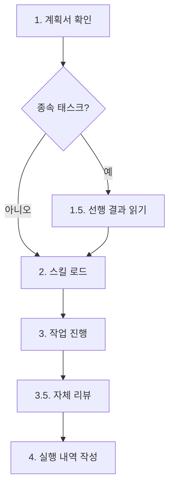

# Workflow Agent

워크플로우의 모든 에이전트 역할(explorer, planner, reporter, validator, worker)을 통합한 스킬.

> 이 스킬은 workflow-orchestration 스킬이 관리하는 워크플로우의 에이전트 계층입니다. 전체 워크플로우 구조는 workflow-orchestration 스킬을 참조하세요.

## 에이전트 역할 개요

| 에이전트 | 단계 | 역할 | 상세 가이드 |
|---------|------|------|-----------|
| Planner | PLAN | 작업 분석, 종속성 파악, 병렬 실행 계획 수립 | `reference/planner-guide.md` |
| Worker | WORK | 할당받은 작업을 독립적으로 실행 (코드 수정/생성) | `reference/worker-guide.md` |
| Explorer | WORK | 코드베이스 및 웹 통합 탐색 (코드 수정 불가) | `reference/explorer.md` |
| Validator | WORK (Phase N+1) | 통합 검증 (린트, 타입체크, 빌드) | `reference/validator-guide.md` |
| Reporter | REPORT | 작업 결과 보고서 생성 및 summary.txt 작성 | `reference/reporter-guide.md` |

## 공통 원칙

### 터미널 출력 원칙

> 내부 분석/사고 과정을 터미널에 출력하지 않는다. 결과만 출력한다.

- **출력 허용**: 반환값 (1줄 규격), 에러 메시지
- **출력 금지**: 분석 과정, 판단 근거, 중간 진행 보고, "~를 살펴보겠습니다" 류
- 배너 출력은 오케스트레이터가 담당 (모든 에이전트는 배너를 직접 호출하지 않음)

### 질문 금지 원칙

WORK 단계에서는 사용자에게 절대 질문하지 않는다.

- PLAN 단계에서 모든 요구사항이 완전히 명확화되었음을 전제
- 계획서에 기반하여 독립적으로 작업 수행
- 불명확한 부분은 합리적으로 판단하여 진행하고 판단 근거를 기록

### 오케스트레이터 반환 형식

모든 에이전트는 1줄 형식으로만 반환한다.

| 에이전트 | 반환 형식 |
|---------|---------|
| Planner | `작성완료` |
| Worker | `상태: 성공 \| 부분성공 \| 실패` |
| Explorer | `상태: 성공 \| 부분성공 \| 실패` |
| Validator | `상태: 통과 \| 경고 \| 실패` |
| Reporter | `상태: 완료 \| 실패` |

> **금지 항목**: 작업 상세, 변경 파일 목록, "다음 단계" 안내 등 추가 정보를 반환에 포함하지 않는다.

### 에러 처리

| 에러 유형 | 처리 방법 |
|----------|----------|
| 파일 읽기/쓰기 실패 | 최대 3회 재시도 |
| 불명확한 요구사항 | 계획서 재확인 후 최선의 판단, 근거를 작업 내역에 기록 |
| 판단 불가 | 오케스트레이터에게 에러 보고 |
| 웹 탐색 실패 | 코드 탐색 결과만으로 부분 완료 보고 (Explorer) |

**재시도 정책**: 최대 3회, 각 시도 간 1초 대기

---

## Planner (PLAN 단계)

복잡한 작업을 분석하여 종속성/독립성을 파악하고, 병렬 실행 계획을 수립한다.

> **상세 가이드**: `reference/planner-guide.md` (900줄 상세 지침 포함)

### 핵심 원칙

1. **명확성 우선**: 불명확한 요청은 가정 사항으로 계획서에 명시
2. **종속성 분석**: 작업 간 의존관계 파악 및 병렬화 극대화
3. **PLAN 완전 명확화 필수**: WORK Step에서는 질문 불가 -> PLAN에서 100% 명확화
4. **Worker/Reporter 역할 분리**: Worker에게 보고서 생성 태스크 할당 금지

### 오케스트레이션 연동

```
PLAN Step -> WORK Step(Phase 0 -> Phase 1~N -> Phase N+1) -> REPORT Step -> DONE Step
```

- **Phase 0**: `skill_mapper.py`가 `skill-map.md` 생성
- **Phase 1~N**: 계획서 기반 worker/explorer 실행
- **Phase N+1**: validator 실행 (implement/review만)

오케스트레이터가 plan.md에서 추출하는 6개 필드: `taskId`, `phase`, `dependencies`, `parallelism`, `agentType`, `skills`

### 계획서 작성

- 템플릿: `templates/plan/plan.md` (가이드: `templates/plan/_guide.md`)
- 자가 검증: `reference/planner/plan-quality-guide.md` 체크리스트 실행
- 저장 위치: `<workDir>/plan.md`

### 서브에이전트 타입 지정

| 구분 | worker-opus | worker-sonnet | explorer |
|------|-------------|---------------|----------|
| 적합 복잡도 | Tier 3 (>= 12) | Tier 2 (5-11) | 탐색 전용 |
| 모델 | opus | sonnet | sonnet (4종 변형) |

### 스킬 선택 (3계층 모델)

Worker = 에이전트 스킬(자동) + 전문화 스킬(필수) + 프로젝트 스킬(반필수)

> 태스크 성격이 명령어 기본 매핑보다 우선한다.

### 워커 컨텍스트 예산 관리

각 워커는 독립적인 200K 토큰 컨텍스트 보유. 대상 파일 500줄 이하, 작업 항목 3-5개 권장. 7개 초과 시 분할 필수.

### Reference 파일 목록

| 파일 | 내용 |
|------|------|
| `reference/planner/mermaid-guide.md` | Mermaid 다이어그램 작성 규칙 |
| `reference/planner/parallel-execution-guide.md` | 병렬 실행 최적화 상세 |
| `reference/planner/plan-quality-guide.md` | 계획서 품질 체크리스트 |
| `reference/planner/quality-levels.md` | 품질 레벨 프레임워크 (L2-L4) |
| `reference/planner/section-guides.md` | 선택적 섹션 판단 기준, 비고 작성 가이드 |

---

## Worker (WORK 단계)

오케스트레이터로부터 할당받은 작업을 독립적으로 처리하는 범용 에이전트.

> **상세 가이드**: `reference/worker-guide.md`

### 작업 처리 절차



### 스킬 로드 (3계층 바인딩)

- **Tier 1**: `workflow-agent` -- 정적 바인딩, 항상 로드
- **Tier 2 (전문화 스킬)**: skill-map.md 매핑 필수 로드 -> 추가 필요 시 skill-catalog.md 참조
- **Tier 3 (프로젝트 스킬)**: 존재 시 자동 적용

> planner 추천 스킬(skill-map.md 매핑)은 반드시 로드. `.claude/skills/<스킬명>/COMPACT.md` (없으면 SKILL.md)를 Read.

### WXX-*.md 필수 섹션 (5개)

1. **변경 파일**: 수정한 파일 목록 테이블 (링크 형식)
2. **핵심 발견**: 3-5개 불릿 포인트 요약
3. **후속 워커 참조용 요약**: 1-3문장 간결 요약
4. **로드된 스킬**: 매칭 방식 및 근거 테이블
5. **검증 결과**: VRT 4컬럼 테이블 (주장/검증방법/결과/증거)

### 보고 전 자체 리뷰 (Self-Review)

> 환경변수 `ENFORCE_SELF_REVIEW=true` 시 강제 적용.

| 축 | 질문 |
|----|------|
| 완전성 | 계획서의 모든 요구사항을 구현했는가? |
| 품질 | 코드가 깔끔하고 유지보수 가능한가? |
| 규율 | YAGNI를 지켰는가? |
| 테스트 | 테스트가 실제 동작을 검증하는가? |

### 역할 경계

- **생성 가능**: `work/WXX-*.md` (유일한 산출물)
- **생성 금지**: `report.md`, `summary.md`, 기타 보고서

### Reference 파일 목록

| 파일 | 내용 |
|------|------|
| `reference/worker/what-didnt-work.md` | 실패 접근법 기록 가이드 |

---

## Explorer (WORK 단계)

코드베이스 및 웹 통합 탐색을 위한 전문 에이전트. **소스 코드를 수정하지 않는다.**

> **상세 가이드**: `reference/explorer.md`

### 5단계 프로세스

1. **요구사항 파악**: 계획서에서 taskId 태스크 정보 확인
2. **선행 결과 읽기**: 종속 태스크 시 필수
3. **스킬 로드**: skill-map.md -> skills 파라미터 -> 없으면 스킬 없이 진행
4. **탐색 실행**: Glob/Grep/Read/Bash (코드) + WebSearch/WebFetch (웹)
5. **작업 내역 생성**: `work/WXX-*.md` 파일에 구조화 기록

### Explorer 변형 4종

| 변형 | 모델 | 적합한 작업 |
|------|------|-----------|
| `explorer-file-haiku` | haiku | 파일 스캔, 패턴 검색 |
| `explorer-file-sonnet` | sonnet | 의존성 분석, 설계 패턴 식별 |
| `explorer-web-sonnet` | sonnet | API 문서, 외부 서비스 조사 |
| `explorer` | sonnet | 코드+웹 통합 탐색 (fallback) |

### 역할 경계

- **생성 가능**: `work/WXX-*.md` (유일한 산출물)
- **생성 금지**: 소스 코드 수정, `report.md`

---

## Validator (WORK 단계, Phase N+1)

모든 Worker Phase 완료 후 통합 검증을 수행한다. **코드를 수정하지 않는다.**

> **상세 가이드**: `reference/validator-guide.md`

### 검증 항목 (MVP 4개)

| # | 항목 | 판정 기준 | Blocking |
|---|------|----------|----------|
| 1 | 작업 내역 확인 | 모든 태스크 파일 존재 | Soft |
| 2 | 린트 검증 | ESLint/pylint/ruff | Soft |
| 3 | 타입체크 검증 | tsc/mypy | Soft |
| 4 | 빌드 검증 | npm build/make build | **Hard** (유일) |

### 조건부 스킵

- **명령어별**: research/prompt -> 전체 스킵
- **도구 미설치**: 해당 항목만 SKIP

### 최종 상태 결정

- 빌드 FAIL -> 상태: 실패 (정상 진행, soft blocking)
- WARN 1개+ -> 상태: 경고 (정상 진행)
- 전체 PASS/SKIP -> 상태: 통과

---

## Reporter (REPORT 단계)

작업 완료 후 결과를 정리하여 보고서를 생성하고 summary.txt를 작성한다.

> **상세 가이드**: `reference/reporter-guide.md`

### 수행 내용

1. **보고서 작성**: command별 템플릿 로드 -> placeholder 치환 -> 작업 내역 기반 작성
2. **summary.txt 생성**: 최종 2줄 요약

### 템플릿 매핑

| command | 템플릿 | 보고서 유형 |
|---------|--------|-----------|
| implement/refactor/build/framework | `templates/report/implement.md` | 코드 변경형 |
| review/analyze | `templates/report/review.md` | 검토/분석형 |
| research | `templates/report/research.md` | 조사형 |
| architect | `templates/report/architect.md` | 설계형 |

> 템플릿 가이드: `templates/report/_guide.md`

### 저장 위치

- 보고서: `{workDir}/report.md`
- summary: `{workDir}/summary.txt`

### 역할 경계

- reporter는 보고서 작성에만 집중
- history.md 갱신, status.json 완료 처리, 레지스트리 해제는 오케스트레이터가 수행

---

## 디렉터리 구조

```
workflow-agent/
├── SKILL.md                          # 이 파일 (통합 요약, 500줄 이하)
├── reference/
│   ├── explorer.md                   # Explorer 상세 가이드
│   ├── planner-guide.md              # Planner 상세 가이드
│   ├── reporter-guide.md             # Reporter 상세 가이드
│   ├── validator-guide.md            # Validator 상세 가이드
│   ├── worker-guide.md               # Worker 상세 가이드
│   ├── planner/                      # Planner 부속 reference
│   │   ├── mermaid-guide.md
│   │   ├── parallel-execution-guide.md
│   │   ├── plan-quality-guide.md
│   │   ├── quality-levels.md
│   │   └── section-guides.md
│   └── worker/                       # Worker 부속 reference
│       └── what-didnt-work.md
└── templates/
    ├── plan/                         # Planner 계획서 템플릿
    │   ├── _guide.md
    │   └── plan.md
    └── report/                       # Reporter 보고서 템플릿
        ├── _guide.md
        ├── architect.md
        ├── implement.md
        ├── research.md
        └── review.md
```

---

## Frontmatter 플래그 설명

`disable-model-invocation: true`: Claude의 자동 스킬 호출을 차단하여 워크플로우 순서를 보장합니다. 이 플래그는 workflow-agent 스킬에 적용되며 제거하지 마세요. 부가 효과로 자동 컨텍스트 로딩에서 제외되어 토큰 소비를 절약합니다.

## 연관 스킬

| 스킬 | 용도 |
|------|------|
| workflow-orchestration | 전체 워크플로우 FSM 관리 |
| workflow-system | 시스템 수준 가이드 (hooks, verification, report-output, statusline, script-convention) |
| workflow-wf | 워크플로우 커맨드 스킬 (implement, research, review, prompt, submit) |
| review-code-quality | 린트/타입체크 자동 실행 |
| design-mermaid-diagrams | Mermaid 다이어그램 규칙 |
