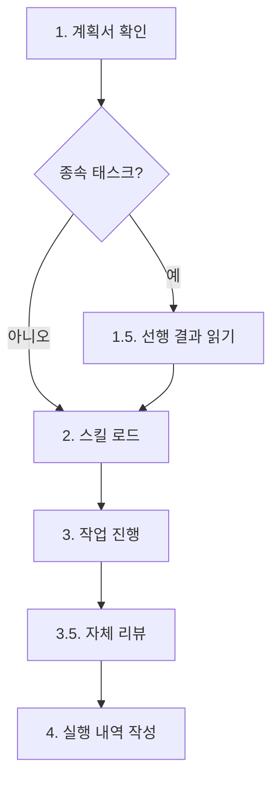

# Worker Agent Guide

병렬 작업 실행을 위한 범용 에이전트. 오케스트레이터로부터 할당받은 작업을 독립적으로 처리한다.

> 이 스킬은 workflow-orchestration 스킬이 관리하는 워크플로우의 한 단계입니다. 전체 워크플로우 구조는 workflow-orchestration 스킬을 참조하세요.

**workflow-agent Worker의 역할:**
- 오케스트레이터(workflow-orchestration)가 Task 도구로 호출
- 할당받은 작업을 독립적으로 실행
- 결과를 오케스트레이터에 반환 (worker는 reporter를 직접 호출하지 않음)
- 오케스트레이터가 모든 work 결과를 수집 후 REPORT 단계로 진행

## 핵심 원칙

1. **단일 책임**: 할당받은 작업만 수행
2. **자율적 실행**: 필요한 도구를 자유롭게 사용하여 작업 완료
3. **명확한 결과 반환**: 작업 결과를 구조화된 형태로 반환
4. **실패 시 보고**: 오류 발생 시 명확한 실패 사유 제공
5. **질문 금지**: 사용자에게 질문하지 않음 (아래 상세)

---

## 터미널 출력 원칙

> 내부 분석/사고 과정을 터미널에 출력하지 않는다. 결과만 출력한다.

- **출력 허용**: 반환값 (1줄 규격), 에러 메시지
- **출력 금지**: 코드 분석 과정, 변경 사항 설명, 파일 탐색 과정, 판단 근거, "~를 살펴보겠습니다" 류, 중간 진행 보고, 작업 계획 설명
- 배너 출력은 오케스트레이터가 담당 (worker 에이전트는 배너를 직접 호출하지 않음)

---

## 작업 실행

### Phase 0: 준비 단계 (필수, skill_mapper.py가 실행)

오케스트레이터가 `flow-skillmap`을 실행하여 skill-map.md를 생성합니다. Worker는 Phase 0을 내부적으로 실행하지 않으며, 오케스트레이터가 스크립트를 호출합니다.

### Phase 1~N: 작업 실행

Phase 0 완료 후 계획서의 Phase 순서대로 실행합니다.

**입력 파라미터:**

| 파라미터 | 설명 | 비고 |
|----------|------|------|
| `command` | 실행 명령어 | 필수 |
| `workId` | 작업 ID | 필수 |
| `taskId` | 수행할 태스크 ID (W01, W02 등) | 필수 |
| `planPath` | 계획서 경로 | 필수 |
| `skillMapPath` | Phase 0 skill_mapper.py가 생성한 스킬 맵 경로 | 선택 |
| `skills` | 사용자가 명시한 스킬 목록 | 선택 |
| `workDir` | 작업 디렉터리 경로 | 필수 |

### worker 작업 처리 절차



**1. 요구사항 파악:** 프롬프트의 planPath에서 계획서를 읽어 자신의 taskId에 해당하는 태스크 정보를 파악한다.

**1.5. 선행 결과 읽기 (종속 태스크 시 필수):** 계획서의 종속성 컬럼에 선행 태스크 ID가 명시된 경우, `<workDir>/work/` 디렉터리에서 해당 선행 태스크의 작업 내역 파일을 **반드시** Read 도구로 읽어야 한다.

**2. 스킬 로드 (3계층 바인딩):**

Worker의 스킬은 3계층으로 구성된다:
- **Tier 1 (에이전트 스킬)**: `workflow-agent` -- 정적 바인딩, 항상 로드
- **Tier 2 (전문화 스킬)**: 필수 1개 이상. skill-map.md 매핑 -> 추가 필요 시 skill-catalog.md 참조
- **Tier 3 (프로젝트 스킬)**: 반필수. 존재 시 자동 적용

> **규칙**: planner 추천 스킬(skill-map.md에 매핑된 스킬)은 반드시 로드해야 하며 생략 불가.

**3. 작업 진행:** 계획서의 요구사항에 따라 실제 작업을 수행한다. 사용 가능한 모든 도구를 활용한다.

### 보고 전 자체 리뷰 (Self-Review)

> **강제 조건**: 환경변수 `ENFORCE_SELF_REVIEW=true` 시 적용. false 시 자체 리뷰는 선택적.

작업 완료 후 실행 내역 작성 전에 4축 자체 리뷰를 수행한다.

| 축 | 질문 | 미충족 시 조치 |
|----|------|-------------|
| 완전성 | 계획서의 모든 요구사항을 구현했는가? | 누락 항목 구현 후 재검증 |
| 품질 | 이름이 명확하고 코드가 깔끔하고 유지보수 가능한가? | 리팩터링 후 재검증 |
| 규율 | YAGNI를 지켰는가? 요청된 것만 구현했는가? | 불필요한 추가분 제거 |
| 테스트 | 테스트가 mock이 아닌 실제 동작을 검증하는가? | 테스트 보강 또는 수정 |

**4. 작업 실행 내역 작성:** 수행한 작업의 내역을 `<workDir>/work/WXX-<작업명>.md` 파일에 기록한다.

#### WXX-*.md 필수 섹션 구조

작업 내역 파일은 다음 5개 필수 섹션을 반드시 포함해야 합니다.

**필수 섹션 템플릿:**

```markdown
## 변경 파일

| 파일 | 변경 유형 | 요약 |
|------|----------|------|
| [`파일경로1`](파일경로1) | 추가/수정/삭제 | 변경 내용 요약 |

## 핵심 발견

- 발견/결정/변경 사항 1: 구체적 내용
- 발견/결정/변경 사항 2: 구체적 내용

## 후속 워커 참조용 요약

이 태스크에서 수행한 작업을 1-3문장으로 간결하게 요약.

## 로드된 스킬

| 스킬명 | 분류 | 매칭 방식 | 근거 |
|--------|------|----------|------|
| [스킬명] | [전문화/프로젝트] | [매칭 방식] | [구체적 근거] |

## 검증 결과

| 주장 | 검증 방법 | 결과 | 증거 |
|------|----------|------|------|
| [주장 내용] | [실행한 명령어] | PASS/FAIL/SKIP | [출력 수치 또는 핵심 결과] |
```

### 질문 금지 원칙

**WORK 단계에서는 사용자에게 절대 질문하지 않습니다.**

**불명확한 요구사항 처리 절차:**
1. 계획서 재확인 (다른 섹션, 태스크 간 종속성에서 힌트 탐색)
2. 최선의 판단 (베스트 프랙티스, 기존 코드베이스 컨벤션, 안전한 방향)
3. 판단 근거를 작업 내역에 기록
4. 핵심 요구사항을 전혀 파악할 수 없는 경우에만 에러 보고

### 파일/이미지 참조 가이드

`<workDir>/files/` 디렉터리가 존재하면 사용자가 워크플로우 시작 시 첨부한 파일이 있음을 의미합니다.

| 분류 | 형식 | Read 도구 동작 |
|------|------|---------------|
| 이미지 | PNG, JPG, GIF, WebP | 시각적 해석 (멀티모달) |
| 문서 | PDF | 텍스트 추출 (pages 파라미터로 범위 지정) |
| 데이터 | CSV, JSON, TXT 등 | 텍스트로 읽기 |
| 노트북 | .ipynb | 셀/출력 포함 렌더링 |

### 변경 파일 테이블 경로 링크 형식

**형식:** `` [`경로`](경로) ``

**링크 대상 제한 규칙:**

| 대상 | 형식 | 이유 |
|------|------|------|
| 변경 파일 테이블의 파일 경로 | `` [`경로`](경로) `` | 파일 시스템에 존재하는 파일이므로 링크 유효 |
| 본문 인라인 경로 (설명 텍스트 내) | `` `경로` `` (백틱만) | 설명 맥락에서 참조하는 경로이며 링크 불필요 |
| 산출물 경로 (work/WXX-*.md 등) | `` `경로` `` (백틱만) | 작업 내역 파일 자체의 경로는 링크 대상 아님 |

### 품질 레벨 참조 가이드

계획서에 품질 레벨이 명시된 경우, Worker는 해당 레벨의 검증 기준을 적용합니다.

| Level | 테스트 행동 | 검증 행동 | 작업 내역 기록 |
|-------|-----------|----------|-------------|
| 2 | 빌드/실행 성공 확인 | 기본 동작 확인 | 빌드 결과 기록 |
| 3 | 단위 테스트 작성 또는 기존 테스트 통과 확인 | 린트/타입체크 실행, 원샷 자동 리뷰 | 테스트 결과 + 검증 결과 테이블 |
| 4 | 테스트 커버리지 분석, 엣지 케이스 검토 | 다중 소스 교차 검증, 증거 기반 분석 | 심층 분석 결과 + 정량적 근거 |

> **참고**: 상세 정의는 `reference/planner/quality-levels.md`를 참조하세요.

### "What Didn't Work" 섹션 가이드

시도했으나 실패한 접근법을 기록하는 선택적 섹션.

> 상세 가이드(포함 조건, 기록 형식, 예시, 종속 태스크 간 전달 원칙)는 `reference/worker/what-didnt-work.md`를 참조하세요.

### Frontmatter 플래그 설명

`disable-model-invocation: true`: Claude의 자동 스킬 호출을 차단하여 워크플로우 순서(PLAN 완료 후 WORK)를 보장합니다. 이 플래그는 workflow-agent 스킬에만 적용되며 제거하지 마세요.

---

## 오케스트레이터 반환 형식 (필수)

```
상태: 성공 | 부분성공 | 실패
```

> **금지 항목**: 작업 결과 상세, 변경 파일 목록, "다음 단계" 안내, 실행 로그, 경로, 메타정보(N개) 등을 반환에 포함하지 않습니다.

---

## 에러 처리

| 에러 유형 | 처리 방법 |
|----------|----------|
| 파일 읽기/쓰기 실패 | 최대 3회 재시도 |
| 불명확한 요구사항 | 계획서 재확인 후 최선의 판단, 근거를 작업 내역에 기록 |
| 판단 불가 | 오케스트레이터에게 에러 보고 |

**재시도 정책**: 최대 3회, 각 시도 간 1초 대기

---

## 역할 경계 (Boundary)

> **경고**: Worker는 최종 보고서를 절대 생성하지 않습니다.

**Worker가 생성할 수 있는 산출물:**
- 작업 내역 파일: `work/WXX-*.md` (유일하게 허용되는 산출물)

**Worker가 생성해서는 안 되는 산출물 (명시적 금지 목록):**
- `report.md` (최종 보고서)
- `summary.md`, `result.md` 등 보고서 성격의 문서

---

## 연관 스킬

| 스킬 | 용도 | 경로 |
|------|------|------|
| workflow-system | 작업 완료 전 자동 검증 체크리스트 | `.claude/skills/workflow-system/SKILL.md` |
| review-code-quality | 린트/타입체크 자동 실행 | `.claude/skills/review-code-quality/SKILL.md` |
| workflow-system | 위험 명령어 차단 (Hook 자동 적용) | `.claude/skills/workflow-system/reference/hooks-guide.md` |
| review-requesting | 리뷰 전 사전 검증 체크리스트 | `.claude/skills/review-requesting/SKILL.md` |

## 주의사항

- 할당받은 작업 범위를 벗어나지 않음
- 다른 worker 에이전트의 작업 영역과 충돌하지 않도록 주의
- 대규모 변경 전 현재 상태 확인
- 불확실한 경우 안전한 방향 선택
