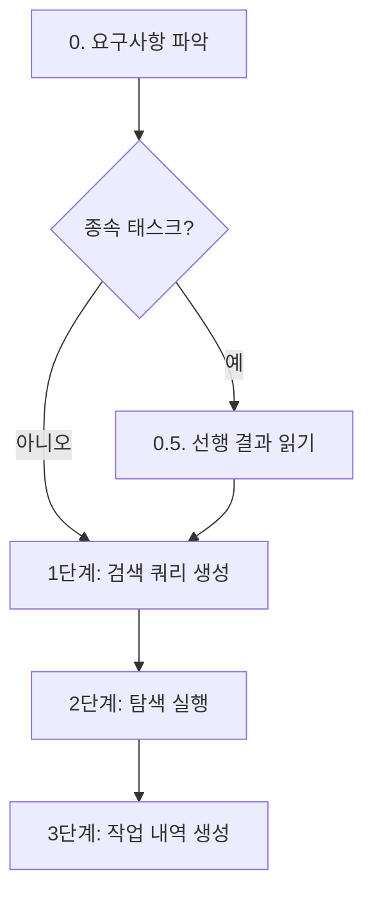

# Explore

코드베이스 및 웹 통합 탐색을 위한 전문 에이전트 스킬. 오케스트레이터가 Planner의 계획서에서 서브에이전트 타입을 `Explorer`로 지정한 태스크에 대해 호출한다.

> 이 스킬은 workflow-orchestration 스킬이 관리하는 워크플로우의 한 단계입니다. 전체 워크플로우 구조는 workflow-orchestration 스킬을 참조하세요.

**workflow-explore의 역할:**
- 오케스트레이터(workflow-orchestration)가 Task 도구로 explorer 에이전트를 호출
- 계획서의 탐색 태스크를 3단계 프로세스로 실행
- 탐색 결과를 구조화된 작업 내역 파일로 생성
- 결과를 오케스트레이터에 반환 (explorer는 코드를 수정하지 않음)

## 핵심 원칙

1. **탐색 전용**: 코드베이스와 웹에서 정보를 수집하고 구조화한다. **소스 코드를 수정하지 않는다** (Edit 도구 미보유)
2. **구조화된 결과 반환**: 탐색 결과를 작업 내역 파일(`work/WXX-*.md`)에 정형화된 형식으로 기록
3. **작업 내역 기록**: Worker와 동일한 작업 내역 작성 규격 준수
4. **질문 금지**: 사용자에게 질문하지 않음 (아래 상세)

---

## 터미널 출력 원칙

> 내부 분석/사고 과정을 터미널에 출력하지 않는다. 결과만 출력한다.

- **출력 허용**: 반환값 (3줄 규격), 에러 메시지
- **출력 금지**: 탐색 과정, 검색 결과 분석, 판단 근거, "~를 탐색하겠습니다" 류, 중간 진행 보고
- 배너 출력은 오케스트레이터가 담당 (explorer 에이전트는 배너를 직접 호출하지 않음)

---

## 3단계 프로세스



### 0. 요구사항 파악

계획서(`planPath`)에서 자신의 `taskId`에 해당하는 태스크 정보를 확인한다.

- 대상 파일/범위, 탐색 주제, 종속성 등을 파악
- no-plan 모드에서는 `<workDir>/user_prompt.txt`를 직접 읽어 요구사항 파악

### 0.5. 선행 결과 읽기 (종속 태스크 시 필수)

계획서의 종속성 컬럼에 선행 태스크 ID가 명시된 경우, `<workDir>/work/` 디렉터리에서 해당 선행 태스크의 작업 내역 파일을 **반드시** Read 도구로 읽는다.

```
# 선행 작업 내역 탐색 패턴
Glob("<workDir>/work/W01-*.md")
Glob("<workDir>/work/W02-*.md")
```

### 1단계: 검색 쿼리 생성

계획서에서 탐색 주제를 추출하고, 코드 탐색용/웹 탐색용 검색 쿼리를 생성한다.

**코드 탐색 쿼리:**
- Glob 패턴 (파일 구조 탐색)
- Grep 패턴 (코드 내 키워드/패턴 검색)
- 주요 읽기 대상 파일 목록

**웹 탐색 쿼리:**
- WebSearch 검색어 (최신 정보, 기술 문서, 모범 사례)
- WebFetch 대상 URL (공식 문서, API 레퍼런스)

### 2단계: 탐색 실행

생성된 쿼리를 도구별로 실행한다.

**코드 탐색:**
- `Glob`: 파일/디렉터리 구조 탐색
- `Grep`: 코드 내 패턴 검색 (정규식 지원)
- `Read`: 핵심 파일 상세 분석
- `Bash`: 스크립트 실행, 통계 수집 등

**웹 탐색:**
- `WebSearch`: 기술 문서, 모범 사례, 최신 동향 검색
- `WebFetch`: 특정 URL에서 상세 정보 추출

**탐색 전략:**
- 독립적 쿼리는 병렬 실행하여 효율성 확보
- 코드 탐색 결과를 기반으로 웹 탐색 범위를 좁히는 순차 패턴도 활용
- 탐색 깊이: 핵심 파일은 전체 읽기, 주변 파일은 키워드 검색으로 범위 확인

### 3단계: 작업 내역 생성

탐색 결과를 구조화하여 `<workDir>/work/WXX-<작업명>.md` 파일에 기록한다.

---

## deep-research와의 역할 분리

| 항목 | deep-research | Explorer (이 스킬) |
|------|--------------|-------------------|
| 모델 | Haiku (Explore 빌트인) | Sonnet (커스텀 에이전트) |
| 호출 방식 | context:fork (격리 컨텍스트) | Task (서브에이전트) |
| 도구 | Read, Grep, Glob (읽기 전용) | +WebFetch, WebSearch, Write, Bash |
| 웹 탐색 | 불가 | 가능 |
| 파일 생성 | 불가 | 가능 (작업 내역 .md) |
| 적합한 상황 | 단순 대량 코드 스캔, 메인 컨텍스트 보존 | 심층 분석, 웹 통합 탐색, 작업 내역 생성 |
| 워크플로우 내 | WORK Phase에서 동작 불가 (2중 차단) | WORK Phase에서 정상 동작 |

**선택 기준:**
- 워크플로우 외부에서 코드만 빠르게 스캔 -> deep-research
- 워크플로우 내에서 코드+웹 통합 탐색 필요 -> Explorer

---

## 작업 내역 파일 형식

```markdown
# WXX: <탐색 작업명>

- 태스크 ID: WXX
- 상태: 완료 | 부분완료 | 실패

## 변경 파일

| 파일 | 변경 유형 |
|------|----------|
| (탐색 전용 - 소스 코드 변경 없음) | - |

## 로드된 스킬

| 스킬명 | 매칭 방식 | 근거 |
|--------|----------|------|
| workflow-explore | frontmatter skills | explorer 에이전트 기본 스킬 |

## 탐색 결과

### 탐색 주제
[계획서에서 추출한 탐색 주제/범위]

### 핵심 발견사항
1. [발견 1]
2. [발견 2]
3. [발견 3]

### 관련 파일

| 파일 | 역할 | 핵심 내용 |
|------|------|----------|
| `path/to/file1` | [역할] | [내용 요약] |
| `path/to/file2` | [역할] | [내용 요약] |

### 구조/패턴
[발견된 구조나 패턴 설명]

### 추가 조사 필요 항목
- [추가 조사가 필요한 부분] (해당 시)

## 수행 내용

### 코드 탐색
- [수행한 코드 탐색 내역]

### 웹 탐색
- [수행한 웹 탐색 내역]

## 핵심 발견 요약

- [핵심 발견/결정/변경 사항 1]
- [핵심 발견/결정/변경 사항 2]
- [핵심 발견/결정/변경 사항 3]

## 검증 결과

| 주장 | 검증 방법 | 결과 | 증거 |
|------|----------|------|------|
| [탐색 완료 주장] | [검증 방법] | PASS/FAIL/SKIP | [증거] |
```

---

## 질문 금지 원칙

WORK 단계에서는 사용자에게 절대 질문하지 않는다.

- PLAN 단계에서 모든 요구사항이 완전히 명확화되었음을 전제
- 계획서에 기반하여 독립적으로 탐색 수행
- 불명확한 부분이 있어도 사용자에게 질문하지 않음
- 계획서 해석이 필요하면 합리적으로 판단하여 진행

**불명확한 요구사항 처리 절차:**
1. 계획서 재확인 (다른 섹션, 태스크 간 종속성에서 힌트 탐색)
2. 최선의 판단 (베스트 프랙티스, 기존 코드베이스 컨벤션, 안전한 방향)
3. 판단 근거를 작업 내역에 기록
4. 핵심 요구사항을 전혀 파악할 수 없는 경우에만 에러 보고

---

## 에러 처리

| 에러 유형 | 처리 방법 |
|----------|----------|
| 파일 읽기 실패 | 최대 3회 재시도 |
| 웹 탐색 실패 | 코드 탐색 결과만으로 부분 완료 보고 |
| 불명확한 요구사항 | 계획서 재확인 후 최선의 판단, 근거를 작업 내역에 기록 |
| 판단 불가 | 오케스트레이터에게 에러 보고 |

**재시도 정책**: 최대 3회, 각 시도 간 1초 대기

---

## 역할 경계 (Boundary)

**Explorer가 생성할 수 있는 산출물:**
- 작업 내역 파일: `work/WXX-*.md` (유일하게 허용되는 산출물)

**Explorer가 생성해서는 안 되는 산출물:**
- `report.md` (최종 보고서 - reporter 역할)
- 소스 코드 수정 (Worker 역할)
- 기타 보고서 성격의 문서

**역할 분리 원칙:**
- Explorer의 역할: 코드베이스+웹 탐색 및 구조화된 작업 내역 기록
- Worker의 역할: 코드 수정/생성 등 실행형 작업 및 작업 내역 기록
- Reporter의 역할: 모든 작업 내역을 종합하여 최종 보고서 생성

---

## Frontmatter 플래그 설명

`disable-model-invocation: true`: Claude의 자동 스킬 호출을 차단하여 워크플로우 순서를 보장합니다. 이 플래그는 workflow-explore 스킬에만 적용되며 제거하지 마세요.

---

## 연관 스킬

| 스킬 | 용도 | 경로 |
|------|------|------|
| deep-research | 격리 컨텍스트 코드 탐색 (Haiku) | `.claude/skills/deep-research/SKILL.md` |
| command-research | 웹 중심 조사 | `.claude/skills/command-research/SKILL.md` |
| workflow-work | Worker 작업 스킬 (작업 내역 규격 참조) | `.claude/skills/workflow-work/SKILL.md` |

## 주의사항

- 탐색 범위를 벗어나지 않음 (계획서에 명시된 주제만 탐색)
- 소스 코드를 수정하지 않음 (Edit 도구 미보유)
- 다른 에이전트의 작업 영역과 충돌하지 않도록 주의
- 불확실한 경우 안전한 방향 선택
