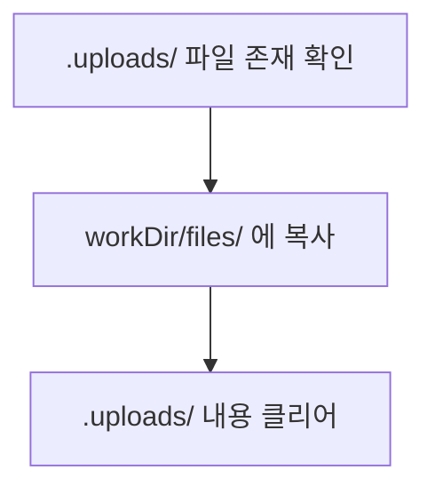

# Init

사용자 요청을 전처리하여 워크플로우의 입력을 준비하는 스킬.

> 이 스킬은 workflow-orchestration 스킬이 관리하는 워크플로우의 한 단계입니다. 전체 워크플로우 구조는 workflow-orchestration 스킬을 참조하세요.

---

## 터미널 출력 원칙

> 내부 분석/사고 과정을 터미널에 출력하지 않는다. 결과만 출력한다.

- **출력 허용**: 반환값 (8줄 규격), 에러 메시지, AskUserQuestion 호출
- **출력 금지**: 분석 과정, 판단 근거 설명, "~를 살펴보겠습니다" 류, 중간 진행 보고, 작업 계획 설명
- 파일 읽기/쓰기 등 내부 작업은 묵묵히 수행하고 최종 반환값만 출력
- INIT 시작/완료 배너는 오케스트레이터가 호출. init 에이전트는 배너를 직접 호출하지 않음

---

## 절차 (3단계)

### Step 1: prompt.txt 읽기 및 시나리오 분기

Read 도구로 **프로젝트 루트의** `.prompt/prompt.txt`를 읽습니다. (CWD가 프로젝트 루트가 아닐 수 있으므로 반드시 절대 경로를 사용)

**분기 판단:**
- 파일에 내용이 있으면 (공백/줄바꿈 외 텍스트 존재) -> Step 2로 진행
- 파일이 없거나 내용이 비어있으면 -> 시나리오 분기:

  - **시나리오 1**: 이전 COMPLETED 워크플로우가 존재하는 경우
    1. `.workflow/` 하위에서 가장 최근 COMPLETED 상태의 워크플로우 탐색
    2. 해당 워크플로우의 `report.md`를 읽어 분석
    3. 후속 작업을 제안하고 AskUserQuestion으로 사용자에게 확인
    4. 사용자가 승인하면 그 내용을 prompt로 사용하여 Step 2로 진행
    5. 사용자가 거부하면 워크플로우 중지

  - **시나리오 2**: 이전 워크플로우가 없는 경우
    - 워크플로우 중지: "`<프로젝트루트>/.prompt/prompt.txt`에 요청 내용을 작성한 후 다시 실행해주세요." (절대 경로로 안내)

### Step 2: 작업 제목 생성

사용자 요청(promptContent)에서 작업 제목을 생성합니다.

**규칙:**
- 요청의 핵심을 20자 이내로 요약
- 한글 사용 가능
- 공백 -> 하이픈(-)으로 변환
- 특수문자(!, @, #, $, %, ^, &, *, (, ), /, \, :, ;, <, >, ?, |, `, ~, " 등) 제거
- 마침표(.) -> 하이픈(-)으로 변환
- 연속 하이픈(--) -> 단일 하이픈(-)으로
- 20자 초과 시 절단

**예시:**
- "로그인 기능 추가" -> "로그인기능추가"
- "PR #123 리뷰" -> "PR-123-리뷰"
- "src/auth/login.ts 버그 수정" -> "src-auth-login-ts-버그수정" (20자 절단)

### Step 3: workId 생성 및 init-workflow.sh 스크립트 실행

Bash 도구로 **정확한 KST 기반** 현재 시간을 가져옵니다:
```bash
TZ=Asia/Seoul date +"%Y%m%d-%H%M%S"
```

**반드시 Bash 실행 결과를 그대로 사용하세요. LLM이 자체 추정하지 마세요.**

출력 예: `20260205-204500`
- date: 하이픈 앞 8자리 (예: 20260205)
- workId: 하이픈 뒤 6자리 (예: 204500)

그 다음, Bash 도구로 통합 초기화 스크립트를 실행합니다:

```bash
wf-init <command> .workflow/<YYYYMMDD>-<workId>/<workName>/<command> <workId> <제목> ${CLAUDE_SESSION_ID} <mode>
```

> **workDir 형식:**
> 두 번째 인자 `workDir`은 `.workflow/<YYYYMMDD>-<HHMMSS>/<workName>/<command>` 형식입니다.
> - 올바른 예: `.workflow/20260208-133900/로그인기능추가/implement`
> - 잘못된 예: `.workflow/20260208-133900` (구 플랫 형식)
> - 잘못된 예: `.workflow/20260208-133900-워크플로우-완료/implement` (레거시 형식)
>
> `<workName>`은 Step 2에서 생성한 작업 제목 기반 하이픈 변환 값입니다.

> **workDir 내부 구조:**
> ```
> <workDir>/
>   .context.json
>   status.json
>   user_prompt.txt
>   plan.md
>   files/              <- .uploads/에서 복사된 첨부 파일 (Step 3-B)
>   work/
>   report.md
> ```

**인자:**
| 순서 | 인자 | 설명 |
|------|------|------|
| 1 | command | 실행 명령어 (implement, refactor 등) |
| 2 | workDir | 작업 디렉터리 경로 (`.workflow/YYYYMMDD-HHMMSS/<workName>/<command>`) |
| 3 | workId | 작업 ID (HHMMSS) |
| 4 | title | 작업 제목 |
| 5 | claude_session_id | (선택적) `${CLAUDE_SESSION_ID}` - 현재 세션 UUID 자동 치환 |
| 6 | mode | (선택적) 워크플로우 모드: `full`(기본값), `no-plan`, `prompt` |

**스크립트가 수행하는 작업:**
1. `.prompt/prompt.txt` 읽기
2. 작업 디렉터리 생성 (`mkdir -p`)
3. `prompt.txt` -> `<workDir>/user_prompt.txt` 복사
3-B. `.uploads/` 파일 -> `<workDir>/files/` 복사 + `.uploads/` 클리어
4. `.prompt/prompt.txt` 클리어
5. `.prompt/querys.txt` 갱신
6. `<workDir>/.context.json` 생성
7. `<workDir>/status.json` 생성 (`mode` 필드 포함 - 6번째 인자로 전달된 모드 값)
8. 좀비 정리 (cleanup-zombie.sh 위임: TTL 만료 → STALE 전환 + 레지스트리 정리)
9. 전역 레지스트리 등록

**Step 3-B 파일 파이프라인:**

`.uploads/` 디렉터리에 사용자가 첨부한 파일(이미지, PDF 등)이 있으면, 스크립트가 자동으로 다음 흐름을 수행합니다:



- **복사 대상**: `.uploads/` 내 모든 파일을 `<workDir>/files/`로 물리적 복사
- **클리어**: `.uploads/` 디렉터리는 유지하되 내부 파일만 삭제
- **조건**: `.uploads/` 디렉터리가 없거나 비어있으면 이 단계를 건너뜀

**주의:** 스크립트 stdout 출력은 무시합니다. 에이전트는 Step 1에서 읽은 prompt.txt 내용만 사용합니다.

---

## 컨텍스트 용량 확인

절차를 시작하기 **전에** 현재 컨텍스트 사용량을 확인합니다. 워크플로우는 PLAN, WORK, REPORT 단계를 거치며 컨텍스트를 지속적으로 소비하므로, 시작 시점의 여유 공간이 중요합니다.

### 체크 기준

| 사용량 | 수준 | 대응 |
|--------|------|------|
| 70% 미만 | 정상 | 그대로 진행 |
| 70% 이상 ~ 80% 미만 | 주의 | `/compact` 권고 메시지 출력 후 진행 |
| 80% 이상 | 위험 | `/compact` 강력 권고 메시지 출력 후 진행 |

### 권고 메시지

**70% 이상 (주의):**
[컨텍스트 주의] 현재 컨텍스트 사용량이 70%를 초과했습니다.
워크플로우 진행 중 컨텍스트가 부족해질 수 있습니다.
권고: /compact 명령어로 컨텍스트를 정리한 후 다시 시도해주세요.

**80% 이상 (위험):**
[컨텍스트 경고] 현재 컨텍스트 사용량이 80%를 초과했습니다.
워크플로우 진행 시 자동 컴팩트가 발생할 가능성이 매우 높습니다.
자동 컴팩트 발생 시 작업 컨텍스트가 유실되어 작업 품질이 저하됩니다.
강력 권고: /compact 명령어로 컨텍스트를 정리한 후 다시 시도해주세요.

### 체크 절차

1. 컨텍스트 사용량 확인
   - 현재 컨텍스트 사용 비율 파악
2. 기준 평가
   - 70% 미만: 정상 -> 절차 시작
   - 70% 이상: 권고 메시지 출력 -> 절차 시작
   - 80% 이상: 강력 권고 메시지 출력 -> 절차 시작

> **참고**: 컨텍스트 체크는 권고 사항이며, 워크플로우 진행을 차단하지 않습니다. 사용자가 권고를 무시하고 진행할 수 있습니다.

---

## 반환 형식 (필수)

> **엄격 준수**: 아래 8줄 형식만 반환합니다. 추가 정보 금지.
> **경고**: 반환값이 규격 줄 수(8줄)를 초과하면 메인 에이전트 컨텍스트가 폭증하여 시스템 장애가 발생합니다.

```
request: <user_prompt.txt의 첫 50자>
workDir: .workflow/<YYYYMMDD>-<HHMMSS>/<workName>/<command>
workId: <workId>
registryKey: <YYYYMMDD>-<HHMMSS>
date: <YYYYMMDD>
title: <제목>
workName: <작업이름>
근거: [1줄 요약]
```

**절대 포함하지 않을 항목:**
- 요청 전문
- "다음 단계" 안내
- 판단 근거 상세
- 변경 파일 목록, 예상 작업 시간, 복잡도 등 상세 정보
- 마크다운 헤더, 부가 섹션

---

## 에러 처리

| 에러 | 처리 |
|------|------|
| prompt.txt 없거나 비어있음 | 시나리오 분기 (Step 1 참조) |
| wf-init 실행 실패 | 에러 반환 (워크플로우 중단) |
| 파일 읽기 실패 | 경로 확인 후 재시도 (최대 3회) |

### 에러 시 반환

**스크립트 실행 실패:**
```
에러: [에러 메시지]
```

### 재시도 정책

- 최대 3회, 각 시도 간 1초 대기
- 재시도 대상: 파일 읽기 실패, 스크립트 실행 실패
- 3회 실패 시 에러 보고

---

## 역할 경계 (Boundary)

init은 **전처리**만 수행합니다. 모든 command(implement, refactor, review, build, analyze, architect, framework, research, prompt)가 init을 통과합니다. 다음 행위는 절대 금지:

- 소스 코드 파일을 Read/Grep으로 탐색하지 마라
- 소스 코드를 Write/Edit하지 마라
- 코드 리뷰 의견을 제시하지 마라
- 이전 워크플로우의 report.md를 분석하지 마라 (**예외**: Step 1 시나리오 1 - prompt.txt 비어있고 이전 COMPLETED 워크플로우 존재 시 허용)
- 후속 작업을 제안하지 마라 (**예외**: Step 1 시나리오 1 - prompt.txt 비어있고 이전 COMPLETED 워크플로우 존재 시 허용)
- PLAN/WORK/REPORT 단계의 작업을 수행하지 마라
- 미완료 워크플로우를 확인하거나 상태 테이블을 출력하지 마라 (registry.json 조회 포함). 다중 워크플로우 동시 실행은 시스템 설계 사항이며, 새 워크플로우 시작에 영향을 주지 않는다.

---

## 동시성 안전성 (Concurrency Safety)

전역 `.workflow/registry.json`은 **활성 워크플로우 레지스트리** 방식으로 운영됩니다:

- **전역 파일 직접 쓰기 금지**: 모든 전역 레지스트리 접근은 `update-workflow-state.sh register/unregister`를 통해 수행
- **파일 잠금 보호**: register/unregister 시 파일 잠금으로 동시성 경합 방지
- **로컬 .context.json 독립성**: 각 워크플로우는 자체 `<workDir>/.context.json`을 독립적으로 관리

## 주의사항

1. **Step 순서 엄수**: 반드시 Step 1 -> 2 -> 3 순서로 진행
2. **반환 형식 엄수**: 8줄 형식 외 추가 정보 금지
3. **workId는 Bash로 생성**: LLM이 자체 추정하지 않음
4. **전역 registry.json 직접 쓰기 금지**: init-workflow.sh가 레지스트리 등록을 처리함
