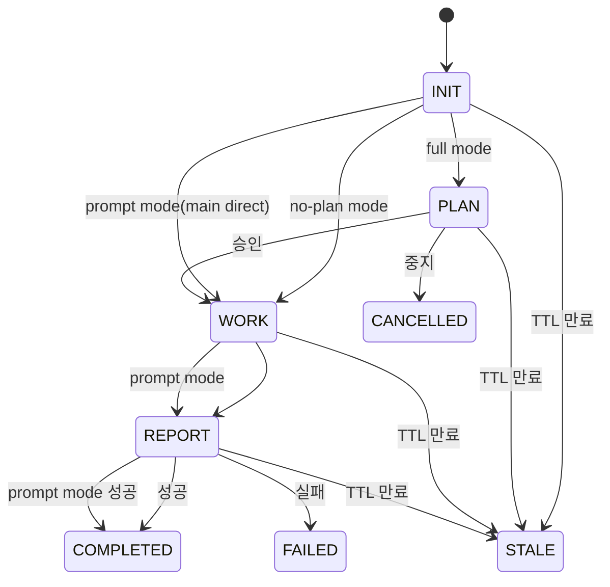

# Orchestrator

Main agent controls workflow sequencing and agent dispatch only.

## FSM State Transition Diagram



## Mode-Phase Order

| Mode | Phase Order | Agent Sequence | Skip |
|------|-------------|----------------|------|
| full (default) | INIT -> PLAN -> WORK -> REPORT -> COMPLETED | init -> planner -> worker(s)/explorer(s) -> reporter -> done | None |
| no-plan (`-np`) | INIT -> WORK -> REPORT -> COMPLETED | init -> worker -> reporter -> done | PLAN |
| prompt | INIT -> WORK -> REPORT -> COMPLETED | init -> (main direct) -> reporter -> done | PLAN |

1. Phase order within each mode MUST NOT be violated
2. PLAN approval REQUIRED before WORK proceeds (full mode only)
3. Violation: halt workflow and report error

## Agent-Phase Mapping

| Phase | Agent | Skill | Return Lines | Key Output |
|-------|-------|-------|-------------|------------|
| INIT | init | workflow-init | 8 | request, workDir, workId, registryKey |
| PLAN | planner | workflow-plan | 3 | plan path |
| WORK | worker | workflow-work + command skills | 3 | work log path |
| WORK | explorer | workflow-explore | 3 | exploration result path |
| REPORT | reporter | workflow-report | 2 | report path |
| DONE | done | workflow-done | 1 | status |

---

## Supported Commands

| Command | Description |
|---------|------------|
| implement | Feature implementation, refactoring, architecture diagrams |
| review | Code review |
| research | Research/investigation and internal asset analysis |
| strategy | Multi-workflow strategy and roadmap generation |
| prompt | Lightweight direct work (Tier 3, main agent direct + reporter + done) |

Commands follow their mode's phase order. Default is full. `prompt` always runs in prompt mode.

## Input Parameters

- `command`: execution command (implement, review, research, strategy, prompt)

> cc:* commands do NOT use `$ARGUMENTS` for prompt content. User requests are handled by init agent via `.prompt/prompt.txt`. Mode flags (`-np`) in `$ARGUMENTS` are allowed for mode selection only.

---

## Terminal Output Protocol

> Core principle: Users want phase-level results only. MUST NOT output internal analysis/reasoning.

### Phase Banner Calls

```bash
# Phase start banner
Workflow <registryKey> <phase>

# Phase completion banner (status included, path auto-inferred)
Workflow <registryKey> <phase> <status>
```

- **`<registryKey>`**: `YYYYMMDD-HHMMSS` format workflow identifier (full workDir path backward compatible)

**Call Timing:**

| Timing | Command |
|--------|---------|
| Before INIT | `Workflow INIT none <command>` |
| Before/After PLAN | `Workflow <registryKey> PLAN` / `Workflow <registryKey> PLAN done` |
| Before/After WORK | `Workflow <registryKey> WORK` / `Workflow <registryKey> WORK done` |
| WORK Phase 0~N start | `Workflow <registryKey> WORK-PHASE <N> "<taskIds>" <parallel\|sequential>` |
| Before/After REPORT | `Workflow <registryKey> REPORT` / `Workflow <registryKey> REPORT done` |
| Before/After DONE | `Workflow <registryKey> DONE` / `Workflow <registryKey> DONE done` |
| Before/After WORK (prompt) | `Workflow <registryKey> WORK` / `Workflow <registryKey> WORK done` (main direct work) |

PLAN completion banner MUST complete before AskUserQuestion (sequential, 2 separate turns).

DONE start banner: Called by orchestrator before dispatching done agent. DONE completion banner: Called by orchestrator after done agent returns. Auto-sends Slack notification.

**CRITICAL: After DONE banner, the orchestrator MUST terminate immediately. Output ZERO text after DONE banner. Any post-DONE output is a protocol violation.**

### Post-Return Silence Rules

| Step Completed | Allowed Actions | Prohibited |
|---------------|----------------|------------|
| INIT done (full) | Extract/retain params, PLAN banner, status update, planner call | Return summary, progress text, **AskUserQuestion**, init 반환값 판단/검증 |
| INIT done (no-plan) | Extract/retain params, skip PLAN, WORK banner, status update (INIT->WORK), single worker call | PLAN banner, planner call, AskUserQuestion |
| INIT done (prompt) | Direct work by main agent, WORK banner, status update (INIT->WORK) | PLAN banner, planner call |
| PLAN (2a) done | PLAN completion banner **(await Bash)**, then AskUserQuestion **(sequential, MUST NOT parallel)** | Plan summary, parallel banner+ask |
| PLAN (2b) done | Branch on approval, WORK banner, status update | Approval explanation |
| WORK Phase start | WORK-PHASE 0 banner (MUST FIRST), then Phase 0 worker call, then Phase 1~N | Skipping Phase banner, Skipping Phase 0 banner, **Phase 0 스킵 (CRITICAL VIOLATION)**, **progress/waiting text** |
| WORK in progress | Next worker call (parallel/sequential per dependency) | Planner re-call, status rollback, autonomous augmentation, **Phase 0 스킵 후 Phase 1 진행**, **progress/waiting text (any language), phase status messages** |
| WORK done | WORK completion banner, extract first 3 lines, REPORT banner, reporter call | Work summary, file listing |
| REPORT done | REPORT completion banner, DONE start banner, done agent call, extract first 2 lines, DONE completion banner, immediate termination | Report summary, any post-DONE text |

---

## Step 1: INIT

**Details:** See [step1-init.md](step1-init.md)

```bash
Workflow INIT none <command>
```

```
Task(subagent_type="init", prompt="command: <command>, mode: <mode>")
```

Returns: `request`, `workDir`, `workId`, `registryKey`, `date`, `title`, `workName`, `rationale` -- all MUST be retained for subsequent phases.

### INIT Return Handling (CRITICAL)

> **init이 8줄 규격으로 정상 반환하면, 오케스트레이터는 반환값을 무조건 수용하고 즉시 다음 단계로 진행한다.**

| 금지 행위 | 이유 |
|-----------|------|
| `request` 필드의 품질/완전성 평가 | request가 불완전해 보여도 판단은 오케스트레이터의 역할이 아님. user_prompt.txt 원문은 workDir에 보존되어 있으며 planner가 읽음 |
| init 반환값 기반 AskUserQuestion | 사용자 확인이 필요한 시나리오(prompt.txt 비어있음 등)는 init 에이전트가 자체 처리 완료 |
| 반환값 재해석/보정 | init이 반환한 값을 수정하거나 다른 값으로 대체 금지 |

**오케스트레이터의 유일한 분기 조건:** init이 `에러:` 접두사로 반환한 경우에만 워크플로우를 중단한다. 그 외 모든 경우 → Mode Branching으로 진행.

### Mode Branching (After INIT)

| Command | Mode | Next Step |
|---------|------|-----------|
| `prompt` | prompt | Skip PLAN, main agent direct WORK -> REPORT -> DONE. See [step1-init.md](step1-init.md) "Prompt Mode Post-INIT Flow" |
| Others with `-np` | no-plan | Skip to WORK. See [step1-init.md](step1-init.md) "No-Plan Mode" |
| Others (default) | full | Proceed to PLAN |

---

## Sub-agent Dispatch

### Step 2: PLAN

**Details:** See [step2-plan.md](step2-plan.md)

**Status update:** `wf-state both <registryKey> planner INIT PLAN`

```
Task(subagent_type="planner", prompt="command: <command>, workId: <workId>, request: <request>, workDir: <workDir>")
```

After planner returns, orchestrator performs **AskUserQuestion** approval (3 fixed options). See [step2-plan.md](step2-plan.md) for approval flow, .context.json handling, CANCELLED processing, and Binding Contract rule.

### Step 3: WORK

**Details:** See [step3-work.md](step3-work.md)

**Status update (mode-aware):**
- full mode: `wf-state both <registryKey> worker PLAN WORK`
- no-plan mode: `wf-state both <registryKey> worker INIT WORK`
- prompt mode: `wf-state both <registryKey> worker INIT WORK` (main agent direct work, no worker sub-agent)

**Rules:** Only worker/explorer/reporter calls allowed. MUST NOT re-call planner/init. MUST NOT reverse phase. Execute ONLY plan tasks (full mode), user_prompt.txt request (no-plan mode), or main agent direct work (prompt mode).

**Worker dispatch patterns:** Phase 0 is NON-NEGOTIABLE and MUST execute before any Phase 1~N worker calls. See [step3-work.md](step3-work.md) for no-plan mode, Phase 0 mandatory execution, Phase 1~N task execution, and usage-pending tracking.

**Worker return:** Extract first 3 lines only (discard from line 4). Details in .workflow/ files.

### Step 4: REPORT

**Details:** See [step4-report.md](step4-report.md)

**Status update:** `wf-state both <registryKey> reporter WORK REPORT`

```
Task(subagent_type="reporter", prompt="command: <command>, workId: <workId>, workDir: <workDir>, workPath: <workDir>/work/")
```

### Step 5: DONE

**Details:** See [step5-done.md](step5-done.md)

After REPORT completion: DONE start banner -> done agent call -> DONE completion banner -> terminate.

```bash
Workflow <registryKey> DONE
Task(subagent_type="done", prompt="registryKey: <registryKey>, workDir: <workDir>, command: <command>, title: <title>, reportPath: <reportPath>, status: <status>, workflow_id: <workflow_id>")
Workflow <registryKey> DONE done
```

---

## Common Reference

> Sub-agent return formats, state update methods, FSM transition rules, error handling: See [common-reference.md](common-reference.md)

---

## Main Agent vs Sub-agent Responsibility Boundary

### Orchestrator-Only Actions

| Action | Description |
|--------|-------------|
| Phase banner Bash calls | `Workflow <registryKey> <phase>` start/completion banners |
| AskUserQuestion calls | PLAN approval, error escalation, user confirmation |
| wf-state transition/registry | `wf-state both/status/context/register/unregister/link-session` |
| Sub-agent return extraction | Extract first N lines only from sub-agent returns (discard remainder) |
| prompt.txt handling (INIT + 수정 요청 only) | INIT: init agent가 prompt.txt -> user_prompt.txt 복사 + prompt.txt 클리어. 수정 요청: reload-prompt.sh가 prompt.txt -> user_prompt.txt append + prompt.txt 클리어. 승인/중지 시 prompt.txt 접근 MUST NOT |
| Post-DONE immediate termination | Zero text output after DONE completion banner |

### Sub-agent-Only Actions

| Agent | Exclusive Actions |
|-------|-------------------|
| init | Workflow initialization, workDir creation, prompt.txt processing, status.json/registry setup |
| planner | Plan document authoring (`plan.md`), task decomposition, phase/dependency design |
| worker | Source code read/modify/create (Read/Write/Edit), code analysis, test execution, work log authoring (`work/WXX-*.md`) |
| explorer | Codebase+web exploration, structured exploration result reporting, work log authoring (`work/WXX-*.md`) |
| reporter | Final report authoring (`report.md`), work log aggregation |
| done | Finalization processing, Slack notification, cleanup |

### Orchestrator Prohibited Actions

| Prohibited Action | Reason |
|-------------------|--------|
| Direct source code modification (Write/Edit) | Worker exclusive; orchestrator is sequencing-only |
| Direct code analysis/review | Worker exclusive; orchestrator must not interpret code |
| Plan/report/work-log authoring | Respective sub-agent exclusive (planner/reporter/worker) |
| Sub-agent return interpretation/summary/explanation output | Returns are opaque routing tokens; any interpretation pollutes terminal and inflates context |
| 승인/중지 후 .prompt/prompt.txt 읽기 | "수정 요청" 외 분기에서 prompt.txt를 읽으면 다른 워크플로우 질의와 충돌 발생. prompt.txt 접근은 INIT(init agent)과 수정 요청(reload-prompt.sh)으로 한정 |

### Platform Constraints Requiring Orchestrator Execution

Certain actions must be performed by the orchestrator due to Claude Code platform limitations, not by design preference.

| Constraint | Explanation |
|------------|-------------|
| AskUserQuestion unavailable in sub-agents | Sub-agents cannot invoke AskUserQuestion (GitHub Issue #12890); all user interaction must route through orchestrator |
| Sub-agent Bash output not visible to user | Sub-agent terminal output is not displayed to the user; phase banners must be called by orchestrator to be visible |
| No direct sub-agent-to-sub-agent invocation | All dispatch goes through orchestrator; sub-agents cannot call Task to spawn sibling agents |

---

## Notes

1. MUST run INIT first; on cc:* command, call init immediately without checking user input
2. Phase order per mode strictly enforced; WORK cannot ask questions (clarification in PLAN only)
3. Git commits via `/git:commit` separately; Slack failure does not block workflow
