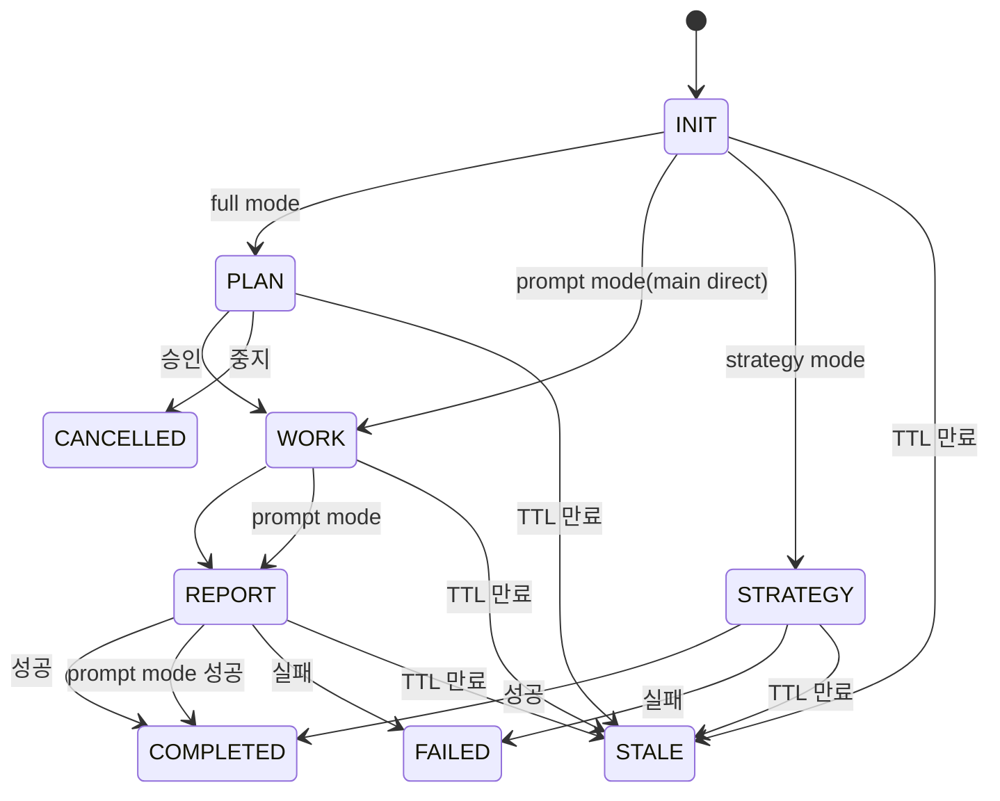

# Orchestrator

Main agent controls workflow sequencing and agent dispatch only.

## FSM State Transition Diagram



## Mode-Phase Order

| Mode | Phase Order | Agent Sequence | Skip |
|------|-------------|----------------|------|
| full (default) | INIT -> PLAN -> WORK -> REPORT -> COMPLETED | init -> planner -> worker(s)/explorer(s) -> reporter -> done | None |
| prompt | INIT -> WORK -> REPORT -> COMPLETED | init -> (main direct) -> reporter -> done | PLAN |
| strategy | INIT -> STRATEGY -> COMPLETED | init -> (main direct) -> done | PLAN, WORK, REPORT |

1. Phase order within each mode MUST NOT be violated
2. PLAN approval REQUIRED before WORK proceeds (full mode only)
3. Violation: halt workflow and report error

## Mode Auto-Determination Rule

오케스트레이터는 INIT 에이전트 호출 전, command로 `mode`를 자동 결정한다.

**결정 알고리즘:**
1. `command == "prompt"` → `mode: prompt` (early return)
2. `command == "strategy"` → `mode: strategy` (early return)
3. 그 외 → `mode: full` (기본값)

**매핑 테이블:**

| Command | Mode |
|---------|------|
| `prompt` | `prompt` |
| `strategy` | `strategy` |
| `implement` | `full` |
| `review` | `full` |
| `research` | `full` |

> mode는 command에 의해 일의적으로 결정된다. 개별 커맨드 문서는 mode 결정 로직을 포함하지 않는다.

## Agent-Phase Mapping

| Phase | Agent | Skill | Return Lines | Key Output |
|-------|-------|-------|-------------|------------|
| INIT | init | workflow-init | 8 | request, workDir, workId, registryKey |
| PLAN | planner | workflow-plan | 3 | plan path |
| WORK | worker | workflow-work + command skills | 3 | work log path |
| WORK | explorer | workflow-explore | 3 | exploration result path |
| REPORT | reporter | workflow-report | 2 | report path |
| STRATEGY | main direct | command-strategy | - | roadmap.md + .kanbanboard |
| DONE | done | workflow-done | 1 | status |

---

## Supported Commands

| Command | Description |
|---------|------------|
| implement | Feature implementation, refactoring, architecture diagrams |
| review | Code review |
| research | Research/investigation and internal asset analysis |
| strategy | Multi-workflow strategy (INIT->STRATEGY->DONE, main agent direct) |
| prompt | Lightweight direct work (Tier 3, main agent direct + reporter + done) |

Commands follow their mode's phase order. Default is full. `prompt` always runs in prompt mode. `strategy` always runs in strategy mode.

## Input Parameters

- `command`: execution command (implement, review, research, strategy, prompt)

> cc:* commands do NOT use `$ARGUMENTS` for prompt content. User requests are handled by init agent via `.prompt/prompt.txt`.

---

## Terminal Output Protocol

> Core principle: Users want phase-level results only. MUST NOT output internal analysis/reasoning.

### Phase Banner Calls

배너 출력은 2개의 shell alias 명령어로 수행한다. Bash 도구에서 **명령어 이름을 그대로** 호출해야 한다.

```bash
# Phase start banner — Bash 도구에서 이 명령어를 그대로 실행
step-start <registryKey> <phase>

# Phase completion message — Bash 도구에서 이 명령어를 그대로 실행
step-end <registryKey> <phase>
```

> **CRITICAL**: `step-start`와 `step-end`는 `.zshrc`에 등록된 shell alias이다. Bash 도구 호출 시 **반드시 alias 이름으로만 호출**해야 한다.
> - **올바른 호출**: `step-start 20260219-051347 PLAN`
> - **잘못된 호출**: `bash .claude/scripts/workflow/banner.sh step-start 20260219-051347 PLAN` (step-start가 첫 번째 인자로 전달되어 파싱 오류 발생)
> - **잘못된 호출**: `bash .claude/scripts/workflow/banner.sh 20260219-051347 PLAN` (alias 대신 직접 스크립트 경로 호출 금지)

- **`<registryKey>`**: `YYYYMMDD-HHMMSS` format workflow identifier (full workDir path backward compatible)

**Call Timing:**

| Timing | Start (step-start) | Complete (step-end) |
|--------|--------------------|-----------------------------|
| INIT | `step-start INIT none <command>` | `step-end <key> INIT` |
| PLAN | `step-start <key> PLAN` | `step-end <key> PLAN` |
| WORK | `step-start <key> WORK` | `step-end <key> WORK` |
| WORK Phase 0~N | `step-start <key> WORK-PHASE <N> "<taskIds>" <parallel\|sequential>` | (없음) |
| REPORT | `step-start <key> REPORT` | `step-end <key> REPORT` |
| DONE | `step-start <key> DONE` | `step-end <key> DONE done` |
| WORK (prompt) | `step-start <key> WORK` | `step-end <key> WORK` |
| STRATEGY | `step-start <key> STRATEGY` | `step-end <key> STRATEGY` |

**각 phase의 오케스트레이터 호출 순서 (PLAN/WORK/REPORT/DONE 공통):**
1. `python3 .claude/scripts/workflow/update_state.py both <key> <agent> <fromPhase> <toPhase>` — 상태 업데이트
2. `step-start <key> <PHASE>` — 시작 배너
3. (에이전트 작업 수행)
4. `step-end <key> <PHASE>` — 완료 메시지

> **INIT 예외:** INIT는 `update_state.py both` 호출 없이 `step-start → init 에이전트 → step-end`만 수행한다. 상태 전환(`INIT->PLAN` 또는 `INIT->WORK`)은 step-end 이후 Mode Branching에서 후속 phase의 update_state.py both가 처리한다. INIT 단계에서 `update_state.py both`를 호출하면 `INIT->INIT` FSM 에러가 발생한다.

PLAN step-end MUST complete before AskUserQuestion (sequential, 2 separate turns).

DONE start banner: Called by orchestrator before dispatching done agent. DONE completion: `step-end <key> DONE done` called after done agent returns. Auto-sends Slack notification.

**CRITICAL: After `step-end <key> DONE done` Bash call returns, the orchestrator MUST terminate the current turn immediately. Output ZERO text after DONE banner. Do NOT invoke any further tool (Bash, Task, Read, Write, Edit, or any other). Do NOT generate any text, summary, confirmation, or status message. The DONE completion banner is the final action of the workflow -- end the turn now. Any post-DONE output is a protocol violation.**

### Post-Return Silence Rules

> **적용 범위**: 이 규칙은 해당 Step 완료 후뿐 아니라 **워크플로우 전 구간**에 적용됩니다. 에이전트 호출 전/중/후 모든 시점에서 내부 추론/분석 텍스트 출력은 금지입니다.

| Step Completed | Allowed Actions | Prohibited |
|---------------|----------------|------------|
| INIT done (full) | INIT step-end, extract/retain params, PLAN step-start, status update, planner call | Return summary, progress text, **AskUserQuestion**, init 반환값 판단/검증, **내부 추론/분석 텍스트 출력** |
| INIT done (strategy) | INIT step-end, extract/retain params, skip PLAN/WORK/REPORT, STRATEGY banner, status update (INIT->STRATEGY), main direct work | PLAN banner, WORK banner, planner call, worker call, AskUserQuestion, **내부 추론/분석 텍스트 출력** |
| INIT done (prompt) | INIT step-end, direct work by main agent, WORK banner, status update (INIT->WORK) | PLAN banner, planner call, **내부 추론/분석 텍스트 출력** |
| PLAN (2a) done | PLAN completion banner **(await Bash)**, then AskUserQuestion **(sequential, MUST NOT parallel)** | Plan summary, parallel banner+ask, **내부 추론/분석 텍스트 출력** |
| PLAN (2b) done | Branch on approval, WORK banner, status update | Approval explanation, **내부 추론/분석 텍스트 출력** |
| WORK Phase start | WORK-PHASE 0 banner (MUST FIRST), then Phase 0 worker call, then Phase 1~N | Skipping Phase banner, Skipping Phase 0 banner, **Phase 0 스킵 (CRITICAL VIOLATION)**, **progress/waiting text**, **내부 추론/분석 텍스트 출력** |
| WORK in progress | Next worker call (parallel/sequential per dependency) | Planner re-call, status rollback, autonomous augmentation, **Phase 0 스킵 후 Phase 1 진행**, **progress/waiting text (any language), phase status messages**, **내부 추론/분석 텍스트 출력** |
| WORK done | WORK step-end, extract first 3 lines, REPORT step-start, reporter call | Work summary, file listing, **내부 추론/분석 텍스트 출력** |
| REPORT done | REPORT step-end, DONE step-start, done agent call, extract first 2 lines, DONE step-end → **DONE step-end Bash 결과 수신 즉시 turn 종료. 추가 Bash/Task/텍스트 출력 일체 금지** | Report summary, any post-DONE text, any tool call after DONE banner, **내부 추론/분석 텍스트 출력** |

---

## Step 1: INIT

**Details:** See [step1-init.md](step1-init.md)

```bash
step-start INIT none <command>
```

```
Task(subagent_type="init", prompt="command: <command>, mode: <mode>")
```

Returns: `request`, `workDir`, `workId`, `registryKey`, `date`, `title`, `workName`, `rationale` -- all MUST be retained for subsequent phases.

### INIT Return Handling (CRITICAL)

> **init이 8줄 규격으로 정상 반환하면, 오케스트레이터는 반환값을 무조건 수용하고 즉시 다음 단계로 진행한다.**

| 금지 행위 | 이유 |
|-----------|------|
| `request` 필드의 품질/완전성 평가 | request가 불완전해 보여도 판단은 오케스트레이터의 역할이 아님. user_prompt.txt 원문은 workDir에 보존되어 있으며 planner가 읽음 |
| init 반환값 기반 AskUserQuestion | 사용자 확인이 필요한 시나리오(prompt.txt 비어있음 등)는 init 에이전트가 자체 처리 완료 |
| 반환값 재해석/보정 | init이 반환한 값을 수정하거나 다른 값으로 대체 금지 |

**오케스트레이터의 유일한 분기 조건:** init이 `에러:` 접두사로 반환한 경우에만 워크플로우를 중단한다. 그 외 모든 경우 → Mode Branching으로 진행.

### Mode Branching (After INIT)

> `mode`는 "Mode Auto-Determination Rule"에 의해 INIT 호출 전 자동 결정된 값이다.

| Mode | Next Step |
|------|-----------|
| `prompt` | Skip PLAN, main agent direct WORK -> REPORT -> DONE. See [step1-init.md](step1-init.md) "Prompt Mode Post-INIT Flow" |
| `strategy` | Skip PLAN/WORK/REPORT, main agent direct STRATEGY -> DONE. See [step1-init.md](step1-init.md) "Strategy Mode Post-INIT Flow" |
| `full` | Proceed to PLAN |

---

## Sub-agent Dispatch

### Step 2: PLAN

**Details:** See [step2-plan.md](step2-plan.md)

**Status update:** `python3 .claude/scripts/workflow/update_state.py both <registryKey> planner INIT PLAN`

```
Task(subagent_type="planner", prompt="command: <command>, workId: <workId>, request: <request>, workDir: <workDir>")
```

After planner returns, orchestrator performs **AskUserQuestion** approval (3 fixed options). See [step2-plan.md](step2-plan.md) for approval flow, .context.json handling, CANCELLED processing, and Binding Contract rule.

### Step 3: WORK

**Details:** See [step3-work.md](step3-work.md)

**Status update (mode-aware):**
- full mode: `python3 .claude/scripts/workflow/update_state.py both <registryKey> worker PLAN WORK`
- prompt mode: `python3 .claude/scripts/workflow/update_state.py both <registryKey> worker INIT WORK` (main agent direct work, no worker sub-agent)
- strategy mode: WORK Phase 없음 (STRATEGY Phase에서 오케스트레이터 직접 작업)

**Rules:** Only worker/explorer/reporter calls allowed. MUST NOT re-call planner/init. MUST NOT reverse phase. Execute ONLY plan tasks (full mode) or main agent direct work (prompt mode).

**Worker dispatch patterns:** Phase 0 is NON-NEGOTIABLE and MUST execute before any Phase 1~N worker calls. See [step3-work.md](step3-work.md) for Phase 0 mandatory execution, Phase 1~N task execution, and usage-pending tracking.

**Worker return:** Extract first 3 lines only (discard from line 4). Details in .workflow/ files.

### Step 4: REPORT

**Details:** See [step4-report.md](step4-report.md)

**Status update:** `python3 .claude/scripts/workflow/update_state.py both <registryKey> reporter WORK REPORT`

```
Task(subagent_type="reporter", prompt="command: <command>, workId: <workId>, workDir: <workDir>, workPath: <workDir>/work/")
```

### Step 5: DONE

**Details:** See [step5-done.md](step5-done.md)

After REPORT completion: DONE start banner -> done agent call -> DONE step_complete -> terminate.

```bash
step-start <registryKey> DONE
Task(subagent_type="done", prompt="registryKey: <registryKey>, workDir: <workDir>, command: <command>, title: <title>, reportPath: <reportPath>, status: <status>, workflow_id: <workflow_id>")
step-end <registryKey> DONE done
```

---

## Common Reference

> Sub-agent return formats, state update methods, FSM transition rules, error handling: See [common-reference.md](common-reference.md)

---

## Main Agent vs Sub-agent Responsibility Boundary

### Orchestrator-Only Actions

| Action | Description |
|--------|-------------|
| Phase banner Bash calls | `step-start` (start) + `step-end` (completion) |
| AskUserQuestion calls | PLAN approval, error escalation, user confirmation |
| State transition/registry | `python3 .claude/scripts/workflow/update_state.py both/status/context/register/unregister/link-session` |
| Sub-agent return extraction | Extract first N lines only from sub-agent returns (discard remainder) |
| prompt.txt handling (INIT + 수정 요청 only) | INIT: init agent가 prompt.txt -> user_prompt.txt 복사 + prompt.txt 클리어. 수정 요청: reload_prompt.py가 prompt.txt -> user_prompt.txt append + prompt.txt 클리어. 승인/중지 시 prompt.txt 접근 MUST NOT |
| Post-DONE immediate termination | Zero text output after DONE completion banner |

### Sub-agent-Only Actions

| Agent | Exclusive Actions |
|-------|-------------------|
| init | Workflow initialization, workDir creation, prompt.txt processing, status.json/registry setup |
| planner | Plan document authoring (`plan.md`), task decomposition, phase/dependency design |
| worker | Source code read/modify/create (Read/Write/Edit), code analysis, test execution, work log authoring (`work/WXX-*.md`) |
| explorer | Codebase+web exploration, structured exploration result reporting, work log authoring (`work/WXX-*.md`) |
| reporter | Final report authoring (`report.md`), work log aggregation |
| done | Finalization processing, Slack notification, cleanup |

### Orchestrator Prohibited Actions

| Prohibited Action | Reason |
|-------------------|--------|
| Direct source code modification (Write/Edit) | Worker exclusive; orchestrator is sequencing-only |
| Direct code analysis/review | Worker exclusive; orchestrator must not interpret code |
| Plan/report/work-log authoring | Respective sub-agent exclusive (planner/reporter/worker) |
| Sub-agent return interpretation/summary/explanation output | Returns are opaque routing tokens; any interpretation pollutes terminal and inflates context |
| **내부 추론/분석/사고 과정 텍스트 출력** | Terminal Output Protocol 위반: 사용자는 phase 결과만 필요. plan.md 분석 결과, 진행 상황 설명, 판단 근거, 에이전트 호출 전 설명("플래너를 호출하겠습니다" 류) 등 모든 내부 사고 과정의 텍스트 출력 금지. 컨텍스트 낭비 및 터미널 오염 원인 |
| 승인/중지 후 .prompt/prompt.txt 읽기 | "수정 요청" 외 분기에서 prompt.txt를 읽으면 다른 워크플로우 질의와 충돌 발생. prompt.txt 접근은 INIT(init agent)과 수정 요청(reload_prompt.py)으로 한정 |
| 다른 워크플로우 산출물 읽기 | 현재 워크플로우(`<workDir>`) 외부의 `.workflow/` 파일(다른 워크플로우의 plan.md, report.md, work/*.md 등)을 Read하면 컨텍스트 오염 및 토큰 낭비 발생. 오케스트레이터가 읽을 수 있는 파일은 현재 워크플로우의 workDir 내부로 한정 |

### Orchestrator Allowed Reads

오케스트레이터가 Read 도구로 읽어도 되는 파일은 아래 허용 목록(allowlist)으로 **엄격히** 한정합니다. 이 목록 외의 `.workflow/` 파일은 읽기 금지입니다.

| 허용 파일 | 용도 | 필수 근거 |
|-----------|------|----------|
| `<workDir>/plan.md` | WORK Phase 태스크 디스패치 | 서브에이전트 간 직접 통신 불가(플랫폼 제약)로 오케스트레이터만 taskId/phase/dependency/parallelism/agentType을 추출하여 디스패치 순서를 결정할 수 있음 |
| `<workDir>/user_prompt.txt` | prompt 모드에서 직접 작업 시 | prompt 모드는 오케스트레이터가 직접 Write/Edit를 수행하므로 사용자 요청 파악이 불가피 |

> **skill-map.md는 오케스트레이터가 읽지 않습니다.** Phase 0 완료 후 skill-map.md는 Phase 1+ Worker가 직접 읽습니다. 오케스트레이터는 Worker 호출 시 `skillMapPath: <workDir>/work/skill-map.md` 경로만 파라미터로 전달합니다.

### Platform Constraints Requiring Orchestrator Execution

Certain actions must be performed by the orchestrator due to Claude Code platform limitations, not by design preference.

| Constraint | Explanation |
|------------|-------------|
| AskUserQuestion unavailable in sub-agents | Sub-agents cannot invoke AskUserQuestion (GitHub Issue #12890); all user interaction must route through orchestrator |
| Sub-agent Bash output not visible to user | Sub-agent terminal output is not displayed to the user; phase banners must be called by orchestrator to be visible |
| No direct sub-agent-to-sub-agent invocation | All dispatch goes through orchestrator; sub-agents cannot call Task to spawn sibling agents |

---

## Notes

1. MUST run INIT first; on cc:* command, call init immediately without checking user input
2. Phase order per mode strictly enforced; WORK cannot ask questions (clarification in PLAN only)
3. Git commits via `/git:commit` separately; Slack failure does not block workflow
