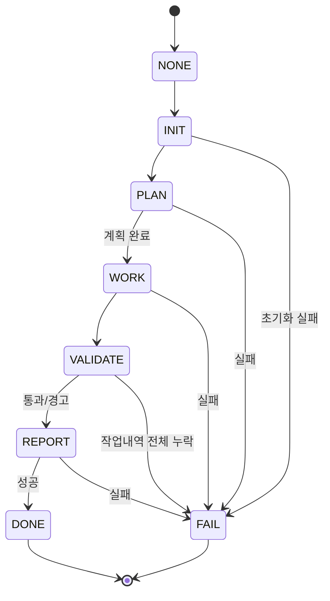

# Orchestrator

오케스트레이터(메인 워크플로우 세션)는 **Task 서브에이전트 4종 호출** + **INIT 진입** + **DONE 종결** 만 명시 호출한다. 그 사이 모든 결정론 wrapper 호출은 hook 이 자동 흡수한다 (T-483, `HOOK_WORKFLOW_ORCHESTRATION=true`).

## FSM State Transition


```mermaid
stateDiagram-v2
    [*] --> NONE
    NONE --> INIT
    INIT --> PLAN
    INIT --> FAIL: 초기화 실패
    PLAN --> WORK: 계획 완료
    PLAN --> FAIL: 실패
    WORK --> VALIDATE
    WORK --> FAIL: 실패
    VALIDATE --> REPORT: 통과/경고
    VALIDATE --> FAIL: 작업내역 전체 누락
    REPORT --> DONE: 성공
    REPORT --> FAIL: 실패
    DONE --> [*]
    FAIL --> [*]
```

## Step Order

PLAN -> WORK (Phase 0 skillmap -> Phase 1~N worker/explorer -> Phase N+1 validator) -> REPORT -> DONE.

순서 위반 금지. WORK 중 planner 재호출 금지. validator 의 `작업내역 전체 누락` hard-fail 만 REPORT 차단 + FAILED 전이.

## Agent-Step Mapping

| Step | Agent | Skill | Return Status | Artifact |
|------|-------|-------|---------------|----------|
| PLAN | planner | workflow-agent | `상태: 작성완료` | `<workDir>/plan.md` |
| WORK | worker-opus / worker-sonnet / explorer-* | workflow-agent + command skills | `상태: 성공\|부분성공\|실패` | `<workDir>/work/WXX-*.md` |
| WORK | validator | workflow-agent | `상태: 통과\|경고\|실패` | `<workDir>/work/validation-report.md` |
| REPORT | reporter | workflow-agent | `상태: 완료\|실패` | `<workDir>/report.md` |

## Supported Commands

| Command | Description | Worktree |
|---------|------------|----------|
| implement | Feature implementation, refactoring, architecture diagrams | O |
| review | Code review | X |
| research | Research/investigation and internal asset analysis | X |

> 사용자 요청은 `.kanban/open/T-NNN.xml` 티켓 파일을 통해 전달된다. XML 구조는 [`references/T-NNN.xml`](references/T-NNN.xml) 참조.

---

## Hook Absorption Contract (T-483, MUST)

`HOOK_WORKFLOW_ORCHESTRATION=true` 시 다음 wrapper 호출은 **hook 이 자동 흡수**한다. 오케스트레이터가 명시 호출하지 않는다 (MUST NOT — 중복 호출은 status.json transition 중복 + workflow.log 노이즈 유발).

| Wrapper | 흡수 시점 |
|---------|---------|
| `flow-update both <key> planner PLAN` | Task(subagent_type=planner) **호출 직전** (PreToolUse hook) |
| `flow-step start <key>` (PLAN) | 동일 (PreToolUse) |
| `flow-validate <workDir>/plan.md` (advisory) | Task(planner) **반환 직후** (PostToolUse hook) |
| `flow-update both <key> worker WORK` | Task(worker-*/explorer-*) 첫 호출 직전 (PreToolUse) |
| `flow-step start <key>` (WORK) | 동일 (PreToolUse) |
| `flow-phase <key> 0` + `flow-skillmap <key>` | 첫 worker/explorer Task 직전 (PreToolUse) |
| `flow-phase <key> <N>` | 각 worker/explorer Task 직전 (PreToolUse) — prompt 의 `phase: N` 추출 |
| `flow-update task-start <key> <taskId>` | 동일 (PreToolUse) — prompt 의 `taskId: WNN` 추출 |
| `flow-update task-status <key> <taskId> completed\|failed` | worker/explorer/validator Task 반환 직후 (PostToolUse) — tool_result outcome 자동 판별 |
| `flow-phase <key> <N+1>` + `flow-update task-start <key> validator` | Task(validator) 직전 (PreToolUse) |
| `flow-update both <key> reporter REPORT` + `flow-step start <key>` | Task(reporter) 직전 (PreToolUse) |

오케스트레이터가 **명시 호출해야 하는 것** (3종):

1. **INIT (1회)**:
   ```bash
   cd "$(flow-init <command> --ticket T-NNN | tail -1)"
   ```
2. **Task × N (planner → worker/explorer × M → validator → reporter)**:
   ```
   Task(subagent_type="planner", prompt="command: <command>, workId: <workId>, request: <request>, workDir: <workDir>")
   Task(subagent_type="worker-opus", prompt="command: <command>, workId: <workId>, taskId: W01, phase: 1, planPath: <planPath>, workDir: <workDir>, skills: <스킬명>")
   Task(subagent_type="validator", prompt="command: <command>, workId: <workId>, phase: <N+1>, workDir: <workDir>, planPath: <planPath>")
   Task(subagent_type="reporter", prompt="command: <command>, workId: <workId>, workDir: <workDir>, workPath: <workDir>/work/")
   ```
   > **Task prompt 필수 필드 (hook 흡수가 의존)**: worker/explorer 는 `taskId`, `phase`. validator 는 `phase` (선택, 미지정 시 hook 이 worker 수 +1 로 추론). planner / reporter 는 phase 불필요.

3. **DONE (1회, turn 종료)**:
   ```bash
   flow-update status <registryKey> DONE
   flow-finish <registryKey> 완료 --ticket-number <T-NNN> [--workflow-id <id>]
   flow-claude end <registryKey>
   ```
   > **CRITICAL**: `flow-claude end <key>` Bash 반환 후 turn **즉시 종료**. 추가 도구 호출 / 텍스트 출력 일체 금지.

> **DONE 단계는 hook 이 흡수하지 않는다 — 이유**: turn 종료 신호(`flow-claude end`) 는 오케스트레이터의 Bash 호출 자체가 trigger. hook 이 자동 호출하면 LLM 이 추가 turn 을 돌리는 위험.

---

## INIT (Orchestrator-driven, 1 Bash call)

```bash
cd "$(flow-init <command> --ticket T-NNN | tail -1)"
```

- command: implement | review | research | (chain)
- flow-init: 디렉터리 생성 + worktree 생성(implement만) + init-result.json 기록
- stdout 마지막 줄: worktreePath 절대경로 (또는 빈 줄). 빈 줄이면 cwd 유지

실패 시 비정상 종료 코드. INIT 결과 요약/출력 MUST NOT — ticket Read / init-result.json Read / dependency ls / TodoWrite 금지.

INIT 완료 후 즉시 PLAN 진행 (Task(planner) 호출). INIT 결과 요약/출력 MUST NOT.

---

## PLAN (planner Agent, 1 Task call)

```
Task(subagent_type="planner", prompt="command: <command>, workId: <workId>, request: <request>, workDir: <workDir>")
```

> **research 명령어 시 추가 컨텍스트**: command=`research` 인 경우 planner 는 계획서에 "작업 범위" 섹션(In-Scope / Out-of-Scope)을 필수 포함한다.

planner `상태: 작성완료` 반환 후:

- **자동 흡수**: PostToolUse hook 이 `flow-validate <workDir>/plan.md` 호출 (advisory, exit 0 고정).
- **Auto-Approve Gate**: `autoApprove=true` (기본) 시 즉시 WORK 진행. `autoApprove=false` (`-n` 플래그) 시 AskUserQuestion 으로 승인/수정/중지 3선택지 제시.

PLAN 승인 후 계획서는 Binding Contract. 오케스트레이터가 독자적으로 태스크 추가/삭제/변경 MUST NOT.

---

## WORK (worker/explorer/validator Agents)

> **Rules**: planner 재호출 금지. step 역행 금지. plan tasks 만 실행.

### Plan Reading

WORK 진입 후 `<workDir>/plan.md` 를 **1회만** 읽어 6개 필드 추출: `taskId`, `phase`, `dependencies`, `parallelism`, `agentType`, `skills`. 그 외 내용은 Worker 가 직접 참조.

### Task Dispatch

**Independent tasks (parallel)**:
```
Task(subagent_type="worker-opus", prompt="command: <command>, workId: <workId>, taskId: W01, phase: 1, planPath: <planPath>, workDir: <workDir>, skills: <스킬명>")
Task(subagent_type="worker-sonnet", prompt="command: <command>, workId: <workId>, taskId: W02, phase: 1, planPath: <planPath>, workDir: <workDir>")
```

**Dependent tasks (sequential)**:
```
Task(subagent_type="worker-opus", prompt="command: <command>, workId: <workId>, taskId: W04, phase: 2, planPath: <planPath>, workDir: <workDir>")
```

**Explorer agentType (6종)**: `worker-opus`, `worker-sonnet`, `explorer`, `explorer-file-haiku`, `explorer-file-sonnet`, `explorer-web-sonnet`. 계획서 서브에이전트 컬럼 값을 `subagent_type` 에 그대로 전달.

### Task Return Value

Task 호출 후 **상태만** 확인 (1줄). 나머지 출력은 무시 — `.workflow/work/` 파일에 저장됨. task-status 갱신은 **자동 흡수**.

### Error Handling

| 상황 | 처리 |
|------|------|
| 독립 태스크 실패 | 다른 독립 태스크 계속 진행 |
| 종속 선행 실패 | 해당 종속 체인 중단, 다른 체인 계속 |
| 실패율 ≥ 50% | 실패 태스크 skip + 남은 태스크 계속 실행 + REPORT 정상 진행 |
| Worker "실패" | `WORKFLOW_RETRY_WORK` 환경변수 (기본 0) 횟수만큼 재호출. 상한 도달 시 phase FAILED 전이 |

### Validator Phase

| Command | Validator |
|---------|-----------|
| implement / review | 실행 |
| research | 스킵 (보고서만 산출, 코드 변경 없음) |

```
Task(subagent_type="validator", prompt="command: <command>, workId: <workId>, phase: <N+1>, workDir: <workDir>, planPath: <planPath>")
```

반환 상태 `통과` / `경고` → REPORT 진행. `실패` + **작업내역 전체 누락** → Hard blocking: REPORT 차단 + `flow-update status FAILED` 전이. 빌드 FAIL 등 다른 사유의 실패는 soft blocking.

### Hooks 수정 태스크 패턴

```bash
flow-update env <registryKey> set HOOKS_EDIT_ALLOWED 1     # Worker 호출 전
# ... Worker Task 호출 ...
flow-update env <registryKey> unset HOOKS_EDIT_ALLOWED     # Worker 완료 후 반드시 해제
```

---

## REPORT (reporter Agent, 1 Task call)

```
Task(subagent_type="reporter", prompt="command: <command>, workId: <workId>, workDir: <workDir>, workPath: <workDir>/work/")
```

reporter 가 `{workDir}/report.md` + `summary.txt` 생성. 실패 시 `WORKFLOW_RETRY_REPORT` (기본 0) 횟수만큼 재시도. 상한 도달 시 FAILED.

> **research 보고서 품질 기대치**: command=`research` 인 경우 reporter 는 보고서에 "참고 자료" 출처 섹션 + 주장-근거-출처 3단 구조 결론을 필수 포함한다. 출처 명시 형식: `[등급] 출처명 (URL, YYYY)`.

reporter `상태: 완료` 반환 후 DONE 단계 진행 (3 Bash 호출).

---

## DONE (Orchestrator-driven, 3 Bash calls, turn termination)

```bash
flow-update status <registryKey> DONE
flow-finish <registryKey> 완료 --ticket-number <T-NNN> [--workflow-id <id>]
flow-claude end <registryKey>
```

### flow-finish 5단계

1. status.json 완료 처리 -- `update_state.py status` (critical)
2. 사용량 확정 -- `update_state.py usage-finalize` (비차단)
3. 아카이빙 -- `history_sync.py archive` (비차단)
4. 칸반 갱신 -- `update-kanban.sh` (workflow_id 있을 때만, 비차단)
5. 세션 cleanup -- TMUX_PANE + T-* 윈도우 조건 시 3초 지연 후 kill (비차단)

### Post-DONE Silence (CRITICAL)

`flow-claude end <registryKey>` Bash 반환 즉시 **turn 종료**. 추가 도구 호출 / 텍스트 생성 일체 금지. 워크플로우 마지막 행위.

---

## Terminal Output Protocol

> Core principle: 사용자는 step-level 결과만 본다. 내부 분석/추론 텍스트 출력 MUST NOT.

| Step Completed | Allowed Actions | Prohibited |
|----------------|----------------|------------|
| INIT completed | Task(planner) 즉시 호출 | summary, **AskUserQuestion**, 내부 추론 텍스트, ticket Read, init-result.json Read, dependency ls, TodoWrite |
| PLAN done | Auto-Approve Gate → Task(worker-*/explorer-*) 호출 | plan summary, **AskUserQuestion**[^1], 내부 추론 텍스트 |
| WORK in progress | 다음 worker/explorer Task 호출 (parallel/sequential) | planner 재호출, autonomous augmentation, 내부 추론 텍스트 |
| WORK done | Task(reporter) 호출 | work summary, 내부 추론 텍스트 |
| VALIDATE done | REPORT 진행 (통과/경고 시) | validation report summary, 자동 회귀 트리거 |
| REPORT done | DONE 3 Bash 호출 → **turn 즉시 종료** | report summary, post-DONE text, 추가 도구 호출 |

[^1]: `autoApprove=false` (`-n` 플래그) 시에만 AskUserQuestion 허용. 미지정(기본) 시 PLAN~DONE 전 구간 AskUserQuestion 0회.

### Workflow Log Protocol

`workflow.log` 는 wrapper 들이 자동 기록. hook 흡수 시점도 `HOOK[Pre,Task=<type>]` / `HOOK[Post,Task=<type>]` 형식으로 추가 기록.

| Wrapper | 트리거되는 로그 이벤트 |
|---------|---------------------|
| `flow-step start <key>` | `STEP_START` |
| `flow-step end <key> [label]` | `STEP_END` (+ `ARTIFACT`) |
| `flow-phase <key> <N>` | `PHASE_START` |
| `flow-claude end <key>` | `WORKFLOW_END` |
| `flow-update task-start` | `AGENT_DISPATCH` |
| `flow-update task-status` | `AGENT_RETURN` |
| `flow-update both` | `STATE_BOTH` |

---

## Main Agent vs Sub-agent Responsibility Boundary

### Orchestrator Allowed Actions

| Action | Description |
|--------|-------------|
| INIT cd Bash call | `cd "$(flow-init ... | tail -1)"` (1회) |
| Task(planner/worker-*/explorer-*/validator/reporter) call | 결정론 wrapper 는 hook 흡수 |
| DONE 3 Bash calls | `flow-update status DONE` + `flow-finish` + `flow-claude end` |
| AskUserQuestion (autoApprove=false 한정) | `-n` 수동 확인 모드 전용 |
| `<workDir>/plan.md` 1회 read | WORK Step 태스크 디스패치용 |

### Orchestrator Prohibited Actions

| Prohibited | Reason |
|-----------|--------|
| 결정론 wrapper 명시 호출 (`flow-update both`, `flow-step start`, `flow-phase`, `flow-skillmap`, `flow-update task-start`, `flow-update task-status`, `flow-validate`) | hook 흡수 — 중복 호출 시 transition 중복 + workflow.log 노이즈 |
| Direct source code modification (Write/Edit) | Worker exclusive |
| Direct code analysis/review | Worker exclusive |
| Plan/report/work-log authoring | Sub-agent exclusive |
| Sub-agent return interpretation/summary output | Returns are opaque routing tokens |
| 내부 추론/분석/사고 과정 텍스트 출력 | Terminal Output Protocol 위반 |
| PLAN 완료 후 티켓 파일 읽기 | initialization.py 실행으로 한정 |
| 다른 워크플로우 산출물 읽기 | 현재 workDir 내부로 한정 |
| `init-result.json` 직접 Read | `flow-init | tail -1` cd 1액션으로 한정 |

### Platform Constraints

| Constraint | Explanation |
|------------|-------------|
| AskUserQuestion unavailable in sub-agents | GitHub Issue #12890 |
| Sub-agent Bash output not visible to user | Step banners must be triggered by orchestrator (hook 흡수가 처리) |
| No direct sub-agent-to-sub-agent invocation | All dispatch through orchestrator |

---

## Verify Wrappers (Advisory vs Hard-Gate)

| Phase | Wrapper | Strength | Failure Action |
|-------|---------|----------|----------------|
| INIT | `_phase_verify_init` (initialization.py:581) | Advisory | `quality_score < 0.6` 시 `[WARN]` workflow.log 기록. blocking 0건 |
| PLAN | `flow-validate` (hook 흡수) | Advisory | exit 0 고정. 실패해도 WORK 진행 |
| VALIDATE | `flow-phase-verify` | Hard-Gate | validator `실패` + 작업내역 전체 누락 시 REPORT 차단 + `flow-update status FAILED` 전이. 빌드 FAIL 등 다른 사유는 soft |
| DONE | `emit_report_advisory` (worker_return_parser.py:125) | Advisory | `report.md` 부재 시 `[WARN]` 로그 + `report.missing` metrics emit |

> **T-411 폐기 사례 캐논 (commit 0c970fa)**: 추측 기반 자동 차단/강제 전이/칸반 자동 회귀 정책 절대 도입 금지 (MUST NOT). advisory wrapper 는 WARN 로그 + metrics emit 까지만 수행하며, 사용자 수동 수습 경로를 항상 보존한다.

---

## Hook Failure Recovery (T-483)

hook 이 결정론 wrapper 호출 시 실패하면 `status.json` 의 `hook_fails[]` 배열에 자동 기록되며 두 단계로 LLM 에 노출된다:

1. **즉시 가시성 (다음 PreToolUse[Task])**: 다음 Task 호출 시 `pretooluse_task.py` 가 `hook_fails` 잔재를 검출하면 **deny + reason (`[WORKFLOW HOOK FAIL RESIDUE] ...`) 1회 발화** 후 잔재 비움. LLM 은 deny 메시지로 즉시 인지. **같은 Task 를 재호출하면 잔재 빈 상태이므로 정상 진행** (1턴 지연만, 영구 차단 X).
2. **세션 컨텍스트 (SessionStart)**: 워크플로우 세션의 다음 SessionStart 시 `workflow_session_start.py` 가 `hook_fails` 잔재를 system context 로 stdout inject. resume/compact/clear 시점에 노출.

advisory only — hook 실패가 워크플로우 전이를 영구 차단하지 않는다 (1회 deny 후 재시도 통과). 잔재 정보는 SessionStart inject 와 workflow.log 에 보존되어 사용자/LLM 수동 정정 가능.

---

## Common Reference

> Sub-agent return formats, state update methods, FSM transition rules, error handling: See [common-reference.md](common-reference.md)

---

## Notes

1. `/wf` 명령 시 오케스트레이터는 INIT (`cd "$(flow-init ... | tail -1)"`) → Task × N → DONE (3 Bash) 만 호출. 그 외 결정론 wrapper 는 hook 이 흡수.
2. Step order (PLAN → WORK → VALIDATE → REPORT → DONE) 엄격 강제. WORK 중 질문 금지 (clarification 은 PLAN 한정).
3. Git commits via `/git:commit` separately; Slack failure does not block workflow.
4. `HOOK_WORKFLOW_ORCHESTRATION=false` 설정 시 기존 동작 (오케스트레이터가 모든 wrapper 명시 호출) 로 폴백. 본 SKILL.md 는 흡수 모드(true) 기준 — false 모드에서는 결정론 호출을 명시해야 한다.
