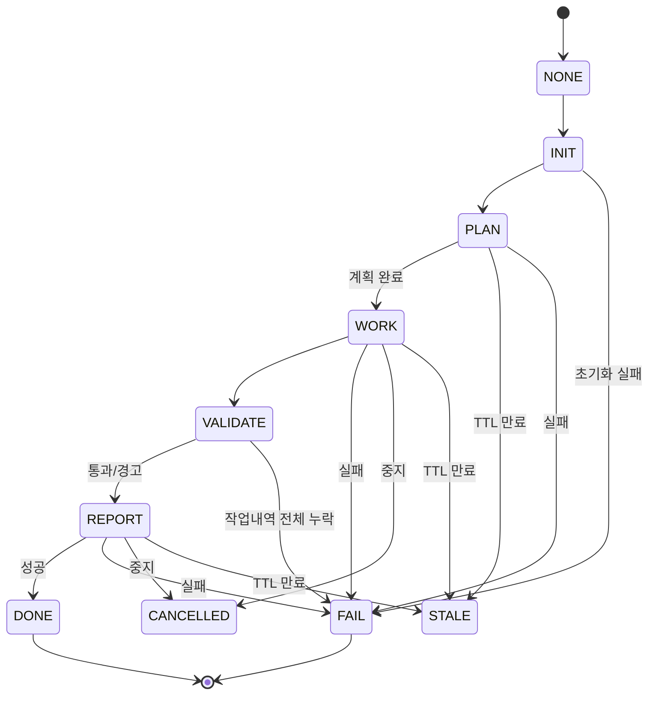

# Orchestrator

Main agent controls workflow sequencing and agent dispatch only.

## FSM State Transition Diagram


```mermaid
stateDiagram-v2
    [*] --> NONE
    NONE --> INIT
    INIT --> PLAN
    INIT --> FAIL: 초기화 실패
    PLAN --> WORK: 계획 완료
    PLAN --> STALE: TTL 만료
    PLAN --> FAIL: 실패
    WORK --> VALIDATE
    WORK --> FAIL: 실패
    WORK --> CANCELLED: 중지
    WORK --> STALE: TTL 만료
    VALIDATE --> REPORT: 통과/경고
    VALIDATE --> FAIL: 작업내역 전체 누락
    REPORT --> DONE: 성공
    REPORT --> FAIL: 실패
    REPORT --> CANCELLED: 중지
    REPORT --> STALE: TTL 만료
    DONE --> [*]
    FAIL --> [*]
```

## Step Order

| Step Order | Agent Sequence |
|-------------|----------------|
| PLAN -> WORK -> VALIDATE -> REPORT -> DONE | planner -> worker(s)/explorer(s) -> validator -> reporter |

1. Step order MUST NOT be violated
2. PLAN 완료 후 스킬 매핑 검증 통과 시 WORK 즉시 진행
3. Violation: halt workflow and report error

## Agent-Step Mapping

| Step | Agent | Skill | Return Status | Artifact (Convention) |
|-------|-------|-------|--------------|----------------------|
| PLAN | planner | workflow-agent | `상태: 작성완료` | `<workDir>/plan.md` |
| WORK | worker | workflow-agent + command skills | `상태: 성공\|부분성공\|실패` | `<workDir>/work/WXX-*.md` |
| WORK | explorer | workflow-agent | `상태: 성공\|부분성공\|실패` | `<workDir>/work/WXX-*.md` |
| WORK | validator | workflow-agent | `상태: 통과\|경고\|실패` | `<workDir>/work/validation-report.md` |
| REPORT | reporter | workflow-agent | `상태: 완료\|실패` | `<workDir>/report.md` |

> **Note on worker agent:** `worker-opus` (Claude Opus) and `worker-sonnet` (Claude Sonnet) variants follow the same `workflow-agent` skill specification and return status format.

---

## Supported Commands

| Command | Description | Worktree |
|---------|------------|----------|
| implement | Feature implementation, refactoring, architecture diagrams | O |
| review | Code review | X |
| research | Research/investigation and internal asset analysis | X |

## Input Parameters

- `command`: execution command (implement, review, research)

> `/wf` commands use `$ARGUMENTS` for command detection. User requests are handled via `.kanban/open/T-NNN.xml` ticket files (상태별 디렉터리: `open/`, `progress/`, `review/`, `done/`).
>
> **SSoT XML structure reference:** See [`references/T-NNN.xml`](references/T-NNN.xml) for the canonical ticket file template.

---

## Terminal Output Protocol

> Core principle: Users want step-level results only. MUST NOT output internal analysis/reasoning.

### Step Banner Calls

배너 출력은 `flow-step`/`flow-phase` shell alias로 수행한다. Bash 도구에서 **alias 이름을 그대로** 호출해야 한다.

```bash
flow-step start <registryKey> [phase]     # Step 시작 배너
flow-step end <registryKey> [label]       # Step 완료 배너 (● + 링크 + [OK])
flow-phase <registryKey> <N>              # WORK Phase 서브배너
flow-update both <registryKey> <agent> <toStep>  # 상태 업데이트 + 시각화
flow-skillmap <registryKey>               # WORK Phase 0 스킬 매핑
flow-finish <registryKey> 완료|실패 --ticket-number <T-NNN> [--workflow-id <id>]  # 워크플로우 마무리
flow-claude end <registryKey>             # 워크플로우 종료
```

> **CRITICAL**: `flow-step`/`flow-phase`는 `.zshrc`에 등록된 shell alias이다. 직접 스크립트 호출 금지.

> **Banner and State Update Call Isolation Rule**: `flow-step`/`flow-phase`/`flow-update` 호출은 반드시 **개별 Bash 도구 호출**로 실행한다. `&&` 또는 `;`로 체이닝 금지. 단, `update_state.py task-status`/`usage-pending`은 `&&` 체이닝 허용.

**Call Timing:**

| Timing | Banner Command |
|--------|---------------|
| PLAN start | `flow-step start <registryKey>` |
| WORK start | `flow-step start <registryKey>` |
| WORK Phase 0~N | `flow-phase <registryKey> <N>` |
| WORK Phase N+1 (validator) | `flow-phase <registryKey> <N+1>` |
| REPORT start | `flow-step start <registryKey>` |
| DONE (마무리) | `flow-finish <registryKey> 완료\|실패 --ticket-number <T-NNN>` |
| DONE (종료) | `flow-claude end <registryKey>` |

> **Phase 종료 배너 폐지**: `flow-step end planSubmit/workDone/reportDone` 3종은 `flow-update status` 전이가 이미 동일 정보(phase 종료)를 status.json `transitions[]` + workflow.log 에 기록하므로 폐지. R-METRIC-1 룰도 같이 폐지 (R-FSM-1 과 검증 중복).

**각 step의 오케스트레이터 호출 순서:**
1. `flow-update both <key> <agent> <toStep>` -- 상태 업데이트
2. `flow-step start <registryKey>` -- 시작 배너
3. (에이전트 작업 수행)

> 위 1~3 각 항목은 **개별 Bash 도구 호출**로 실행한다.

**CRITICAL: After `flow-claude end <key>` Bash call returns, the orchestrator MUST terminate the current turn immediately. Output ZERO text after DONE banner. Do NOT invoke any further tool. The DONE completion banner is the final action of the workflow.**

### Workflow Log Protocol

워크플로우 실행 중 `workflow.log` 파일에 구조화된 이벤트를 기록한다. 배너 스크립트와 Python 스크립트가 자동으로 기록하며, 오케스트레이터는 `update_state.py task-status`를 통해 AGENT_DISPATCH/AGENT_RETURN 이벤트를 간접적으로 트리거한다.

| 오케스트레이터 호출 | 트리거되는 로그 이벤트 |
|-----------------|-------------------|
| `flow-step start <registryKey>` | `STEP_START` |
| `flow-step end <registryKey> [label]` | `STEP_END` (+ `ARTIFACT`) |
| `flow-phase <registryKey> <N>` | `PHASE_START` |
| `flow-claude end <registryKey>` | `WORKFLOW_END` |
| `flow-update task-status <key> running <taskId>` | `AGENT_DISPATCH` |
| `flow-update task-status <key> completed\|failed <taskId>` | `AGENT_RETURN` |
| `flow-update usage-pending <key> <agents>` | `USAGE_PENDING` |
| `flow-update both <key> <agent> <toStep>` | `STATE_BOTH` |

---

### Post-Return Silence Rules

> **적용 범위**: 워크플로우 전 구간에 적용. 에이전트 호출 전/중/후 모든 시점에서 내부 추론/분석 텍스트 출력 금지.

| Step Completed | Allowed Actions | Prohibited |
|---------------|----------------|------------|
| INIT completed | initialization 실행, params 추출/보관, PLAN 진행 | Return summary, **AskUserQuestion**, 내부 추론 텍스트, ticket Read, init-result.json Read, dependency ls, TodoWrite |
| PLAN done | `flow-step end`, 스킬 매핑 검증, WORK 진행 | Plan summary, **AskUserQuestion**[^1], 내부 추론 텍스트 |
| WORK Phase start | `flow-phase 0` (MUST FIRST), Phase 0 -> Phase 1~N | Phase 0 스킵 (**CRITICAL VIOLATION**), progress 텍스트 |
| WORK in progress | Next worker call (parallel/sequential) | Planner re-call, autonomous augmentation, 내부 추론 텍스트 |
| WORK done | `flow-step start`, reporter call | Work summary, 내부 추론 텍스트 |
| VALIDATE done | `flow-phase-verify` 실행, REPORT 진행 (통과/경고 시) | Validation report summary, 내부 추론 텍스트, 자동 회귀 트리거 |
| REPORT done | `flow-update status DONE`, `flow-finish`, `flow-claude end` -> **turn 즉시 종료** | Report summary, post-DONE text, 추가 도구 호출 |

[^1]: autoApprove=false(`-n` 플래그 지정) 시에만 AskUserQuestion 허용. `-n` 미지정(기본) 시 PLAN~DONE 전 구간 AskUserQuestion 0회

---

## INIT (Orchestrator-driven)

`/wf` 슬래시 커맨드 실행 시 오케스트레이터가 단일 명령으로 INIT을 처리한다:

```bash
cd "$(flow-init <command> --ticket T-NNN | tail -1)"
```

- command: implement | review | research | (chain)
- flow-init: 디렉터리 생성 + worktree 생성(implement만) + init-result.json 기록
- stdout 마지막 줄: worktreePath 절대경로 (또는 빈 줄). 빈 줄이면 cwd 유지

실패 시 `FAIL` + 비정상 종료 코드. INIT 결과 요약/출력 MUST NOT — 구체 금지: ticket Read, init-result.json Read, dependency ls, TodoWrite.

**Return Value Retention (후속 단계에 전달):**

| Parameter | Used In | Purpose |
|-----------|---------|---------|
| `workDir` | PLAN~DONE | 작업 디렉터리 경로 |
| `registryKey` | PLAN~DONE | 배너/상태 식별자 |
| `workId` | PLAN~DONE | 작업 ID (HHMMSS) |
| `command` | PLAN~DONE | 실행 명령어 |
| `autoApprove` | PLAN | -n 플래그 여부 |
| `title`, `ticketNumber` | DONE | flow-finish 인자 |
| `worktreePath` | INIT | 워크트리 절대경로 (cwd 전환용) |

**종료 코드:** 0=성공, 1=티켓 비어있음, 2=인자 오류, 4=초기화 실패

### Init Verification (Advisory)

`_phase_verify_init` (initialization.py:581) 가 init-result.json 생성 후 자동 호출된다. **advisory only** — `quality_score < 0.6` 시 `[WARN]` workflow.log 기록만 수행하며 blocking 0건. PLAN 진입은 정상 진행된다.

INIT 완료 후 즉시 PLAN 진행. INIT 결과 요약/출력 MUST NOT.

---

## PLAN (planner Agent)

**Status update:** `flow-update both <registryKey> planner PLAN`

```
Task(subagent_type="planner", prompt="command: <command>, workId: <workId>, request: <request>, workDir: <workDir>")
```

> **research 명령어 시 추가 컨텍스트**: command가 `research`인 경우, planner는 계획서에 "작업 범위" 섹션(In-Scope / Out-of-Scope)을 필수 포함한다. 조사 대상 범위를 명확히 구분하여 워커가 범위 이탈 없이 조사를 수행할 수 있도록 한다.

### 2a-Post: planner 반환 후 호출 순서

planner가 `작성완료` 반환 직후:
1. **plan_validator.py** -- `validator_output=$(flow-validate <workDir>/plan.md 2>&1) || validator_output=""` (advisory, non-blocking)
   > **advisory only**. exit 0 고정 (`|| true` 패턴), 실패해도 WORK 진행. hard gate 는 다음 Step 2c 의 `flow-skillmap` (exit 2 시 planner revise 재호출 최대 3회).
2. **즉시** Auto-Approve Gate로 진행

### Auto-Approve Gate (Step 2b)

| `autoApprove` | 동작 |
|--------------|------|
| `true` (기본값) | 즉시 스킬 매핑 검증으로 진행 |
| `false` (`-n`) | AskUserQuestion으로 승인/수정/중지 3선택지 제시. "수정" 시 planner revise 모드 재호출 -> 2a-Post 재실행 -> 재진입 (상한 없음) |

### Skill Mapping Validation Loop (Step 2c)

```bash
skill_mapper_output=$(flow-skillmap <registryKey> 2>&1)
skill_mapper_exit=$?
```

| Exit Code | 동작 |
|-----------|------|
| `0` | WORK 즉시 진행 |
| `2` | planner revise 재호출 -> 재검증 (최대 3회). 3회 초과 시 경고 후 강제 진행 |
| `1` | `[WARN]` 후 WORK 강제 진행 |

### Binding Contract Rule

PLAN 승인 후 계획서는 Binding Contract. 오케스트레이터가 독자적으로 태스크 추가/삭제/변경 MUST NOT. Worker 반환값 근거 임의 수정 금지.

---

## WORK (worker/explorer Agent)

**Status update:** `flow-update both <registryKey> worker WORK`

**Rules:** Only worker/explorer/validator/reporter calls allowed. MUST NOT re-call planner. MUST NOT reverse step. Execute ONLY plan tasks.

### Plan Reading for Task Dispatch

WORK 진입 후 `<workDir>/plan.md`를 **1회만** 읽어 최소 6개 필드 추출: `taskId`, `phase`, `dependencies`, `parallelism`, `agentType`, `skills`. 위 6개 외 내용은 Worker가 직접 참조.

### Phase 0 - Preparation (REQUIRED)

> **CRITICAL: Phase 0 스킵 절대 금지.** Phase 0을 건너뛰고 Phase 1으로 직행하는 것은 프로토콜 위반이다.

```bash
flow-phase <registryKey> 0
flow-skillmap <registryKey>
```

`skill_mapper.py`가 plan.md skills 컬럼 + 명령어 기본 + TF-IDF fallback으로 `skill-map.md` 생성. 실패(exit 1) 시 skill-map.md 없이 Phase 1 진행 (Worker 자율 결정).

### Phase 1~N: Task Execution

계획서 Phase 순서대로 실행. 각 Phase Worker 호출 **직전**에 배너 출력.

**Independent tasks (parallel):**
```bash
flow-phase <registryKey> 1
flow-update task-start <registryKey> W01 W02
```
```
Task(subagent_type="worker-opus", prompt="command: <command>, workId: <workId>, taskId: W01, planPath: <planPath>, workDir: <workDir>, skills: <스킬명>")
Task(subagent_type="worker-sonnet", prompt="command: <command>, workId: <workId>, taskId: W02, planPath: <planPath>, workDir: <workDir>")
```

**Dependent tasks (sequential):**
```bash
flow-phase <registryKey> 2
flow-update task-start <registryKey> W04
```
```
Task(subagent_type="worker-opus", prompt="command: <command>, workId: <workId>, taskId: W04, planPath: <planPath>, workDir: <workDir>")
```

**Explorer agentType (6종):** `worker-opus`, `worker-sonnet`, `explorer`, `explorer-file-haiku`, `explorer-file-sonnet`, `explorer-web-sonnet`. 계획서 서브에이전트 컬럼 값을 `subagent_type`에 그대로 전달.

### Worker/Explorer Return Value Processing

Task 호출 후 **상태만** 확인 (1줄). 나머지는 무시 (.workflow/ 파일에 저장됨). 상태 외 내용 MUST discard.

```bash
# 반환 직후 task-status 갱신 (다음 Phase 배너 전 필수)
flow-update task-status <registryKey> <taskId> completed   # 성공/부분성공
flow-update task-status <registryKey> <taskId> failed      # 실패
```

### Error Handling (WORK)

| 상황 | 처리 |
|------|------|
| 독립 태스크 실패 | 다른 독립 태스크 계속 진행 |
| 종속 선행 실패 | 해당 종속 체인 중단, 다른 체인 계속 |
| 실패율 >= 50% | 실패 태스크 skip + 남은 태스크 계속 실행 + REPORT 정상 진행. `[WARN]` workflow.log에 실패율, 실패 태스크 ID, skip된 종속 태스크 ID 기록. 보고서에 실패 태스크 보고 섹션 자동 포함 |
| Worker "실패" | `PHASE_RETRY_MAX[WORK]` 횟수만큼 재호출 (환경변수 `WORKFLOW_RETRY_WORK`, 기본 0). 상한 도달 시 해당 태스크 실패 기록 |

### Retry Pattern (WORK / REPORT 공통)

WORK phase Worker 실패 / REPORT phase reporter 실패 시 오케스트레이터가 호출하는 표준 retry 패턴이다. 환경변수 `WORKFLOW_RETRY_WORK` / `WORKFLOW_RETRY_REPORT` (기본 0) 로 phase별 상한 제어.

```pseudocode
while is_retry_available(workDir, phase):
    result = dispatch_agent(...)              # Worker (WORK) 또는 reporter (REPORT) 재호출
    if result.status == "성공":
        break
    flow-fail-record record <registryKey> \
        --phase <PHASE> --error "<msg>" --hint "<next-attempt-hint>"

# 상한 도달 시 해당 phase 실패 기록 → workflow_phase 전이 (FAILED)
```

**T-455 단방향 sentinel 캐논**: `flow-fail-record record` 가 생성하는 sentinel/recorded 마커는 워크플로우 종료 시까지 절대 삭제하지 않는다. 비차단 흐름 — 실패 기록은 후속 retry 의사결정의 입력일 뿐, retry 자체를 차단하지 않는다.

**기본값 0 의미**: `WORKFLOW_RETRY_WORK=0` / `WORKFLOW_RETRY_REPORT=0` (기본) 시 `is_retry_available` 가 즉시 False 반환 → retry 비활성 → 실패 1회로 phase FAILED 전이. 회귀 0건 보장. `.settings` 에 명시 활성화 (예: `WORKFLOW_RETRY_WORK=2`) 시에만 retry 동작.

### Hooks 수정 태스크 패턴

```bash
flow-update env <registryKey> set HOOKS_EDIT_ALLOWED 1     # Worker 호출 전
# ... Worker Task 호출 ...
flow-update env <registryKey> unset HOOKS_EDIT_ALLOWED     # Worker 완료 후 반드시 해제
```

### Validator Phase (Phase N+1)

| 명령어 | validator 실행 |
|--------|---------------|
| implement / review | 실행 |
| research | 스킵 (보고서만 산출, 코드 변경 없음) |

```bash
flow-phase <registryKey> <N+1>
flow-update task-start <registryKey> validator
```
```
Task(subagent_type="validator", prompt="command: <command>, workId: <workId>, workDir: <workDir>, planPath: <planPath>")
```

반환 상태(통과/경고) 정상 진행. 반환 상태(실패)도 기본적으로 soft blocking이나, **작업내역 전체 누락으로 인한 실패인 경우 Hard blocking**: REPORT 단계 진입을 차단하고 `flow-update status <registryKey> FAILED`로 전이한다. `flow-update task-status <registryKey> validator completed|failed`.

> **판별 기준**: validator가 "실패"를 반환할 때, `validation-report.md`에 "작업내역 전체 누락" 사유가 명시된 경우에만 Hard blocking 처리. 빌드 FAIL 등 다른 사유의 실패는 soft blocking(정상 진행) 유지.

### Post-WORK Flow

Validator 완료 후 즉시 REPORT 상태 전이 (`flow-update both <key> reporter REPORT`). WORK 완료 배너 폐지.

---

## REPORT (reporter Agent)

**Status update:** `flow-update both <registryKey> reporter REPORT`

```
Task(subagent_type="reporter", prompt="command: <command>, workId: <workId>, workDir: <workDir>, workPath: <workDir>/work/")
```

reporter가 보고서(`{workDir}/report.md`) + summary.txt 생성. 실패 시 `PHASE_RETRY_MAX[REPORT]` 횟수만큼 재시도 (환경변수 `WORKFLOW_RETRY_REPORT`, 기본 0). 상한 도달 시 FAILED 전이.

> **research 보고서 품질 기대치**: command가 `research`인 경우, reporter는 보고서에 "참고 자료" 출처 섹션과 주장-근거-출처 3단 구조 기반 결론을 필수 포함한다. W01(workflow-wf/SKILL.md)의 출처 명시 형식(`[등급] 출처명 (URL, YYYY)`)과 일관성을 유지한다.

> **report.md 존재 advisory (T-447)**: `flow-finish` Step 1(status.json 완료 처리) 직후, `emit_report_advisory`가 `{workDir}/report.md` 디스크 존재 여부를 자동 검증한다. 파일이 없으면 WARN 로그 + `report.missing` metrics 이벤트만 emit. **advisory only** — 강제 전이 / kanban move / 자동 회귀 절대 금지 (T-411 폐지 사례 캐논, commit 0c970fa). WARN 로그가 있어도 `flow-claude end` turn 종료에 영향 없음 (Post-DONE Silence Rules 호환). 사용자 수동 수습 경로 보존: 메인 세션에서 work/ 통합 후 report.md 작성 가능.

> **VALIDATE 단계 산출물 검증 흡수 완료 (T-453)**: T-453 신설 VALIDATE phase 가 산출물 정합성 검증을 hard-gate 로 흡수했다. DONE 시점의 `emit_report_advisory` 는 보조 advisory 만 수행하며 자동 차단 트리거 금지 (T-411 캐논).

### Post-REPORT Flow (REPORT -> DONE)

```bash
flow-update status <registryKey> DONE                                           # 1. 상태 전이
flow-finish <registryKey> 완료 --ticket-number <T-NNN> [--workflow-id <id>]     # 2. 마무리
flow-claude end <registryKey>                                                   # 3. 종료 배너 -> turn 즉시 종료
```

---

## DONE (flow-finish + flow-claude end)

### flow-finish 5단계

1. **status.json 완료 처리** -- `update_state.py status` (critical, 실패 시 exit 1)
2. **사용량 확정** -- `update_state.py usage-finalize` (비차단)
3. **아카이빙** -- `history_sync.py archive` (비차단)
4. **칸반 갱신** -- `update-kanban.sh` (workflow_id 있을 때만, 비차단)
5. **세션 cleanup** -- TMUX_PANE + T-* 윈도우 조건 시 3초 지연 후 kill (비차단)

### Post-DONE Silence (REQUIRED)

**`flow-claude end <registryKey>` Bash 결과 수신 즉시 turn 종료. 추가 도구 호출/텍스트 생성 일체 금지. 이것이 워크플로우의 마지막 행위이다.**

---

## Main Agent vs Sub-agent Responsibility Boundary

### Orchestrator-Only Actions

| Action | Description |
|--------|-------------|
| Step banner Bash calls | `flow-step start/end` + `flow-phase` + `flow-finish`/`flow-claude end` |
| AskUserQuestion calls | `-n` 수동 확인 모드 전용. 기본 모드에서는 자동 fallback으로 대체 |
| State transition | `flow-update both/status/context/task-status/usage-pending/env/link-session/usage/usage-finalize` |
| Sub-agent return extraction | 상태만 확인 (1줄). 산출물 경로는 컨벤션으로 확정 |
| Workflow finalization | `flow-finish` -> `flow-claude end` |

### Orchestrator Prohibited Actions

| Prohibited Action | Reason |
|-------------------|--------|
| Direct source code modification (Write/Edit) | Worker exclusive |
| Direct code analysis/review | Worker exclusive |
| Plan/report/work-log authoring | Respective sub-agent exclusive |
| Sub-agent return interpretation/summary output | Returns are opaque routing tokens |
| 내부 추론/분석/사고 과정 텍스트 출력 | Terminal Output Protocol 위반 |
| PLAN 완료 후 티켓 파일 읽기 | initialization.py 실행으로 한정 |
| 다른 워크플로우 산출물 읽기 | 현재 workDir 내부로 한정 |

### Orchestrator Allowed Reads

| 허용 파일 | 용도 |
|-----------|------|
| `<workDir>/plan.md` | WORK Step 태스크 디스패치 (1회만) |

> **skill-map.md는 오케스트레이터가 읽지 않는다.** Worker 호출 시 `skillMapPath` 경로만 전달.

> **INIT phase 진입점**: `flow-init` stdout 만 사용 (Read 도구 미사용). `init-result.json` 직접 Read MUST NOT — params 추출은 `flow-init | tail -1` cd 1액션으로 한정.

### Platform Constraints

| Constraint | Explanation |
|------------|-------------|
| AskUserQuestion unavailable in sub-agents | GitHub Issue #12890 |
| Sub-agent Bash output not visible to user | Step banners must be called by orchestrator |
| No direct sub-agent-to-sub-agent invocation | All dispatch through orchestrator |

---

## Verify Wrappers (Advisory vs Hard-Gate)

LLM 이 1회 read 로 어느 wrapper 가 차단하고 어느 wrapper 가 advisory 인지 판별 가능하도록 명문화.

| Phase | Wrapper (call site) | Strength | Failure Action |
|-------|---------------------|----------|----------------|
| INIT | `_phase_verify_init` (initialization.py:581) | Advisory | `quality_score < 0.6` 시 `[WARN]` workflow.log 기록만 수행. blocking 0건. planner 호출 정상 진행 |
| PLAN | `flow-validate` (plan_validator.py 경유) | Advisory | exit 0 고정. 실패해도 WORK 진행. hard gate 는 다음 Step 2c 의 `flow-skillmap` (exit 2 시 planner revise 재호출 최대 3회) |
| VALIDATE | `flow-phase-verify` | Hard-Gate | validator "실패" + 작업내역 전체 누락 시 REPORT 차단 + `flow-update status FAILED` 전이. 빌드 FAIL 등 다른 사유는 soft (정상 진행) |
| DONE | `emit_report_advisory` (worker_return_parser.py:125) | Advisory | `report.md` 부재 시 `[WARN]` 로그 + `report.missing` metrics emit. 강제 전이/kanban move/자동 회귀 0건 |

> **T-411 폐기 사례 캐논 (commit 0c970fa)**: 추측 기반 자동 차단/강제 전이/칸반 자동 회귀 정책 절대 도입 금지 (MUST NOT). advisory wrapper 는 WARN 로그 + metrics emit 까지만 수행하며, 사용자 수동 수습 경로를 항상 보존한다. VALIDATE phase 의 hard-gate 도 "작업내역 전체 누락" 단일 조건에 한정.

---

## Common Reference

> Sub-agent return formats, state update methods, FSM transition rules, error handling: See [common-reference.md](common-reference.md)

---

## Notes

1. On /wf command, orchestrator parses command directly, runs flow-init for INIT (single-step `cd "$(flow-init ... | tail -1)"`), then proceeds to PLAN Step
2. Step order (PLAN -> WORK -> VALIDATE -> REPORT -> DONE) strictly enforced; WORK cannot ask questions (clarification in PLAN only)
3. Git commits via `/git:commit` separately; Slack failure does not block workflow
