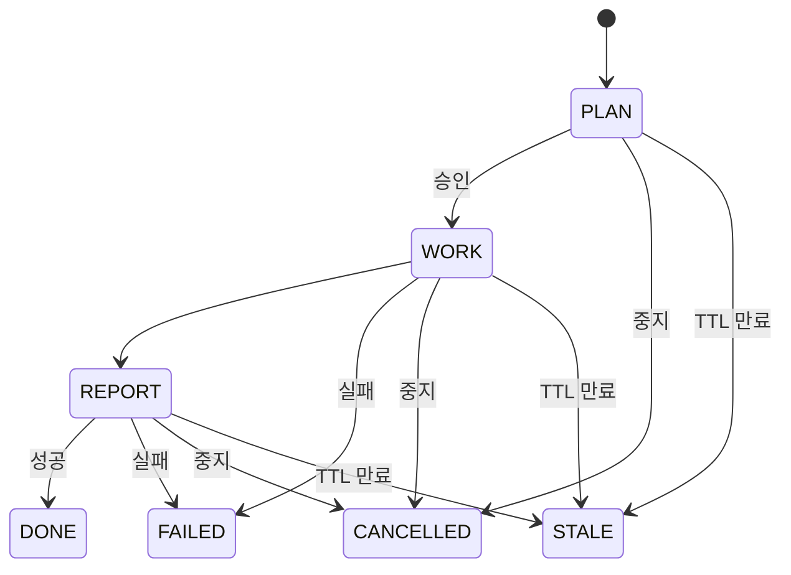

# Orchestrator

Main agent controls workflow sequencing and agent dispatch only.

## FSM State Transition Diagram


```mermaid
stateDiagram-v2
    [*] --> PLAN
    PLAN --> WORK: 승인
    PLAN --> CANCELLED: 중지
    PLAN --> STALE: TTL 만료
    WORK --> REPORT
    WORK --> FAILED: 실패
    REPORT --> DONE: 성공
    REPORT --> FAILED: 실패
    WORK --> CANCELLED: 중지
    WORK --> STALE: TTL 만료
    REPORT --> CANCELLED: 중지
    REPORT --> STALE: TTL 만료
```

## Step Order

| Step Order | Agent Sequence |
|-------------|----------------|
| PLAN -> WORK -> REPORT -> DONE | planner -> worker(s)/explorer(s) -> validator -> reporter |

1. Step order MUST NOT be violated
2. PLAN approval REQUIRED before WORK proceeds
3. Violation: halt workflow and report error

## Agent-Step Mapping

| Step | Agent | Skill | Return Status | Artifact (Convention) |
|-------|-------|-------|--------------|----------------------|
| PLAN | planner | workflow-agent-planner | `상태: 작성완료` | `<workDir>/plan.md` |
| WORK | worker | workflow-agent-worker + command skills | `상태: 성공\|부분성공\|실패` | `<workDir>/work/WXX-*.md` |
| WORK | explorer | workflow-agent-explorer | `상태: 성공\|부분성공\|실패` | `<workDir>/work/WXX-*.md` |
| WORK | validator | workflow-agent-validator | `상태: 통과\|경고\|실패` | `<workDir>/work/validation-report.md` |
| REPORT | reporter | workflow-agent-reporter | `상태: 완료\|실패` | `<workDir>/report.md` |

---

## Supported Commands

| Command | Description |
|---------|------------|
| implement | Feature implementation, refactoring, architecture diagrams |
| review | Code review |
| research | Research/investigation and internal asset analysis |

Commands follow the PLAN -> WORK -> REPORT -> DONE step order.

## Input Parameters

- `command`: execution command (implement, review, research)

> cc:* commands use `$ARGUMENTS` for command detection. User requests are handled by UserPromptSubmit hook via `.prompt/prompt.txt`.

---

## Terminal Output Protocol

> Core principle: Users want step-level results only. MUST NOT output internal analysis/reasoning.

### Step Banner Calls

배너 출력은 `flow-step`/`flow-phase` shell alias로 수행한다. Bash 도구에서 **alias 이름을 그대로** 호출해야 한다.

```bash
# Step 시작 배너
flow-step start <registryKey>

# Step 완료 배너 (● + 링크 + [OK])
flow-step end <registryKey> [label]

# WORK Phase 서브배너
flow-phase <registryKey> <N>

# 상태 업데이트 + 시각화
flow-update both <registryKey> <agent> <toStep>

# WORK Phase 0 스킬 매핑
flow-skillmap <registryKey>

# 워크플로우 마무리 (DONE 전용)
flow-finish <registryKey> 완료|실패 [--workflow-id <id>]
flow-claude end <registryKey>
```

> **CRITICAL**: `flow-step`/`flow-phase`는 `.zshrc`에 등록된 shell alias이다. `bash .claude/scripts/banner/flow_claude_banner.sh` 직접 호출 금지.

> **Banner and State Update Call Isolation Rule**: `flow-step`/`flow-phase`/`flow-update` 호출은 반드시 **개별 Bash 도구 호출**로 실행한다. `&&` 또는 `;`로 체이닝 금지. 단, `update_state.py task-status`/`usage-pending`은 동일 Step 내 일괄 등록이므로 `&&` 체이닝 허용.

**Call Timing:**

| Timing | Banner Command |
|--------|---------------|
| PLAN start | `flow-step start <registryKey>` |
| PLAN end | `flow-step end <registryKey> planSubmit` |
| WORK start | `flow-step start <registryKey>` |
| WORK Phase 0~N | `flow-phase <registryKey> <N>` |
| WORK Phase N+1 (validator) | `flow-phase <registryKey> <N+1>` |
| WORK end | `flow-step end <registryKey> workDone` |
| REPORT start | `flow-step start <registryKey>` |
| REPORT end | `flow-step end <registryKey> reportDone` |
| DONE (마무리) | `flow-finish <registryKey> 완료\|실패 [--workflow-id <id>]` |
| DONE (종료) | `flow-claude end <registryKey>` |

**각 step의 오케스트레이터 호출 순서:**
1. `flow-update both <key> <agent> <toStep>` — 상태 업데이트
2. `flow-step start <registryKey>` — 시작 배너
3. (에이전트 작업 수행)
4. `flow-step end <registryKey> [label]` — 완료 배너

> 위 1~3 각 항목은 **개별 Bash 도구 호출**로 실행한다. 단일 Bash 호출에 합치지 않는다.

DONE: `flow-finish <registryKey> 완료` → `flow-claude end <registryKey>` → terminate. Slack 알림 자동 수행.

**CRITICAL: After `flow-claude end <key>` Bash call returns, the orchestrator MUST terminate the current turn immediately. Output ZERO text after DONE banner. Do NOT invoke any further tool (Bash, Task, Read, Write, Edit, or any other). Do NOT generate any text, summary, confirmation, or status message. The DONE completion banner is the final action of the workflow -- end the turn now. Any post-DONE output is a protocol violation.**

### Post-Return Silence Rules

> **적용 범위**: 이 규칙은 해당 Step 완료 후뿐 아니라 **워크플로우 전 구간**에 적용됩니다. 에이전트 호출 전/중/후 모든 시점에서 내부 추론/분석 텍스트 출력은 금지입니다.

| Step Completed | Allowed Actions | Prohibited |
|---------------|----------------|------------|
| INIT completed | run initialization.py, extract/retain params, `flow-step start <registryKey>`, status update (NONE->PLAN), planner call | Return summary, progress text, **AskUserQuestion**, **내부 추론/분석 텍스트 출력** |
| PLAN (2a) done | `flow-step end <registryKey> planSubmit`, AskUserQuestion **(planner 반환 후 순서대로)** | Plan summary, **내부 추론/분석 텍스트 출력** |
| PLAN (2b) 승인 | Branch on approval, `flow-step start <registryKey>`, status update | Approval explanation, **내부 추론/분석 텍스트 출력** |
| PLAN (2b) 중지 | CANCELLED Processing (step-plan.md 참조), status 전이(PLAN->CANCELLED) | **DONE 배너 호출**, **WORK 배너 호출**, **내부 추론/분석 텍스트 출력** |
| WORK Phase start | `flow-phase <registryKey> 0` (MUST FIRST), then Phase 0 skill_mapper.py call, then Phase 1~N | Skipping Phase banner, **Phase 0 스킵 (CRITICAL VIOLATION)**, **progress/waiting text**, **내부 추론/분석 텍스트 출력** |
| WORK in progress | Next worker call (parallel/sequential per dependency) | Planner re-call, status rollback, autonomous augmentation, **Phase 0 스킵 후 Phase 1 진행**, **progress/waiting text**, **내부 추론/분석 텍스트 출력** |
| WORK done | 상태 확인, `flow-step start <registryKey>`, reporter call | Work summary, file listing, **내부 추론/분석 텍스트 출력** |
| REPORT done | `flow-update status <key> DONE`, `flow-finish <key> 완료`, `flow-claude end <key>` → **flow-claude end Bash 결과 수신 즉시 turn 종료. 추가 Bash/Task/텍스트 출력 일체 금지** | Report summary, any post-DONE text, any tool call after DONE banner, **내부 추론/분석 텍스트 출력** |

---

## Initialization (Orchestrator-driven)

cc:* 슬래시 커맨드 실행 시 오케스트레이터가 command를 직접 파싱하여 다음을 순차 실행한다 (hook 없음):

1. 사용자 입력에서 command 파싱 (예: `/cc:implement` → command=implement)
2. `flow-claude start <command>` — 시작 배너 출력
3. prompt.txt를 읽어 20자 이내 한글 제목 생성 (오케스트레이터가 직접 생성, LLM 별도 호출 없음)
4. `flow-init <command> "<title>"` — 워크플로우 디렉터리 생성, status.json 초기화. 실패 시 `FAIL` 출력 + 비정상 종료 코드
5. 종료 코드 0이면 최신 `.workflow/` 디렉터리의 `init-result.json`을 Read하여 workDir 등 값을 도출하고 후속 Phase에서 유지:
   - init-result.json 키: workDir, registryKey, workId, date, workName, command, title

After initialization, proceed to PLAN step.

---

## Sub-agent Dispatch

### PLAN

**Details:** See [step-plan.md](step-plan.md)

**Status update:** `flow-update both <registryKey> planner PLAN`

```
Task(subagent_type="planner", prompt="command: <command>, workId: <workId>, request: <request>, workDir: <workDir>")
```

planner가 `작성완료`를 반환하면, 오케스트레이터는 `plan_validator.py`를 자동 실행하여 계획서 구조를 검증한 후(advisory, non-blocking) `flow-step end`를 호출하고 **AskUserQuestion** 승인을 수행한다(3 고정 옵션, 경고 시 question 필드에 포함). 상세: [step-plan.md](step-plan.md) 참조.

### WORK

**Details:** See [step-work.md](step-work.md)

**Status update:**
`flow-update both <registryKey> worker WORK`

**Rules:** Only worker/explorer/validator/reporter calls allowed. MUST NOT re-call planner. MUST NOT reverse step. Execute ONLY plan tasks.

**Worker dispatch patterns:** Phase 0 is NON-NEGOTIABLE (Phase 0 = skill_mapper.py 스크립트가 스킬 매핑 준비, Phase 1+ = skill-map 참조하여 계획서 태스크 실행, 스킬 미발견 시 Worker 자율 결정으로 진행) and MUST execute before any Phase 1~N worker calls. See [step-work.md](step-work.md) for Phase 0 mandatory execution, Phase 1~N task execution, and usage-pending tracking.

**Worker return:** 상태만 확인 (성공/부분성공/실패). Details in .workflow/ files.

### REPORT

**Details:** See [step-report.md](step-report.md)

**Status update:** `flow-update both <registryKey> reporter REPORT`

```
Task(subagent_type="reporter", prompt="command: <command>, workId: <workId>, workDir: <workDir>, workPath: <workDir>/work/")
```

### DONE

> **CANCELLED 시 DONE 단계를 거치지 않는다.** DONE은 정상 완료 경로(REPORT 완료 후)에서만 호출된다. 사용자가 "중지"를 선택한 경우 CANCELLED Processing(step-plan.md 참조)을 수행하며 DONE 단계로 진행하지 않는다.

After REPORT completion: update_state.py status -> flow-finish -> flow-claude end -> terminate.

```bash
flow-update status <registryKey> DONE
flow-finish <registryKey> 완료 [--workflow-id <id>]  # status: "완료" 또는 "실패" 만 허용
flow-claude end <registryKey>
```

---

## Common Reference

> Sub-agent return formats, state update methods, FSM transition rules, error handling: See [common-reference.md](common-reference.md)

---

## Main Agent vs Sub-agent Responsibility Boundary

### Orchestrator-Only Actions

| Action | Description |
|--------|-------------|
| Step banner Bash calls | `flow-step start/end` + `flow-phase` (WORK phases) + `flow-finish`/`flow-claude end` (completion) |
| AskUserQuestion calls | PLAN approval, error escalation, user confirmation |
| State transition | `flow-update both/status/context/task-status/usage-pending/env/link-session/usage/usage-finalize` |
| Sub-agent return extraction | 상태만 확인 (1줄). 산출물 경로는 컨벤션으로 확정 |
| prompt.txt handling (initialization.py + 수정 요청 only) | initialization.py가 prompt.txt -> user_prompt.txt 복사 + prompt.txt 클리어. 수정 요청: `flow-reload`가 prompt.txt -> user_prompt.txt append + prompt.txt 클리어. 승인/중지 시 prompt.txt 접근 MUST NOT |
| Workflow finalization | `flow-finish <registryKey> 완료\|실패` — Slack 알림, cleanup |
| Workflow end | `flow-claude end <registryKey>` — 완료 배너 출력 + 종료 |
| Post-DONE immediate termination | Zero text output after DONE completion banner |

### Sub-agent-Only Actions

| Agent | Exclusive Actions |
|-------|-------------------|
| planner | Plan document authoring (`plan.md`), task decomposition, Phase/dependency design |
| worker | Source code read/modify/create (Read/Write/Edit), code analysis, test execution, work log authoring (`work/WXX-*.md`) |
| explorer | Codebase+web exploration, structured exploration result reporting, work log authoring (`work/WXX-*.md`) |
| validator | Lint/type-check/build verification, validation report authoring (`work/validation-report.md`) |
| reporter | Final report authoring (`report.md`), work log aggregation |

### Orchestrator Prohibited Actions

| Prohibited Action | Reason |
|-------------------|--------|
| Direct source code modification (Write/Edit) | Worker exclusive; orchestrator is sequencing-only |
| Direct code analysis/review | Worker exclusive; orchestrator must not interpret code |
| Plan/report/work-log authoring | Respective sub-agent exclusive (planner/reporter/worker) |
| Sub-agent return interpretation/summary/explanation output | Returns are opaque routing tokens; any interpretation pollutes terminal and inflates context |
| **내부 추론/분석/사고 과정 텍스트 출력** | Terminal Output Protocol 위반: 사용자는 step 결과만 필요. plan.md 분석 결과, 진행 상황 설명, 판단 근거, 에이전트 호출 전 설명("플래너를 호출하겠습니다" 류) 등 모든 내부 사고 과정의 텍스트 출력 금지. 컨텍스트 낭비 및 터미널 오염 원인 |
| 승인/중지 후 .prompt/prompt.txt 읽기 | "수정 요청" 외 분기에서 prompt.txt를 읽으면 다른 워크플로우 질의와 충돌 발생. prompt.txt 접근은 initialization.py 실행과 수정 요청(`flow-reload`)으로 한정 |
| 다른 워크플로우 산출물 읽기 | 현재 워크플로우(`<workDir>`) 외부의 `.workflow/` 파일(다른 워크플로우의 plan.md, report.md, work/*.md 등)을 Read하면 컨텍스트 오염 및 토큰 낭비 발생. 오케스트레이터가 읽을 수 있는 파일은 현재 워크플로우의 workDir 내부로 한정 |

### Orchestrator Allowed Reads

오케스트레이터가 Read 도구로 읽어도 되는 파일은 아래 허용 목록(allowlist)으로 **엄격히** 한정합니다. 이 목록 외의 `.workflow/` 파일은 읽기 금지입니다.

| 허용 파일 | 용도 | 필수 근거 |
|-----------|------|----------|
| `<workDir>/plan.md` | WORK Step 태스크 디스패치 | 서브에이전트 간 직접 통신 불가(플랫폼 제약)로 오케스트레이터만 taskId/Phase/dependency/parallelism/agentType을 추출하여 디스패치 순서를 결정할 수 있음 |

> **skill-map.md는 오케스트레이터가 읽지 않습니다.** Phase 0 완료 후 skill-map.md는 Phase 1+ Worker가 직접 읽습니다. 오케스트레이터는 Worker 호출 시 `skillMapPath: <workDir>/work/skill-map.md` 경로만 파라미터로 전달합니다.

Phase 0(준비 단계)에서 생성된 skill-map.md는 Phase 1+(작업 실행 단계)의 Worker가 참조하는 구조이다.

### Platform Constraints Requiring Orchestrator Execution

Certain actions must be performed by the orchestrator due to Claude Code platform limitations, not by design preference.

| Constraint | Explanation |
|------------|-------------|
| AskUserQuestion unavailable in sub-agents | Sub-agents cannot invoke AskUserQuestion (GitHub Issue #12890); all user interaction must route through orchestrator |
| Sub-agent Bash output not visible to user | Sub-agent terminal output is not displayed to the user; step banners must be called by orchestrator to be visible |
| No direct sub-agent-to-sub-agent invocation | All dispatch goes through orchestrator; sub-agents cannot call Task to spawn sibling agents |

---

## Notes

1. On cc:* command, orchestrator parses command directly, runs flow-claude start banner then initialization.py, then proceeds to PLAN Step
2. Step order (PLAN -> WORK -> REPORT -> DONE) strictly enforced; WORK cannot ask questions (clarification in PLAN only)
3. Git commits via `/git:commit` separately; Slack failure does not block workflow
