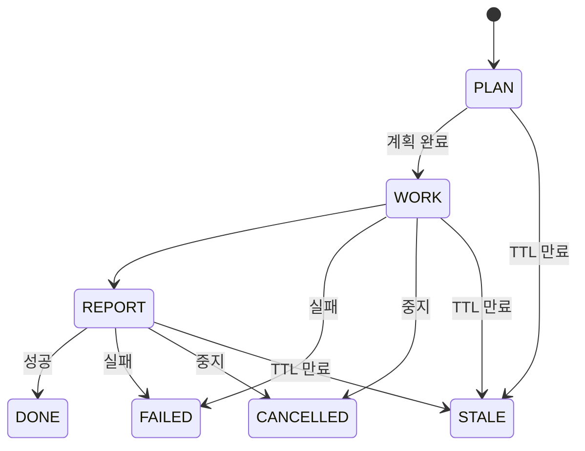

# Orchestrator

Main agent controls workflow sequencing and agent dispatch only.

## FSM State Transition Diagram


```mermaid
stateDiagram-v2
    [*] --> PLAN
    PLAN --> WORK: 계획 완료
    PLAN --> STALE: TTL 만료
    WORK --> REPORT
    WORK --> FAILED: 실패
    REPORT --> DONE: 성공
    REPORT --> FAILED: 실패
    WORK --> CANCELLED: 중지
    WORK --> STALE: TTL 만료
    REPORT --> CANCELLED: 중지
    REPORT --> STALE: TTL 만료
```

## Step Order

| Step Order | Agent Sequence |
|-------------|----------------|
| PLAN -> WORK -> REPORT -> DONE | planner -> worker(s)/explorer(s) -> validator -> reporter |

1. Step order MUST NOT be violated
2. PLAN 완료 후 스킬 매핑 검증 통과 시 WORK 즉시 진행
3. Violation: halt workflow and report error

## Agent-Step Mapping

| Step | Agent | Skill | Return Status | Artifact (Convention) |
|-------|-------|-------|--------------|----------------------|
| PLAN | planner | workflow-agent | `상태: 작성완료` | `<workDir>/plan.md` |
| WORK | worker | workflow-agent + command skills | `상태: 성공\|부분성공\|실패` | `<workDir>/work/WXX-*.md` |
| WORK | explorer | workflow-agent | `상태: 성공\|부분성공\|실패` | `<workDir>/work/WXX-*.md` |
| WORK | validator | workflow-agent | `상태: 통과\|경고\|실패` | `<workDir>/work/validation-report.md` |
| REPORT | reporter | workflow-agent | `상태: 완료\|실패` | `<workDir>/report.md` |

> **Note on worker agent:** `worker-opus` (Claude Opus) and `worker-sonnet` (Claude Sonnet) variants follow the same `workflow-agent` skill specification and return status format.

---

## Supported Commands

| Command | Description |
|---------|------------|
| implement | Feature implementation, refactoring, architecture diagrams |
| review | Code review |
| research | Research/investigation and internal asset analysis |

## Input Parameters

- `command`: execution command (implement, review, research)

> `/wf` commands use `$ARGUMENTS` for command detection. User requests are handled via `.kanban/active/T-NNN.xml` ticket files.
>
> **SSoT XML structure reference:** See [`references/T-NNN.xml`](references/T-NNN.xml) for the canonical ticket file template.

---

## Terminal Output Protocol

> Core principle: Users want step-level results only. MUST NOT output internal analysis/reasoning.

### Step Banner Calls

배너 출력은 `flow-step`/`flow-phase` shell alias로 수행한다. Bash 도구에서 **alias 이름을 그대로** 호출해야 한다.

```bash
flow-step start <registryKey> [phase]     # Step 시작 배너
flow-step end <registryKey> [label]       # Step 완료 배너 (● + 링크 + [OK])
flow-phase <registryKey> <N>              # WORK Phase 서브배너
flow-update both <registryKey> <agent> <toStep>  # 상태 업데이트 + 시각화
flow-skillmap <registryKey>               # WORK Phase 0 스킬 매핑
flow-finish <registryKey> 완료|실패 --ticket-number <T-NNN> [--workflow-id <id>]  # 워크플로우 마무리
flow-claude end <registryKey>             # 워크플로우 종료
```

> **CRITICAL**: `flow-step`/`flow-phase`는 `.zshrc`에 등록된 shell alias이다. 직접 스크립트 호출 금지.

> **Banner and State Update Call Isolation Rule**: `flow-step`/`flow-phase`/`flow-update` 호출은 반드시 **개별 Bash 도구 호출**로 실행한다. `&&` 또는 `;`로 체이닝 금지. 단, `update_state.py task-status`/`usage-pending`은 `&&` 체이닝 허용.

**Call Timing:**

| Timing | Banner Command |
|--------|---------------|
| PLAN start | `flow-step start <registryKey>` |
| PLAN end | `flow-step end <registryKey> planSubmit` |
| WORK start | `flow-step start <registryKey>` |
| WORK Phase 0~N | `flow-phase <registryKey> <N>` |
| WORK Phase N+1 (validator) | `flow-phase <registryKey> <N+1>` |
| WORK end | `flow-step end <registryKey> workDone` |
| REPORT start | `flow-step start <registryKey>` |
| REPORT end | `flow-step end <registryKey> reportDone` |
| DONE (마무리) | `flow-finish <registryKey> 완료\|실패 --ticket-number <T-NNN>` |
| DONE (종료) | `flow-claude end <registryKey>` |

**각 step의 오케스트레이터 호출 순서:**
1. `flow-update both <key> <agent> <toStep>` -- 상태 업데이트
2. `flow-step start <registryKey>` -- 시작 배너
3. (에이전트 작업 수행)
4. `flow-step end <registryKey> [label]` -- 완료 배너

> 위 1~3 각 항목은 **개별 Bash 도구 호출**로 실행한다.

**CRITICAL: After `flow-claude end <key>` Bash call returns, the orchestrator MUST terminate the current turn immediately. Output ZERO text after DONE banner. Do NOT invoke any further tool. The DONE completion banner is the final action of the workflow.**

### Workflow Log Protocol

워크플로우 실행 중 `workflow.log` 파일에 구조화된 이벤트를 기록한다. 배너 스크립트와 Python 스크립트가 자동으로 기록하며, 오케스트레이터는 `update_state.py task-status`를 통해 AGENT_DISPATCH/AGENT_RETURN 이벤트를 간접적으로 트리거한다.

| 오케스트레이터 호출 | 트리거되는 로그 이벤트 |
|-----------------|-------------------|
| `flow-step start <registryKey>` | `STEP_START` |
| `flow-step end <registryKey> [label]` | `STEP_END` (+ `ARTIFACT`) |
| `flow-phase <registryKey> <N>` | `PHASE_START` |
| `flow-claude end <registryKey>` | `WORKFLOW_END` |
| `flow-update task-status <key> running <taskId>` | `AGENT_DISPATCH` |
| `flow-update task-status <key> completed\|failed <taskId>` | `AGENT_RETURN` |
| `flow-update usage-pending <key> <agents>` | `USAGE_PENDING` |
| `flow-update both <key> <agent> <toStep>` | `STATE_BOTH` |

---

### Post-Return Silence Rules

> **적용 범위**: 워크플로우 전 구간에 적용. 에이전트 호출 전/중/후 모든 시점에서 내부 추론/분석 텍스트 출력 금지.

| Step Completed | Allowed Actions | Prohibited |
|---------------|----------------|------------|
| INIT completed | initialization 실행, params 추출/보관, PLAN 진행 | Return summary, **AskUserQuestion**, 내부 추론 텍스트 |
| PLAN done | `flow-step end`, 스킬 매핑 검증, WORK 진행 | Plan summary, **AskUserQuestion**[^1], 내부 추론 텍스트 |
| WORK Phase start | `flow-phase 0` (MUST FIRST), Phase 0 -> Phase 1~N | Phase 0 스킵 (**CRITICAL VIOLATION**), progress 텍스트 |
| WORK in progress | Next worker call (parallel/sequential) | Planner re-call, autonomous augmentation, 내부 추론 텍스트 |
| WORK done | `flow-step start`, reporter call | Work summary, 내부 추론 텍스트 |
| REPORT done | `flow-update status DONE`, `flow-finish`, `flow-claude end` -> **turn 즉시 종료** | Report summary, post-DONE text, 추가 도구 호출 |

[^1]: autoApprove=false(`-n` 플래그 지정) 시에만 AskUserQuestion 허용. `-n` 미지정(기본) 시 PLAN~DONE 전 구간 AskUserQuestion 0회

---

## INIT (Orchestrator-driven)

`/wf` 슬래시 커맨드 실행 시 오케스트레이터가 command를 직접 파싱하여 순차 실행한다 (hook 없음, LLM 별도 호출 없음):

**5-Step 실행 흐름:**

1. **Command/플래그 파싱** -- `/wf -s implement` -> command=implement, autoApprove=true. `-n` 지정 시 autoApprove=false. 체인 command(예: `research>implement`)는 전체 문자열 그대로 보관
2. **시작 배너** -- `flow-claude start <command>`
3. **제목 생성** -- 티켓 파일(`.kanban/active/T-NNN.xml`) 읽어 20자 이내 한글 제목 생성 (오케스트레이터 직접)
4. **initialization.py 실행** -- `flow-init <command> "<title>" #N`. 실패 시 `FAIL` + 비정상 종료 코드
5. **init-result.json 파싱** -- 종료 코드 0이면 최신 `.workflow/` 디렉터리의 init-result.json을 Read

**Return Value Retention (후속 단계에 전달):**

| Parameter | Used In | Purpose |
|-----------|---------|---------|
| `workDir` | PLAN~DONE | 작업 디렉터리 경로 |
| `registryKey` | PLAN~DONE | 배너/상태 식별자 |
| `workId` | PLAN~DONE | 작업 ID (HHMMSS) |
| `command` | PLAN~DONE | 실행 명령어 |
| `autoApprove` | PLAN | -n 플래그 여부 |
| `title`, `ticketNumber` | DONE | flow-finish 인자 |

**종료 코드:** 0=성공, 1=티켓 비어있음, 2=인자 오류, 4=초기화 실패

INIT 완료 후 즉시 PLAN 진행. INIT 결과 요약/출력 MUST NOT.

---

## PLAN (planner Agent)

**Status update:** `flow-update both <registryKey> planner PLAN`

```
Task(subagent_type="planner", prompt="command: <command>, workId: <workId>, request: <request>, workDir: <workDir>")
```

### Prompt Quality Check (Step 2-pre)

> init-result.json에 `prompt_quality` 필드가 없으면 스킵하고 planner 호출로 진행.

| `quality_score` | 동작 |
|-----------------|------|
| 필드 없음 / `>= 0.6` | planner 호출로 진행 |
| `< 0.6` | `[WARN]` workflow.log에 기록 + planner 프롬프트에 품질 경고 블록 추가 후 정상 진행. 보고서에 품질 경고 섹션 자동 포함 |

**quality_score < 0.6 자동 fallback 절차:**

1. `[WARN]` workflow.log에 기록: `quality_score` 값, `missing_tags` 목록, `feedback` 내용
2. planner 호출 프롬프트 말미에 아래 품질 경고 블록을 추가 (누락 태그 명시 + 가정 사항 기술 지시)
3. planner 정상 호출 (중단 없음). `missing_tags`에 `constraints`/`criteria` 포함 여부와 무관하게 동일 처리

**planner 프롬프트에 추가되는 품질 경고 블록:**

```
[품질 경고] 사용자 프롬프트의 quality_score가 {score}입니다.
누락 태그: {missing_tags}
비어있는 태그: {empty_tags}
피드백: {feedback_list}

지침: 누락/부족한 정보에 대해 합리적인 가정(assumption)을 수립하고,
계획서 "가정 사항" 섹션에 명시하세요. 가정에 기반한 작업임을 표시하세요.
```

### 2a-Post: planner 반환 후 호출 순서

planner가 `작성완료` 반환 직후:
1. **plan_validator.py** -- `validator_output=$(flow-validate <workDir>/plan.md 2>&1) || validator_output=""` (advisory, non-blocking)
2. **`flow-step end <registryKey> planSubmit`** -- PLAN 완료 배너 (**1회만**)
3. **즉시** Auto-Approve Gate로 진행

### Auto-Approve Gate (Step 2b)

| `autoApprove` | 동작 |
|--------------|------|
| `true` (기본값) | 즉시 스킬 매핑 검증으로 진행 |
| `false` (`-n`) | AskUserQuestion으로 승인/수정/중지 3선택지 제시. "수정" 시 planner revise 모드 재호출 -> 2a-Post 재실행 -> 재진입 (상한 없음) |

### Skill Mapping Validation Loop (Step 2c)

```bash
skill_mapper_output=$(flow-skillmap <registryKey> 2>&1)
skill_mapper_exit=$?
```

| Exit Code | 동작 |
|-----------|------|
| `0` | WORK 즉시 진행 |
| `2` | planner revise 재호출 -> 재검증 (최대 3회). 3회 초과 시 경고 후 강제 진행 |
| `1` | `[WARN]` 후 WORK 강제 진행 |

### Binding Contract Rule

PLAN 승인 후 계획서는 Binding Contract. 오케스트레이터가 독자적으로 태스크 추가/삭제/변경 MUST NOT. Worker 반환값 근거 임의 수정 금지.

---

## WORK (worker/explorer Agent)

**Status update:** `flow-update both <registryKey> worker WORK`

**Rules:** Only worker/explorer/validator/reporter calls allowed. MUST NOT re-call planner. MUST NOT reverse step. Execute ONLY plan tasks.

### Plan Reading for Task Dispatch

WORK 진입 후 `<workDir>/plan.md`를 **1회만** 읽어 최소 6개 필드 추출: `taskId`, `phase`, `dependencies`, `parallelism`, `agentType`, `skills`. 위 6개 외 내용은 Worker가 직접 참조.

### Phase 0 - Preparation (REQUIRED)

> **CRITICAL: Phase 0 스킵 절대 금지.** Phase 0을 건너뛰고 Phase 1으로 직행하는 것은 프로토콜 위반이다.

```bash
flow-phase <registryKey> 0
flow-skillmap <registryKey>
```

`skill_mapper.py`가 plan.md skills 컬럼 + 명령어 기본 + TF-IDF fallback으로 `skill-map.md` 생성. 실패(exit 1) 시 skill-map.md 없이 Phase 1 진행 (Worker 자율 결정).

### Phase 1~N: Task Execution

계획서 Phase 순서대로 실행. 각 Phase Worker 호출 **직전**에 배너 출력.

**Independent tasks (parallel):**
```bash
flow-phase <registryKey> 1
flow-update task-start <registryKey> W01 W02
```
```
Task(subagent_type="worker-opus", prompt="command: <command>, workId: <workId>, taskId: W01, planPath: <planPath>, workDir: <workDir>, skills: <스킬명>")
Task(subagent_type="worker-sonnet", prompt="command: <command>, workId: <workId>, taskId: W02, planPath: <planPath>, workDir: <workDir>")
```

**Dependent tasks (sequential):**
```bash
flow-phase <registryKey> 2
flow-update task-start <registryKey> W04
```
```
Task(subagent_type="worker-opus", prompt="command: <command>, workId: <workId>, taskId: W04, planPath: <planPath>, workDir: <workDir>")
```

**Explorer agentType (6종):** `worker-opus`, `worker-sonnet`, `explorer`, `explorer-file-haiku`, `explorer-file-sonnet`, `explorer-web-sonnet`. 계획서 서브에이전트 컬럼 값을 `subagent_type`에 그대로 전달.

### Worker/Explorer Return Value Processing

Task 호출 후 **상태만** 확인 (1줄). 나머지는 무시 (.workflow/ 파일에 저장됨). 상태 외 내용 MUST discard.

```bash
# 반환 직후 task-status 갱신 (다음 Phase 배너 전 필수)
flow-update task-status <registryKey> <taskId> completed   # 성공/부분성공
flow-update task-status <registryKey> <taskId> failed      # 실패
```

### Error Handling (WORK)

| 상황 | 처리 |
|------|------|
| 독립 태스크 실패 | 다른 독립 태스크 계속 진행 |
| 종속 선행 실패 | 해당 종속 체인 중단, 다른 체인 계속 |
| 실패율 >= 50% | 실패 태스크 skip + 남은 태스크 계속 실행 + REPORT 정상 진행. `[WARN]` workflow.log에 실패율, 실패 태스크 ID, skip된 종속 태스크 ID 기록. 보고서에 실패 태스크 보고 섹션 자동 포함 |
| Worker "실패" | 최대 3회 재호출. 3회 실패 시 해당 태스크 실패 기록 |

### Hooks 수정 태스크 패턴

```bash
flow-update env <registryKey> set HOOKS_EDIT_ALLOWED 1     # Worker 호출 전
# ... Worker Task 호출 ...
flow-update env <registryKey> unset HOOKS_EDIT_ALLOWED     # Worker 완료 후 반드시 해제
```

### Validator Phase (Phase N+1)

| 명령어 | validator 실행 |
|--------|---------------|
| implement / review | 실행 |
| research | 스킵 |

```bash
flow-phase <registryKey> <N+1>
flow-update task-start <registryKey> validator
```
```
Task(subagent_type="validator", prompt="command: <command>, workId: <workId>, workDir: <workDir>, planPath: <planPath>")
```

반환 상태(통과/경고/실패) 모두 정상 진행 (soft blocking). `flow-update task-status <registryKey> validator completed`.

### Post-WORK Flow

```bash
flow-step end <registryKey> workDone   # WORK 완료 배너 (Validator 완료 후, REPORT 전이 전)
```

---

## REPORT (reporter Agent)

**Status update:** `flow-update both <registryKey> reporter REPORT`

```
Task(subagent_type="reporter", prompt="command: <command>, workId: <workId>, workDir: <workDir>, workPath: <workDir>/work/")
```

reporter가 보고서(`{workDir}/report.md`) + summary.txt 생성. 실패 시 최대 3회 재시도. 3회 모두 실패 시 FAILED 전이.

### Post-REPORT Flow (REPORT -> DONE)

```bash
flow-step end <registryKey> reportDone                                          # 1. REPORT 완료 배너
flow-update status <registryKey> DONE                                           # 2. 상태 전이
flow-finish <registryKey> 완료 --ticket-number <T-NNN> [--workflow-id <id>]     # 3. 마무리
flow-claude end <registryKey>                                                   # 4. 종료 배너 -> turn 즉시 종료
```

---

## DONE (flow-finish + flow-claude end)

### flow-finish 5단계

1. **status.json 완료 처리** -- `update_state.py status` (critical, 실패 시 exit 1)
2. **사용량 확정** -- `update_state.py usage-finalize` (비차단)
3. **아카이빙** -- `history_sync.py archive` (비차단)
4. **칸반 갱신** -- `update-kanban.sh` (workflow_id 있을 때만, 비차단)
5. **tmux cleanup** -- TMUX_PANE + T-* 윈도우 조건 시 3초 지연 후 kill (비차단)

### Post-DONE Silence (REQUIRED)

**`flow-claude end <registryKey>` Bash 결과 수신 즉시 turn 종료. 추가 도구 호출/텍스트 생성 일체 금지. 이것이 워크플로우의 마지막 행위이다.**

---

## Main Agent vs Sub-agent Responsibility Boundary

### Orchestrator-Only Actions

| Action | Description |
|--------|-------------|
| Step banner Bash calls | `flow-step start/end` + `flow-phase` + `flow-finish`/`flow-claude end` |
| AskUserQuestion calls | `-n` 수동 확인 모드 전용. 기본 모드에서는 자동 fallback으로 대체 |
| State transition | `flow-update both/status/context/task-status/usage-pending/env/link-session/usage/usage-finalize` |
| Sub-agent return extraction | 상태만 확인 (1줄). 산출물 경로는 컨벤션으로 확정 |
| Workflow finalization | `flow-finish` -> `flow-claude end` |

### Orchestrator Prohibited Actions

| Prohibited Action | Reason |
|-------------------|--------|
| Direct source code modification (Write/Edit) | Worker exclusive |
| Direct code analysis/review | Worker exclusive |
| Plan/report/work-log authoring | Respective sub-agent exclusive |
| Sub-agent return interpretation/summary output | Returns are opaque routing tokens |
| 내부 추론/분석/사고 과정 텍스트 출력 | Terminal Output Protocol 위반 |
| PLAN 완료 후 티켓 파일 읽기 | initialization.py 실행으로 한정 |
| 다른 워크플로우 산출물 읽기 | 현재 workDir 내부로 한정 |

### Orchestrator Allowed Reads

| 허용 파일 | 용도 |
|-----------|------|
| `<workDir>/plan.md` | WORK Step 태스크 디스패치 (1회만) |

> **skill-map.md는 오케스트레이터가 읽지 않는다.** Worker 호출 시 `skillMapPath` 경로만 전달.

### Platform Constraints

| Constraint | Explanation |
|------------|-------------|
| AskUserQuestion unavailable in sub-agents | GitHub Issue #12890 |
| Sub-agent Bash output not visible to user | Step banners must be called by orchestrator |
| No direct sub-agent-to-sub-agent invocation | All dispatch through orchestrator |

---

## Common Reference

> Sub-agent return formats, state update methods, FSM transition rules, error handling: See [common-reference.md](common-reference.md)

---

## Notes

1. On /wf command, orchestrator parses command directly, runs flow-claude start banner then initialization.py, then proceeds to PLAN Step
2. Step order (PLAN -> WORK -> REPORT -> DONE) strictly enforced; WORK cannot ask questions (clarification in PLAN only)
3. Git commits via `/git:commit` separately; Slack failure does not block workflow
