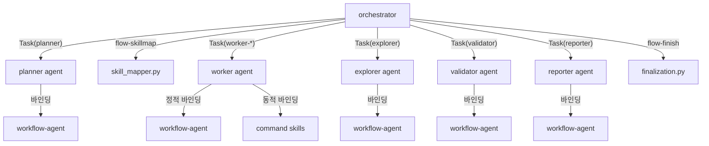

# Common Reference

## Glossary (용어 사전)

### 용어 분류: 3계층 스킬 바인딩

- **Agent Skill** (Tier 1, `workflow-agent-*`): 정적 바인딩. 에이전트 워크플로우 절차 정의.
- **Specialization Skill** (Tier 2, 전문화 스킬): 동적 바인딩 (worker 전용). 범용 도메인 전문성. scope: global. 필수 1+.
- **Project Skill** (Tier 3, 프로젝트 스킬): 동적 바인딩 (worker 전용). DDD 도메인 특화. scope: project. 반필수.
- "skill" 단독 사용 시 세 가지 레벨을 포괄하는 총칭

### 핵심 용어 정의

| 용어 (영문) | 한글 표기 | 정의 |
|-------------|----------|------|
| **Step** | 스텝 | 워크플로우의 실행 단위. PLAN, WORK, REPORT, DONE, FAILED, CANCELLED, STALE 중 하나. |
| **command** | 명령어 | 사용자가 실행하는 작업 유형. implement, review, research 중 하나. |
| **agent** | 에이전트 | 특정 Step을 전담하는 실행 주체. planner, worker, explorer, reporter 4개와 orchestrator로 구성. |
| **sub-agent** | 서브에이전트 | orchestrator가 Task 도구로 호출하는 하위 에이전트. planner, worker, explorer, reporter가 해당. sub-agent 간 직접 호출은 금지. |
| **worker-opus** | 워커(Opus) | WORK Step을 전담하는 서브에이전트. 복잡한 코드 생성/리팩토링, 아키텍처 변경 등 고복잡도 작업(Tier 3). |
| **worker-sonnet** | 워커(Sonnet) | WORK Step을 전담하는 서브에이전트. 일반 구현/수정, 중간 복잡도 작업(Tier 2). |
| **explorer** | 익스플로러 | WORK Step에서 코드베이스+웹 탐색을 전담하는 서브에이전트. Worker와 동일 레벨로 호출되며, 탐색 결과를 구조화된 작업 내역으로 생성. |
| **orchestrator** | 오케스트레이터 | 워크플로우의 단계 순서(sequencing)와 에이전트 디스패치를 제어하는 최상위 에이전트. Application Service 역할. "메인 에이전트", "부모 에이전트"와 동일한 개념이며, 모든 문서에서 "오케스트레이터"로 통일. |
| **init** | 이닛 | 오케스트레이터가 flow-init(initialization.py)을 실행하여 워크플로우 디렉터리 생성, status.json 초기화, 레지스트리 등록을 수행. |
| **planner** | 플래너 | PLAN Step을 전담하는 서브에이전트. 사용자 요청을 분석하여 태스크 분해, 종속성 정의, 실행 계획서(plan.md)를 생성. |
| **reporter** | 리포터 | REPORT Step을 전담하는 서브에이전트. 작업 내역(work log)을 취합하여 보고서(report.md)를 생성. |
| **flow-finish** | 플로우 스크립트 피니시 | 오케스트레이터가 직접 호출하는 워크플로우 마무리 스크립트(finalization.py). status 전이, history.md 갱신, 사용량 확정, 아카이빙, kanban 갱신을 수행. |
| **orchestrator exclusive action** | 오케스트레이터 전용 행위 | 서브에이전트가 플랫폼 제약으로 수행할 수 없어 오케스트레이터만 수행 가능한 행위. AskUserQuestion, `flow-claude`/`flow-step`/`flow-phase`/`flow-update` 배너(shell alias — Bash 도구에서 alias 이름으로 직접 호출), `flow-init`/`flow-finish`/`flow-reload` 스크립트 alias, `flow-update` 호출 등. |
| **workDir** | 작업 디렉터리 | 워크플로우의 모든 산출물이 저장되는 디렉터리. 형식: `.workflow/<YYYYMMDD-HHMMSS>/<workName>/<command>` |
| **workId** | 작업 ID | 워크플로우를 식별하는 6자리 시간 기반 ID. 형식: `HHMMSS` (예: 143000). |
| **registryKey** | 워크플로우 키 | 워크플로우를 전역적으로 식별하는 키. 형식: `YYYYMMDD-HHMMSS`. 디렉터리 스캔으로 workDir를 해석. |
| **FSM** | 유한 상태 기계 | Finite State Machine. 워크플로우의 Step 전이를 제어하는 상태 기계. 이중 가드(`.claude/scripts/flow/update_state.py` + `.claude/hooks/pre-tool-use.py`)로 불법 전이를 차단. |
| **transition** | 전이 | FSM에서 한 Step에서 다른 Step으로의 상태 변경. status.json의 transitions 배열에 이벤트 시퀀스로 기록됨. |
| **Aggregate** | 애그리거트 | DDD 전술적 설계 패턴. 워크플로우 시스템에서 status.json(워크플로우 상태)이 Aggregate Root 역할. |
| **mode** | 모드 | 워크플로우 실행 모드. PLAN->WORK->REPORT->DONE 단일 모드. |
| **skill-map** | 스킬 맵 | Phase 0에서 생성되는 태스크별 command skill 매핑 결과. `<workDir>/work/skill-map.md`에 저장. Worker는 매핑 테이블에서 스킬 목록을 확인하고 필요한 스킬의 지침을 직접 로드. |
| **Phase 0** | 준비 단계 | WORK Step 시작 시 1개 worker가 수행하는 준비 작업. 계획서에서 명시된 작업을 수행하기 위해 필요한 스킬을 `.claude/skills/` 디렉터리에서 탐색하고 `skill-map.md`로 매핑하는 단계. work 디렉터리 생성 및 skill-map 작성. 모든 워크플로우에서 필수 실행. |
| **Phase 1+** | 작업 실행 단계 | Phase 0 완료 후 skill-map.md를 참조하여 계획서의 태스크를 Phase 순서대로 실행하는 단계. 각 Worker가 skill-map.md 매핑 테이블에서 스킬 목록을 확인하고, 해당 스킬의 COMPACT.md/SKILL.md를 직접 Read하여 작업 수행. skill-map.md가 없으면 Worker 자율 결정으로 진행. |
| **banner** | 배너 | 워크플로우 진행 상태를 터미널에 표시하는 시각적 알림. orchestrator가 Step 시작/완료 시 호출. |
| **task** | 태스크 | 계획서에서 분해된 개별 실행 단위. Worker 또는 Explorer가 수행. |
| **work log** | 작업 내역 | Worker/Explorer가 태스크 실행 후 생성하는 기록 파일. `work/WXX-*.md` 형식. |
| **plan document** | 계획서 | planner가 PLAN 단계에서 생성하는 작업 계획 문서. `plan.md`. 기술적 실행 전략(HOW)을 담당하며, 사용자 의도(WHAT)는 user_prompt.txt가 전담한다. |
| **report document** | 보고서 | reporter가 REPORT 단계에서 생성하는 결과 문서. `report.md`. |
| **usage-pending** | 사용량 대기 등록 | Worker 호출 전 토큰 사용량 추적을 위해 등록하는 상태. |
| **artifact** | 산출물 | 워크플로우 실행 과정에서 생성되는 파일. 계획서, 보고서, 작업 내역 등. |
| **Workflow Step** | 워크플로우 스텝 | 오케스트레이터 절차 순서. FSM Step과 1:1 대응. SKILL.md의 INIT/PLAN/WORK/REPORT/DONE 섹션에서 각 Step별 프로토콜을 정의. |
| **DONE** | (FSM Step/배너 명칭) | 워크플로우 완료를 나타내는 FSM Step이자 배너 명칭. 오케스트레이터가 flow-finish + flow-claude end로 마무리 수행. Agent-Step 매핑 테이블, Step 헤딩(DONE), 배너(Workflow <registryKey> DONE)에서 사용. |
| **summary.txt** | 요약 파일 | reporter 에이전트가 생성하고, flow-finish(finalization.py)가 읽어서 history.md 갱신에 활용 |
| **user_prompt.txt** | 사용자 프롬프트 파일 | 사용자 요청 원문 파일. `<workDir>/user_prompt.txt`에 저장. initialization.py가 `.kanban/active/T-NNN.xml` 티켓 전체 XML을 읽어 workDir에 복사 후 상태를 in-progress로 전환. 티켓 파일은 `<metadata>` / `<submit>` / `<history>` 3래퍼 요소 구조를 가지며, `<current>`는 `<metadata>` 래퍼 내부(number/title/datetime/status/current)에 위치함. `<subnumber>` 내부에 `<prompt>` 래퍼(goal/target/constraints/criteria/context 포함)와 `<result>` 래퍼(workdir/plan/work/report 하위 요소)가 있음. **XML 구조 SSoT 레퍼런스:** `.claude/skills/workflow-orchestration/references/T-NNN.xml` |

### WHAT/HOW Bounded Context 용어 구분

| WHAT BC (티켓) | HOW BC (계획서) | 설명 |
|----------------|----------------|------|
| criteria (완료 기준) | 기술 검증 기준 | WHAT: 사용자 수준 성공 판정. HOW: 파일명/수치/조건 기반 기술 검증 |
| goal (목표) | 작업 요약 | WHAT: 사용자 의도/비즈니스 목표. HOW: 기술적 접근 방식과 산출물 |
| context (맥락) | 현황 스냅샷 | WHAT: 배경 정보 원문. HOW: 코드베이스 탐색 기반 정량적 현황 분석 |
| 요청 (request) | 사용자 원문 (메타 필드) | 사용자 원문 그대로 보존. plan.md에서 재서술하지 않음 |
| scope (범위) | 작업 범위 (In/Out-of-Scope) | WHAT: 사용자 정의 범위. HOW: 기술적 해석을 거친 구체적 범위 |

WHAT BC의 용어는 user_prompt.txt(티켓 원문)에서 사용되며, HOW BC의 용어는 plan.md(계획서)에서 사용된다. 동일 개념에 대해 BC별로 다른 용어를 사용하여 역할 경계를 명확히 한다.

### 에이전트-Step-스킬 관계


```mermaid
flowchart TD
    ORCH[orchestrator] -->|"Task(planner)"| PLAN_A[planner agent]
    ORCH -->|"flow-skillmap"| SKILL_MAP[skill_mapper.py]
    ORCH -->|"Task(worker-*)"| WORK_A[worker agent]
    ORCH -->|"Task(explorer)"| EXPLORE_A[explorer agent]
    ORCH -->|"Task(validator)"| VALID_A[validator agent]
    ORCH -->|"Task(reporter)"| REPORT_A[reporter agent]
    ORCH -->|"flow-finish"| FINISH[finalization.py]

    PLAN_A -->|바인딩| WF_PLAN[workflow-agent]
    WORK_A -->|정적 바인딩| WF_WORK[workflow-agent]
    WORK_A -->|동적 바인딩| CMD_SKILLS[command skills]
    EXPLORE_A -->|바인딩| WF_EXPLORE[workflow-agent]
    VALID_A -->|바인딩| WF_VALID[workflow-agent]
    REPORT_A -->|바인딩| WF_REPORT[workflow-agent]
```

- **orchestrator**: 에이전트를 직접 호출하는 유일한 주체. 에이전트 간 직접 호출 금지.
- **에이전트-Step 1:1 매핑**: 각 에이전트는 특정 Step을 전담 (planner=PLAN, skill_mapper.py=WORK Phase 0, worker/explorer=WORK Phase 1~N, validator=WORK Phase N+1, reporter=REPORT). DONE은 오케스트레이터가 flow-finish로 직접 처리.
- **스킬 바인딩 이중 구조**: workflow skill은 frontmatter로 정적 바인딩, command skill은 skill-catalog.md로 동적 바인딩 (worker 전용).
- **역할 경계 원칙**: 오케스트레이터는 조율(sequencing, dispatch, state management)만 수행하고 실제 작업(파일 수정, 계획서/보고서 작성)은 서브에이전트에 위임한다. 단, 플랫폼 제약 행위는 오케스트레이터가 직접 수행한다.

### 한영 표기 규약

- 시스템 내부 식별자/에이전트 참조/코드 주석: 영문 원형 사용 (`phase`, `workDir`, planner 등)
- 사용자 대면 문서/계획서/보고서: 한글 중심, 최초 등장 시 한영 병기 (예: "워커(worker)")
- 검색 일관성: 최초 등장 시 한영 병기 후 이후 일관 사용

### 외래어 표기 기준

| 표준 표기 | 비표준 표기 (사용 금지) | 근거 |
|----------|----------------------|------|
| 디렉터리 | 디렉토리 | 국립국어원 외래어 표기법 (directory) |

### 용어 통일 기준

다음 표현은 문서 전체에서 통일된 용어로 사용한다.

| 통일 용어 | 대체된 표현 (사용 금지) | 적용 문맥 |
|----------|----------------------|----------|
| 오케스트레이터 | 메인 에이전트, 부모 에이전트, 상위 에이전트 (모든 문서에서 치환 완료) | 에이전트/스킬 문서 전체. 섹션 제목, 입력/반환 설명, 에러 보고 등 모든 문맥. |
| DONE 배너 | DONE Phase 배너 | DONE은 배너 명칭이며 FSM Step이므로 "Phase"를 붙이지 않는다. |
| 디렉터리 | 디렉토리 | 외래어 표기법 기준. 위 "외래어 표기 기준" 참조. |

## Agent-Skill Mapping Matrix

| Agent | Phase | Workflow Skill | Command Skills | Binding |
|-------|-------|---------------|----------------|---------|
| planner | PLAN | workflow-agent | - | frontmatter `skills:` |
| worker-opus | WORK | workflow-agent | 전문화 스킬(Tier 2) + 프로젝트 스킬(Tier 3) 동적 로드 (계획서 명시 > skills 파라미터 > 명령어 기본 매핑 > TF-IDF fallback) | frontmatter `skills:` (workflow-agent) + 런타임 동적 (Tier 2 + Tier 3) |
| worker-sonnet | WORK | workflow-agent | (worker-opus와 동일) | (worker-opus와 동일) |
| explorer | WORK | workflow-agent | - | frontmatter `skills:` |
| validator | WORK (Phase N+1) | workflow-agent | - | frontmatter `skills:` |
| reporter (sonnet) | REPORT | workflow-agent | - | frontmatter `skills:` |

> **worker의 스킬 동적 로드 (3계층)**: worker는 `workflow-agent` skill만 frontmatter에 선언합니다. 전문화 스킬(Tier 2)과 프로젝트 스킬(Tier 3)은 4단계 우선순위(계획서 명시 > skills 파라미터 > 명령어 기본 매핑 > TF-IDF fallback)로 런타임에 결정됩니다.

## Responsibility Matrix (Main vs Sub-agent)

| Action | 주체 | 근거 |
|--------|------|------|
| AskUserQuestion | Main | 플랫폼 제약: 서브에이전트에서 호출 불가 (GitHub Issue #12890). `-n` 수동 확인 모드 전용. 기본 모드에서는 자동 fallback으로 대체됨 |
| flow-claude/flow-step/flow-phase/flow-update 배너 + flow-init/flow-finish/flow-reload 스크립트 (Phase banner & script Bash calls) | Main | 플랫폼 제약: 서브에이전트 Bash 출력이 사용자 터미널에 미표시. flow-update가 상태 전이 시각화를 전담. 배너 명령은 개별 Bash 호출로 실행 (체이닝 금지). task-start 모드로 통합되어 && 체이닝 불필요 |
| update_state.py 호출 (transition) | Main + Sub (모드별) | Step 전이(status)는 오케스트레이터 전용. 보조 작업(link-session, usage 기록)은 서브에이전트 허용 |
| 소스 코드 Read/Write/Edit | Sub (worker) | 역할 분리: 실제 작업(소스 코드 읽기/수정/생성)은 서브에이전트에 위임 |
| plan.md Read (디스패치용, 1회만) | **Main** | 최소 6개 필드(taskId, phase, dependencies, parallelism, agentType, skills)만 추출. 디스패치 순서 결정 목적으로 한정. 계획서 내용 해석/보관 금지 |
| skill-map.md Read | **Sub (worker, Phase 1+)** | 오케스트레이터는 경로(`skillMapPath`)만 전달. Worker가 직접 읽어 스킬을 결정 (Phase 1+에서 참조) |
| user_prompt.txt Read | Sub (worker) | worker 서브에이전트가 필요 시 직접 읽기 |
| 계획서 작성 (plan.md) | Sub (planner) | 역할 분리: 계획 수립은 planner 전담 |
| 보고서 작성 (report.md) | Sub (reporter) | 역할 분리: 보고서 종합은 reporter 전담 |
| 작업 내역 작성 (work/WXX-*.md) | Sub (worker, explorer) | 역할 분리: 태스크 실행 기록은 worker/explorer 전담 |
| 초기화 (workDir/status.json 생성) | Main (flow-init) | 워크플로우 초기화는 오케스트레이터가 flow-init을 통해 수행 |
| 마무리 (Slack 알림/정리) | Main (flow-finish + flow-claude end) | 오케스트레이터가 flow-finish(finalization.py) + flow-claude end로 직접 마무리 수행 |

## Worker Agent Common Rules (공통 규칙)

모든 워커 에이전트(worker-*/explorer/validator)가 따라야 하는 3가지 공통 규칙입니다.

| 규칙 | 설명 | 적용 대상 |
|------|------|----------|
| **산출물 필수 생성** | 모든 태스크 실행 후 반드시 작업 내역 파일을 생성해야 함.<br><br>- worker-*/explorer: `work/WXX-*.md`<br>- validator: `work/validation-report.md`<br><br>검증 결과 SKIP이거나 실패하더라도 파일은 반드시 생성. | worker-opus<br>worker-sonnet<br>explorer<br>validator |
| **계획서+스킬 로드 필수** | 모든 워커는 작업 시작 시 다음을 필수 수행해야 함:<br><br>1. planPath에서 계획서(plan.md)를 Read하여 요구사항 파악<br>2. skillMapPath에서 skill-map.md를 Read하여 태스크용 스킬 로드. 또는 skills 파라미터로 전달된 스킬 사용<br><br>참고: explorer는 계획서 스킬 컬럼 및 skills 파라미터만 지원. TF-IDF fallback은 비적용. | worker-opus<br>worker-sonnet<br>explorer<br>(validator은 계획서 로드만) |
| **선행 산출물 참조 필수** | 종속 태스크(dependencies 컬럼에 선행 ID가 있는 경우) 수행 시 `<workDir>/work/` 경로에서 선행 작업 내역 파일을 반드시 Read해야 함.<br><br>- worker-*/explorer: 작업 연속성 보장 목적<br>- validator: 검증 컨텍스트 확보 목적 (Glob으로 전체 W*-*.md 탐색 후 "핵심 발견" 섹션 참조) | worker-opus<br>worker-sonnet<br>explorer<br>validator (검증 컨텍스트로 활용) |

## Sub-agent Return Formats (REQUIRED)

> **WARNING: 반환값이 1줄을 초과하면 오케스트레이터 컨텍스트가 폭증하여 시스템 장애가 발생합니다.**
>
> 1. 모든 작업 결과는 `.workflow/` 파일에 기록 완료 후 반환
> 2. 반환값은 오직 **상태만** 포함 (1줄)
> 3. 경로, 메타정보(N개), 코드, 목록, 테이블, 요약, 마크다운 헤더는 반환에 MUST NOT include
> 4. 규격 외 내용 1줄이라도 추가 시 시스템 장애 발생

### Common Rules

- 작업 상세는 `.workflow/` 파일에 기록, 메인에는 **상태 1줄만** 반환 (경로/코드/로그/테이블 MUST NOT)
- 산출물 경로는 컨벤션으로 확정 (아래 Artifact Path Convention 참조). 반환값에 경로를 포함하지 않는다
- 오케스트레이터: 반환값 수신 후 해석/요약/설명 출력 금지. DONE 배너 Bash 결과 수신 → turn 즉시 종료 (도구 호출 0개, 텍스트 출력 0자). `flow-claude end <registryKey> DONE` 호출 후 어떠한 행위도 하지 않고 turn을 끝내라

### Return Format (All Agents — 1 line)

| Agent | Return Format |
|-------|---------------|
| planner | `상태: 작성완료` |
| worker-* | `상태: 성공\|부분성공\|실패` |
| explorer | `상태: 성공\|부분성공\|실패` |
| validator | `상태: 통과\|경고\|실패` |
| reporter | `상태: 완료\|실패` |

### Artifact Path Convention

산출물 경로는 반환값에 포함하지 않으며, 아래 컨벤션으로 확정한다.

| Agent | Artifact Path (Convention) |
|-------|---------------------------|
| planner | `<workDir>/plan.md` |
| skill_mapper.py | `<workDir>/work/skill-map.md` |
| worker-* | `<workDir>/work/WXX-*.md` |
| explorer | `<workDir>/work/WXX-*.md` |
| validator | `<workDir>/work/validation-report.md` |
| reporter | `<workDir>/report.md`, `<workDir>/summary.txt` |

## State Update Methods

`flow-update <mode> <registryKey> [args...]` 명령으로 상태를 업데이트합니다. `both` 모드 권장.

| Mode | Arguments | Description |
|------|-----------|-------------|
| context | `<registryKey> <agent>` | .context.json agent 필드 업데이트 |
| status | `<registryKey> <toStep>` | status.json step 변경 (fromStep은 status.json에서 자동 읽기) |
| both | `<registryKey> <agent> <toStep>` | context + status 동시 (권장) |
| link-session | `<registryKey> <sessionId>` | linked_sessions에 세션 추가 |
| env | `<registryKey> set\|unset <KEY> [VALUE]` | .claude.env 환경변수 설정/해제 |
| usage-pending | `<registryKey> <id1> [id2] ...` | 워커 호출 전 사용량 추적 대기 등록. 복수 ID 지원. agent_id=task_id 자동 매핑. |
| usage | `<registryKey> <agent_name> <input_tokens> <output_tokens> [cache_creation] [cache_read] [task_id]` | 워커 완료 후 실제 토큰 사용량 기록. agent_name(planner/worker/reporter), 입출력 토큰, 선택적 캐시 정보, 워커 태스크ID(task_id)를 기록. |
| usage-finalize | `<registryKey>` | 모든 usage 기록을 취합하여 사용량 집계 완료. workflow 마무리 시 호출. |
| task-start | `<registryKey> <id1> [id2] ...` | task-status running + usage-pending 일괄 등록. 복수 ID 지원. |
| task-status | `<registryKey> <status> <id1> [id2] ...` 또는 `<registryKey> <taskId> <status>` (레거시) | 태스크 상태 갱신. 복수 ID 지원 (신규). 레거시 단일 ID 형식도 자동 감지. |

- registryKey: `YYYYMMDD-HHMMSS` 형식. hook 초기화 출력에서 직접 사용 가능. 구성: `date + "-" + workId`. 전체 workDir 경로도 하위 호환.
- agent 값: PLAN=`planner`, WORK=`worker` (worker-opus/sonnet 공통), REPORT=`reporter`

> **Note:** 상태 전이 시각화는 `flow-update` 배너(shell alias)가 전담한다. `flow-update` 호출 시 "이전 상태 -> 현재 상태" 형식으로 ANSI 색상 강조 출력된다(fromStep은 status.json에서 자동 읽기). 그 후 `flow-step start`를 호출하여 시작 배너를 출력한다. (WORK-PHASE에서는 flow-update 스킵) task-start 모드는 task-status + usage-pending을 통합하므로 개별 호출이 불필요. 각각 개별 Bash 도구 호출로 실행하며, `&&`/`;` 체이닝은 불필요.

### 호출 주체별 허용 모드

| 모드 | 오케스트레이터 | 서브에이전트 |
|------|--------------|-------------|
| context | O | X |
| status | O | X |
| both | O | X |
| link-session | X | O (worker, explorer, reporter) |
| env | O | X |
| usage-* | X | O (Hook) |
| task-start | O | X |

- 비차단 원칙: 실패 시 경고만 출력, 워크플로우 정상 진행. Step 전이 실패 시: 자동 재시도 3회(1초 간격) + 3회 실패 시 `WORKFLOW_SKIP_GUARD=1` 강제 전이 + AUDIT 로그 기록. `-n` 수동 확인 모드에서만 AskUserQuestion 유지

## State Management (status.json)

`<workDir>/status.json`으로 현재 단계와 전이 이력을 추적합니다. 스키마(9개 필드)는 initialization.py에서 생성.

`linked_sessions`: 워크플로우에 참여한 세션 ID 배열. worker/explorer/reporter가 `link-session`으로 자체 등록 (중복 자동 방지, 비차단).

### FSM Transition Rules

**Mode-aware transitions** (status.json `mode` field determines allowed transitions):

| Normal Flow | Branches |
|-------------|----------|
| `PLAN -> WORK -> REPORT -> DONE` | PLAN/WORK/REPORT->CANCELLED, PLAN/WORK/REPORT->FAILED, INIT/NONE->{STALE,FAILED,CANCELLED}, TTL->STALE |

불법 전이 시 시스템 가드가 차단. `.claude/scripts/flow/update_state.py`는 전이 미수행(no-op), `.claude/hooks/pre-tool-use.py`는 도구 호출 deny. 비상 시 WORKFLOW_SKIP_GUARD=1로 우회 가능.

> `mode` 필드가 없는 기존 status.json은 기본값 `full`로 처리 (하위 호환).

## Error Handling

| Situation | Action |
|-----------|--------|
| Hook initialization error | 최대 3회 재시도 (경고 로그 출력) |
| Step error (PLAN/WORK/REPORT) | 최대 3회 재시도 후 에러 보고 |
| Independent task failure | 다른 독립 태스크는 계속 진행 |
| Dependent task blocker failure | 해당 종속 체인 중단, 다른 체인 계속 |
| Total failure rate > 50% | `[WARN]` 로그 기록 후 실패 태스크 skip, 남은 태스크 계속 실행. REPORT 단계에서 실패 태스크 보고 섹션 자동 포함 |
| update_state.py deny/failure (Step 전이 실패) | 자동 재시도 3회(1초 간격). 3회 실패 시 `WORKFLOW_SKIP_GUARD=1` 강제 전이(`flow-update env` 설정 -> 재호출 -> 즉시 해제). `[AUDIT]` 로그 기록 + 보고서에 FSM 강제 전이 경고 포함. 강제 전이도 실패 시 FAILED 상태 전이 |
| Workflow cancel/abort (중단/취소) | status 전이를 통해 CANCELLED 상태로 변경. |

### 전이 실패 자동 복구 절차

Step 전이(`update_state.py`) 호출 결과가 "blocked" 또는 "failed"를 포함하는 경우 아래 절차를 순서대로 실행한다.

**1차~3차 재시도 (1초 간격)**

```
1차 시도: update_state.py 호출 -> 결과 확인
  -> 성공("allowed"): 정상 진행
  -> 실패("blocked"/"failed"): 1초 대기 후 2차 시도
2차 시도: status.json 재로드 후 update_state.py 재호출
  -> 성공: 정상 진행
  -> 실패: 1초 대기 후 3차 시도
3차 시도: status.json 재로드 후 update_state.py 재호출
  -> 성공: 정상 진행
  -> 실패: 강제 전이 단계로 진입
```

**강제 전이 (재시도 3회 소진 후)**

강제 전이는 다음 4가지 조건을 모두 충족해야 한다.

1. **재시도 3회 소진**: 1차~3차 재시도 모두 실패한 경우에만 발동
2. **즉시 환경변수 해제**: `flow-update env <registryKey> set WORKFLOW_SKIP_GUARD 1` 설정 후 재호출 완료 즉시 `flow-update env <registryKey> unset WORKFLOW_SKIP_GUARD` 해제. 환경변수가 잔류하면 안 됨
3. **AUDIT 로그 기록**: `[AUDIT]` 레벨로 workflow.log에 전이 대상(fromStep -> toStep), 재시도 횟수, 강제 전이 발동 시각을 기록
4. **보고서 경고 포함**: 보고서(`report.md`)에 "FSM 강제 전이 경고" 섹션을 자동 포함. 강제 전이 발생 단계, 원인, 발동 시각 명시

**강제 전이 실패 시 CRITICAL 처리**

```
강제 전이도 실패:
  -> flow-update both <registryKey> worker FAILED 호출 (FAILED 상태 전이 시도)
  -> [CRITICAL] 로그 기록: FSM 강제 전이 실패, 워크플로우 복구 불가 상태
  -> 워크플로우 종료 (이후 단계 실행 불가)
```
