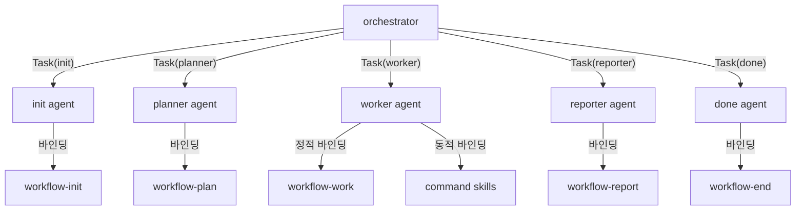

# Common Reference

## Glossary (용어 사전)

### 용어 분류: Workflow Skill vs Command Skill

- **Workflow Skill** (`workflow-*`, 7개): 워크플로우 단계 관리 및 오케스트레이션. 에이전트 frontmatter의 `skills:` 필드로 정적 바인딩.
- **Command Skill** (`command-*` 또는 기능명, 40+개): 개별 명령어의 구체적 기능 수행. `command-skill-map.md` 기반 동적 바인딩 (worker 전용).
- "skill" 단독 사용 시 두 가지 레벨을 포괄하는 총칭

### 핵심 용어 정의

| 용어 (영문) | 한글 표기 | 정의 |
|-------------|----------|------|
| **Phase** | 단계 | 워크플로우의 실행 단위. INIT, PLAN, WORK, REPORT, COMPLETED, FAILED, CANCELLED, STALE 중 하나. <!-- END는 FSM Phase가 아닌 done 에이전트 활동 구간의 별칭이다 --> |
| **command** | 명령어 | 사용자가 실행하는 작업 유형. implement, review, research, strategy, prompt 중 하나. |
| **agent** | 에이전트 | 특정 Phase를 전담하는 실행 주체. init, planner, worker, explorer, reporter, done 6개와 orchestrator(메인 에이전트)로 구성. |
| **sub-agent** | 서브에이전트 | orchestrator가 Task 도구로 호출하는 하위 에이전트. init, planner, worker, explorer, reporter, done이 해당. sub-agent 간 직접 호출은 금지. |
| **worker** | 워커 | WORK Phase를 전담하는 서브에이전트. 계획서의 태스크를 독립적으로 실행하며, 병렬 실행이 가능. |
| **explorer** | 익스플로러 | WORK Phase에서 코드베이스+웹 탐색을 전담하는 서브에이전트. Worker와 동일 레벨로 호출되며, 탐색 결과를 구조화된 작업 내역으로 생성. |
| **orchestrator** | 오케스트레이터 | 워크플로우의 단계 순서(sequencing)와 에이전트 디스패치를 제어하는 메인 에이전트. Application Service 역할. |
| **orchestrator exclusive action** | 오케스트레이터 전용 행위 | 서브에이전트가 플랫폼 제약으로 수행할 수 없어 오케스트레이터만 수행 가능한 행위. AskUserQuestion, Workflow 배너, wf-state 호출 등. |
| **workDir** | 작업 디렉토리 | 워크플로우의 모든 산출물이 저장되는 디렉토리. 형식: `.workflow/<YYYYMMDD-HHMMSS>/<workName>/<command>` |
| **workId** | 작업 ID | 워크플로우를 식별하는 6자리 시간 기반 ID. 형식: `HHMMSS` (예: 143000). |
| **registryKey** | 레지스트리 키 | 워크플로우를 전역적으로 식별하는 키. 형식: `YYYYMMDD-HHMMSS`. registry.json에서 workDir로 해석됨. |
| **FSM** | 유한 상태 기계 | Finite State Machine. 워크플로우의 Phase 전이를 제어하는 상태 기계. 이중 가드(update-state.sh + transition-guard.sh)로 불법 전이를 차단. |
| **transition** | 전이 | FSM에서 한 Phase에서 다른 Phase로의 상태 변경. status.json의 transitions 배열에 이벤트 시퀀스로 기록됨. |
| **Aggregate** | 애그리거트 | DDD 전술적 설계 패턴. 워크플로우 시스템에서 status.json(워크플로우 상태)과 registry.json(전역 레지스트리)이 각각 Aggregate Root 역할. |
| **mode** | 모드 | 워크플로우 실행 모드. `full`(INIT->PLAN->WORK->REPORT->COMPLETED), `no-plan`(INIT->WORK->REPORT->COMPLETED), `prompt`(INIT->WORK->REPORT->COMPLETED) 3가지. |
| **skill-map** | 스킬 맵 | Phase 0에서 생성되는 태스크별 command skill 매핑 결과. `<workDir>/work/skill-map.md`에 저장. |
| **Phase 0** | 준비 단계 | WORK Phase 시작 전 1개 worker가 수행하는 준비 작업. work 디렉토리 생성 및 skill-map 작성. full 모드에서 필수 실행. |
| **banner** | 배너 | 워크플로우 진행 상태를 터미널에 표시하는 시각적 알림. orchestrator가 Phase 시작/완료 시 호출. |
| **task** | 태스크 | 계획서에서 분해된 개별 실행 단위. Worker 또는 Explorer가 수행. |
| **work log** | 작업 내역 | Worker/Explorer가 태스크 실행 후 생성하는 기록 파일. `work/WXX-*.md` 형식. |
| **plan document** | 계획서 | planner가 PLAN 단계에서 생성하는 작업 계획 문서. `plan.md`. |
| **report document** | 보고서 | reporter가 REPORT 단계에서 생성하는 결과 문서. `report.md`. |
| **usage-pending** | 사용량 대기 등록 | Worker 호출 전 토큰 사용량 추적을 위해 등록하는 상태. |
| **artifact** | 산출물 | 워크플로우 실행 과정에서 생성되는 파일. 계획서, 보고서, 작업 내역 등. |
| **Step** | 스텝 | 오케스트레이터 절차 순서. Phase(FSM 상태)와 구분되는 개념으로 step1-init.md~step5-done.md 파일명에 사용. |

### 에이전트-Phase-스킬 관계



- **orchestrator**: 에이전트를 직접 호출하는 유일한 주체. 에이전트 간 직접 호출 금지.
- **에이전트-Phase 1:1 매핑**: 각 에이전트는 특정 Phase를 전담 (init=INIT, planner=PLAN, worker=WORK, reporter=REPORT, done=END (END는 REPORT->COMPLETED 전이 구간의 별칭)).
- **스킬 바인딩 이중 구조**: workflow skill은 frontmatter로 정적 바인딩, command skill은 command-skill-map.md로 동적 바인딩 (worker 전용).
- **역할 경계 원칙**: 오케스트레이터는 조율(sequencing, dispatch, state management)만 수행하고 실제 작업(파일 수정, 계획서/보고서 작성)은 서브에이전트에 위임한다. 단, 플랫폼 제약 행위는 오케스트레이터가 직접 수행한다.

### 한영 표기 규약

- 시스템 내부 식별자/에이전트 참조/코드 주석: 영문 원형 사용 (`phase`, `workDir`, init, planner 등)
- 사용자 대면 문서/계획서/보고서: 한글 중심, 최초 등장 시 한영 병기 (예: "워커(worker)")
- 검색 일관성: 최초 등장 시 한영 병기 후 이후 일관 사용

## Agent-Skill Mapping Matrix

| Agent | Phase | Workflow Skill | Command Skills | Binding |
|-------|-------|---------------|----------------|---------|
| init | INIT | workflow-init | - | frontmatter `skills:` |
| planner | PLAN | workflow-plan | - | frontmatter `skills:` |
| worker | WORK | workflow-work | command-skill-map.md 기반 동적 로드 (implement, review, research, strategy별 기본 매핑 + 키워드 매칭 + description 폴백) | frontmatter `skills:` (workflow-work) + 런타임 동적 (command skills) |
| explorer | WORK | workflow-explore | - | frontmatter `skills:` |
| reporter | REPORT | workflow-report | - | frontmatter `skills:` |
| done | END (별칭) | workflow-end | - | frontmatter `skills:` |

> **worker의 command skill 동적 로드**: worker는 `workflow-work` skill만 frontmatter에 선언합니다. command skill은 `command-skill-map.md`의 4단계 우선순위(skills 파라미터 > 명령어 기본 매핑 > 키워드 매칭 > description 폴백)로 런타임에 결정됩니다.

## Responsibility Matrix (Main vs Sub-agent)

| Action | 주체 | 근거 |
|--------|------|------|
| AskUserQuestion | Main | 플랫폼 제약: 서브에이전트에서 호출 불가 (GitHub Issue #12890) |
| Workflow 배너 (Phase banner Bash calls) | Main | 플랫폼 제약: 서브에이전트 Bash 출력이 사용자 터미널에 미표시 |
| wf-state 호출 (transition/registry) | Main + Sub (모드별) | Phase 전이(status)와 레지스트리(register/unregister)는 오케스트레이터 전용. 보조 작업(link-session, usage 기록)은 서브에이전트 허용 |
| 소스 코드 수정 (Read/Write/Edit) | Sub (worker) | 역할 분리: 실제 작업은 서브에이전트에 위임 |
| 계획서 작성 (plan.md) | Sub (planner) | 역할 분리: 계획 수립은 planner 전담 |
| 보고서 작성 (report.md) | Sub (reporter) | 역할 분리: 보고서 종합은 reporter 전담 |
| 작업 내역 작성 (work/WXX-*.md) | Sub (worker) | 역할 분리: 태스크 실행 기록은 worker 전담 |
| 초기화 (workDir/status.json 생성) | Sub (init) | 역할 분리: 워크플로우 초기화는 init 전담 |
| 마무리 (Slack 알림/정리) | Sub (done) | 역할 분리: 마무리 처리는 done 전담 |

## Sub-agent Return Formats (REQUIRED)

> **WARNING: 반환값이 규격 줄 수를 초과하면 메인 에이전트 컨텍스트가 폭증하여 시스템 장애가 발생합니다.**
>
> 1. 모든 작업 결과는 `.workflow/` 파일에 기록 완료 후 반환
> 2. 반환값은 오직 상태 + 파일 경로만 포함
> 3. 코드, 목록, 테이블, 요약, 마크다운 헤더는 반환에 MUST NOT include
> 4. 규격 외 내용 1줄이라도 추가 시 시스템 장애 발생

### Common Rules

- 작업 상세는 `.workflow/` 파일에 기록, 메인에는 아래 형식만 반환 (코드/로그/테이블 MUST NOT)
- 오케스트레이터: 반환값 수신 후 해석/요약/설명 출력 금지. DONE 배너 후 즉시 종료 (추가 텍스트 절대 금지)

### init Return Format (8 lines)

```
request: <user_prompt.txt의 첫 50자>
workDir: .workflow/<YYYYMMDD-HHMMSS>/<workName>/<command>
workId: <workId>
registryKey: <YYYYMMDD>-<HHMMSS>
date: <YYYYMMDD>
title: <제목>
workName: <작업이름>
근거: [1줄 요약]
```

### planner Return Format (3 lines)

```
상태: 작성완료
계획서: <계획서 파일 경로>
태스크 수: N개
```

### worker Return Format (3 lines)

```
상태: 성공 | 부분성공 | 실패
작업 내역: <작업 내역 파일 경로>
변경 파일: N개
```

### reporter Return Format (2 lines)

```
상태: 완료 | 실패
보고서: <보고서 파일 경로>
```

### done Return Format (1 line)

```
상태: 완료 | 실패
```

## State Update Methods

`wf-state <mode> <registryKey> [args...]` 명령으로 상태를 업데이트합니다. `both` 모드 권장.

| Mode | Arguments | Description |
|------|-----------|-------------|
| context | `<registryKey> <agent>` | .context.json agent 필드 업데이트 |
| status | `<registryKey> <fromPhase> <toPhase>` | status.json phase 변경 |
| both | `<registryKey> <agent> <fromPhase> <toPhase>` | context + status 동시 (권장) |
| register / unregister | `<registryKey>` | 전역 레지스트리 등록/해제 |
| link-session | `<registryKey> <sessionId>` | linked_sessions에 세션 추가 |
| env | `<registryKey> set\|unset <KEY> [VALUE]` | .claude.env 환경변수 설정/해제 |

- registryKey: `YYYYMMDD-HHMMSS` 형식. init 반환값에서 직접 사용 가능. 구성: `date + "-" + workId`. 전체 workDir 경로도 하위 호환.
- agent 값: INIT=`init`, PLAN=`planner`, WORK=`worker`, REPORT=`reporter`, END=`done`
### 호출 주체별 허용 모드

| 모드 | 오케스트레이터 | 서브에이전트 |
|------|--------------|-------------|
| context | O | X |
| status | O | X |
| both | O | X |
| register | O | X |
| unregister | O | O (done only) |
| link-session | X | O (worker, explorer, reporter) |
| env | O | X |
| usage-* | X | O (Hook) |

- 비차단 원칙: 실패 시 경고만 출력, 워크플로우 정상 진행 (단, 오케스트레이터의 Phase 전이 실패는 예외: AskUserQuestion으로 사용자 확인 필수)

## State Management (status.json)

`<workDir>/status.json`으로 현재 단계와 전이 이력을 추적합니다. 스키마(9개 필드)는 workflow-init skill 참조.

`linked_sessions`: 워크플로우에 참여한 세션 ID 배열. worker/explorer/reporter가 `link-session`으로 자체 등록 (중복 자동 방지, 비차단).

### FSM Transition Rules

**Mode-aware transitions** (status.json `mode` field determines allowed transitions):

| Mode | Normal Flow | Branches |
|------|-------------|----------|
| full (default) | `INIT -> PLAN -> WORK -> REPORT -> COMPLETED` | PLAN->CANCELLED, WORK/REPORT->FAILED, TTL->STALE |
| no-plan | `INIT -> WORK -> REPORT -> COMPLETED` | WORK/REPORT->FAILED, TTL->STALE |
| prompt | `INIT -> WORK -> REPORT -> COMPLETED` | WORK/REPORT->FAILED, TTL->STALE |

불법 전이 시 시스템 가드가 차단. update-workflow-state.sh는 전이 미수행(no-op), PreToolUse Hook은 도구 호출 deny. 비상 시 WORKFLOW_SKIP_GUARD=1로 우회 가능.

> `mode` 필드가 없는 기존 status.json은 기본값 `full`로 처리 (하위 호환).

## Error Handling

| Situation | Action |
|-----------|--------|
| INIT error | 최대 3회 재시도 (경고 로그 출력) |
| Phase error (PLAN/WORK/REPORT) | 최대 3회 재시도 후 에러 보고 |
| Independent task failure | 다른 독립 태스크는 계속 진행 |
| Dependent task blocker failure | 해당 종속 체인 중단, 다른 체인 계속 |
| Total failure rate > 50% | 워크플로우 중단 및 AskUserQuestion으로 사용자 확인 |
| wf-state deny/failure (Phase 전이 실패) | AskUserQuestion으로 사용자에게 상황 보고 후 재시도/중단 선택 요청 |
| Workflow cancel/abort (중단/취소) | 반드시 `wf-state unregister <registryKey>`를 호출하여 레지스트리에서 해제. status 전이와 unregister는 순차 실행 필수. |
