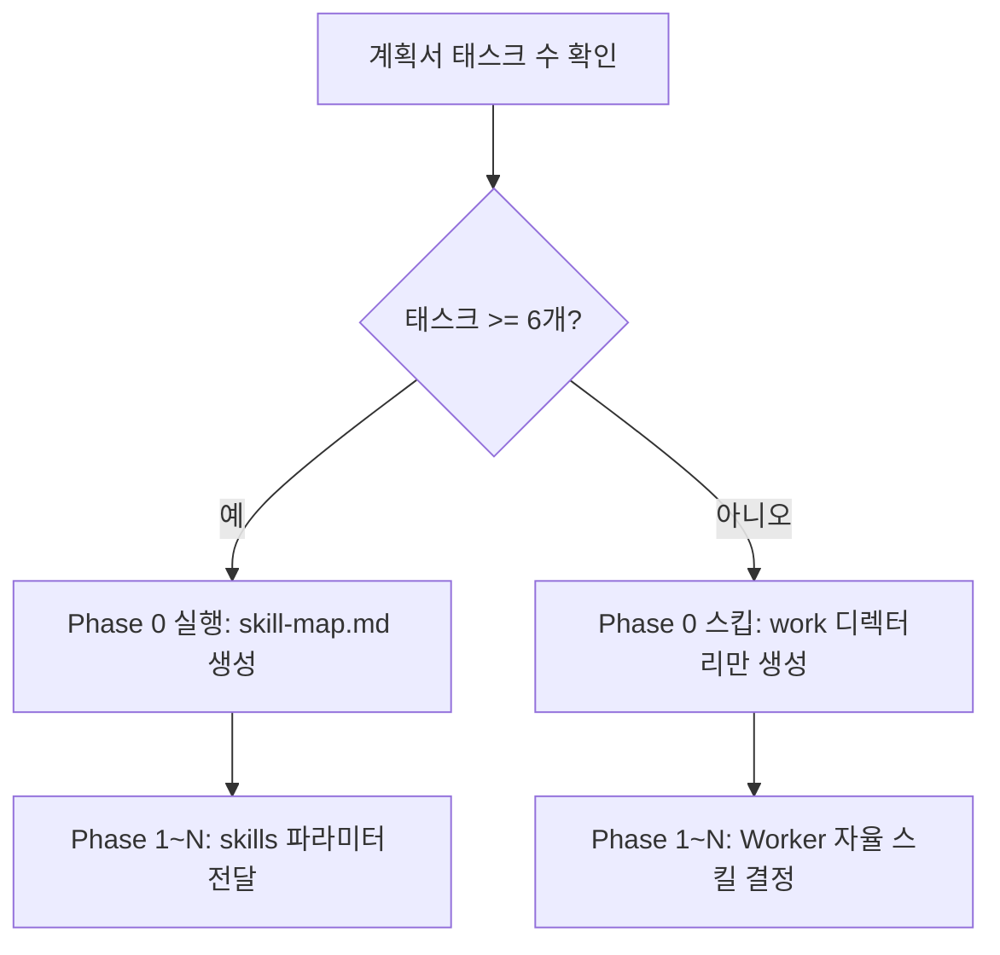

# Step 3: WORK (worker Agent)

> **Agent-Skill Binding**
> - Agent: `worker` (model: inherit, maxTurns: 50)
> - Skill: `workflow-work` (항상 바인딩) + command skills (동적 바인딩, command-skill-map.md 참조)
> - Task prompt (full): `command: <command>, workId: <workId>, taskId: <WXX>, planPath: <planPath>, workDir: <workDir>`
> - Task prompt (no-plan): `command: <command>, workId: <workId>, taskId: W01, workDir: <workDir>, mode: no-plan`

> **State Update** before WORK start:
> ```bash
> # full mode (default): transition from PLAN
> wf-state both <registryKey> worker PLAN WORK
> # no-plan mode: transition from INIT (PLAN was skipped)
> wf-state both <registryKey> worker INIT WORK
> ```

> **WORK Phase Rules (REQUIRED)**
>
> | Category | Rule |
> |----------|------|
> | **Allowed calls** | worker, reporter 에이전트만 호출 가능 |
> | **Re-call MUST NOT** | planner, init 에이전트 재호출 MUST NOT |
> | **Reverse transition MUST NOT** | WORK->PLAN, WORK->INIT 등 역방향 phase 변경 MUST NOT |
> | **Autonomous judgment MUST NOT** | 오케스트레이터가 독자적으로 맥락 보강, 계획 수정, 태스크 추가/삭제/변경을 판단하지 않음 |
> | **Plan tasks only** | 계획서에 명시된 태스크만 순서대로 실행. 계획서에 없는 작업은 수행하지 않음 |

**Detailed Guide:** workflow-work skill 참조

> **Worker Internal Procedure (5 steps):** 각 worker는 호출 후 내부적으로 `계획서 확인 -> 선행 결과 읽기(종속 시) -> 스킬 로드 -> 작업 진행 -> 실행 내역 작성`의 5단계를 수행합니다. 종속 태스크에서는 선행 작업 내역 파일을 필수로 읽어 판단 근거와 What Didn't Work을 확인합니다.

## No-Plan Mode Worker Call Pattern

> **no-plan 모드에서는 Phase 0과 Phase 1~N 대신 단일 Worker를 호출합니다.**

no-plan 모드 판별: status.json의 `mode` 필드가 `no-plan`이면 아래 패턴으로 실행합니다.

**State Update:**
```bash
wf-state both <registryKey> worker INIT WORK
```

**Single Worker Call (no planPath, no Phase 0):**
```bash
# usage-pending: Worker 호출 직전에 실행 (taskId를 agent_id 대체 키로 사용)
wf-state usage-pending <registryKey> W01 W01
```
```
Task(subagent_type="worker", prompt="command: <command>, workId: <workId>, taskId: W01, workDir: <workDir>, mode: no-plan")
```

**no-plan 모드 특성:**

| 항목 | full 모드 | no-plan 모드 |
|------|----------|-------------|
| State transition | PLAN -> WORK | INIT -> WORK |
| Phase 0 (skill-map) | 조건부 (태스크 >= 6개) | 스킵 |
| planPath | 필수 | 없음 |
| Worker 수 | 다수 (W01~WNN) | 단일 (W01 고정) |
| 요구사항 소스 | 계획서 (plan.md) | user_prompt.txt |

no-plan Worker는 `<workDir>/user_prompt.txt`를 직접 읽어 요구사항을 파악하고, 명령어별 기본 스킬 매핑으로 스킬을 자동 결정하여 작업을 수행합니다.

> **Note:** no-plan 모드에서는 단일 Worker이므로 WORK-PHASE 서브배너를 출력하지 않습니다.

---

## Full Mode: Phase 0 - Preparation (Conditional, Sequential 1 worker)

> **조건부 실행**: Phase 0은 계획서의 태스크 수가 **6개 이상**일 때만 실행합니다.
> 태스크 수가 6개 미만이면 Phase 0을 스킵하고 바로 Phase 1로 진행합니다.

**Phase 0 실행 판단 흐름:**



**Phase 0 실행 시 (태스크 >= 6개):**

```bash
# Phase 0 서브배너 출력
Workflow <registryKey> WORK-PHASE 0 "phase0" sequential
```

```
mkdir -p <workDir>/work
Task(subagent_type="worker", prompt="command: <command>, workId: <workId>, taskId: phase0, planPath: <planPath>, workDir: <workDir>, mode: phase0")
```

Phase 0 기능: (1) `<workDir>/work/` 디렉터리 생성, (2) 계획서 태스크와 스킬을 매핑하여 `<workDir>/work/skill-map.md` 생성.

Phase 0 완료 후 skill-map.md를 참고하여 후속 worker 호출 시 skills 파라미터를 전달합니다.

**Phase 0 스킵 시 (태스크 < 6개):**

```bash
mkdir -p <workDir>/work
```

work 디렉터리만 생성하고 바로 Phase 1로 진행합니다. Worker는 skills 파라미터 없이 호출되며, 각 Worker가 `command-skill-map.md`의 명령어별 기본 매핑과 키워드 분석, 그리고 `.claude/skills/*/SKILL.md`의 description 필드를 참조하여 자율적으로 스킬을 결정합니다.

**Phase 0 실패 시 폴백:**

Phase 0이 실행되었으나 실패(상태: 실패)를 반환한 경우, 개별 자율 결정으로 자동 폴백합니다:
1. Phase 0 실패를 로그에 기록
2. skill-map.md 없이 Phase 1로 진행
3. 각 Worker가 skills 파라미터 없이 자율 결정으로 작업 수행

## Phase 1~N: Task Execution

### Phase 간 결과 공유 원칙

현행 워크플로우는 **파일 시스템 기반 암묵적 공유** 방식을 사용합니다. 각 Worker는 작업 내역을 `<workDir>/work/WXX-*.md`에 기록하고, 후속 Phase의 종속 Worker가 해당 파일을 직접 탐색하여 읽습니다. 오케스트레이터는 선행 작업 내역 경로를 별도로 전달하지 않습니다.

**Phase 2+ Worker의 선행 결과 참조:**
- 종속 태스크를 수행하는 Worker는 `<workDir>/work/` 디렉터리에서 선행 태스크의 작업 내역 파일을 **필수로 읽어야** 합니다
- Worker는 `Glob("<workDir>/work/W01-*.md")` 패턴으로 선행 작업 내역 파일을 자율적으로 탐색합니다
- 선행 작업의 판단 근거, What Didn't Work, 핵심 발견을 확인하여 불필요한 시행착오를 방지합니다
- 종속성이 없는 독립 태스크(Phase 1 등)에서는 이 과정이 불필요합니다

계획서의 Phase 순서대로 실행합니다. 각 Phase의 Worker 호출 **직전**에 Phase 서브배너를 출력합니다:

```bash
# Phase N 서브배너 출력 (Worker 호출 직전, 각 Phase마다 1회)
Workflow <registryKey> WORK-PHASE <N> "<taskIds>" <parallel|sequential>
```

**Independent tasks (parallel):**
```bash
# Phase 서브배너 출력
Workflow <registryKey> WORK-PHASE 1 "W01,W02" parallel
```
```bash
# usage-pending: 각 Worker 호출 직전에 개별 실행
wf-state usage-pending <registryKey> W01 W01
wf-state usage-pending <registryKey> W02 W02
```
```
Task(subagent_type="worker", prompt="command: <command>, workId: <workId>, taskId: W01, planPath: <planPath>, workDir: <workDir>, skills: <스킬명>")
Task(subagent_type="worker", prompt="command: <command>, workId: <workId>, taskId: W02, planPath: <planPath>, workDir: <workDir>")
```

**Dependent tasks (sequential):**
```bash
# Phase 서브배너 출력
Workflow <registryKey> WORK-PHASE 2 "W04" sequential
```
```bash
# usage-pending: Worker 호출 직전에 실행
wf-state usage-pending <registryKey> W04 W04
```
```
Task(subagent_type="worker", prompt="command: <command>, workId: <workId>, taskId: W04, planPath: <planPath>, workDir: <workDir>")
```

> **skills parameter**: Phase 0에서 생성된 skill-map.md의 추천 스킬 또는 계획서에 명시된 스킬을 전달. 미명시 태스크는 worker가 자동 결정.

## Explore Sub-agent

계획서에서 `서브에이전트: Explore`로 지정된 태스크는 Explore(Haiku) 서브에이전트를 사용합니다.

**Explore Call Pattern:**
```
Task(subagent_type="explore", prompt="
다음 파일들을 분석하고 각 파일의 주요 기능과 구조를 요약하세요:
- <파일 경로 목록>

출력 형식: 파일별 1-3줄 요약
")
```

**Explore Usage Rules:**
- **Read-only tasks only**: 파일 수정이 필요 없는 대량 분석 태스크에만 사용
- **Parallel calls**: 여러 Explore 에이전트를 동시에 호출하여 파일 분배 가능
- **Worker combination**: Explore(읽기) 결과를 수집한 후 Worker(쓰기)에 전달하는 파이프라인 구성 가능
- **Plan compliance**: 계획서에 `서브에이전트: Explore`로 명시된 태스크만 Explore로 호출

## Error Handling

Worker 실패 시 태스크 종속성과 전체 실패율에 따라 처리합니다.

### 독립 태스크 실패

같은 Phase 내 독립(병렬) 태스크가 실패한 경우, 다른 독립 태스크는 계속 진행합니다. 실패한 태스크의 상태만 기록하고 후속 Phase로 이동합니다.

```
# Phase 1 (병렬): W01, W02, W03
results = parallel_execute([W01, W02, W03])
# W02가 실패해도 W01, W03 결과는 유효
failed = [r for r in results if r.status == "실패"]
# 실패 태스크를 기록하고 계속 진행
```

### 종속 태스크 체인 중단

선행 태스크가 실패한 경우, 해당 태스크에 종속된 후속 태스크 체인을 중단합니다. 종속 관계가 없는 다른 체인은 정상 진행합니다.

```
# W01 실패 → W04(W01 종속) 스킵, W05(W02 종속) 정상 진행
if dependency_task.status == "실패":
    log("[WARN] {taskId} 스킵: 선행 태스크 {dependency} 실패")
    skip_task(taskId)
```

### 50% 실패율 기준 워크플로우 중단

전체 태스크 중 50% 이상이 실패하면 워크플로우를 중단하고 사용자에게 확인을 요청합니다.

```
total_tasks = count(all_tasks)
failed_tasks = count(tasks where status == "실패" or status == "스킵")

if failed_tasks / total_tasks >= 0.5:
    AskUserQuestion("전체 {total_tasks}개 태스크 중 {failed_tasks}개가 실패했습니다. 계속 진행하시겠습니까?")
```

| 상황 | 처리 |
|------|------|
| 독립 태스크 실패 | 다른 독립 태스크 계속 진행 |
| 종속 선행 태스크 실패 | 해당 종속 체인 중단, 다른 체인 계속 |
| 실패율 >= 50% | 워크플로우 중단, AskUserQuestion으로 사용자 확인 |
| Worker 반환 상태 "실패" | 최대 3회 재호출. 3회 모두 실패 시 해당 태스크를 실패로 기록하고 종속성 규칙에 따라 처리 |

## Worker Return Value Processing (REQUIRED)

> **WARNING: Worker 반환값이 3줄을 초과하면 메인 컨텍스트가 폭증하여 시스템 장애가 발생합니다.**

Task(worker) 호출 후 반환값 처리 규칙:
1. 반환값에서 **첫 3줄만** 추출하여 컨텍스트에 보관 (4줄째부터는 MUST discard)
2. 나머지는 무시 (상세 내용은 .workflow/ 파일에 이미 저장됨)
3. 3줄 형식이 아닌 반환값이라도 첫 3줄만 사용, 초과분은 MUST NOT retain

## Usage Tracking: usage-pending (REQUIRED)

> Worker 토큰 사용량을 taskId 단위로 정확히 추적하기 위해, **모든 Worker Task 호출 직전에** `usage-pending`을 실행해야 합니다.

**목적:** SubagentStop Hook(`usage-tracker.sh`)이 Worker 종료 시 `_pending_workers` 매핑을 조회하여 토큰을 올바른 taskId에 귀속시킵니다.

**호출 규칙:**

| 상황 | 패턴 | 비고 |
|------|------|------|
| 병렬 Worker (Phase 1) | 각 Worker 호출 직전마다 개별 `usage-pending` | 모든 pending을 일괄 등록 후 병렬 Task 호출 |
| 순차 Worker (Phase 2+) | Worker 호출 직전에 `usage-pending` | 1:1 매핑 |
| no-plan 단일 Worker | Worker 호출 직전에 `usage-pending` | taskId=W01 고정 |

```bash
# 형식: wf-state usage-pending <registryKey> <agent_id_or_taskId> <taskId>
wf-state usage-pending <registryKey> W01 W01
```

## Hooks 수정 태스크 실행 패턴

> hooks 디렉토리(`.claude/hooks/`)의 파일을 수정하는 태스크는 `hooks-self-guard.sh`에 의해 차단됩니다.
> 오케스트레이터가 `wf-state env` 명령으로 `HOOKS_EDIT_ALLOWED=1` 환경변수를 설정한 후 Worker를 호출하고, 완료 후 해제해야 합니다.

**실행 순서:**

```bash
# 1. Worker 호출 전: hooks 수정 허용 환경변수 설정
wf-state env <registryKey> set HOOKS_EDIT_ALLOWED 1

# 2. Worker 호출 (hooks 파일 수정 태스크)
wf-state usage-pending <registryKey> W01 W01
```
```
Task(subagent_type="worker", prompt="command: implement, workId: <workId>, taskId: W01, planPath: <planPath>, workDir: <workDir>")
```
```bash
# 3. Worker 완료 후: 환경변수 해제 (반드시 실행)
wf-state env <registryKey> unset HOOKS_EDIT_ALLOWED
```

**규칙:**

| 항목 | 설명 |
|------|------|
| 설정 시점 | Worker Task 호출 직전 (usage-pending보다 먼저) |
| 해제 시점 | Worker 반환값 수신 직후 (성공/실패 무관, 반드시 해제) |
| 허용 범위 | `HOOKS_EDIT_ALLOWED` KEY만 사용. 다른 KEY는 `wf-state env`의 화이트리스트로 제한 |
| 적용 대상 | 계획서에서 hooks 디렉토리 파일을 수정 대상으로 명시한 태스크만 해당 |
