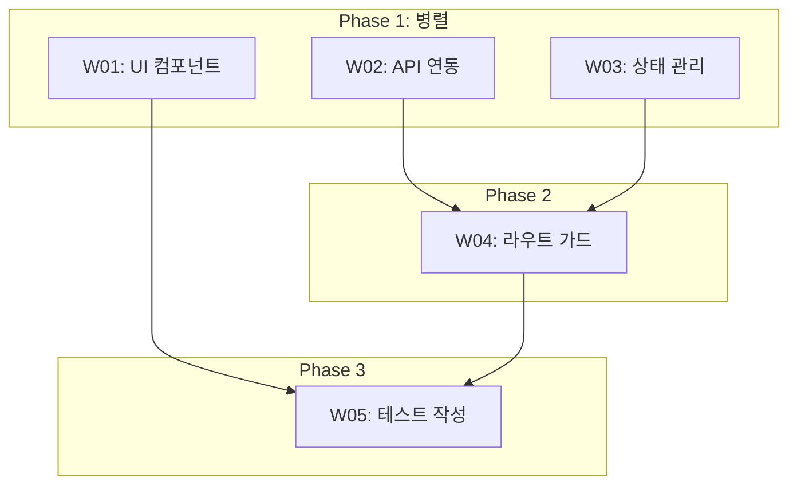
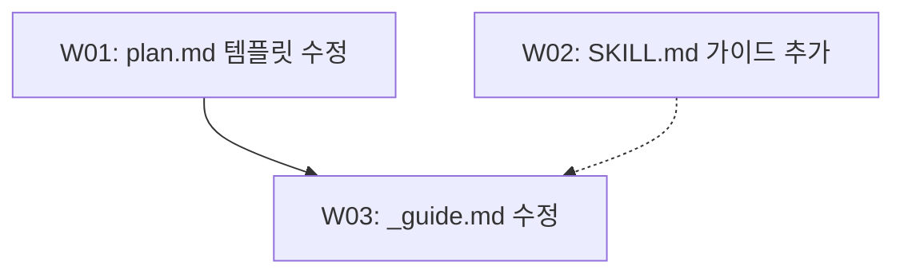

# Plan

복잡한 작업을 분석하여 종속성/독립성을 파악하고, 병렬 실행 계획을 수립하는 스킬.

> 이 스킬은 workflow-orchestration 스킬이 관리하는 워크플로우의 한 단계입니다. 전체 워크플로우 구조는 workflow-orchestration 스킬을 참조하세요.

## 핵심 원칙

1. **명확성 우선**: 불명확한 요청은 명확해질 때까지 반복 질문
2. **종속성 분석**: 작업 간 의존관계 파악
3. **병렬화 극대화**: 독립적인 작업은 work 에이전트로 병렬 실행
4. **적응적 실행**: 간단한 작업은 즉시 실행, 복잡한 작업은 사용자 확인 후 실행
5. **PLAN 완전 명확화 필수**: WORK 단계에서는 질문이 불가하므로 PLAN에서 100% 명확화
6. **Worker/Reporter 역할 분리**: Worker 태스크에 최종 보고서(report.md, summary 문서) 생성을 절대 포함하지 않음. 최종 보고서는 REPORT 단계에서 reporter 에이전트가 전담. Worker 산출물은 작업 내역 파일(work/WXX-*.md)에 한정

---

## 터미널 출력 원칙

> 내부 분석/사고 과정을 터미널에 출력하지 않는다. 결과만 출력한다.

- **출력 허용**: 계획서 파일 경로, AskUserQuestion 승인 요청, 에러 메시지, 반환값 (3줄 규격)
- **출력 금지**: 분석 과정, 판단 근거 설명, 요구사항 해석 과정, 작업 분해 과정 설명, "~를 살펴보겠습니다" 류, 중간 진행 보고
- 계획 수립 과정은 묵묵히 수행하고, 계획서 파일 경로와 승인 요청만 터미널에 출력
- **계획서 경로 출력 필수**: 계획서(`plan.md`) 경로는 반드시 터미널에 출력되어야 한다. 단, 경로 출력은 완료 배너를 통해 오케스트레이터가 수행한다 (planner 에이전트가 직접 출력하지 않음)
- 배너 출력은 오케스트레이터가 담당 (planner 에이전트는 배너를 직접 호출하지 않음)

---

## PLAN 가이드

planner 에이전트가 PLAN을 수행합니다.

### 충분한 사용자 티키타카 (핵심)

<!-- NOTE: 현재 planner(서브에이전트)는 AskUserQuestion을 직접 호출할 수 없습니다 (플랫폼 제약, GitHub Issue #12890).
     아래 기술된 반복 질의응답은 Tier 2에서 오케스트레이터 경유 방식으로 개선 예정입니다.
     현재는 planner가 추가 질문 없이 계획서를 작성하고, 오케스트레이터가 사용자 승인을 수행합니다. -->
- planner는 요구사항이 **완전히 명확해질 때까지** 사용자와 반복 질의응답을 수행해야 함
- 모호한 부분, 누락된 정보, 결정이 필요한 사항은 **모두 이 단계에서 해결**
- WORK 단계에서는 질문이 불가하므로 PLAN에서 100% 명확화 필수
- 사용자가 "진행해", "OK" 등 승인 시에만 계획서 확정

### 명확성 검증 체크리스트

요청이 불명확하면 **반드시** AskUserQuestion 도구를 사용하여 재질의한다. 다음 항목을 확인:

- 목표가 명확한가?
- 범위가 정의되어 있는가?
- 제약조건이 있는가?
- 예상 결과물이 명시되어 있는가?

**재질의 예시:**
```
"웹사이트 만들어줘"
-> "어떤 종류의 웹사이트인가요? (랜딩페이지, 대시보드, 블로그 등)"
-> "주요 기능은 무엇인가요?"
-> "사용할 기술 스택이 있나요?"
```

불명확한 부분이 해소될 때까지 AskUserQuestion 도구를 사용하여 질문을 반복한다.

### 작업 분해

요청을 개별 작업 단위로 분해:

```
예: "React 앱에 로그인 기능 추가"
-> T1: 로그인 UI 컴포넌트 생성
-> T2: 인증 API 연동
-> T3: 상태 관리 설정
-> T4: 라우트 가드 구현
-> T5: 테스트 작성
```

### Breadth Task 감지 및 Explore 에이전트 활용

대량의 파일을 읽기 전용으로 분석하는 태스크는 **Explore 서브에이전트**를 사용하여 컨텍스트 소비를 최소화합니다.

**Breadth Task 감지 패턴:**

다음 키워드/패턴이 포함된 태스크를 breadth task로 식별합니다:

| 패턴 | 예시 |
|------|------|
| "review all", "모든 ~를 검토" | "모든 Hook 스크립트를 검토" |
| "explore each", "각 ~를 탐색" | "각 스킬 파일을 탐색" |
| "summarize entire", "전체 ~를 요약" | "전체 코드베이스를 요약" |
| "scan", "스캔" | "보안 취약점 스캔" |
| "audit", "감사" | "의존성 감사" |
| "inventory", "목록화" | "API 엔드포인트 목록화" |

**Explore 에이전트 적합 조건:**
1. **읽기 전용**: 파일 수정이 필요하지 않은 태스크
2. **대량 파일**: 5개 이상의 파일을 분석해야 하는 태스크
3. **독립적 분석**: 각 파일을 독립적으로 분석할 수 있는 태스크

**서브에이전트 타입 지정:**

계획서 태스크 테이블에 `서브에이전트` 컬럼을 추가하여 태스크별 서브에이전트 타입을 명시합니다:

| ID | 작업 | 종속성 | Phase | 서브에이전트 |
|----|------|--------|-------|-------------|
| W01 | 모든 Hook 스크립트 검토 | - | 1 | Explore |
| W02 | 인증 모듈 리팩토링 | W01 | 2 | Worker |

- **Worker** (기본값): 파일 수정, 코드 작성 등 쓰기 작업이 포함된 태스크
- **Explore**: 읽기 전용 대량 분석 태스크 (Haiku 모델, 저비용, 고속)

> **주의**: Explore는 읽기 전용이므로 파일 수정이 필요한 태스크에는 사용 불가합니다.

**토폴로지 인식 파티셔닝 가이드라인:**

Explore 에이전트에 파일을 분배할 때 파일 크기별로 그룹화합니다:

| 파일 크기 | 에이전트당 파일 수 |
|----------|------------------|
| 소 (< 100줄) | 5-8개 |
| 중 (100-500줄) | 2-3개 |
| 대 (> 500줄) | 1개 |

### 태스크 분배 검증 체크리스트

작업 분해 후 다음 항목을 반드시 검증:

- [ ] Worker 태스크에 `report.md` 생성이 포함되어 있지 않은가?
- [ ] Worker 태스크에 최종 보고서, summary 문서, 결과 리포트 등 보고서 성격의 산출물이 포함되어 있지 않은가?
- [ ] Worker의 산출물이 작업 내역 파일(`work/WXX-*.md`)로 한정되어 있는가?

> **경고**: 최종 보고서 생성은 REPORT 단계에서 reporter 에이전트가 전담합니다. Worker에게 보고서 생성 태스크를 할당하면 역할 충돌이 발생합니다.

### 종속성 분석

각 작업 간 관계 파악:

| 작업 | 선행 작업 | 병렬 가능 |
|------|----------|----------|
| T1 | 없음 | O |
| T2 | 없음 | O |
| T3 | 없음 | O |
| T4 | T2, T3 | X |
| T5 | T1, T2, T3, T4 | X |

### 실행 계획 수립

**병렬 그룹 구성:**
```
Phase 1 (병렬): [T1, T2, T3] -> work 에이전트 3개 동시 실행
Phase 2 (순차): [T4] -> T2, T3 완료 후 실행
Phase 3 (순차): [T5] -> 모든 작업 완료 후 실행
```

### 태스크 복잡도 자동 평가

각 태스크의 복잡도를 수치화하여 분해 깊이와 리소스 배분을 결정합니다.

**복잡도 점수 산정 공식:**
```
복잡도 = action_verbs * 2 + connectors * 2 + domain + scope + risk
```

| 요소 | 설명 | 점수 범위 |
|------|------|----------|
| `action_verbs` | 태스크 설명의 행위 동사 수 (생성, 수정, 삭제, 연동, 분석 등) | 0-5 (x2) |
| `connectors` | 접속사/조건 ("~하고", "~한 후", "~이면", 종속성, 공유 리소스) | 0-3 (x2) |
| `domain` | 도메인 전문성 필요도 (0: 일반, 1: 중간, 2: 전문) | 0-2 |
| `scope` | 영향 범위 (0: 단일 파일, 1: 모듈, 2: 시스템, 3: 크로스커팅) | 0-3 |
| `risk` | 부작용 위험도 (0: 안전, 1: 주의, 2: 높음) | 0-2 |

> 전체 점수 범위: 0-35

**복잡도 티어:**

| 티어 | 점수 범위 | 분류 | 분해 깊이 가이드 |
|------|----------|------|----------------|
| Tier 1 | < 5 | 단순 (단일 파일 수정, 설정 변경) | 분해 불필요, 단일 태스크로 실행 |
| Tier 2 | 5 - 15 | 중간 (다중 파일 수정, 로직 변경) | 2단계 이하 분해 권장 |
| Tier 3 | > 15 | 복잡 (아키텍처 변경, 다중 모듈 연동) | 3단계 이상 분해 필수, 하위 태스크 분리 검토 |

**계획서 태스크 테이블에 복잡도 컬럼 추가:**

| ID | 작업 | 종속성 | Phase | 복잡도 |
|----|------|--------|-------|--------|
| W01 | 설정 파일 수정 | - | 1 | T1(2) |
| W02 | 인증 모듈 리팩토링 | W01 | 2 | T2(12) |
| W03 | API 게이트웨이 재설계 | W02 | 3 | T3(22) |

**평가 예시:**
- "settings.json에 필드 추가" → 동사 1, 접속사 0, 도메인 0, 범위 0, 위험 0 = **T1(2)**
- "API 연동 후 에러 처리 및 재시도 로직 구현" → 동사 3, 접속사 2, 도메인 1, 범위 1, 위험 1 = **T2(13)**
- "전체 Hook 시스템 리팩토링 및 하위 호환성 보장" → 동사 2, 접속사 1, 도메인 2, 범위 3, 위험 2 = **T3(13)**

> **주의**: 복잡도 점수는 절대적 기준이 아닌 상대적 가이드라인이다. Tier 3 태스크가 하나의 Phase에 집중되지 않도록 분배를 검토한다.

### 계획서 작성

**계획서 템플릿:**

계획서 마크다운 템플릿은 별도 파일로 관리됩니다. 다음 절차로 사용합니다:

1. `.claude/skills/workflow-plan/templates/plan.md`를 Read 도구로 로드
2. `{{placeholder}}`를 실제 값으로 치환
3. 선택적 섹션(완료 기준, 리스크 평가, 가정 사항, 비고)은 필요에 따라 포함/생략
4. 작업 내용에 맞게 각 섹션을 작성

> **참고**: placeholder 목록, 선택적 섹션 가이드, command별 비고 활용 힌트는 `templates/_guide.md`를 참조하세요.
> 템플릿은 권장 구조이며, 내용에 따라 planner가 유연하게 조정할 수 있습니다.

**저장 위치:** `<workDir>/plan.md` (workDir = `.workflow/<YYYYMMDD-HHMMSS>/<workName>/<command>`)

**planner 출력:**
- 계획서 경로
- 태스크 목록 (독립/종속 구분)
- 실행 계획 (Phase별)
- 사용자 질의응답 내역 (명확화 과정 기록)

### .context.json 업데이트 및 최종 컨펌

계획서 저장 후 .context.json 업데이트 및 최종 컨펌 절차는 오케스트레이터(workflow-orchestration)가 수행합니다. planner는 계획서 작성까지만 담당합니다.

오케스트레이터는 AskUserQuestion으로 다음 3가지 선택지를 제시합니다:

| 선택지 | 설명 |
|--------|------|
| **승인 (Recommended)** | WORK 단계로 진행 |
| **수정 (prompt.txt)** | prompt.txt에 피드백을 작성한 후 선택하면 planner가 계획을 수정하여 다시 컨펌 요청 |
| **중지** | 워크플로우를 중단 (CANCELLED) |

> **"수정" 동작:** 사용자가 prompt.txt에 수정 피드백을 작성한 후 "수정"을 선택하면, planner가 해당 피드백을 반영하여 계획을 재수립하고 다시 컨펌을 요청합니다. 피드백이 없으면 planner가 자체 판단으로 계획을 개선합니다.

---

## 병렬 실행 패턴

독립적인 작업들은 Task 도구의 work 에이전트를 사용하여 병렬 실행:

```
# 병렬 실행 예시 (단일 메시지에 여러 Task 호출)
Task(subagent_type="worker", prompt="T1: 로그인 UI 컴포넌트 생성...")
Task(subagent_type="worker", prompt="T2: 인증 API 연동...")
Task(subagent_type="worker", prompt="T3: 상태 관리 설정...")
```

**중요:** 병렬 실행 시 반드시 단일 메시지에 여러 Task 호출을 포함해야 한다.

## 워커별 작업 상세 테이블 작성 가이드

계획서의 "작업 목록" 테이블 아래에 "워커별 작업 상세" 섹션을 추가하여 각 워커가 수행할 구체적인 작업을 명시합니다.

**작성 원칙:**

1. "작업 목록" 테이블이 1줄 요약이라면, "워커별 작업 상세" 테이블은 구체적인 실행 지침
2. 모든 워커 태스크(WXX)에 대해 행을 작성 (누락 금지)
3. 대상 파일은 상대 경로로 명시 (백틱으로 감싸기)
4. 작업 내용은 번호 매기기로 세부 항목을 나열 (예: (1) xxx (2) yyy)
5. 산출물은 작업 내역 파일 경로 (`work/WXX-<설명>.md`)

**컬럼 정의:**

| 컬럼 | 설명 | 예시 |
|------|------|------|
| 워커 ID | 태스크 ID (작업 목록의 ID와 동일) | W01, W02 |
| 대상 파일 | 워커가 수정/생성할 파일 경로 | `src/auth/login.ts` |
| 작업 내용 | 구체적인 수정 사항 (번호 매기기) | (1) 함수 추가 (2) 타입 정의 |
| 산출물 | 작업 내역 파일 경로 | `work/W01-로그인-구현.md` |

**작성 예시:**

```markdown
## 워커별 작업 상세

| 워커 ID | 대상 파일 | 작업 내용 | 산출물 |
|---------|----------|----------|--------|
| W01 | `src/auth/login.ts` | (1) LoginForm 컴포넌트 생성 (2) 폼 유효성 검증 추가 | `work/W01-로그인-UI.md` |
| W02 | `src/api/auth.ts` | (1) login API 호출 함수 작성 (2) 에러 핸들링 구현 | `work/W02-인증-API.md` |
```

---

## 작업 흐름도 (Mermaid 다이어그램) 작성 가이드

계획서의 "실행 계획" 섹션 아래에 "작업 흐름도" 섹션을 추가하여 워커 간 실행 순서를 Mermaid 다이어그램으로 시각화합니다.

**기본 규칙:**

| 규칙 | 설명 |
|------|------|
| 방향 | `flowchart TD` (Top-Down) 고정 |
| 노드 라벨 | `W01[W01: 1줄 요약]` 형식 (워커 ID + 설명 포함) |
| 종속 관계 | 실선 화살표 `-->` 사용 |
| 약한 참조 | 점선 화살표 `-.->` 사용 (참고용 의존, 필수 아님) |
| 독립 워커 | 동일 레벨에 배치 (화살표 연결 없음) |

**Phase별 서브그래프 사용 기준:**

- Phase가 **3개 이상**일 때만 `subgraph`로 Phase를 감쌈
- Phase가 1-2개일 때는 서브그래프 없이 노드와 화살표만 사용

**서브그래프 예시 (Phase 3개 이상):**



**단순 예시 (Phase 2개 이하):**



**문법 주의사항:**

- 노드 ID에 한글/특수문자 사용 금지 (W01, W02 등 영문+숫자만)
- 라벨 텍스트에는 한글 사용 가능
- 화살표 앞뒤로 공백 포함 (`W01 --> W02`)
- 서브그래프 ID도 영문만 사용 (`subgraph Phase1[Phase 1: 병렬]`)

**렌더링 검증 안내:**

- 다이어그램 작성 후 https://mermaid.live/ 에서 렌더링을 검증할 수 있습니다
- VSCode에서 렌더링되지 않는 경우 Markdown Preview Mermaid Support (`bierner.markdown-mermaid`) 확장 단독 사용을 권장합니다
- 다른 Mermaid 관련 확장이 설치되어 있으면 충돌이 발생할 수 있으므로, `bierner.markdown-mermaid` 외의 Mermaid 확장은 비활성화를 권장합니다

---

## 출력 형식 (상황에 따라 선택)

### 테이블 형식
복잡한 종속성이 있을 때:

| Phase | 작업 | 설명 | 종속성 | 실행 방식 |
|-------|------|------|--------|----------|
| 1 | T1, T2 | ... | 없음 | 병렬 |
| 2 | T3 | ... | T1 | 순차 |

### 계층 목록
단순한 구조일 때:

```
1. Phase 1 (병렬)
   - T1: 작업 설명
   - T2: 작업 설명
2. Phase 2 (T1, T2 완료 후)
   - T3: 작업 설명
```

### 플로우차트
시각적 표현이 필요할 때 Mermaid 활용

## 재질의 가이드라인

불명확한 요청 유형별 AskUserQuestion 도구로 질문하는 예시:

| 불명확 유형 | 질문 예시 |
|------------|----------|
| 목표 불명확 | "최종 목표가 무엇인가요?" |
| 범위 불명확 | "어디까지 구현해야 하나요?" |
| 기술 불명확 | "사용할 기술/프레임워크가 있나요?" |
| 우선순위 불명확 | "가장 중요한 기능은 무엇인가요?" |
| 제약조건 불명확 | "특별한 제약사항이 있나요?" |

**원칙:** 추측하지 말고 AskUserQuestion 도구로 질문한다. 명확해질 때까지 반복한다.

## 연관 스킬

### scope-decomposer

작업 분해 시 RICE 우선순위 평가와 종속성 그래프를 활용하여 더 체계적인 태스크 분해를 수행할 수 있습니다. 복잡한 작업의 경우 `.claude/skills/scope-decomposer/SKILL.md`를 참조하세요.

## 문서 저장

계획 수립 결과를 문서로 저장한다.

**저장 위치:**
```
<workDir>/plan.md
```

**경로 구성:**
- `workDir`: `.workflow/<YYYYMMDD-HHMMSS>/<workName>/<command>` (중첩 구조)

**예시:**
```
.workflow/20260203-143000/로그인기능추가/implement/plan.md
.workflow/20260203-144500/API-리팩토링/refactor/plan.md
.workflow/20260203-150000/코드리뷰/review/plan.md
```

**저장 시점:** 계획 수립 완료 후 자동 저장

## 에러 처리

에러 발생 시:

| 에러 유형 | 처리 방법 |
|----------|----------|
| 파일 읽기 실패 | 경로 확인 후 재시도, 3회 실패 시 사용자에게 보고 |
| 파일 쓰기 실패 | 권한 확인 후 재시도, 3회 실패 시 사용자에게 보고 |
| 필수 정보 누락 | AskUserQuestion 도구로 사용자에게 질문하여 정보 수집 |
| 예상치 못한 에러 | 에러 내용 기록 후 사용자에게 보고 |
| Slack 전송 실패 | 경고 출력 후 계속 진행 (Slack은 필수가 아님) |

**재시도 정책**: 최대 3회, 각 시도 간 1초 대기
