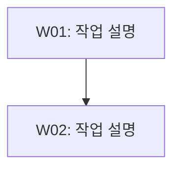

# [제목]

- 작업 ID: {{workId}}
- 명령어: {{command}}
- 작성일: {{date}} (KST)
- 요청: {{request}}
<!-- 선택. 명령어별 기본값과 다를 때만 명시. 기본값: implement/refactor/framework=3, build=2, review/architect/analyze/research=4 -->
<!-- - 품질 레벨: Level N -->

## 사용자 질의응답 내역

| 순서 | 질문 | 답변 |
|------|------|------|
| 1 | ... | ... |

## 작업 요약
<!-- 선택. T2+ 태스크가 있거나 W02 이상의 다중 워커 계획에서 권장 -->
<!-- 1-3문장으로 작업 전체의 목적, 접근 방식, 예상 산출물을 요약 -->
<!-- 메타 정보의 "요청"(사용자 원문)과 달리, planner가 분석/해석한 작업 개요를 기술 -->

[작업 요약 텍스트]

## 작업 흐름도
<!-- 권장. 워커 1명이거나 종속성 없는 단순 병렬이면 생략 가능 -->

## 작업 목록

| ID | 작업 | 종속성 | Phase | 복잡도 | 서브에이전트 |
|----|------|--------|-------|--------|-------------|
| W01 | ... | - | 1 | T1(3) | Worker |
<!-- 서브에이전트: Worker(실행형 작업) 또는 Explorer(탐색형 작업)를 지정 -->

## 워커별 작업 상세
<!-- 권장. 워커 1명이고 작업 단순하면 생략 가능 -->
<!-- 작성 가이드:
  [형식] 워커별 H3 서브섹션으로 분리. 각 서브섹션에 대상 파일, 산출물, 번호 매기기 작업 내용 포함
  [상세도] 각 작업 항목은 Worker가 추가 질문 없이 실행 가능한 수준의 구체성 확보
  [필수 요소] (1) 대상 파일 경로 (2) 산출물 경로 (3) 번호 매기기 작업 내용 4-5개
  [작업 내용 원칙]
    - 각 항목은 구체적 행위 동사로 시작 (생성, 수정, 추가, 삭제, 분석, 검증 등)
    - 한 항목에 복수 행위 병합 금지 ("X 수정 및 Y 추가" -> 별도 항목으로 분리)
    - 대상 파일 내 구체적 위치/섹션/함수명을 가능한 한 명시
    - 변경의 "무엇"뿐 아니라 "어떻게"도 기술 (예: "추가" -> "테이블 3번째 행 다음에 추가")
-->

### WXX: [작업명]

<!-- 대상 파일 경로는 기존 파일이면 [`path/to/file`](path/to/file) 링크 형식 사용 가능. 미존재 파일은 `path/to/file` 백틱만 사용 -->
- 대상 파일: `path/to/file`
- 산출물: `work/WXX-작업명.md`

**작업 내용:**

1. [행위 동사로 시작하는 구체적 작업 항목]
2. [행위 동사로 시작하는 구체적 작업 항목]
3. [행위 동사로 시작하는 구체적 작업 항목]
4. [행위 동사로 시작하는 구체적 작업 항목]

## 실행 계획

### Phase 1 (병렬)
- W01: ...

### Phase 2 (순차)
- W02: ...

## 완료 기준
<!-- 권장. 단일 T1 태스크만 있는 매우 단순한 계획인 경우 생략 가능 -->
<!-- 측정 가능성 원칙: 각 기준에 (1) 정량적 수치("N개 이상", "0건"), (2) 구체적 파일/경로명, (3) 검증 가능한 조건("~형식으로") 중 1개 이상 포함 -->

- [ ] [성공 판정 기준 1 - 수치/파일명/검증조건 포함]
- [ ] [성공 판정 기준 2 - 수치/파일명/검증조건 포함]

## 작업 범위
<!-- 선택. research, architect, 복잡한 implement에서 권장 -->
<!-- 비고 내 "연구 범위 경계" 서브섹션을 대체하는 구조화된 범위 관리 -->

### 포함 (In-Scope)
- [포함 항목 1]
- [포함 항목 2]

### 제외 (Out-of-Scope)
- [제외 항목 1]
- [제외 항목 2]

## 리스크 평가
<!-- 선택. T2 이상 태스크가 1개라도 있으면 권장 -->

| 리스크 | 심각도 | 완화 전략 |
|--------|--------|----------|
| [리스크 1] | HIGH/MEDIUM/LOW | [완화 전략] |

## 가정 사항
<!-- 선택. 모든 요구사항이 100% 명확화된 경우 생략 가능 -->

- [가정 1]: [근거]

## 비고
<!-- 권장. 배경 정보, 현황 분석, 참고 사항 등 자유 형식 -->
<!-- 반드시 ### 서브섹션으로 구분. 최소 1개의 정량적 현황 서브섹션 포함 -->

### 현황 스냅샷
<!-- command별 정량 데이터 포함:
  - implement: 대상 파일 수, 수정 예상 라인 규모, 현행 동작 요약(수치)
  - research: 크기, 파일 수, 디렉토리 수, 기간 등 수치 데이터
  - review: 검토 대상 파일 수, 코드 라인 규모, 함수 수 등
  - refactor: 리팩토링 전 상태 수치(코드 라인, 함수 수, 중복도 등)
  - architect: 현행 구조 요약(모듈 수, 의존성 수, 레이어 수 등) -->

[정량적 현황 데이터]

### 수정 대상 파일
<!-- 선택. implement/refactor 등 파일 수정이 수반되는 command에서 활용 -->
<!-- 파일 경로는 [`path/to/file`](path/to/file) 링크 형식 권장. 미존재 파일(신규 생성 예정)은 `path/to/file` 백틱만 사용 -->

[대상 파일 목록 또는 범위 경계]
