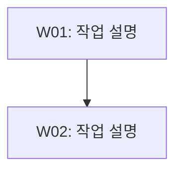

# [제목]

- 작업 ID: {{workId}}
- 명령어: {{command}}
- 작성일: {{date}} (KST)
- 요청: {{request}}
<!-- 선택. 명령어별 기본값과 다를 때만 명시. 기본값: implement/refactor/framework=3, build=2, review/architect/analyze/research=4 -->
<!-- - 품질 레벨: Level N -->

## 사용자 질의응답 내역

| 순서 | 질문 | 답변 |
|------|------|------|
| 1 | ... | ... |

## 작업 목록

| ID | 작업 | 종속성 | Phase | 복잡도 | 서브에이전트 |
|----|------|--------|-------|--------|-------------|
| W01 | ... | - | 1 | T1(3) | Worker |

## 워커별 작업 상세

| 워커 ID | 대상 파일 | 작업 내용 | 산출물 |
|---------|----------|----------|--------|
| W01 | `path/to/file` | [구체적 작업 내용] | `work/W01-작업명.md` |

## 실행 계획

### Phase 1 (병렬)
- W01: ...

### Phase 2 (순차)
- W02: ...

## 작업 흐름도

## 완료 기준
<!-- 권장. 단일 T1 태스크만 있는 매우 단순한 계획인 경우 생략 가능 -->
<!-- 측정 가능성 원칙: 각 기준에 (1) 정량적 수치("N개 이상", "0건"), (2) 구체적 파일/경로명, (3) 검증 가능한 조건("~형식으로") 중 1개 이상 포함 -->

- [ ] [성공 판정 기준 1 - 수치/파일명/검증조건 포함]
- [ ] [성공 판정 기준 2 - 수치/파일명/검증조건 포함]

## 리스크 평가
<!-- 선택. T2 이상 태스크가 1개라도 있으면 권장 -->

| 리스크 | 심각도 | 완화 전략 |
|--------|--------|----------|
| [리스크 1] | HIGH/MEDIUM/LOW | [완화 전략] |

## 가정 사항
<!-- 선택. 모든 요구사항이 100% 명확화된 경우 생략 가능 -->

- [가정 1]: [근거]

## 비고
<!-- 권장. 배경 정보, 현황 분석, 참고 사항 등 자유 형식 -->
<!-- 반드시 ### 서브섹션으로 구분. 최소 1개의 정량적 현황 서브섹션 포함 -->

### 현황 스냅샷
<!-- command별 정량 데이터 포함:
  - implement: 대상 파일 수, 수정 예상 라인 규모, 현행 동작 요약(수치)
  - research: 크기, 파일 수, 디렉토리 수, 기간 등 수치 데이터
  - review: 검토 대상 파일 수, 코드 라인 규모, 함수 수 등
  - refactor: 리팩토링 전 상태 수치(코드 라인, 함수 수, 중복도 등)
  - architect: 현행 구조 요약(모듈 수, 의존성 수, 레이어 수 등) -->

[정량적 현황 데이터]

### 수정 대상 파일
<!-- 선택. implement/refactor 등 파일 수정이 수반되는 command에서 활용 -->

[대상 파일 목록 또는 범위 경계]
