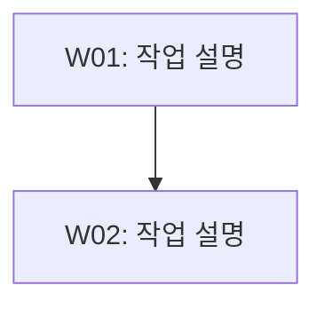

# [제목]

- 작업 ID: {{workId}}
- 명령어: {{command}}
- 작성일: {{date}} (KST)
- 요청: {{request}}

## 사용자 질의응답 내역

| 순서 | 질문 | 답변 |
|------|------|------|
| 1 | ... | ... |

## 작업 목록

| ID | 작업 | 종속성 | Phase | 복잡도 | 서브에이전트 |
|----|------|--------|-------|--------|-------------|
| W01 | ... | - | 1 | T1(3) | Worker |

## 워커별 작업 상세

| 워커 ID | 대상 파일 | 작업 내용 | 산출물 |
|---------|----------|----------|--------|
| W01 | `path/to/file` | [구체적 작업 내용] | `work/W01-작업명.md` |

## 실행 계획

### Phase 1 (병렬)
- W01: ...

### Phase 2 (순차)
- W02: ...

## 작업 흐름도

## 완료 기준
<!-- 권장. 단일 T1 태스크만 있는 매우 단순한 계획인 경우 생략 가능 -->

- [ ] [성공 판정 기준 1]
- [ ] [성공 판정 기준 2]

## 리스크 평가
<!-- 선택. T2 이상 태스크가 1개라도 있으면 권장 -->

| 리스크 | 심각도 | 완화 전략 |
|--------|--------|----------|
| [리스크 1] | HIGH/MEDIUM/LOW | [완화 전략] |

## 가정 사항
<!-- 선택. 모든 요구사항이 100% 명확화된 경우 생략 가능 -->

- [가정 1]: [근거]

## 비고
<!-- 권장. 배경 정보, 현황 분석, 참고 사항 등 자유 형식 -->

[추가 메모 또는 주의사항]
