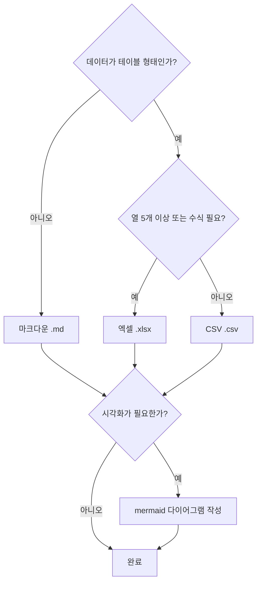
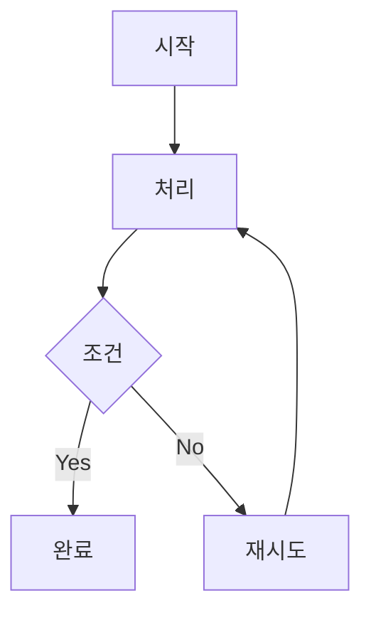
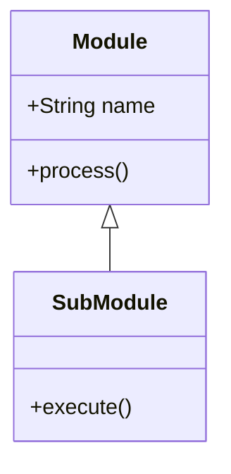
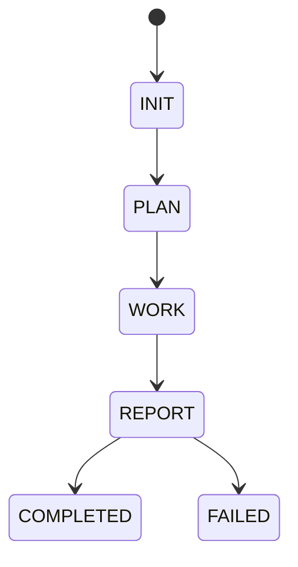
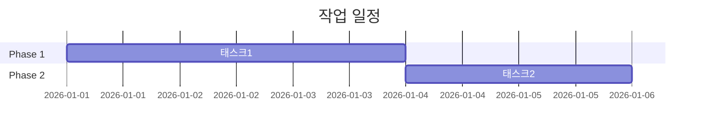
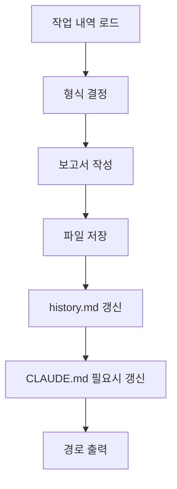

# Report

작업 완료 후 결과를 정리하여 보고서를 생성하고, history.md를 갱신하고 CLAUDE.md를 필요시 갱신하며, 완료 알림을 전송하는 스킬.

> 이 스킬은 workflow-orchestration 스킬이 관리하는 워크플로우의 한 단계입니다. 전체 워크플로우 구조는 workflow-orchestration 스킬을 참조하세요.

**workflow-report 스킬의 책임:**
- REPORT: 작업 결과를 정리하여 보고서 생성
- history.md 갱신 (`.workflow/history.md` 작업 이력 테이블에 행 추가)
- CLAUDE.md 갱신 (Known Issues/Next Steps 필요시 업데이트)

> **책임 경계**: status.json 완료 처리(REPORT->COMPLETED)와 레지스트리 해제(wf-state unregister)는 오케스트레이터가 담당합니다. reporter는 보고서 작성에만 집중합니다.

> **Slack 완료 알림**: reporter는 Slack 호출을 수행하지 않습니다. Slack 완료 알림은 DONE 배너(`Workflow <registryKey> DONE done`)에서 자동 전송됩니다.

**호출 시점:**
- 오케스트레이터(workflow-orchestration)에서 reporter 에이전트를 통해 호출됨
- 또는 사용자가 `/report` 명령어로 명시적 호출

## 핵심 원칙

1. **정확성**: 실제 수행된 작업과 결과만 기록
2. **명확성**: 한눈에 파악 가능한 구조
3. **적절한 형식**: 내용에 맞는 출력 형식 선택
4. **추적 가능성**: 원본 계획과 실행 결과 연결

---

## 터미널 출력 원칙

> 내부 분석/사고 과정을 터미널에 출력하지 않는다. 결과만 출력한다.

- **출력 허용**: 보고서 파일 경로, 반환값 (3줄 규격), 에러 메시지
- **출력 금지**: 보고서 내용 요약, 작업 결과 분석 과정, 변경 파일 목록 나열, "~를 살펴보겠습니다" 류, 중간 진행 보고, "워크플로우가 완료되었습니다" 등 완료 안내 메시지 (보고서 경로는 REPORT 완료 배너가 이미 출력하므로 중복 금지)
- 보고서 작성, history.md/CLAUDE.md 갱신 등 모든 작업은 묵묵히 수행하고 최종 보고서 경로만 출력
- 배너 출력은 오케스트레이터가 담당 (reporter 에이전트는 배너를 직접 호출하지 않음)
- **보고서 경로 터미널 출력 필수**: 보고서 경로(`report.md`)는 반드시 터미널에 출력되어야 함. 단, 출력 주체는 오케스트레이터이며, REPORT 완료 배너의 5번째 인자로 경로를 전달하여 자동 표시됨. reporter 에이전트가 직접 경로를 터미널에 출력하지 않음.

---

## reporter 에이전트 REPORT

오케스트레이터가 reporter 에이전트를 호출하여 보고서 작성을 위임합니다.

### reporter 에이전트 호출 전 준비

오케스트레이터는 reporter 에이전트를 호출하기 전에 로컬 `<workDir>/.context.json`의 `agent` 필드를 `"reporter"`로 업데이트합니다.

```bash
wf-state context <registryKey> reporter
```

### reporter 에이전트 호출 시그니처

```
Task(subagent_type="reporter", prompt="
command: <command>
workId: <workId>
workDir: <workDir>
workPath: <workDir>/work/
")
```

### reporter 수행 내용

1. **보고서 작성**
   1. command에 해당하는 템플릿 파일을 Read 도구로 로드
      - 매핑: implement/refactor/build/framework → `templates/implement.md`, review/analyze → `templates/review.md`, research → `templates/research.md`, architect → `templates/architect.md`
      - 템플릿 경로: `.claude/skills/workflow-report/templates/<템플릿파일>`
      - placeholder 치환 가이드: `templates/_guide.md` 참조
   2. 작업 내역(`work/` 디렉터리) 취합 및 분석
   3. 템플릿의 `{{placeholder}}`를 실제 값으로 치환하고, 작업 내역을 기반으로 각 섹션 작성
   4. 보고서 경로를 `{workDir}/report.md`로 확정적 구성 (LLM 추론에 의존하지 않음)
   5. 보고서 저장: `{workDir}/report.md`

2. **history.md 갱신**
   - `.workflow/history.md`에 작업 이력 행 추가 (상세 절차는 아래 참조)

3. **CLAUDE.md 갱신** (필요시)
   - Known Issues/Next Steps에 변경이 필요한 경우에만 업데이트
   - 갱신 불필요 시 스킵

> **Note**: status.json 완료 처리(REPORT->COMPLETED)와 레지스트리 해제(wf-state unregister)는 reporter 반환 후 오케스트레이터가 수행합니다. 상세 절차는 `workflow-orchestration/step3-report.md`의 "REPORT Completion: Orchestrator Post-Processing" 섹션을 참조하세요.

> **Slack 완료 알림**: reporter는 Slack 호출을 수행하지 않습니다. Slack 완료 알림은 DONE 배너(`Workflow <registryKey> DONE done`)에서 자동 전송됩니다.

### reporter 출력

- 보고서 경로: `{workDir}/report.md`
- CLAUDE.md 갱신 완료 (또는 스킵)

> **Note**: reporter 반환 후, 오케스트레이터가 status.json 완료 처리 및 레지스트리 해제를 수행합니다.

---

## 출력 형식 선택

| 형식 | 용도 | 파일 |
|------|------|------|
| 마크다운 | 텍스트 중심 보고서, 문서화 | `.md` |
| CSV | 단순 테이블 데이터, 목록 | `.csv` |
| 엑셀 | 복잡한 표, 다중 시트, 수식 필요 | `.xlsx` |
| 다이어그램 | 워크플로우, 구조 시각화 | command-mermaid-diagrams 스킬 연동 |

### 형식 결정 기준



## 보고서 구조

### 마크다운 보고서 템플릿

command별 보고서 구조가 다르므로, `templates/` 디렉토리에 유형별 템플릿을 분리하여 관리합니다.

**템플릿 사용 절차:**

1. command에 해당하는 템플릿 파일을 Read 도구로 로드
2. `{{placeholder}}`를 실제 값으로 치환
3. 작업 내역(`work/` 디렉터리)을 분석하여 각 섹션 작성
4. `(선택)` 표기된 섹션은 해당 없으면 생략

**command별 템플릿 매핑:**

| command | 템플릿 파일 | 보고서 유형 |
|---------|------------|------------|
| implement | `templates/implement.md` | 코드 변경형 (문제-해결 구조) |
| refactor | `templates/implement.md` | 코드 변경형 (개선 전/후 비교) |
| build | `templates/implement.md` | 코드 변경형 (빌드 결과 중심) |
| framework | `templates/implement.md` | 코드 변경형 (생성 구조 중심) |
| review | `templates/review.md` | 검토/분석형 (판정 구조) |
| analyze | `templates/review.md` | 검토/분석형 (분석 결과 구조) |
| research | `templates/research.md` | 조사형 (조사-결론 구조) |
| architect | `templates/architect.md` | 설계형 (아키텍처 구조) |

> **참고**: 템플릿 선택 가이드 및 placeholder 목록은 `templates/_guide.md`를 참조하세요.
> 템플릿은 권장 구조이며, 내용에 따라 reporter가 유연하게 조정할 수 있습니다.

### CSV 보고서 템플릿

```csv
작업ID,작업명,상태,결과물,비고
T1,로그인 UI 생성,완료,src/components/Login.tsx,
T2,API 연동,완료,src/api/auth.ts,
T3,테스트 작성,실패,,의존성 오류
```

### 엑셀 보고서 구조

```
Sheet 1: 요약
- 전체 통계, 완료율, 주요 지표

Sheet 2: 작업 상세
- 각 작업의 상세 정보 테이블

Sheet 3: 파일 목록
- 생성/수정된 모든 파일

Sheet 4: 이슈 로그
- 발생한 문제와 해결 방법
```

엑셀 생성 시 `openpyxl` 라이브러리 사용:
```python
from openpyxl import Workbook
wb = Workbook()
# ... 시트 작성
wb.save('report.xlsx')
```

## 저장 위치

| 단계 | 저장 위치 |
|------|----------|
| PLAN | `<workDir>/plan.md` |
| WORK | `<workDir>/work/WXX-<작업명>.md` |
| REPORT | `{workDir}/report.md` |

**경로 구성:**
- `workDir`: 오케스트레이터로부터 전달받은 작업 디렉토리 경로 (예: `.workflow/<YYYYMMDD-HHMMSS>/<workName>/<command>`)
- reporter는 `workDir`을 직접 사용하여 보고서 경로를 확정적으로 구성 (LLM 추론으로 경로를 재조합하지 않음)

**예시:**
```
.workflow/20260203-143000/로그인기능추가/implement/report.md
.workflow/20260203-144500/API-리팩토링/refactor/report.md
.workflow/20260203-150000/코드리뷰/review/report.md
```

**다중 파일이 필요한 경우 (CSV, Excel 등):**
```
.workflow/20260203-143000/로그인기능추가/implement/
|-- report.md        # 메인 보고서
|-- summary.csv        # 요약 테이블 (필요시)
|-- diagram.png        # 시각화 다이어그램 (필요시)
```

## 다이어그램 연동

시각화가 필요한 경우 command-mermaid-diagrams 스킬을 참조하여 mermaid 코드 블록을 작성합니다.

**다이어그램 유형별 mermaid 예시:**

**작업 흐름도 (flowchart):**


**시스템 구조 (class diagram):**


**상태 변화 (state diagram):**


**타임라인 (gantt chart):**


> **원칙**: 보고서 내 다이어그램은 반드시 mermaid 코드 블록을 사용합니다. ASCII art나 텍스트 화살표(`→`, `↓`)를 다이어그램 대용으로 사용하지 않습니다.
> **방향 필수**: Flowchart 연결선은 반드시 방향 화살표(`-->`, `-.->`, `==>`)를 사용합니다. 방향 없는 연결(`---`, `-.-`, `===`)은 금지합니다.

## 워크플로우



1. **작업 내역 로드** (필수): `{workDir}/work/`에서 로드
2. **형식 결정**: 데이터 특성에 맞는 형식 선택
3. **보고서 작성**: 템플릿에 따라 작성
4. **저장**: `{workDir}/report.md`에 저장 (workDir은 오케스트레이터로부터 전달받은 확정 경로)
5. **history.md 갱신**: `.workflow/history.md`에 작업 이력 행 추가 (상세 절차는 아래 참조)
6. **CLAUDE.md 갱신**: Known Issues/Next Steps에 변경이 필요한 경우에만 갱신 (갱신 불필요 시 스킵)
7. **출력**: 보고서 파일 경로만 출력 (요약은 터미널에 직접 출력하지 않음, 사용자가 보고서 파일을 직접 확인)

> **Note**: reporter 반환 후, 오케스트레이터가 status.json 완료 처리(`wf-state status <registryKey> REPORT COMPLETED`) 및 레지스트리 해제(`wf-state unregister <registryKey>`)를 수행합니다.

> **Slack 완료 알림**: DONE 배너(`Workflow <registryKey> DONE done`)에서 자동 전송됩니다. reporter는 Slack 호출을 수행하지 않습니다.

**Git 커밋**: 워크플로우 완료 후 `/git:commit` 명령어로 별도 실행 (report 스킬 범위 외)

## history.md 갱신 (필수)

보고서 작성 완료 후, `.workflow/history.md`에 작업 이력을 추가합니다.

### 대상 파일

`.workflow/history.md` (프로젝트 루트 기준)

### 갱신 내용

마크다운 테이블의 마커 아래에 행을 추가합니다.

**행 형식:**
```
| YYYY-MM-DD | YYYYMMDD-HHMMSS | 제목 | command | 상태 | [보고서](상대경로) |
```

- `YYYY-MM-DD`: 작업 날짜 (ISO 형식, 10자리)
- `YYYYMMDD-HHMMSS`: 작업 ID (전체 워크플로우 키)
- `제목`: 작업 제목
- `command`: 실행 명령어 (implement, refactor, review 등)
- `상태`: `완료` / `부분완료` / `실패`
- `보고서`: 보고서 파일 링크 (`[보고서](상대경로)`) 또는 `-` (보고서 없음)

### 갱신 방법

Edit 도구로 마커 아래에 행을 추가합니다:

```
old_string: "<!-- 새 항목은 이 줄 아래에 추가됩니다 -->"
new_string: "<!-- 새 항목은 이 줄 아래에 추가됩니다 -->\n| <YYYY-MM-DD> | <YYYYMMDD-HHMMSS> | <제목> | <command> | <상태> | <보고서링크> |"
```

- `<보고서링크>`: `[보고서](<workDir에서 .workflow/ 접두사를 제거한 경로>/report.md)` 형식 (history.md가 .workflow/ 안에 있으므로 상대 경로 기준으로 .workflow/ 제거 필요) 또는 보고서가 없으면 `-`

### history.md 초기 생성

파일이 없으면 아래 템플릿으로 생성 후 행을 추가합니다:

```markdown
# 작업 히스토리

| 날짜 | 작업ID | 제목 | 명령어 | 상태 | 보고서 |
|------|--------|------|--------|------|--------|
<!-- 새 항목은 이 줄 아래에 추가됩니다 -->
```

### 실패 처리

history.md 갱신 실패 시 경고만 출력하고 계속 진행합니다. 워크플로우를 중단시키지 않습니다.

---

## CLAUDE.md 갱신 (필요시)

보고서 작성 후, 프로젝트의 CLAUDE.md를 **필요한 경우에만** 갱신합니다.

### 갱신 대상

- **Known Issues**: 미해결 이슈가 있으면 추가/제거
- **Next Steps**: 후속 작업이 있으면 추가/갱신
- 기타 관련 섹션 업데이트 (필요시: Tech Stack, Commands 등)

### 갱신 절차

1. **CLAUDE.md 파일 읽기**: 프로젝트 루트의 `CLAUDE.md` 파일을 Read 도구로 읽음
2. **갱신 필요 여부 판단**: Known Issues/Next Steps에 변경이 필요한지 확인
3. **갱신 불필요 시**: 스킵 (파일 수정하지 않음)
4. **갱신 필요 시**: 해당 섹션만 업데이트
   - Known Issues: 미해결 이슈 추가/제거
   - Next Steps: 후속 작업 추가/갱신
   - 기타 섹션: 새 명령어, 새 기술 도입 등
5. **파일 저장**: Edit 도구로 변경사항 저장

**주의사항:**
- 작업 이력은 `.workflow/history.md`에서 관리 (CLAUDE.md에 기록하지 않음)
- 갱신 불필요 시 반드시 스킵하여 불필요한 파일 변경을 방지

---

## Slack 완료 알림

> **reporter는 Slack 호출을 수행하지 않습니다.** Slack 완료 알림은 DONE 배너(`Workflow <registryKey> DONE done`)에서 자동 전송됩니다.
> 이전에는 reporter가 직접 `slack.sh`를 호출했으나, DONE 시점으로 일원화되어 reporter의 Slack 책임이 제거되었습니다.

---

---

> **Note**: status.json 완료 처리(REPORT->COMPLETED/FAILED)와 레지스트리 해제(wf-state unregister)는 reporter 반환 후 오케스트레이터가 수행합니다. 상세 절차는 `workflow-orchestration/step3-report.md`를 참조하세요.

---

## Git 커밋

**Git 커밋은 report 스킬의 범위가 아닙니다.** 워크플로우 완료 후 사용자가 `/git:commit` 명령어로 별도 실행합니다.

**참고**: `/git:commit` 명령어 상세는 `.claude/commands/git/commit.md` 참조

## 연관 스킬

보고서 작성 품질 향상을 위해 다음 스킬을 참조할 수 있습니다:

| 스킬 | 용도 | 경로 |
|------|------|------|
| changelog-generator | Git 커밋 기반 CHANGELOG/릴리스 노트 자동 생성 | `.claude/skills/changelog-generator/SKILL.md` |
| pr-summary | 동적 컨텍스트 주입으로 PR 제목/요약 자동 생성 | `.claude/skills/pr-summary/SKILL.md` |
| command-verification-before-completion | 작업 완료 선언 전 자동 검증 강제 | `.claude/skills/command-verification-before-completion/SKILL.md` |

## 에러 처리

에러 발생 시:

| 에러 유형 | 처리 방법 |
|----------|----------|
| 파일 읽기 실패 | 경로 확인 후 재시도, 3회 실패 시 사용자에게 보고 |
| 파일 쓰기 실패 | 권한 확인 후 재시도, 3회 실패 시 사용자에게 보고 |
| 필수 정보 누락 | 부모 에이전트에게 에러 보고 (필요 시 부모가 AskUserQuestion으로 사용자에게 재확인) |
| 예상치 못한 에러 | 에러 내용 기록 후 사용자에게 보고 |
| history.md 갱신 실패 | 경고 출력 후 계속 진행, 워크플로우 정상 완료 처리 |
| CLAUDE.md 갱신 실패 | 경고 출력 후 계속 진행, 작업 내역에 기록 |

**재시도 정책**: 최대 3회, 각 시도 간 1초 대기
