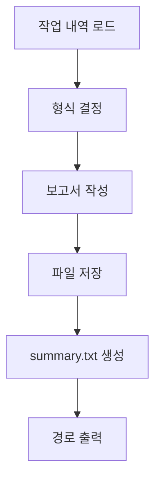

# Report

작업 완료 후 결과를 정리하여 보고서를 생성하고 summary.txt를 작성하는 스킬.

> 이 스킬은 workflow-orchestration 스킬이 관리하는 워크플로우의 한 단계입니다. 전체 워크플로우 구조는 workflow-orchestration 스킬을 참조하세요.

**workflow-report 스킬의 책임:**
- REPORT: 작업 결과를 정리하여 보고서 생성
- summary.txt 생성 (최종 작업 2줄 요약)

> **책임 경계**: history.md 갱신, status.json 완료 처리(REPORT->COMPLETED), 사용량 확정, 레지스트리 해제(`update_state.py unregister`), DONE 배너는 done 에이전트가 담당합니다. reporter는 보고서 작성에만 집중합니다.

> **Slack 완료 알림**: reporter는 Slack 호출을 수행하지 않습니다. Slack 완료 알림은 DONE 배너(`step-end <registryKey> DONE done`)에서 자동 전송됩니다.

## 핵심 원칙

1. **정확성**: 실제 수행된 작업과 결과만 기록
2. **명확성**: 한눈에 파악 가능한 구조
3. **적절한 형식**: 내용에 맞는 출력 형식 선택
4. **추적 가능성**: 원본 계획과 실행 결과 연결

---

## 터미널 출력 원칙

> 내부 분석/사고 과정을 터미널에 출력하지 않는다. 결과만 출력한다.

- **출력 허용**: 보고서 파일 경로, 반환값 (2줄 규격), 에러 메시지
- **출력 금지**: 보고서 내용 요약, 작업 결과 분석 과정, 변경 파일 목록 나열, "~를 살펴보겠습니다" 류, 중간 진행 보고, "워크플로우가 완료되었습니다" 등 완료 안내 메시지 (보고서 경로는 REPORT 완료 배너가 이미 출력하므로 중복 금지)
- 보고서 작성, summary.txt 생성 등 모든 작업은 묵묵히 수행하고 최종 보고서 경로만 출력
- 배너 출력은 오케스트레이터가 담당 (reporter 에이전트는 배너를 직접 호출하지 않음)
- **보고서 경로 터미널 출력 필수**: 보고서 경로(`report.md`)는 반드시 터미널에 출력되어야 함. 단, 출력 주체는 오케스트레이터이며, REPORT 완료 배너의 5번째 인자로 경로를 전달하여 자동 표시됨. reporter 에이전트가 직접 경로를 터미널에 출력하지 않음.

---

## reporter 에이전트 REPORT

오케스트레이터가 reporter 에이전트를 호출하여 보고서 작성을 위임합니다.

### reporter 에이전트 호출 전 준비

오케스트레이터는 reporter 에이전트를 호출하기 전에 로컬 `<workDir>/.context.json`의 `agent` 필드를 `"reporter"`로 업데이트합니다.

```bash
python3 .claude/scripts/state/update_state.py context <registryKey> reporter
```

### reporter 에이전트 호출 시그니처

```
Task(subagent_type="reporter", prompt="
command: <command>
workId: <workId>
workDir: <workDir>
workPath: <workDir>/work/
")
```

### reporter 수행 내용

1. **보고서 작성**
   1. command에 해당하는 템플릿 파일을 Read 도구로 로드
      - 매핑: implement/refactor/build/framework -> `templates/implement.md`, review/analyze -> `templates/review.md`, research -> `templates/research.md`, architect -> `templates/architect.md`
      - 템플릿 경로: `.claude/skills/workflow-report/templates/<템플릿파일>`
      - placeholder 치환 가이드: `templates/_guide.md` 참조
   2. 작업 내역(`work/` 디렉터리) 취합 및 분석
   3. 템플릿의 `{{placeholder}}`를 실제 값으로 치환하고, 작업 내역을 기반으로 각 섹션 작성
   4. 보고서 경로를 `{workDir}/report.md`로 확정적 구성 (LLM 추론에 의존하지 않음)
   5. 보고서 저장: `{workDir}/report.md`

2. **summary.txt 생성**
   - 보고서 작성 완료 후, 최종 작업 2줄 요약을 `{workDir}/summary.txt`에 저장
   - 1줄: 작업 제목 및 command
   - 2줄: 핵심 결과 요약 (변경 파일 수, 주요 성과 등)

> **Note**: reporter 반환 후, done 에이전트(Haiku)가 history.md 갱신, status.json 완료 처리, 사용량 확정, 레지스트리 해제, DONE 배너를 수행합니다. 상세 절차는 `workflow-orchestration/step-done.md`를 참조하세요.

### reporter 출력

- 보고서 경로: `{workDir}/report.md`
- summary.txt: `{workDir}/summary.txt`

---

## 출력 형식 선택

| 형식 | 용도 | 파일 |
|------|------|------|
| 마크다운 | 텍스트 중심 보고서, 문서화 | `.md` |
| CSV | 단순 테이블 데이터, 목록 | `.csv` |
| 엑셀 | 복잡한 표, 다중 시트, 수식 필요 | `.xlsx` |
| 다이어그램 | 워크플로우, 구조 시각화 | command-mermaid-diagrams 스킬 연동 |

### 형식 결정 기준


---

## 보고서 구조

### 마크다운 보고서 템플릿

command별 보고서 구조가 다르므로, `templates/` 디렉터리에 유형별 템플릿을 분리하여 관리합니다.

**템플릿 사용 절차:**

1. command에 해당하는 템플릿 파일을 Read 도구로 로드
2. `{{placeholder}}`를 실제 값으로 치환
3. 작업 내역(`work/` 디렉터리)을 분석하여 각 섹션 작성
4. `(선택)` 표기된 섹션은 해당 없으면 생략

**command별 템플릿 매핑:**

| command | 템플릿 파일 | 보고서 유형 |
|---------|------------|------------|
| implement | `templates/implement.md` | 코드 변경형 (문제-해결 구조) |
| refactor | `templates/implement.md` | 코드 변경형 (개선 전/후 비교) |
| build | `templates/implement.md` | 코드 변경형 (빌드 결과 중심) |
| framework | `templates/implement.md` | 코드 변경형 (생성 구조 중심) |
| review | `templates/review.md` | 검토/분석형 (판정 구조) |
| analyze | `templates/review.md` | 검토/분석형 (분석 결과 구조) |
| research | `templates/research.md` | 조사형 (조사-결론 구조) |
| architect | `templates/architect.md` | 설계형 (아키텍처 구조) |

> **참고**: 템플릿 선택 가이드 및 placeholder 목록은 `templates/_guide.md`를 참조하세요.
> 템플릿은 권장 구조이며, 내용에 따라 reporter가 유연하게 조정할 수 있습니다.

### 변경 파일 테이블 경로 링크 형식

보고서의 **변경 파일 목록** 테이블에서 파일 경로는 마크다운 링크 형식으로 작성합니다.

**형식**: `` [`경로`](경로) ``

**예시**:
```markdown
| 파일 경로 | 변경 유형 | 설명 |
|----------|----------|------|
| [`src/components/Login.tsx`](src/components/Login.tsx) | 생성 | 로그인 컴포넌트 |
| [`.claude/skills/workflow-work/SKILL.md`](.claude/skills/workflow-work/SKILL.md) | 수정 | 링크 지침 추가 |
```

**규칙**:
- 변경 파일 테이블의 파일 경로에만 링크 적용
- 본문 인라인 경로(`작업 내역` 섹션 등)는 백틱(`` ` ``) 유지
- 산출물 경로(work/WXX-*.md, report.md 등 .workflow/ 하위)는 백틱 유지, 링크 미적용

**이중 접두사 버그 주의**: 링크 경로에 workDir 접두사를 중복 부여하지 않습니다. 보고서가 `.workflow/<id>/` 하위에 위치하므로, 파일 경로는 프로젝트 루트 기준 상대 경로를 그대로 사용합니다. `../.workflow/../.workflow/` 같은 이중 접두사가 발생하면 링크가 깨집니다.

### CSV 보고서 템플릿

```csv
작업ID,작업명,상태,결과물,비고
T1,로그인 UI 생성,완료,src/components/Login.tsx,
T2,API 연동,완료,src/api/auth.ts,
T3,테스트 작성,실패,,의존성 오류
```

### 엑셀 보고서 구조

```
Sheet 1: 요약
- 전체 통계, 완료율, 주요 지표

Sheet 2: 작업 상세
- 각 작업의 상세 정보 테이블

Sheet 3: 파일 목록
- 생성/수정된 모든 파일

Sheet 4: 이슈 로그
- 발생한 문제와 해결 방법
```

엑셀 생성 시 `openpyxl` 라이브러리 사용:
```python
from openpyxl import Workbook
wb = Workbook()
# ... 시트 작성
wb.save('report.xlsx')
```

---

## 다이어그램 연동

시각화가 필요한 경우 command-mermaid-diagrams 스킬을 참조하여 mermaid 코드 블록을 작성합니다.

**다이어그램 유형별 mermaid 예시:**

**작업 흐름도 (flowchart):**


**시스템 구조 (class diagram):**


**상태 변화 (state diagram):**


**타임라인 (gantt chart):**


> **원칙**: 보고서 내 다이어그램은 반드시 mermaid 코드 블록을 사용합니다. ASCII art나 텍스트 화살표를 다이어그램 대용으로 사용하지 않습니다.
> **방향 필수**: Flowchart 연결선은 반드시 방향 화살표(`-->`, `-.->`, `==>`)를 사용합니다. 방향 없는 연결(`---`, `-.-`, `===`)은 금지합니다.

---

## 워크플로우



1. **작업 내역 로드** (필수): `{workDir}/work/`에서 로드
2. **형식 결정**: 데이터 특성에 맞는 형식 선택
3. **보고서 작성**: 템플릿에 따라 작성
4. **저장**: `{workDir}/report.md`에 저장 (workDir은 오케스트레이터로부터 전달받은 확정 경로)
5. **summary.txt 생성**: 최종 작업 2줄 요약을 `{workDir}/summary.txt`에 저장
6. **출력**: 보고서 파일 경로만 출력 (요약은 터미널에 직접 출력하지 않음, 사용자가 보고서 파일을 직접 확인)

> **Note**: reporter 반환 후, done 에이전트가 status.json 완료 처리 및 레지스트리 해제를 수행합니다.

---

## 저장 위치

| 단계 | 저장 위치 |
|------|----------|
| PLAN | `<workDir>/plan.md` |
| WORK | `<workDir>/work/WXX-<작업명>.md` |
| REPORT | `{workDir}/report.md` |

**경로 구성:**
- `workDir`: 오케스트레이터로부터 전달받은 작업 디렉터리 경로 (예: `.workflow/<YYYYMMDD-HHMMSS>/<workName>/<command>`)
- reporter는 `workDir`을 직접 사용하여 보고서 경로를 확정적으로 구성 (LLM 추론으로 경로를 재조합하지 않음)

**예시:**
```
.workflow/20260203-143000/로그인기능추가/implement/report.md
.workflow/20260203-144500/API-리팩토링/refactor/report.md
.workflow/20260203-150000/코드리뷰/review/report.md
```

**다중 파일이 필요한 경우 (CSV, Excel 등):**
```
.workflow/20260203-143000/로그인기능추가/implement/
|-- report.md        # 메인 보고서
|-- summary.csv        # 요약 테이블 (필요시)
|-- diagram.png        # 시각화 다이어그램 (필요시)
```

---

## Git 커밋

**Git 커밋은 report 스킬의 범위가 아닙니다.** 워크플로우 완료 후 사용자가 `/git:commit` 명령어로 별도 실행합니다.

**참고**: `/git:commit` 명령어 상세는 `.claude/commands/git/commit.md` 참조

---

## 에러 처리

에러 발생 시:

| 에러 유형 | 처리 방법 |
|----------|----------|
| 파일 읽기 실패 | 경로 확인 후 재시도, 3회 실패 시 사용자에게 보고 |
| 파일 쓰기 실패 | 권한 확인 후 재시도, 3회 실패 시 사용자에게 보고 |
| 필수 정보 누락 | 오케스트레이터에게 에러 보고 (필요 시 오케스트레이터가 AskUserQuestion으로 사용자에게 재확인) |
| 예상치 못한 에러 | 에러 내용 기록 후 사용자에게 보고 |

**재시도 정책**: 최대 3회, 각 시도 간 1초 대기

---

## 연관 스킬

보고서 작성 품질 향상을 위해 다음 스킬을 참조할 수 있습니다:

| 스킬 | 용도 | 경로 |
|------|------|------|
| changelog-generator | Git 커밋 기반 CHANGELOG/릴리스 노트 자동 생성 | `.claude/skills/changelog-generator/SKILL.md` |
| pr-summary | 동적 컨텍스트 주입으로 PR 제목/요약 자동 생성 | `.claude/skills/pr-summary/SKILL.md` |
| command-verification-before-completion | 작업 완료 선언 전 자동 검증 강제 | `.claude/skills/command-verification-before-completion/SKILL.md` |
