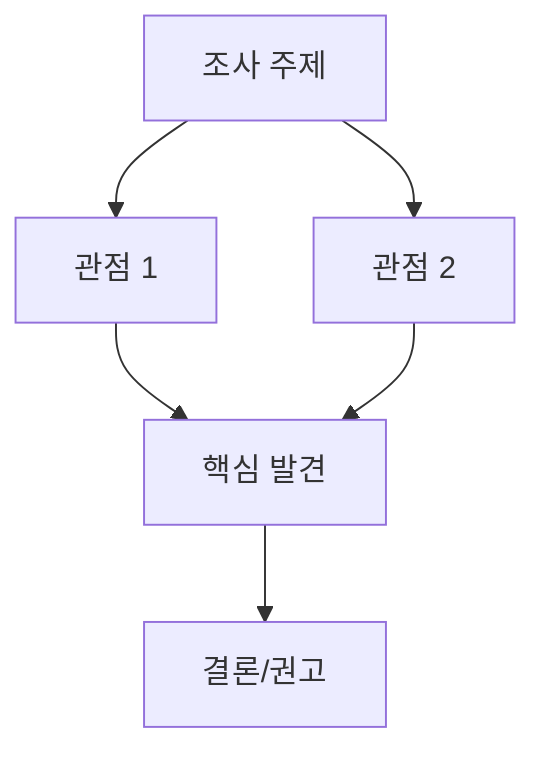

# Research Report: [제목]

- 작업 ID: {{workId}}
- 워크플로우: {{workflowId}}
- 명령어: {{command}}
- 작업명: {{workName}}
- 작성일: {{date}} (KST)
- 원본 계획: {{planPath}}

## Executive Summary

[핵심 결론 1-3문장 요약]

1. [핵심 결론 1]
2. [핵심 결론 2]
3. [핵심 결론 3]

## 조사 결과 시각화 (선택)

[조사 결과의 관계, 비교, 흐름 등을 다이어그램으로 시각화]

## 조사 결과

### 1. [주제 1]

[분석 내용]

| 항목 | 내용 |
|------|------|
| [비교 항목] | [내용] |

**효과**: [기대 효과]

### 2. [주제 2]

(동일 구조 반복)

## 핵심 발견

1. [발견 1]
2. [발견 2]
3. [발견 3]

## 구현 권고 (선택)

### 변경 대상 파일

| 파일 | 변경 유형 | 설명 |
|------|----------|------|
| [`path/to/file`](path/to/file) | 생성/수정 | [설명] |

### 검증 체크리스트

- [ ] [검증 항목 1]
- [ ] [검증 항목 2]

## 작업 내역

| Phase | 태스크 ID | 설명 | 상태 |
|-------|-----------|------|------|
| 1 | W01 | [설명] | 완료 |

## 참고 자료

### 외부 출처
- [제목](URL)

### 내부 파일
- [`path/to/file`](path/to/file) - [설명]

## 결론

[종합 판단 및 권고]
